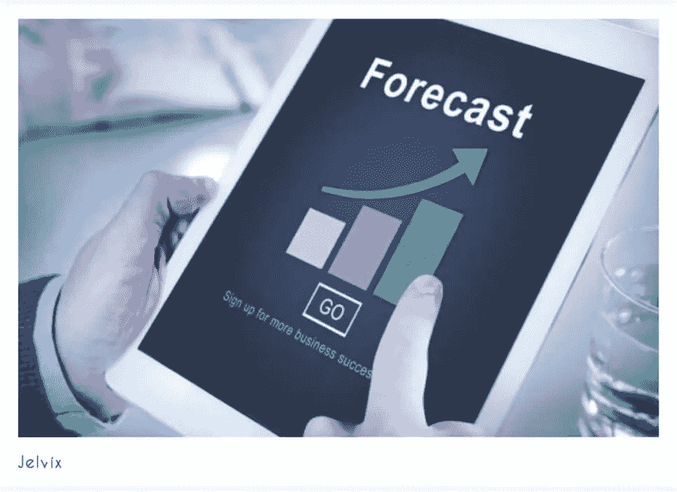
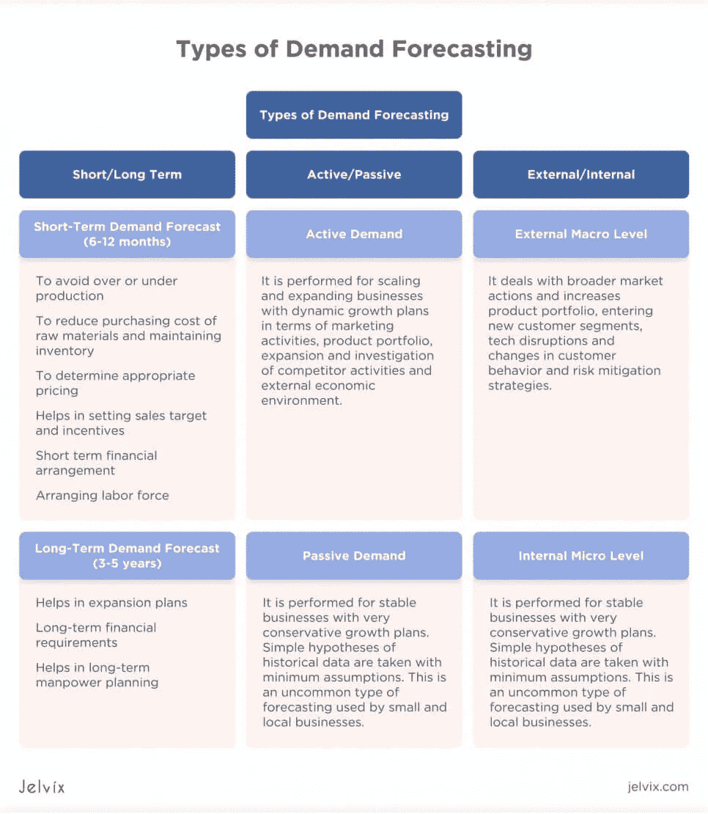
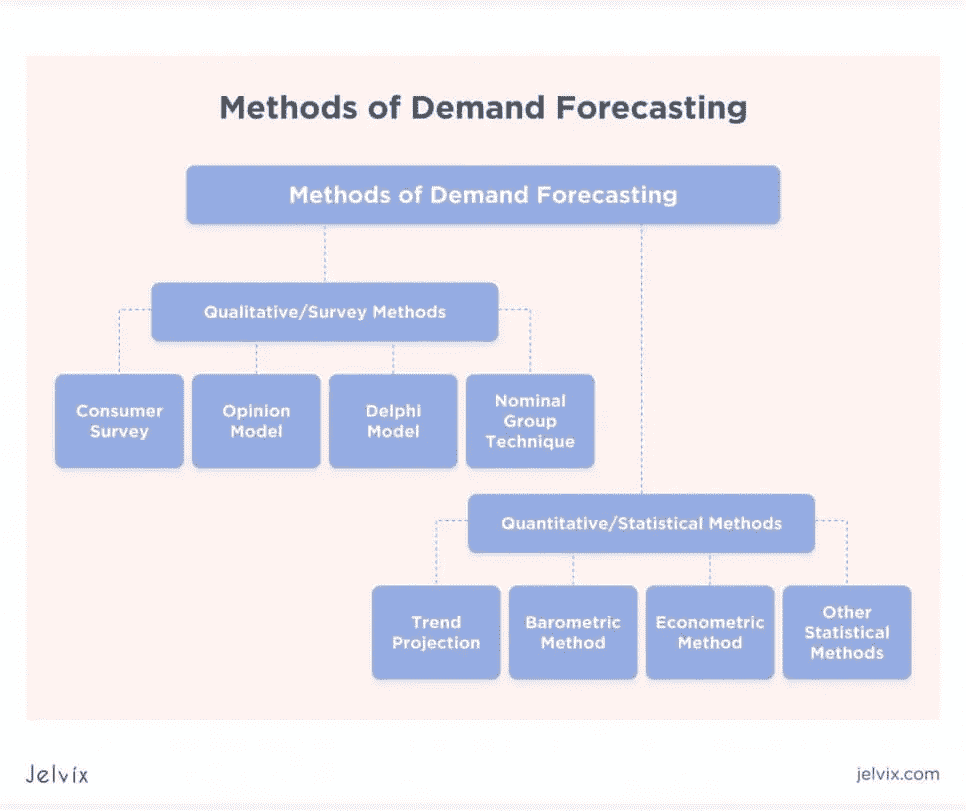
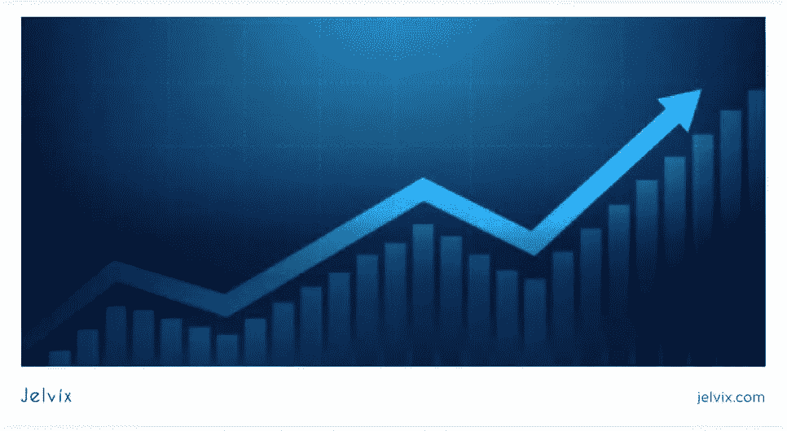
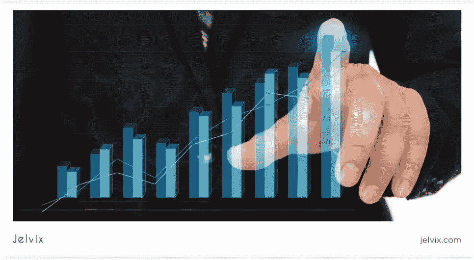
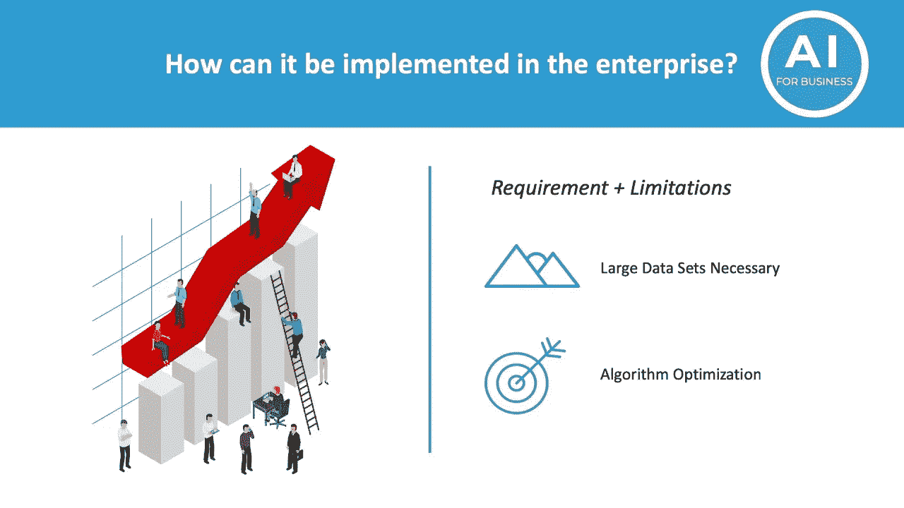
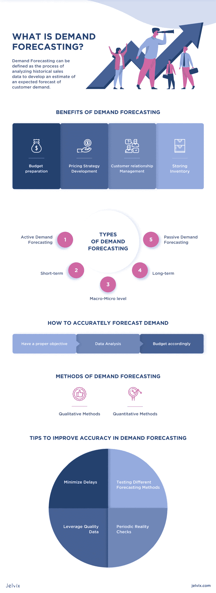

# 关于需求预测你需要知道的一切

> 原文：<https://medium.com/nerd-for-tech/everything-you-need-to-know-about-demand-forecasting-1f791de31385?source=collection_archive---------10----------------------->

经营一家成功的企业并定期检查所有活动是一项相当具有挑战性的任务。你需要查找很多东西，比如需要完全库存的库存单位数量，或者你需要多长时间补充一次库存，以及这些预测将如何随时间变化。

如果你的业务正在逐步产生销售或处于高增长模式，这篇文章将非常适合你，因为它将正确地指导你提高需求预测的能力。

# 什么是需求预测？

需求预测可以定义为[分析](https://jelvix.com/blog/data-analytics-tools)历史销售数据以对[客户需求](https://smallbusiness.chron.com/customer-demand-theory-37253.html)的预期预测进行评估的过程。在商业中，需求预测为我们提供了对客户未来可能购买的商品和服务数量的估计。

营业额、资本支出、风险评估、利润率、现金流、产能规划等关键业务前提基本上都依赖于需求预测。简单来说，需求预测有助于企业[估算](https://jelvix.com/blog/how-to-estimate-software-development-project)未来的总销售额和收入。

# 需求预测的好处

需求预测对电子商务至关重要，因为如果没有对需求的透彻了解，你就无法经营一家成功的企业。公司没有能力在营销支出、生产、员工等方面做出正确的决策。

需求预测的准确性并不完全是 100%。尽管如此，你还是可以采取一些措施来[改善生产提前期](https://www.shipbob.com/blog/how-to-cut-costs-and-production-lead-times/)，提高运营效率，节省资金，推出新产品，并为你的客户提供更好的质量和满意度。需求预测将在以下方面帮助您。

*   **预算编制**

需求预测有助于做出高效的财务决策，并降低影响利润率、现金流、扩张机会、运营成本、[库存会计](https://www.shipbob.com/blog/inventory-accounting/)、人员配备、资源分配和整体支出的风险。所有的战术和运营计划都依赖于需求预测。

*   **定价策略开发**

需求预测不仅仅是完善企业的生产计划以满足需求，它还有助于根据需求为产品定价。了解市场和潜在机会可以促进业务增长。最好的策略是制定有竞争力的价格，采用正确的营销策略，并投资于他们的发展。

如果你选择降价或促销，对它的需求可能会暂时增加。促销是有益的，因为它会立即促进销售。

如果一种产品需求量很大，而供应量有限，你可以利用稀缺性原则，将价格略微提高，作为独家优惠。

*   **客户关系管理**

如果顾客想买什么东西，他们希望产品此刻就能买到。需求预测有助于您预测下一阶段将从特定商店购买哪些类别的产品。在正确的时间推出产品可以增加顾客的满意度和对你品牌的承诺。

*   **储存库存**

需求预测可以帮助您估计库存采购订单和仓储，因为更多的库存需要更多的存储。良好的[库存管理](https://www.investopedia.com/terms/i/inventory-management.asp)意味着手头有足够的产品可供客户使用，但不会太多而导致额外的存储费用。

定期检查库存水平可让您轻松补充库存，并随时预测库存。

# 需求预测的类型

对企业进行需求预测有多种方法。它们可以根据详细程度、时间周期和所考虑的市场范围大致分类。

*   **宏观-微观层面**

宏观层面的需求预测通常涉及依赖于宏观经济环境的更广泛的市场运动。外部预测通常是为了估计业务的战略目标，如产品组合增量、引入新的[客户群](https://www.mycustomer.com/hr-glossary/customer-segmentation?__cf_chl_jschl_tk__=3d59a961da9a9a078ed438aaf40f88c09ad195b1-1610385501-0-AfU5WfnL5JY-J6yuW8DDrqoDzRICsUbXJcEJkiM6qOgFCbc3JxLviUc4DEysD8Q_gOuGED5HRmCBIVrhYC6d9Mz8dkPOCj2eElrSYcP8rgO1ZBC2QrFxOTybEIQ8M-DfGbIOnKpzc9B1rUKWnkPqc6DYph0aHLLhub4qzlaboKMesBsUTTzzci-yY7UpX28IqDMxD0B6_RiFOG_Esc30M5pA9aBGHtI1SzVd9-6wY0BxLrkVlMRcAr1QrheetHo5vafOVO00uIYrT7N9mKz64rfS-kRUGRRpcYpNLMQP2PkEOA-JUA8mSlC4eJZOzCuxzGmoTMgQd_jh615thK_Y0YtMQn695ziCBmGQFjXza2xd)、技术中断和[风险缓解策略](https://www.sciencedirect.com/topics/computer-science/risk-mitigation-strategy)。

同时，微观层面的需求预测可以针对特定的业务、行业或客户群。

*   **短期**

短期需求预测在较短的时间内进行，通常为 3 至 12 个月。需求的季节性模式和战略决策对客户需求的影响都被考虑在内。

*   **长期**

长期需求预测的执行时间超过一年。它有助于识别和规划季节性、年度模式、生产能力和更长时期的扩张。

*   **主动需求预测**

根据[营销战略](https://jelvix.com/blog/product-marketing-plan)，主动进行需求预测，对具有积极增长计划的业务进行分类和多样化。它不断检查产品组合扩张等活动，考虑竞争对手的活动和外部经济环境。

*   **被动需求预测**

这种类型的需求预测是为具有保守增长计划的稳定运行的企业进行的。历史数据的简单推断是在最少假设的情况下提取出来的。这种类型的预测很少见，通常仅限于小型和本地企业。

# 需求预测方法

选择合适的需求预测方法是重要的一步。需求预测有两种不同的方法，即定性方法和定量方法。

## **定性方法**

从定性需求预测中获得的结果通常比定量方法更具描述性和细节性，因为它们不一定依赖数值，而是需要假设和判断来预测未来需求。

下面讨论定性需求预测的例子。

*   **SalesForce 意见**

在这种技巧中，团队中的销售人员被要求提供他们对预期需求的意见和建议。每个销售人员评估他们各自的区域和产品类别，以满足他们的客户需求。最后，销售经理分析所有需求，并在总体评估后生成需求预测的最终版本。

*   **德尔菲技术**

一个专业团队被指定进行需求预测。每位专家负责生成分配给他们的特定细分市场的预测。在第一轮预测之后，每个专家分析他们的预测并与其他专家讨论。团队再次做出后续预测，重复该过程，直到所有专家达成一致意见。

[德尔菲法](https://www.projectsmart.co.uk/delphi-technique-a-step-by-step-guide.php)的优势在于它包含了一群不同的思想领袖和专业人士的意见。尽管如此，由于涉及太多不同的观点，往往需要更长的时间才能得出结论。

*   **市场调查**

在市场研究方法中，明确地为客户部署调查以产生潜在需求。这种调查通常以询问和建议的形式，直接从最终客户那里寻求个人、人口统计、优惠和财务信息。

由于这种技术依赖于随机抽样的基础上，数据需要考虑的调查地区，位置和最终客户的人口统计。这种类型的技术可以证明有利于很少或没有需求历史的产品。

这种方法的优点是，你的市场调查工作会告诉你你的产品是否有问题，并给你一个改进的想法。

市场研究有几个缺点，因为它需要大量时间来收集和分析来自最终客户的数据，这可能会导致错过市场份额。另外，市场调查会让你多花点钱。

## **定量方法**

定量数据法侧重于用硬数字来表示变量。例如，腰围尺寸、身高、步幅长度和具体尺寸选择将被认为是定量的。

从需求预测的角度来看，这种方法通常着眼于现在和过去的统计数据，以做出未来的决策。

定量方法中使用的一些技术有:

*   **计量经济预测技术**

计量经济预测利用需求和影响因素之间更复杂的关系来理解它们之间的关系。推导并分析一个方程，以确保可靠的统计表示。最后，将影响因素的预测值引入等式，以生成准确的预测。

计量经济预测通常关注经济相互作用的不同方面。例如，支出如何影响收入、利率、债务、失业等。

*   **趋势预测法**

这种方法适用于拥有 20-24 个月的大量销售数据的企业。提取的数据通过绘制给定信息的图表，生成统计时间序列，表示正常情况下特定产品类别的以前销售和预计需求。

趋势预测法的好处是它基于数字数据，可以用几种不同的方式改变。分析更加精确，并且可以根据需要进行复制或细化。

趋势预测的缺点是，它没有解决可能催化趋势的潜在问题。例如，一场自然灾害，如地震或野火，可能会给你一个倾斜的视角。需要更多的数据来提供准确的预测。

*   **气压技术**

在这种需求预测技术中，记录当前事件是为了预测未来。在需求预测过程中，这是通过查看经济指标来完成的。主要地，像领先系列、滞后系列或并发系列的人口统计评估被安排来生成需求预测。

气压预测技术的优势在于它解决了识别单个变量的值的问题。这种方法的一个显著缺点是我们不能用它来进行长期预测。

# 需求预测示例

一个小规模的企业可能有一个传统增长计划的目标，而另一个公司可能会在未来扩大规模以实现积极的增长计划。这里有一个场景，可以帮助您了解如何进行需求预测。

假设一家礼品店查看了去年感恩节一周的销售趋势，为下一季度准备了充足的库存。他们分析了去年那个星期季节性产品的销售情况。

一切都很顺利，商店为他们创造了足够的销售额。但几个月前，几个街区之外开了一家竞争商店，所以他们不确定如果当地顾客从竞争对手那里购买产品，感恩节需求会受到什么影响。

与此同时，许多家庭继续搬到这个社区，而且自从竞争连锁店开业以来，他们仍然以合理的速度增长。

他们计划通过在前一季为他们提供了良好投资回报的渠道，推出比去年更多的广告活动，并提供一些新的交易和促销活动，将自己定位为感恩节必去之地。他们的计算预计销售额将比上一年增长 5%。

# 如何准确预测需求

正确预测需求不是一件容易的事情。你必须足够灵活，以应对不规则的流入，但也要采取长期的方法。以下是一些进行需求预测的技巧，这是促进业务增长的正确方法。

*   **有一个合适的目标**

开始需求预测时，应首先确定一个具体的目的。其核心是预测客户将购买什么、购买多少数量以及购买时间。选择最合适的时期，你正在看的特定产品或类别，以及你是预测一般需求还是特定人群的需求。

你必须确保它以不偏不倚的方式满足你的财务规划、产品营销、物流和运营团队。

您需要了解正确需求能力计划的目标，这将有助于您在决策预测过程中更好、更有效地了解消费者行为。

*   **数据分析**

整合所有销售渠道的记录可以提供更清晰的实际产品需求图，并洞察销售预测。查看订单、SKU 订购和销售渠道的日期和时间将帮助您在更具体的层面上预测增长和趋势预测，并回顾您的预测是如何实现的。

请记住，你不应该忽视[电子商务退货](https://www.shipbob.com/blog/ecommerce-returns/)，这可能是昂贵的。退货率高的产品要预估，根据退货原因进行调整。如果有 10%的产品被退回，而你能够减少它，你的生产可能也需要调整。

除了您过去的销售数据，您可能还需要引入其他类型的数据，如市场状况。为了确保可靠性和准确性，数据必须准备充分。

*   **相应预算**

一旦你获得了一个反馈环，你就可以更准确地设定你的下一个预测，并更新你的预算，根据增长目标将资金分配到应该去的地方。需求预测可帮助您降低由库存处理、计划营销支出、未来人员编制、库存生产及其需求，甚至新产品引起的成本。

**提高需求预测准确性的技巧**

如果你有一个准确的预测，你确实会产生更好的结果。生成快速、及时和准确的预测将显著增强您的公司。需求预测是管理决策的重要一环。在这里，我们为您提供一些有用的提示，可以提高需求预测的准确性。

*   **测试不同的预测方法**

当你从不同的角度考虑你的统计记录时，你的预测将会更加精确。有可能一种模式比另一种模式更适合您的业务；考虑尽可能多的角度将会突出推理中的漏洞，并提供更灵活和准确的结果。

*   **尽量减少延误**

数据收集中的时间滞后将严重影响你的预测精度。理想情况下，您希望实时提取信息以减少这些延迟。过迟的行动会给整个供应链带来负面影响，减少运营监管，让你在竞争中落后。一个常规的综合计划过程将帮助你避免高成本的库存积压和缺货。

*   **周期性现实检查**

一旦有了最新的销售数据，你应该定期更新你的预测。你发现的不平衡可以用来调整你的预测，以反映市场上正在发生的事情。考虑竞争对手的活动，并时刻注意新的参与者进入市场，因为环境往往变化很快。

*   **利用质量数据**

统计预测完全依赖历史数据。应用于预测模型的细节必须是完整的、准确的、高质量的，并且取自贵公司记录中的适当时期。这是准确表达真实需求的正确方式。

# 结论

需求预测帮助企业做出影响许多因素的适当决策，从库存管理到供应链优化。

随着客户需求比以往任何时候都更快地变化，企业需要以正确的方式预测需求，因为准确的预测可以让您增长和提高销售，同时提高从种子到货架、从构思到产品处理以及从工厂到客户门口的成本效率。

*原载于*[*https://jelvix.com*](https://jelvix.com/blog/demand-forecasting-methods-machine-learning)*。*