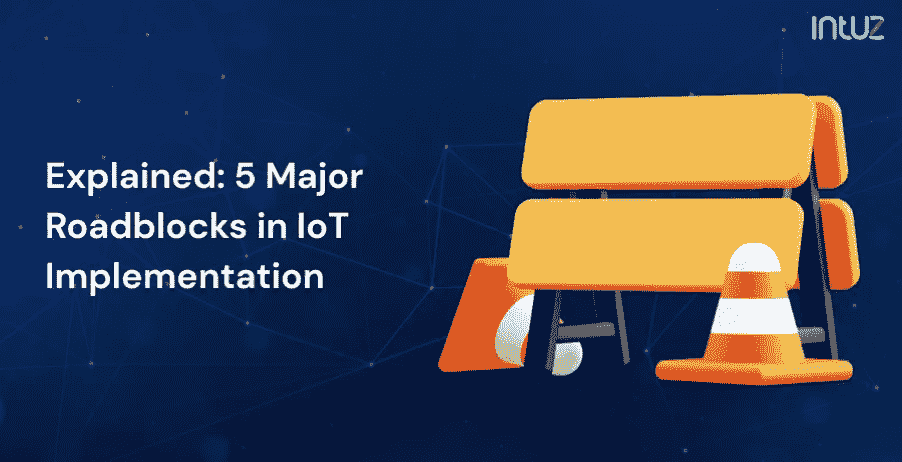
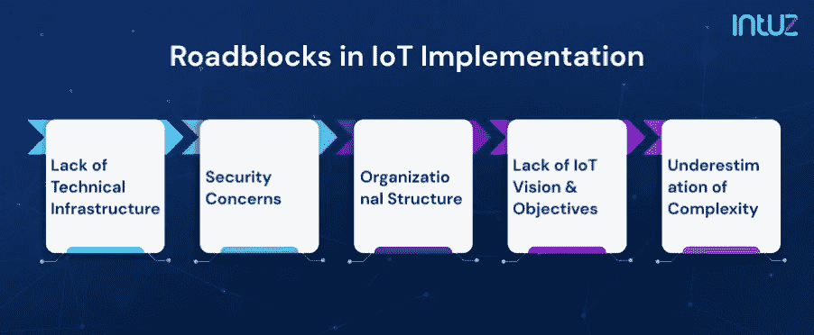

# 解释:物联网实施中的 5 大障碍

> 原文：<https://medium.com/nerd-for-tech/explained-5-major-roadblocks-in-iot-implementation-c057816e64b0?source=collection_archive---------7----------------------->

物联网(IoT)已经成为全球的一股颠覆性力量。无论是医疗保健、制造、农业、交通运输、汽车还是任何其他行业，商业领袖都张开双臂拥抱物联网。

物联网行业市场规模在 2021 年达到 4000 亿美元大关，预计在 2025 年达到 15000 亿美元。因此，如果一家企业不紧跟物联网潮流，它肯定会面临落后或过时的风险。

考虑到物联网设备提供的好处，毫无疑问，物联网的采用将会增加。然而，这一旅程包含了所有物联网利益相关方需要考虑的主要障碍。由于这些障碍，据研究 [75%的物联网项目失败](https://www.softeq.com/blog/75-of-iot-projects-fail-heres-what-you-could-do-to-avoid-this-scenario)。

因此，如果您是一个正在考虑实施物联网解决方案的组织，那么就必须找出障碍来避免它们，并为平稳过渡铺平道路。我们开始吧！

## 1.缺乏技术专长/基础设施

根据微软在 2019 年进行的[研究，38%的公司认为缺乏技术专长是物联网面临的最大挑战。该报告发现，缺乏适当技术专业知识和资源的企业在概念验证阶段的失败率更高。他们的失败率为 30%,相比之下，拥有足够熟练团队的公司失败率为 25%。](https://azure.microsoft.com/mediahandler/files/resourcefiles/iot-signals/IoT-Signals-Microsoft-072019.pdf)

这并不令人惊讶，因为物联网是一项复杂的技术，需要正确的专业知识，同时确保安全并应对技术挑战。不幸的是，物联网行业正遭受技能短缺之苦，公司感到需要物联网专家。

## 2.安全问题

物联网设备的价值很高，因为它们取代了人类执行各种功能的努力。比如现在很多医院都在使用[物联网设备，更精确地执行操作程序](https://www.intuz.com/top-iot-operating-systems-for-iot-devices)。

然而，由于这些设备的安全问题，许多人不采用物联网。这种担心并非完全不合理。已经有许多事件表明，网络犯罪分子可以入侵这些设备，包括智能电视、相机、智能家居、传真机等。这些组织还关心从一台设备传输到另一台设备的数据。

以下是物联网(IoT)的主要安全问题:

*   过时的软件
*   缺乏强加密
*   弱密码
*   易受攻击的接口
*   恶意软件攻击

仅 2021 年上半年就见证了针对物联网设备的[15.1 亿次攻击](https://tdwi.org/articles/2021/11/05/most-vulnerable-iot-devices.aspx%23:~:text=Globally%252C%25201.5%2520billion%2520attacks%2520have,first%2520six%2520months%2520of%25202021.)。其中最突出的一次发生在黑客获得了医院、监狱甚至特斯拉公司的 15 万个监控摄像头的实时反馈之后！

如今，许多物联网设备用于高度关键的环境中，如果安全性受到损害，可能会危及生命。许多企业主对物联网设备带来的这种威胁保持警惕，并选择不使用它们。

这就是为什么我们需要严格的行业标准来确保物联网开发商和制造商遵循最佳实践，如访问控制、身份验证和加密。

## 3.组织结构

与任何其他技术一样，您的组织需要经历一个过渡期来采用物联网设备。不仅仅是从技术的角度来看，你的流程、文化和管理都必须保持一致，才能完全集成物联网。

不幸的是，许多组织没有准备好经历这种文化转变。很多时候，许多部门认为这项技术彼此不同。这破坏了物联网设备应该集成的一致性。

要克服这样一段时间的阻力，你应该分阶段实施物联网。它应该从创建物联网实施及其对各个部门的影响的清晰愿景开始。您应该与相关员工进行讨论和培训研讨会，以确保所有人保持一致。此外，创建文档以确保即使人员变动也能顺利进行。

物联网实施中的障碍

## 4.缺乏物联网愿景和目标

如果你不清楚他们的目标，你的物联网计划注定会失败。例如，许多公司使用这些设备收集数据，但不知道如何处理如此庞大的数据。许多公司采用物联网是因为他们的竞争对手也在这么做，最终被他们必须投入的努力淹没了。

在制造企业中看到的另一个常见现象是，高层管理人员在全行业活动中开始数字化改造他们的公司，而不了解现场工程师或技术人员面临的问题。中层管理人员也对这些问题一无所知，这一切都变成了一个巨大的混乱，因为没有人知道他们在做什么，为什么要做。

如果您正在考虑在您的企业中实施物联网，您必须在与所有员工级别，尤其是一线员工交谈后，制定一套明确的目标。这些目标还应该有一个清晰的路线图，将物联网集成、扩展和扩展到您的流程中。如果你不确定，你应该在试点的基础上进行，并评估你的目标是否达到。

## 5.对复杂性的低估

作为一家物联网开发公司，我们观察到许多企业低估了物联网设备的复杂性。

企业主只认为它是“设置好就忘了”的技术，但没有意识到它将涉及各种咨询、管理、支持和维护工作。这增加了企业领导人经常忽视的成本。

除了额外的成本，公司还往往低估物联网项目的学习曲线。公司最初倾向于大量投资物联网项目，然后意识到他们没有技能或资源来进一步发展。随着许多人放弃他们的计划，这将导致灾难。

如果你不想成为这些公司中的一员，你必须深入了解物联网实施。你可以从技术顾问和物联网开发公司那里获得。只有在理解了其中的错综复杂之后，你才应该决定继续前进。

公司采用物联网是一个辉煌的机遇，同时也是一个具有挑战性的命题。如果你想通过成为早期采用者来获得回报，你应该不耐烦地耐心，耐心地不耐烦。简而言之，你应该在着手物联网项目之前完成所有必要的步骤。

**结束**

正如我们之前看到的，没有合适的技术专业知识是一些企业最终成为“物联网墓地”的主要原因这就是为什么我们建议雇佣可靠的物联网开发公司，他们可以帮助你从设定目标到维护你的物联网设备。

如果你是首席技术官或首席执行官，你应该记住，物联网仍然是一项年轻的技术，它正在经历一个采用和标准化的时期。因此，您的期望和准备必须相匹配，才能成功完成数字化转型。