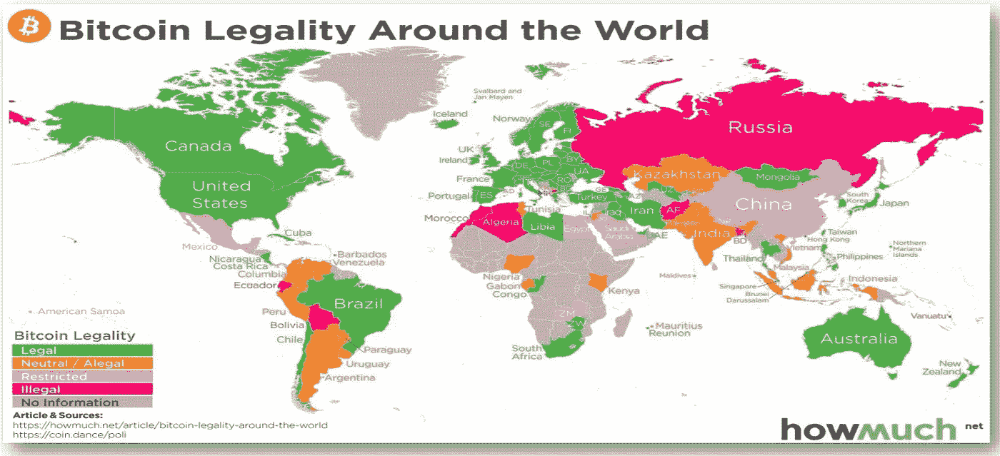
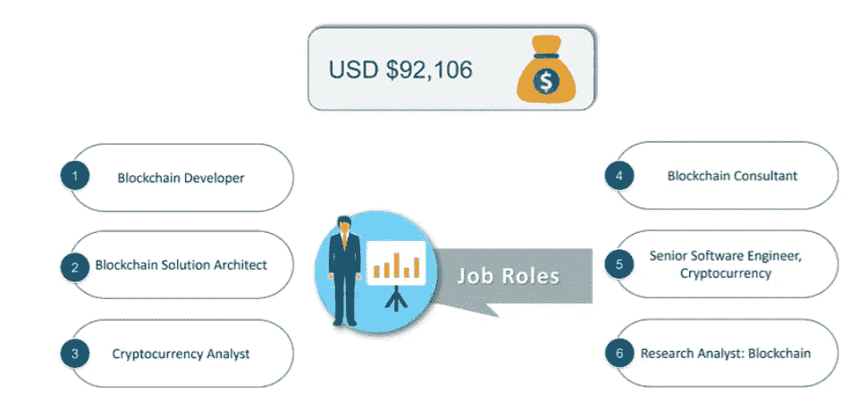
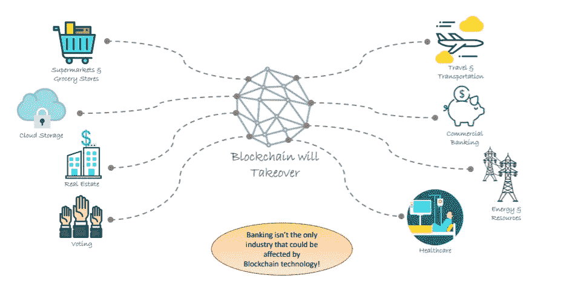

# 探索区块链技术的点滴

> 原文：<https://medium.com/nerd-for-tech/exploring-the-bits-of-blockchain-technology-f3af3d82ffdc?source=collection_archive---------12----------------------->

你有没有想过一个叫**区块链**的东西会成为你同事朋友之间的热门话题？你可能知道一些，也可能听说过一些。但是，你**能自信地谈论区块链技术吗？**这篇文章专门为任何对**感兴趣的人，以最简单的方式学习**区块链基础知识。

今天，我们看到了一个新的数字化时代，我们几乎正在接近区块链时代，世界上的一切都将成为区块链技术的一部分。所以，无论你何时与你的商业伙伴交谈，无论你何时与你的同事交谈，无论你何时在面试中发言，学习和**探索**这个世界都会让你成为一个杰出的人。话虽如此，但这将是一场**颠覆性的变革**，在不久的将来，它有着难以想象的巨大潜力来改变我们的**生活方式**！

## 区块链词典

在我们开始之前，我们先来看看区块链技术中使用的术语，以便进一步理解这些概念。

1.  密码术—密码术涉及创建书面或生成的代码，以确保信息的安全。
2.  加密货币——第一种开始运作的加密货币是比特币，于 2009 年推出，当时中本聪为区块链技术奠定了基础。
3.  比特币——比特币是一种去中心化的货币，这意味着它不受任何权威机构或机构的监管。
4.  令牌——可以通过区块链获得的价值单位(例如公用令牌和安全令牌)。
5.  以太坊——一个开源的、公共的、基于区块链的分布式计算平台。
6.  矿工和数字采矿——采矿是新比特币投放市场的过程。
7.  节点——节点是构成区块链网络一部分的计算机。
8.  电子钱包——允许用户管理比特币和以太网的数字钱包。
9.  智能合约——一种运行在区块链之上的计算机代码，包含一套规则，供相关方自动交换比特币。
10.  哈希—哈希是一种使用算法将字母和数字输入转换为固定长度的加密输出的功能。
11.  双重消费——恶意用户试图同时将他们的比特币支付给两个不同的接收者。

## 什么是区块链？

块是区块链中的一个记录，包含并确认许多等待的事务。平均大约每 10 分钟，一个包含事务的新块通过一个叫做**挖掘**的过程被添加到区块链中。**区块链**是按照时间顺序对比特币等加密货币交易的公开记录。区块链由所有加密货币用户共享。它用于验证比特币交易的持久性，并防止重复消费。

## 区块链的关键概念

*使用密码术保护*

密码学是通过复杂的数学来伪装和揭示(也称为加密和解密)信息的方法。这意味着该信息只能被指定的接收者查看，其他人不能查看。

*不受中央权力机构控制*

*   区块链通过在计算机网络上分发以前保存在中央账本中的信息，超越了对中央机构的需求。
*   通过这种方式，不是一个人或组织拥有区块链，而是任何有互联网连接(和访问，在私人区块链的情况下)的人都可以利用它，并帮助维护和验证它。

*访问网络上的任何人*

区块链可以通过多种方式构建和访问。例如，**比特币**，区块链中最受欢迎的加密货币，它允许任何人以完整节点或贡献矿工的身份参与网络。任何人都可以担任只读角色，或者对区块链进行合法的更改，如添加新的区块。这种区块链允许网络上的所有参与者享有平等和开放的权利和访问权。

*每个人都有数据的副本*

区块链是一个开放的分布式账本。它使用一种**仅追加**的数据结构，这意味着新的交易和数据可以添加到区块链上，但过去的数据不能被擦除。这导致不同方之间的数据和交易的可验证的和永久的记录。这有可能增加透明度和问责制，并积极加强我们的社会和经济制度。

## 区块链是如何工作的？

*   分布式分类帐
*   块数据和散列函数
*   工作证明
*   采矿

分布式分类帐—它使用户群体能够在分类帐(对该群体公开)中记录交易，这样交易一旦发布就不能被更改。

区块数据和哈希函数——区块链只包含经过验证的交易，这可以防止欺诈性交易和货币的双重支出。验证过程依赖于使用算法哈希加密的数据。产生的加密值是一系列与原始数据不相似的数字和字母，称为**散列**。

工作证明—工作证明是一种减缓新块创建速度的机制。计算所需的工作证明并向链中添加新块大约需要 10 分钟。如果有人试图篡改积木，你必须计算所有积木的工作证明。因此，这种安全性使得篡改块变得更加困难，从而确保了安全的链。这种责任由称为**矿工**的特殊节点承担。

挖掘——区块链挖掘涉及将交易添加到分布在区块链所有用户中的现有区块链交易分类账中。目前，一名矿工每增加一个区块可获得 **6.25 比特币**。矿工的奖励每 4 年减少一次！

**采矿软件:**

以下是目前用于比特币挖掘过程的几个软件:

*   CGMiner
*   多名矿工
*   BFGMiner
*   比特明特
*   小型服务器

## 为什么说区块链是革命性的？

这项技术几乎适用于所有涉及价值的交易，包括货币、商品和财产。它的潜在用途几乎是无限的:从收税到让移民能够把钱寄回给那些银行业几乎困难的国家的家人。区块链还有助于减少欺诈，因为每一笔交易都将被记录并发布在公共账本上，任何人都可以看到。

1.  更高的透明度—由于区块链是一种分布式分类帐，所有网络参与者共享相同的文档，而不是单独的副本。
2.  增强的安全性—在记录交易之前，必须就交易达成一致。
3.  临时可追溯性——显示资产来源和旅途中每一站的审计线索。
4.  降低成本——不需要第三方或中间人做出保证。

## 比特币在全球的合法性

下图显示了比特币在哪些地方是合法、中立、受限或非法的:

## 区块链技术的局限性

任何区块链网络在很大程度上都取决于其中的活跃用户数量。为了充分发挥其潜力，网络必须是一个具有广泛分布的节点网格的健壮网络。此外，现有的区块链网络无法维持像 Visa 或 MasterCard 这样的主要发卡机构那样的交易量。截至 2019 年，区块链在有能力取代金融界的巨头之前，还有非常长的路要走。最后，对于任何给定的区块链网络，总有一个**理论上的大规模捕获的可能性**。如果一个组织设法控制了网络的大部分节点，它就不再是完全意义上的去中心化了。

区块链有环境成本——至少，它今天被使用的方式，确实有环境成本。区块链依靠加密来提供安全性，并在分布式网络上建立共识。这实质上意味着，为了“证明”用户具有写入该链的许可，必须运行**复杂的算法**，这又需要大量的计算能力来保持网络运行，从而消耗更多的能量。

缺乏监管创造了一个危险的环境——同样，这在很大程度上是比特币或其他基于价值的区块链网络的问题。但事实是，正如许多人在过去几个月首次投资比特币或其他加密货币时发现的那样，这是一个非常**动荡的环境**。由于缺乏监管，骗局和市场操纵很常见。备受瞩目的案例之一是 once coin——最近被揭露为一个庞氏骗局，据信该骗局从投资者那里掠夺了数百万美元，这些投资者认为他们很早就获得了将成为“下一个比特币”的东西。

区块链可能会很慢——再次由于其复杂性和加密方法、分布式性质，区块链交易可能需要一段时间才能处理，当然与现金或借记卡等“传统”支付系统相比。

## 区块链技术的机遇

1.  高薪工作

2.快速增长的技能和高需求增长

3.对价值链的破坏——区块链将带来显著的价值，提高各方之间的信心，减少价值链中的摩擦。

4.各种行业

到目前为止，你必须对区块链技术的基础知识有很强的了解，例如**关键概念**、**加密货币&比特币、关键术语**、**哈希、挖掘** **等。**所以，这就是我的观点。感谢阅读。祝你今天开心！玩的开心！