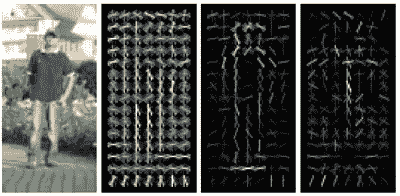
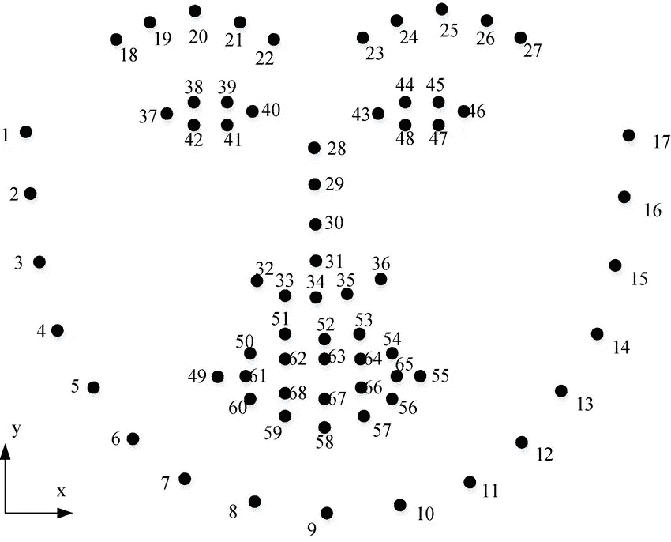
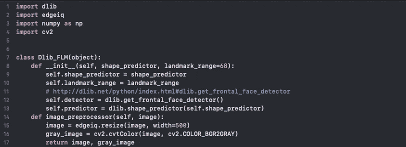
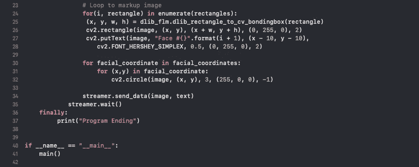
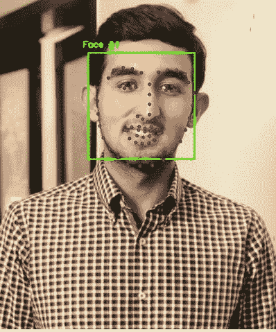

# 面部标志检测变得简单

> 原文：<https://medium.com/nerd-for-tech/facial-landmark-detection-made-simple-7fcd079c09f0?source=collection_archive---------1----------------------->

使用 Dlib 和 alwaysAI

今天，我将给你一个完整的指导，如何执行面部标志检测。面部地标用于定位和表示人脸的显著区域或面部部分，例如鼻子、眼睛、嘴等。面部标记是面部识别中的重要步骤，面部识别是检测物体的物体识别的子集。面部地标用于以下任务。

❒人脸识别

❒人脸跟踪

❒表情理解

❒头部姿态检测

❒脸替换

❒可以扩展到某些形状检测器

# 图书馆

首先，让我们看看我们将使用的库和需求。

## Dlib :

它是一个用 c++编写的开源机器学习和计算机视觉库。它的 python API 结合了快速健壮的 c++和易于使用的 python，使它能够归档许多实际的生活任务。

## OpenCV:

它也是最广泛用于计算机视觉任务的开源库。使用它可以对数字数据进行任何操作。

## 总爱:

alwaysAI 是一个计算机视觉开发平台，用于在任何地方创建和部署机器学习应用程序。它使计算机视觉易于使用，每个人都可以使用。它提供了与计算机视觉、机器学习、机器人和边缘部署相关的各种不同的任务。点击这里查看完整名单【https://alwaysai.co/model-catalog。

# 面部标志

现在我们将对这个话题有更多的了解

## 理论

正如我们所讨论的，我们的目标是找到人脸的主要特征，有多种方法可以做到这一点，但我们将坚持使用最基本但有效的方法，即 HOG + SVM 检测器。值得一提的是，我们这里没有使用卷积网络。

**梯度方向直方图(HOG ):**

HOG 基本上是一个特征检测器，通常用于从图像数据中提取特征。它广泛应用于[计算机视觉](https://courses.analyticsvidhya.com/courses/computer-vision-using-deep-learning-version2/?utm_source=blog&utm_medium=understand-math-HOG-feature-descriptor)任务中进行[物体检测](https://www.analyticsvidhya.com/blog/2018/10/a-step-by-step-introduction-to-the-basic-object-detection-algorithms-part-1/?utm_source=blog&utm_medium=understand-math-HOG-feature-descriptor)。特征检测器是一种检测器算法，它检测图像中重要或必要的点，帮助计算机“看到”世界。正如我们在下图中看到的，特征检测器如何帮助计算机视觉。


信贷:分析 Vidhya

我将很快告诉你猪是如何工作的。HOG 特征描述符生成一个梯度方向直方图(如幅度和方向)。

梯度基本上就是 x 方向和 y 方向的变化。每个像素都有一个取决于亮度的数值，梯度就是一个像素的差值，从右边的像素值中减去相邻的左边的像素值(类似于 y 轴)。如果强度发生急剧变化，例如在边缘附近，渐变的幅度会更大。梯度的方向是垂直梯度与水平梯度的简单正切倒数(就像我们在倾斜角中所做的)。

在计算梯度方向之后，HOG 在梯度和方向的贡献之间制作直方图。

**支持向量机(SVM ):**

SVM 是一种监督机器学习技术，用作分类器。

它处理带标签的数据，并通过边界/内核将它们分成两个或更多类别。在这里，SVM 根据梯度的重要性对其进行分类。

这张图片描绘了你的电脑视觉图像



# 模型

我将使用 dlib 的面部标志探测器模型来完成我们的任务。这是一个预训练的模型，但你也可以在不同的数据集上自己训练它，我会告诉你怎么做。

面部标志检测器模型从根本上检测人脸上的特定点，这些点一起映射到人脸的一些特征/部分。Dlib 的模型在 iBUG 300–W 数据集上训练，该数据集检测人脸上的 68 个点。还有许多其他数据集可以用来训练您的模型，例如 HELEN 数据集由 194 个面部点组成(对于面部检测，使用 300-500 个点)。



好的方面是，相同的 Dlib 框架可以用于根据输入训练数据训练形状预测器——如果您想要训练面部标志检测器或您自己的自定义形状预测器，例如手预测器或硬币预测器等，这将非常有用。

现在让我们进入有趣的部分，我们将看到如何实际实现我们自己的面部标志检测。

## 装置

首先，我们必须从给定的链接安装 alwaysAI CLI:[安装](https://alwaysai.co/docs/getting_started/development_computer_setup.html)。

我们使用这个平台是因为它使得部署和修改您的模型更加容易。除此之外，您可以使用相同的方法利用许多不同的模型。如前所述，首先从我的 Github 库克隆项目。

```
git clone https://github.com/umerzia-7001/Facial_landmarks.git
```

这需要时间。在克隆代码之前，请确保您的 alwaysAI 应用程序已安装且可访问。然后通过移动到代码目录。

```
cd Facial_landmarks
```

在那种类型之后。

```
aai app configure 
```

使用箭头键从选项菜单中选择“创建新项目”。然后为您的项目命名，并将项目保存在本地目录中。最后，使用它运行你的应用程序。

```
aai app install
aai app start
```

该项目将在本地主机上运行，您可以看到它正在运行。

## 密码

现在你可以看到项目是如何运行的，但你会想知道幕后是什么。别担心，我会告诉你代码的意思。如果你打开你的项目文件，你可以看到一个名为**face _ landmarks . py**的文件。这是我们加载模型并做一些预处理的文件。



**第 1-17 行:**

首先，我们导入所需的库

然后我们传入 shape_predictor 模型(已经在我们的文件中)。我们也可以训练自己的模型并在这里使用。

我们给出了地标范围，这是我们的模型被训练来检测的点的数量(如果您使用不同的数据集，您可以改变这个范围)

然后，我们从 Dlib 实例化我们的对象检测器(用于在面上制作框)和预测器

然后，我们调整图像大小，并将图像转换为灰度图像(这样做模型效果更好)


**第 18–30 行:**

检测器将给出脸部周围的边界矩形(可以检测多张脸)

然后我们在预测器中给出图像和方框

然后在第 23 行调用我们的函数，将坐标转换成 NumPy 数组(更容易操作)

在第 28–29 行，我们循环遍历我们的地标，并返回它们的坐标数组。


**从第 31–36 行:**

然后我们有一个函数将矩形从 Dlib 转换成 OpenCV 中使用的矩形(这是最常用的)

Dlib 给出顶部、左侧、右侧和底部坐标，但在许多计算机视觉算法中，我们主要使用高度和宽度。

现在我们将看到另一个文件，即 **app.py**


**第 1–15 行:**

首先，我们导入库和以前的文件

然后，我们为我们的模型指定一个文件名，并实例化我们之前学习过的类

然后，我们使用 edgeiq 获取我们图像的图像路径**注意:**您可以在我们项目的图像文件夹中添加您想要的任何图像。


**从第 17–21 行:**

然后我们开始流光，流光将穿过我们的图像。我设置了 3 秒的图像间隔时间

在 streamer 中，我们读取图像，对其进行预处理，然后返回地标坐标和边界矩形。



**从第 24–40 行:**

然后，我们浏览我们的图像，获得要绘制的矩形的 x、y、宽度和高度

然后我们数一下脸的数量。然后我们在盒子上写下文字。

从第 30 行开始，我们为从模型中获得的 68 个面部坐标画圆(我使用的半径为 3，RGB 颜色为蓝色，-1 表示填充圆)

最后，我们将数据发送到流媒体工具中，然后在应用程序停止后关闭窗口。



示例输出

## 结论:

在这篇文章中，我们讨论了面部标志检测的重要性，我试图给你一些算法的基本理解。为简单起见，我使用了一个预训练模型，但您也可以在自己的数据集上训练自己的模型，并使用它来代替(shape _ predictor _ 68 _ face _ landmarks . dat)文件。

我们还可以扩展我们的知识来检测手点或任何形状检测器，甚至人脸检测器。在 [Github](https://github.com/umerzia-7001) 和 [Linkedin](https://www.linkedin.com/in/muhammad-umer-zia/) 关注我。