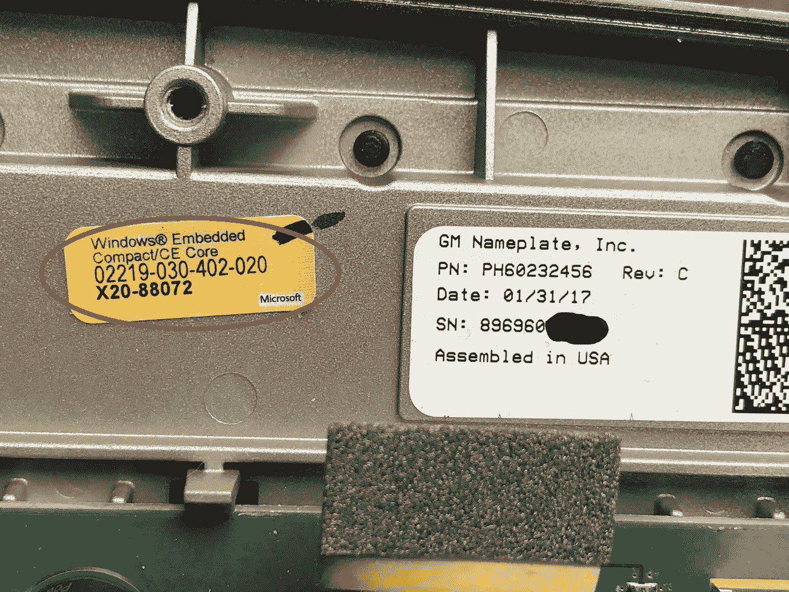

# 联邦调查局对国家食品供应网络风险的警告忽略了机器

> 原文：<https://medium.com/nerd-for-tech/fbi-warns-of-some-cyber-risks-for-nations-food-supply-but-misses-others-6be84e89539?source=collection_archive---------4----------------------->

自从 Mosaic 的创造者和网景公司的联合创始人马克·安德森[在 2011 年提出“软件正在吞噬世界”这个说法以来，它已经成为一个老生常谈的话题。最近越来越清楚的是，它需要更新:软件可以决定世界上的人们是否会吃东西。](https://www.wsj.com/articles/SB10001424053111903480904576512250915629460)

的确，在任何事情上使用软件都有好处和风险。它可以(也确实)让农业变得更加高效和多产。但它是由人类制造的，这意味着它并不完美，如果恶意黑客能够利用这些缺陷，他们可能会在一年的关键时刻破坏或关闭农业运营。

美国联邦调查局(FBI)在[最近的一份紧急警报](https://www.ic3.gov/Media/News/2022/220420-2.pdf)中警告说——勒索软件攻击的威胁在农业行业正在增加，尤其是在春种和秋收的时候。

“尽管针对 FA(食品和农业)领域从农场到餐桌的整个范围的勒索软件攻击经常发生，但在关键季节针对农业合作社的网络攻击数量值得注意，”该警报称。

该机构从 2021 年开始列出的勒索软件攻击包括去年秋天在 9 月 15 日至 10 月 6 日之间针对六个谷物合作社的攻击。“使用了各种勒索软件变种，包括 Conti、BlackMatter、SunCrypt、Sodinokibi 和 BlackByte。一些目标实体不得不完全停止生产，而另一些则失去了管理功能，”联邦调查局的警报报道说。

FA 部门的网络安全专家对这一警报表示欢迎，该警报提出了十多项建议，以“减轻威胁，防范勒索软件攻击”。这些建议包括改进数据保护、网络分段、保持系统补丁和最新、多因素认证、强密码和使用虚拟专用网络。

**一个裂开的洞**

但这些专家指出，警报和建议主要集中在这些企业的办公室、行政和分销业务上，他们说这留下了一个很大的漏洞——越来越多地由软件运行的脆弱的农业机械。

联网农业机械尚未成为主流，但在美国的粮仓，大型农场确实越来越多地在网络空间运营。庞大的机器——有些零售价超过 100 万美元——每年耕种、种植、施肥和收获数百到数千英亩的土地(一个中型农场超过 1500 英亩)，通过互联网连接越来越多地实现自动化。

一个名叫 Sick Codes 的道德黑客，在 2021 年 8 月在 [DEF CON 29](https://defcon.org/) 上的[演讲](https://www.youtube.com/watch?v=zpouLO-GXLo)中说，他和他的黑客同伴发现了“全球食品供应链中一大堆漏洞”，特别是在农业机械中，他说这些漏洞可能会让攻击者在种植或收获等关键时刻关闭它们。

内布拉斯加州的农民和发明家凯文·肯尼(Kevin Kenney)在研究联网农业设备的漏洞时使用了病态代码，他表示，尽管他同意联邦调查局最近发出的警报中的所有内容，“我认为撰写这份警报的联邦调查局人员不知道这些威胁在农民日常使用的现代拖拉机中是如何和在哪里实际存在的。”

“担心大型农场合作社是一回事。当你看到模块化远程信息处理网关(MTG)将所有类型的农业设备系统连接到云上，而没有考虑任何网络安全结构时，情况会变得更加糟糕，”他说。

"简而言之，拖拉机与云联系在一起，它们很容易受到攻击."

事实上，重型设备行业 1200 亿美元的巨头 John Deere 正在吹捧这些与云的联系。二月份 T4 宣布其自动驾驶拖拉机已经“生产就绪”，将在年底前提供给农民。

这意味着农民甚至不必坐在驾驶室里。据该公司称，一旦他们将拖拉机开到田间，对其进行配置，并刷屏幕启动，他们就可以离开并在移动设备上监控其进展。

这显然是方便的，如果它成为主流，将节省成千上万天的劳动力。但是，根据像 Kenney 和 Sick Codes 这样的研究人员的说法，这也是有风险的。

凯文·肯尼提供照片

他们指出，John Deere 的拖拉机和其他农业机械使用的是微软 Windows Embedded Compact/CE，这是一个已有 26 年历史的操作系统，自 2018 年以来一直不受主流支持。包括关键安全更新在内的扩展支持将于明年终止。

最近一个关于连通性影响的例子来自乌克兰战争。美国有线电视新闻网(CNN)上周末报道称，俄罗斯军队从乌克兰的一家 John Deere 经销商处掠夺了价值约 500 万美元的农业机械，但当他们将这些机械运到车臣时，却无法使用，因为它们被远程锁定了。

虽然世界上大多数人会为此喝彩，但它表明，如果恶意黑客获得了同样的控制，他们可以让世界上任何地方的农业机械瘫痪，至少是暂时的——可能足以危及种植或收获。

肯尼还说，农民甚至不能遵循联邦调查局警告中的许多建议。例如，其中一条建议“定期备份数据、空隙，并在脱机状态下使用密码保护备份副本。确保关键数据的拷贝不能从数据所在的系统中被修改或删除。”

“这是个好主意，”他说。“但农业技术和设备制造商，即 ATEMs，像 John Deere、Case、Kabota 等。不要提供工具—软件、硬件和信息—来备份和恢复软件。”

他补充道，“John Deere 没有快速的方法从受到网络攻击的拖拉机上恢复软件。据报道，一辆拖拉机被雷击后需要几天时间才能恢复，“如果网络攻击成功，情况可能会类似或更糟。

他还说，大多数农民甚至不知道或不理解 MTG 是如何工作的。

“2021 年 6 月，我参加了内布拉斯加州约克市 CVA(中央谷农业)合作社的农学副总裁的面试，该合作社是中西部最大的农业合作社之一，”他说。

“当我给他看一张 MTG 的照片，问他是否知道那是什么时，我感到惊讶和不安。他说他不知道。更神奇的是，95%的农民也不知道。”

他说，这意味着“CVA 合作社，像其他数百个毫无戒心的农业合作社一样，在他们所有的移动定制牲畜、种子、肥料和物流服务中存在漏洞，因为他们不受保护的蜂窝 MTG 调制解调器与云相连。”

这是否意味着一个敌对的民族国家可能会让这个国家面临食品价格灾难性上涨的风险，或者面临食品严重短缺的风险？

从技术上来说，是的——2021 年 5 月，针对肉类供应商 [JBS](https://www.nbcnews.com/tech/security/meat-supplier-jbs-paid-ransomware-hackers-11-million-n1270271) 的一次勒索软件攻击导致了价格大幅飙升。这只是分配系统，而不是养牛和饲养。

**有争议的风险**

但是，尽管世界各地的网络安全专家不断倡导更好的软件安全，但并不是所有人都认为 FA 部门处于极端的风险水平。

Synopsys 软件完整性小组的董事总经理詹姆斯·保罗去年表示，研究人员的发现，如病态代码，可能在技术上是准确的，但夸大了风险。

他说，虽然农业机械可能正在走向自动化，大型农场可能正在使用它，但它还没有接近主流。“我认识的绝大多数农民——我也认识他们中的许多人——都是规模相对较大的企业，但规模小于大型企业集团，除了 GPS 之外，他们几乎没有一个人的设备有持续的连接，”他说。"许多农场所在的地区连稳定的手机信号都难以获得，更不用说宽带了."

但是 Paul Roberts，安全分类账的主编，广泛报道了农业机械缺乏安全的问题，他说不会对数以千计的农场的攻击造成重大损失。“想想看，仅仅 100 个大农场就生产了内布拉斯加州 80%的大豆和玉米，”他说。

“看看像 John Deere operations center 这样的平台，它是从部署的设备收集数据和推出软件更新等的中心点。可以想象，对该平台的一次成功攻击，可以用来摧毁部署在战场上的设备。”

“而且，据我所知，可以说，解开如此复杂的设备不仅仅是按下启动按钮的问题，”罗伯茨说。“可能需要几天时间来刷新和恢复损坏的拖拉机、喷雾机、收割机等。对农业设备供应链的大范围攻击可能需要数千名服务技术人员访问偏远的农场，以执行恢复工作——像 Deere 这样的供应商能否支持这一点值得怀疑。”

此外，正如联邦调查局的警告所指出的，在关键时刻，如种植和收获，禁用农业操作可能会造成重大破坏。罗伯茨说，这不像产品交付中的意外延迟，后者通常只是一种烦恼。“这是混乱，和休耕的领域。”

罗伯茨说，如果在政府层面上对这个问题有任何进展的话，那就是意识的提高。“DHS(国土安全部)和 CISA(网络安全和基础设施安全局)意识到了风险，”他说，因为研究人员喜欢病态代码，我也和他们谈过。"

**更好的意识，但是……**

但他和肯尼说，研究人员很难测试农业机械的网络安全，因为每台机器都很贵，而且供应商也不提供。“这使得硬件无法落入安全研究人员的手中，否则他们可能会发现并披露严重的远程可利用漏洞，”罗伯茨说。

肯尼说，除非风险得到解决，否则农业机械应该与互联网断开。“对于少数农民来说，MTGs 是一种奢侈品，对于所有拥有这些在过去 10 年制造的拖拉机的农民来说，这是一种危险，”他说。