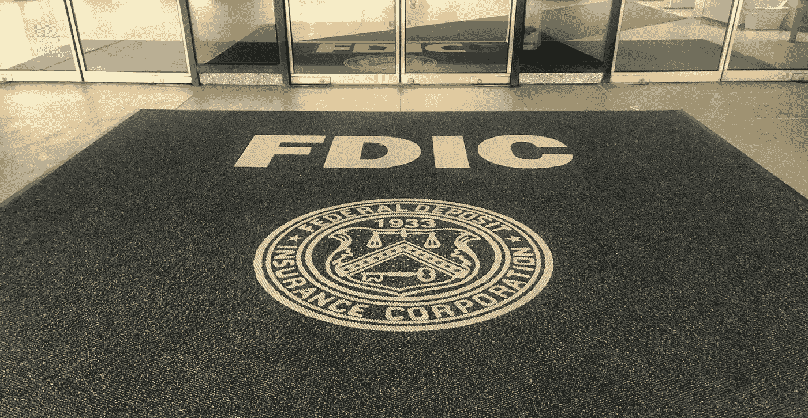

# 联邦政府命令而不是要求银行共享网络事件信息

> 原文：<https://medium.com/nerd-for-tech/feds-are-ordering-not-asking-banks-to-share-cyber-incident-info-1648662cf37a?source=collection_archive---------7----------------------->

几乎所有的网络安全专家都会告诉你，网络罪犯比他们在私人和公共部门的目标更愿意合作——分享信息、技术和策略。

这并不奇怪。可以理解的是，私营企业不愿分享任何东西，从知识产权到承认自己是网络攻击的受害者，因为这可能会给它们带来比试图从攻击中恢复更大的痛苦——负面宣传和法律责任。

但这种情况将会改变，至少在金融服务业(FSI)是如此。也许这将是一件非常好的事情。但不会是自愿的。从现在起的五个月内，银行组织及其服务提供商将被要求在 36 小时内通知联邦监管机构任何特定严重程度的计算机安全事故。

是的，必需的。这不是请求。这是上个月由联邦存款保险公司(FDIC)、美联储和货币监理署联合发布的[规则。虽然它将于 4 月 1 日生效，但在 5 月 1 日并不要求完全遵守。](https://www.fdic.gov/news/board-matters/2021/2021-11-17-notational-fr.pdf)

不同的机构监管金融行业的不同组成部分，但所有机构的规则本质上都是一样的。例如，受 FDIC 监管的银行组织“将被要求在银行组织确定发生了达到通知事件级别的计算机安全事件后的 36 小时内尽快通知 FDIC。”

什么会上升到通知事件的级别？

这些定义充满了标准的官腔，但精简版是指任何“严重破坏或降低，或有理由可能严重破坏或降低”银行组织的事件

*   向“大部分”客户运营或交付其产品和服务的能力；
*   业务线，包括相关的运营、服务、职能和支持，其失败将导致收入、利润或特许权价值的重大损失；
*   以至于会威胁到美国的金融稳定。

通知事件的例子包括“重大计算机系统故障；与网络相关的中断，如分布式拒绝服务或勒索软件攻击；或其他类型的重大操作中断。”

该规定补充称，银行服务提供商将被要求向客户银行报告任何可能中断服务超过 4 小时的事件。

为了减轻报告的“负担”，组织只需报告事件，而不是事件发生的细节或原因分析。

所有这些听起来都很合理，而且早就该做了。正如该规则的导言所言，“这一要求将有助于促进对银行组织和更广泛的金融体系的新威胁的早期意识。这种早期意识将有助于机构在这些威胁成为系统性威胁之前做出反应。”

Synopsys 软件完整性小组的首席科学家 Sammy Migues 同意这个概念。“很难说这不是一个好主意，”他说。“如果所有银行服务提供商在发生某种程度的计算机安全事件时告知其客户银行组织，而银行组织在服务提供商的事件或其自身的事件达到通知事件时告知监管机构，那么从理论上讲，金融系统监管机构可以在某种融合中心共享这些信息，并比任何单个银行组织更快地检测到广泛或系统性的攻击模式。”

**信任和清晰**

那么，为什么 10 年或更久以前没有发生这种情况呢？

这是信任和清晰的问题——两者都明显缺乏。私营部门组织和隐私倡导者多年来一直抱怨说，政府版本的信息共享是一条“单行道”，人们期望他们共享信息，而政府却不共享。与政府分享私人信息会使他们面临制裁或其他法律责任。

新思科技(Synopsys)网络-SCRM(供应链风险管理)项目主管唐戴维森(Don Davidson)表示，私营部门组织和行业协会一直抵制政府强制要求的网络事件报告，部分原因是网络安全方面缺乏明确和一致的“商业标准”。

他说:“对于违约通知的开始时间，各方几乎没有达成一致。”是在检测到异常时、怀疑有违规行为时、确认有违规行为时，以及确定程度如何

事实上，一家公司可能几天甚至几周都不知道某个事件是否达到了通知事件的级别。戴维森说，如果其领导人认为他们必须在确定事件的严重性之前通知联邦机构，“这可能会给公司带来不必要的风险”。

从规则的语言来看，这种情况应该不是问题，因为它说 36 小时的时钟直到“银行组织确定通知事件发生后”才开始计时。

尽管如此，云事件响应公司 Mitiga 的首席运营官 Ariel Parnes 表示，由于网络事件的复杂性，合规可能很难。“除非这些组织已经在收集调查事件所需的法医数据，并有团队在场分析这些数据，否则几乎不可能确定事件是否严重并需要通知，”他说，并补充说，尽管许多组织依赖事件响应供应商，“这些组织通常需要很多天才能访问收集法医数据并开始调查事件所需的系统。”

如果由于不遵守政府安全规则或法规而发生违规或事故，规则中也没有关于免受政府制裁的“安全港”的任何保证。

**抵抗力下降？**

尽管如此，对政府通知要求的抵制似乎正在消退，至少在某些地区是这样。《美国银行家》杂志最近一篇[报道的标题宣称，“36 小时内报告数据泄露？银行对此没有意见。”](https://www.americanbanker.com/news/report-data-breaches-within-36-hours-banks-are-ok-with-that)

也许这部分是因为 FSI 的组织之间已经做了更多的这种事情。“银行组织和服务提供商有自己的 ISACs(信息共享和分析中心)和私人团体来讨论这些事情，”Migues 说。

“我毫不怀疑，这些服务提供商和银行组织中的安全小组经常相互联系，并且可能在有共同需求时走到一起。”

美国银行家协会(American Bankers Association)网络安全和数字风险副总裁 Denyette DePierro 对《美国银行家》(American Banker)表示，“我将它描述为银行业内一种常见做法的标准化，即围绕许多不同类型的事件或事件提前发出自愿通知。”

当然，对该规则如何运作的预测都是初步的，因为它几个月后才会生效。说到政府，事情很少是简单的。可能需要时间来理清规则中的术语和短语的含义，如“重大破坏或退化”、“合理可能”和“重大损失”谁来定义或决定这些是什么意思？

联邦存款保险公司通信办公室发言人布赖恩·沙利文说，至少在开始时，对这些短语的解释将取决于银行。“这些机构希望金融机构做出这些决定，并相应地报告这些事件，”他说。

先例表明，理清这一切将是一个缓慢的过程。“就像 GDPR(欧盟的一般数据保护法规)等人一样，这最初是律师们解析最终规则的每一个字，并确定如何在满足规则精神的同时最大限度地减少对其组织的影响，”米格斯说。

**保护您的软件**

但该规则也可能有一些积极的副作用，例如增强了对组织的激励，使可报告的安全故障不太可能发生。毕竟，如果没有什么可报告的，你不必担心遵守规则。

当然，这将要求组织提高其软件的安全性，软件为几乎所有企业的主要运营提供动力，包括内部和外部。但即使没有联邦政府的催促，这也应该发生。软件在任何组织中都根深蒂固，软件风险是一种商业风险。

好消息是有大量的手动和自动测试工具可以帮助组织做到这一点。他们从[架构风险分析](https://www.synopsys.com/software-integrity/software-security-services/software-architecture-design/risk-analysis.html?cmp=pr-sig&utm_medium=referral)和[威胁建模](https://www.synopsys.com/software-integrity/software-security-services/software-architecture-design/threat-modeling.html?cmp=pr-sig&utm_medium=referral)开始，以确定恶意黑客可能攻击的方式，然后包括[静态](https://www.synopsys.com/software-integrity/security-testing/static-analysis-sast.html?cmp=pr-sig&utm_medium=referral)、[动态](https://www.synopsys.com/software-integrity/application-security-testing-services/dynamic-analysis-dast.html?cmp=pr-sig&utm_medium=referral)和[交互式](https://www.synopsys.com/software-integrity/security-testing/interactive-application-security-testing.html?cmp=pr-sig&utm_medium=referral)应用程序代码安全测试，以及[软件组成分析](https://www.synopsys.com/software-integrity/security-testing/software-composition-analysis.html?cmp=pr-sig&utm_medium=referral)，这有助于开发人员发现并修复开源软件组件中的已知漏洞和潜在许可冲突。

安全会议上的口头禅之一是，虽然没有什么能让软件刀枪不入，但它有可能成为一个更加困难的目标。大多数网络罪犯都在寻找容易下手的目标。

与此同时，或许该规定的另一个令人鼓舞的因素是，它没有规定对未能遵守该规定的任何制裁，也没有规定任何程序来确定一个组织是否因未能报告可报告的事件而有罪。沙利文说，这些都有待确定。

“联邦存款保险公司和其他监管机构肯定会将合规性作为正常的安全和稳健性检查的一部分进行评估，”他说。“如果我们发现某个机构未能及时通知涵盖的计算机安全事件，我们将首先与该机构协商适当的补救措施或纠正措施。但这些情景完全是基于事实和个案的，所以不可能讨论潜在的制裁。”

**多重委托**

无论这项规定的结果如何，它并不是联邦政府在这个问题上的唯一举措。戴维森指出，国防联邦采购条例补充已经要求联邦国防承包商在 72 小时内报告违规行为。立法倡议也在酝酿之中。目前国会正在审议的一项法案——2021 年 T2 网络事件报告法案——将为众多公司向网络安全和基础设施安全局报告任何“重大”网络事件设定 72 小时的最后期限。另一个是[2021 年](https://www.warner.senate.gov/public/_cache/files/4/2/422a0de2-3c56-4e56-a4be-0e83af5b0065/F90B3C493BA4FAB09E546FAF40E4B116.alb21b95.pdf)网络事件通知法案，将为关键基础设施的运营商设定 24 小时的最后期限，以报告勒索软件攻击等网络事件。

换句话说，银行规则可能只是许多强制性报告要求中的一项，新思科技价值链安全总监 Emile Monette 表示，这些要求已经成为“来自各种联邦和州实体的过多通知要求，这意味着它增加了组织的合规负担。”

米格斯说，最重要的问题是监管机构试图解决什么问题。“他们是否认为各种金融组织正在经历频繁且影响巨大的安全事件，但却尽可能对此保密？很难想象这种情况不会发生在任何地方的任何一家公司。他们是试图通过分析来防止对关键的金融部门造成大范围的损害，还是只是试图让人们知道问题到底有多严重？或许他们只是想让 FSI 的公司暂时变得更加开放，这样就不会对违规行为进行处罚了。”

“但每一次滑坡都始于一小步，”米格斯说。