# 用技术对抗偏见:测量流媒体的多样性

> 原文：<https://medium.com/nerd-for-tech/fighting-with-biases-how-to-measure-diversity-in-streaming-media-fd914976a095?source=collection_archive---------34----------------------->

文章最初发表在 [Grid Dynamics 博客](https://blog.griddynamics.com/?utm_source=medium&utm_medium=referral&utm_campaign=Fighting_Bias_Measuring_diversity_in_streaming_media)

## 由[阿列克谢·罗马诺夫](https://blog.griddynamics.com/author/aleksey-romanov/)，[达尼洛·杰基奇](https://blog.griddynamics.com/author/danilo/)，[弗拉基米尔·尼基福罗夫](https://blog.griddynamics.com/author/vladimir-nikiforov/)，[马尔科·尼科利茨](https://blog.griddynamics.com/author/marko/)

# 介绍

随着宽带技术的进步，电视广播行业已被在线流媒体平台迅速接管。点播在线流媒体的主要好处是在任何给定时间选择内容的自由，但更重要的是，提供商能够定制服务以适应个人用户的偏好。

流媒体行业巨头，如网飞、Hulu 和 Disney+，在过去几年里一直在大力投资他们的推荐系统。虽然每个关注网飞的人都必须承认，在过去的两三年里，推荐的质量有了成倍的提高，但这并不是没有一些争议的。

一个值得注意的例子是网飞在 2017 年推出的个性化缩略图功能，其中推荐模型会生成一个自定义缩略图，以便每个用户都能看到代表同一部电影的不同图像。这个项目很大程度上是基于内部研究，这表明用户倾向于在很大程度上根据视觉艺术作品做出决定。当许多非裔美国用户报告他们的缩略图设计以黑人演员为特色时，问题就出现了，即使他们在电影中的角色是边缘或无足轻重的，这表明种族信息被直接或间接使用。[【来源】](https://www.theguardian.com/media/2018/oct/20/netflix-film-black-viewers-personalised-marketing-target)

# “偏见”

种族偏见是机器学习讨论中反复出现的主题，无疑是现代机器学习应用面临的最大障碍之一。

没有一家拥有主管法律部门的流媒体服务提供商会有意使用种族或族裔作为特征。然而，信息以神秘的方式流动，并且存在种族信息可能“泄露”到推荐模型中的特征:

*   电影演员——人们有他们喜欢的演员，流媒体服务肯定会把这作为一个功能
*   电影导演——导演通常有重复出现的演员或处理类似的主题。
*   喜欢这个的人——这可能是种族驱动推荐的最大贡献者。电影通常是针对特定种族的观众拍摄的，或者是针对某些特定群体中更常见的主题(例如嘻哈音乐)
*   你所在地区的人——与前一个类似，如果有偏好的故事主题、演员或种族偏好的地理集群，这可能会导致有人被推荐种族启发的内容。

这表明从推荐系统中完全消除种族信息而不严重损害其性能是多么困难。一种解决方案不是试图删除特征，而是简单地添加能够代表种族、年龄和性别多样性的特征，这些特征可以进一步作为推荐甚至排名标准被包括在内。我们提出了一种自动视频分集估计的方法。

# 方法学

# 人脸检测

我们的第一步是检测视频中的人脸。OpenCV 库可以帮助我们将输入视频分割成一系列帧，每一帧都是一幅 RGB 图像。这样，我们的视频处理任务就变成了逐帧图像处理。

检测图像中任何类别的对象实例通常被称为*对象检测*。因为在我们的情况下，我们想要检测的唯一类别是人脸，并且因为人脸检测是研究人员之前已经解决的任务，所以看一看一些现有的方法将是有用的。

最新的目标检测方法可以分为**一步法**和**两步法**。它们之间的主要区别在于处理*速度-精度权衡的方式。*一阶段方法优先考虑推理时间，即，它们牺牲精度以便能够对大量图像快速执行推理，这使得它们在在线对象检测任务中有用。此类模型的示例包括 YOLO、SSD 和 RetinaNet。

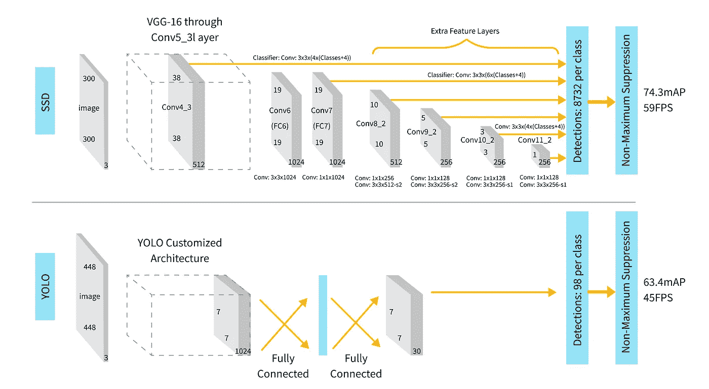

另一方面，两阶段方法优先考虑检测精度。它们提供了更好的性能，但代价是速度。它们被称为两阶段的原因是它们往往是两个模型的组合:区域提议网络，它识别照片中包含对象的概率最高的区域，以及分类器模型，它试图猜测哪个对象出现在这些区域中。两阶段模型最著名的例子是级联 R-CNN、屏蔽 R-CNN 和更快的 R-CNN。

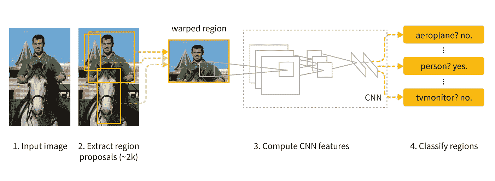

由于我们试图解决的问题既要求速度又要求精度，因此采用 Mobilenet 主干的单级模型类单次多盒检测(SSD)成为人脸检测的最佳选择。

SSD 基于前馈卷积网络，它通过测试一组预定的边界框开始。对于每个默认框，它预测所有对象类别的形状偏移和置信度((c1，c2，，cp))。

在训练时，它首先将这些默认框与基础真值框进行匹配。模型损失是定位损失(例如平滑 L1)和置信度损失(例如 Softmax)之间的加权和。

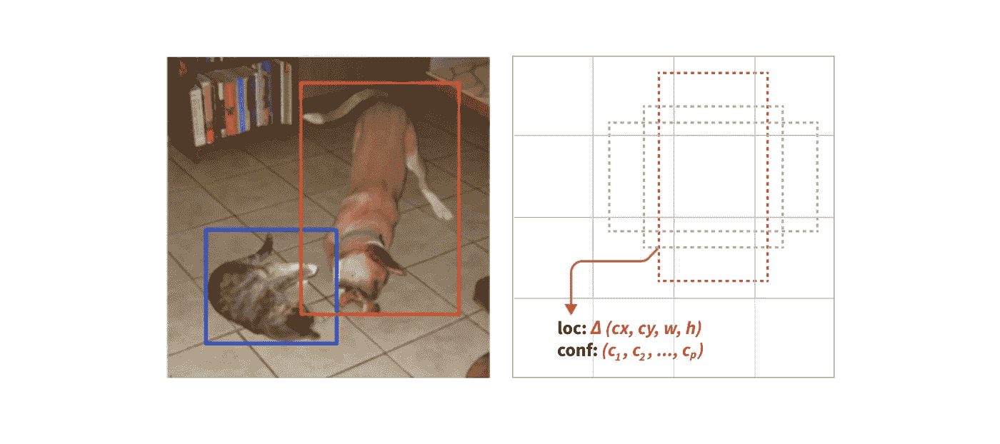

SSD 的早期网络层可以基于不同的架构，例如，最初的框架基于 VGG-16，但是，有更有效的替代方案可以纳入。就速度而言，效率最高的型号之一是 mobilenet。

mobilenet 效率的关键组成部分是*深度方向可分离卷积*，它比标准卷积使用的计算量少 8 到 9 倍，并且只有很小的减少误差。深度方向卷积和 1 × 1(点方向)卷积的组合称为深度方向可分卷积。

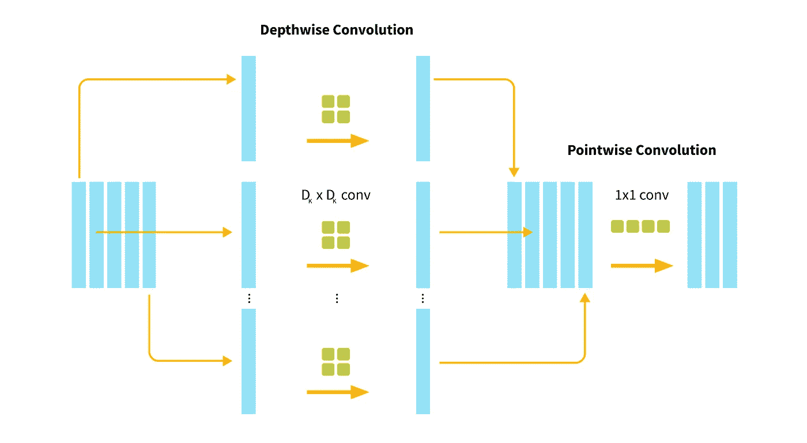

# 性别和种族分类

对于下一步，我们将只使用图像的一部分，即在面部边界框内。性别和种族模型是两个独立的分类模型，每个模型都在公开可用的 [Fairface](https://github.com/dchen236/FairFace) 数据集上进行训练。为了包含更多表现不同情绪的面孔，我们用从互联网上搜集的额外数据丰富了这个数据集。

对于性别分类部分，我们使用了来自基于 VGG 人脸模型的 [deepface](https://github.com/serengil/deepface) 框架的预训练性别模型。

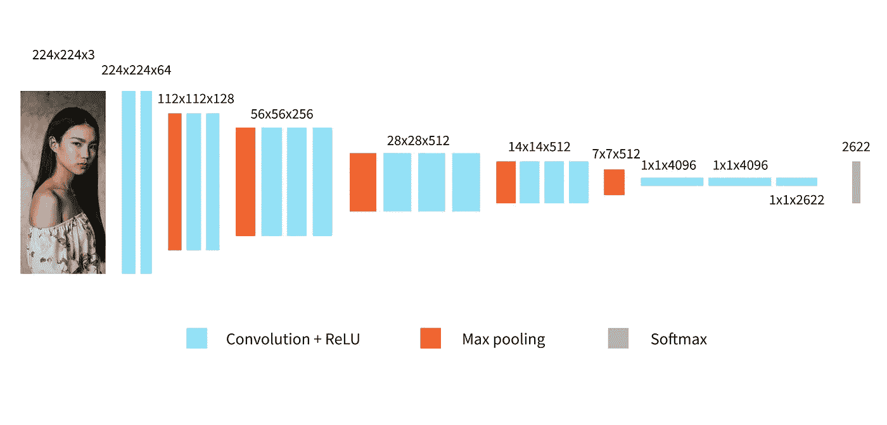

从头开始训练它将需要大量的时间和精力，因此更好的解决方案是使用**微调** —采用在大型数据集上预先训练的模型，解冻顶层，并使用我们的小型数据集训练它们。

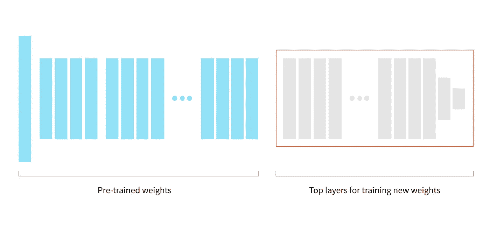

对于我们的训练策略，我们使用回调以某个频率保存模型权重，当验证损失度量停止改善时使用回调来停止训练，以及在每个时期更新学习率值的回调。这些技术以最少的训练历元数确保了更好的预测准确性。

事实证明，在视频上确定某人的种族比确定他们的性别要困难得多。我们需要显著增加训练图像的多样性。为了实现这一点，我们测试了各种数据增强技术，其中最有希望的是用随机化系数降低图像分辨率和亮度。令人惊讶的是，其他一些增强技术，如添加噪音的增强方法，并没有多大用处。

我们最初的普通种族分类模型并不能解决这个问题。我们最终选择了 EfficientNetB2 network，使用了我们在性别分类器上使用的相同微调方法，以及相同的回调列表。

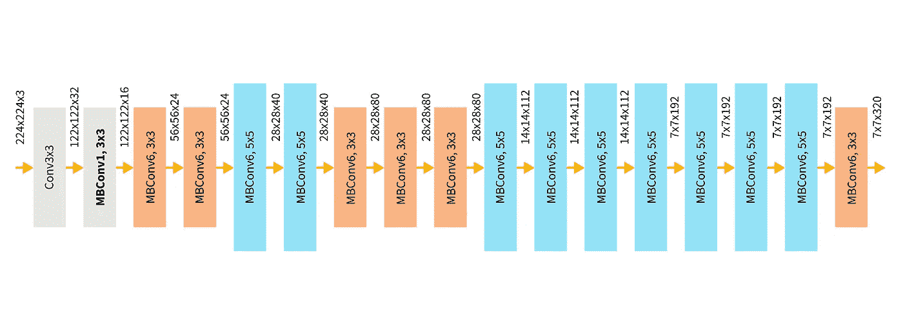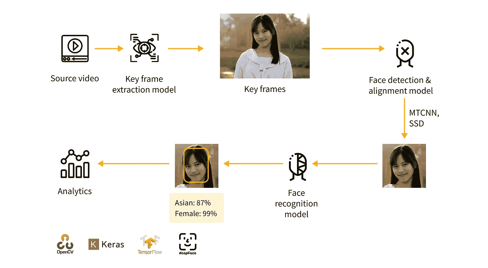

# 估价

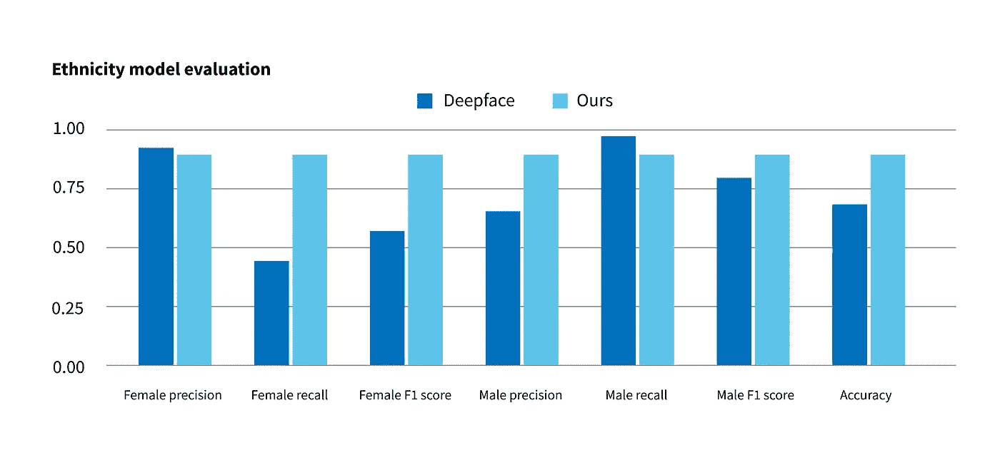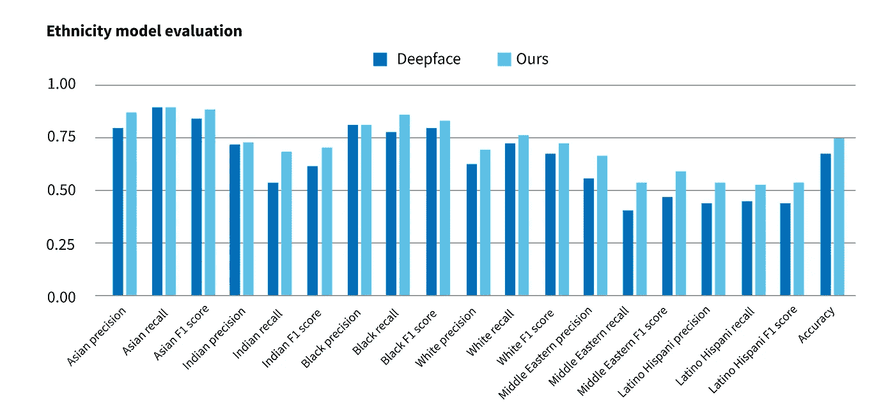

使用平衡的 Fairface 数据集和各种模型调整技术，与 DeepFace 性别模型相比，我们能够实现 30%的准确性提高。种族模型的调整更具挑战性，但我们成功地实现了 11%的精度提高。

# 记忆、时间和金钱成本估算

正如我们上面提到的，除了准确性，时间、内存和金钱成本也是重要的性能指标。我们试图在速度和精度之间找到一个平衡点。因此，我们通过在具有不同配置的不同 AWS 云提供商机器上进行测试来估计货币成本，从最便宜的机器到最贵的机器。

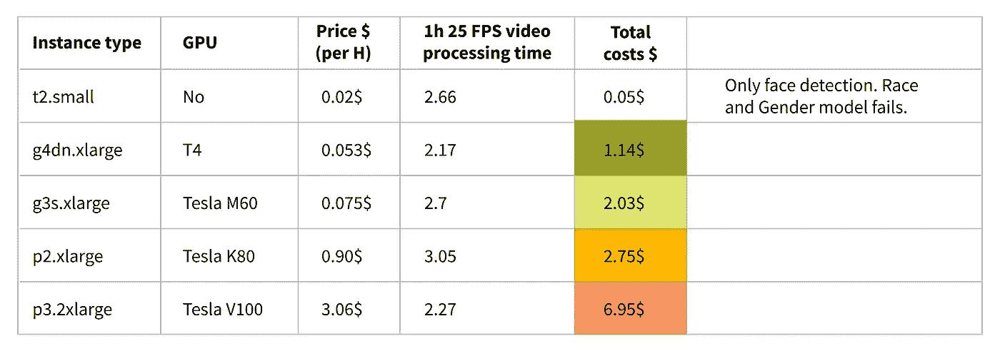

从成本角度来看，最有效的方法似乎是使用英伟达 T4 GPU 在“g4dn.xlarge”实例上运行视频处理。

# 成批处理

为了减少视频处理的耗时，如果我们可以同时对一批帧进行预测，而不是逐帧进行预测，这将非常有用。

但是由于连续的帧可能具有不同数量的面，对象检测中批处理的主要问题是一旦所有结果被堆叠在一起，就将那些模型预测与它们各自的帧进行映射。

对象检测模型将多个帧作为输入，并输出包围盒和分数的矩阵。面部边界框被表示为形状矩阵[ *帧数量 x 面部数量 x 4* ]，而分数被表示为形状的二维矩阵[ *帧数量 x 面部数量* ]，其元素是在相应边界框中检测到面部的概率。该模型可以检测的最大人脸数量被设置为 100，因此我们使用分数矩阵作为掩码来过滤掉预测分数低于特定阈值的人脸。

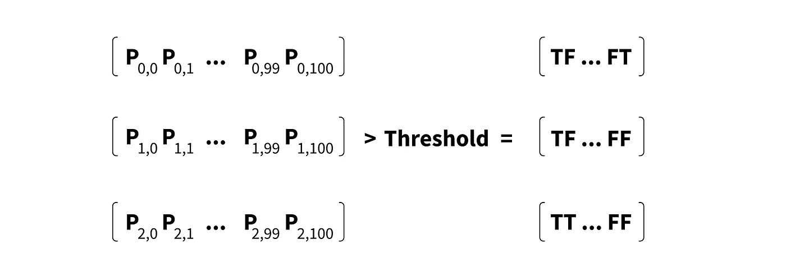

此外，我们使用遮罩来创建 id 向量，以便将人脸映射到它们的框架。首先，我们通过将掩码矩阵乘以从 1 到*帧数*的排序索引值的向量来生成 id 的向量。其次，我们展平矩阵，过滤掉零点，最后得到一个值数组，它将边界框矩阵中的每一行映射到其对应的帧。

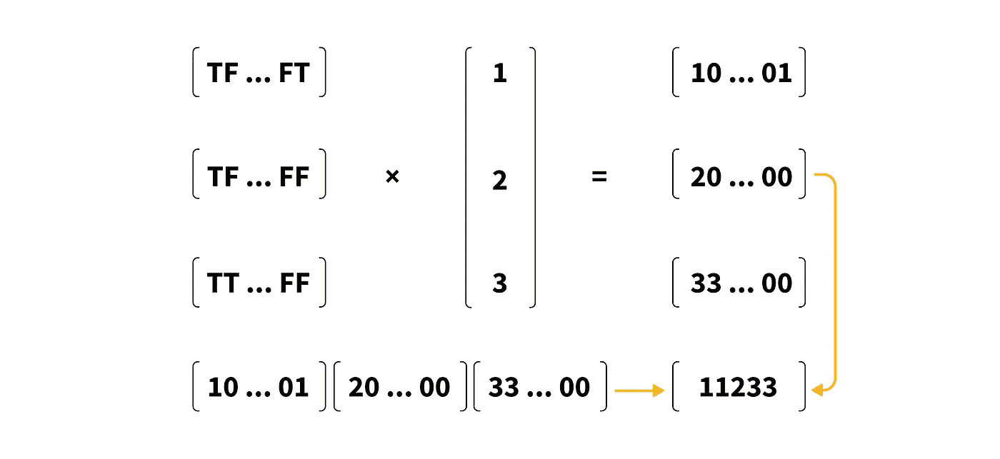

我们可以使用这个新的矩阵来过滤人脸，然后将其余的人脸堆叠成一批进行进一步处理。最后，太小的面被去掉，小盒子被填充。所有这些都可以在一个过程中完成，使用一个数组来屏蔽小框，并通过一个默认填充参数来扩展它们。

为了准备一批调整到所需形状的图像，用于管道中的进一步分类模型，我们使用了一个面部坐标矩阵和一个相应帧的阵列。这是由 opencv 包中的函数 blobFromImages 实现的，它返回一个四维矩阵[ *面数 x 通道数 x 宽度 x 高度* ]。因此，我们有一个完全准备好的批次，可以输入到我们的分类模型中，其最终输出是每个人脸的标签数组。最后，我们使用带有帧 id 的向量将边界框和标签映射回它们各自的帧。

与我们的批处理实现相比，原始的简单逐帧方法处理相同的视频样本要多花大约 17.6%的时间！

# 结论

自动评估视频多样性的能力有着超越推荐电影的用例。零售商对光顾他们商店的人的种族、性别和年龄分布感兴趣。过去需要雇佣市场调查机构、调查和问卷的工作，现在只需一台店内相机就能廉价完成。

作为下一步，我们可以通过突出显示视频中的多目标跟踪来进一步提高模型的准确性。除此之外，附加的模型可以被添加到流水线中，例如情感识别。例如，这可以用来确定客户的满意度。

如果您对这个或我们公司更感兴趣，请随时联系[!](https://www.griddynamics.com/contact?utm_source=medium&utm_medium=referral&utm_campaign=Fighting_Bias_Measuring_diversity_in_streaming_media)