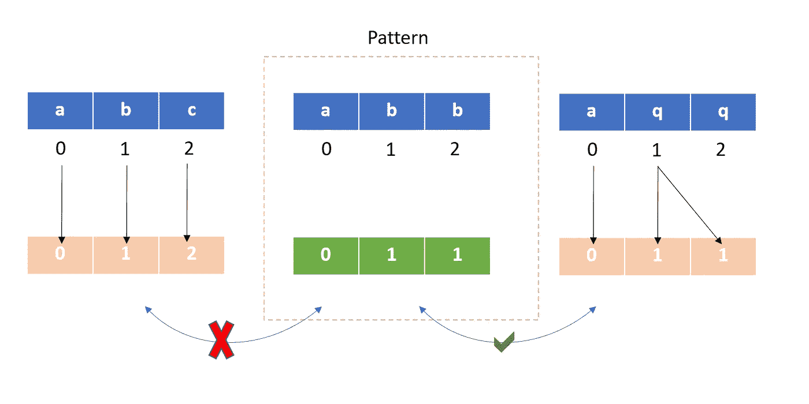

# 寻找模式并替换—日常挑战可能

> 原文：<https://medium.com/nerd-for-tech/find-pattern-and-replace-daily-challenge-may-5ea19d245565?source=collection_archive---------33----------------------->


克拉克·范·德·贝肯在 [Unsplash](https://unsplash.com/s/photos/patterns?utm_source=unsplash&utm_medium=referral&utm_content=creditCopyText) 上拍摄的照片

今天的问题来自每日 Leetcode 编码挑战赛——五月版。这是一个中等标签的问题。让我们看看问题陈述。

## [890。](https://leetcode.com/problems/find-and-replace-pattern/)查找并替换模式

给定一个字符串列表`words`和一个字符串`pattern`，返回*一个与* `pattern`匹配的 `words[i]` *列表。你可以按**任何顺序**返回答案。*

如果存在字母排列`p`，则一个单词匹配该模式，因此在用`p(x)`替换模式中的每个字母`x`后，我们得到想要的单词。

回想一下，字母排列是从字母到字母的双射:每个字母映射到另一个字母，没有两个字母映射到同一个字母。

## 示例:

```
**Input:** words = ["abc","deq","mee","aqq","dkd","ccc"], pattern = "abb"
**Output:** ["mee","aqq"]
```

## 理解问题:

问题是找到具有相同的映射单词出现计数序列的所有单词。换句话说，应该具有相同数量的唯一元素，并且它们应该以与模式元素相似的顺序出现。所以如果我们指定元素的第一次出现作为它的表示。我们将得到一个字符不可知的序列，我们只需要检查模式表示是否相同。



## 代码实现:

```
def helper(s):
    m = {}
    n = len(s)
    res = []
    for i in range(n):
        if s[i] not in m:
            m[s[i]]= len(m) 
        res.append(m[s[i]])
    return resdef findAndReplacePattern(words, pattern):
    pattern = helper(pattern)
    res = []
    for w in words:
        if helper(w)==pattern: 
            res.append(w)   
    return res
```

## 优化:

在上面的解决方案中，我们计算模式时不考虑是否已经存在不匹配。我们可以在发现不匹配的时候退出模式发现过程。这是我们使用两个字典实现的。每个字典都映射到它在模式中的表示&反之亦然。如果我们看到任何字符的重复，我们检查第二个字典中是否有相同的值。

```
def findAndReplacePattern(words, pattern):
    res = []
    for word in words:
        m1 = {}
        m2 = {}
        matched = True
        for i in range(len(pattern)):
            if pattern[i] in m1 or word[i] in m2:
                if word[i] != m1.get(pattern[i]) \
                or m2.get(word[i]) != pattern[i]:
                    matched = False
                    break
            else:
                m1[pattern[i]] = word[i]
                m2[word[i]] = pattern[i]
        if matched:
            res.append(word)

    return res
```

**复杂性分析**

*   时间复杂度:O(N * W)，其中 N 为字数，W 为每个单词的长度。
*   空间复杂度:O(N * 2W)，答案使用的空间。