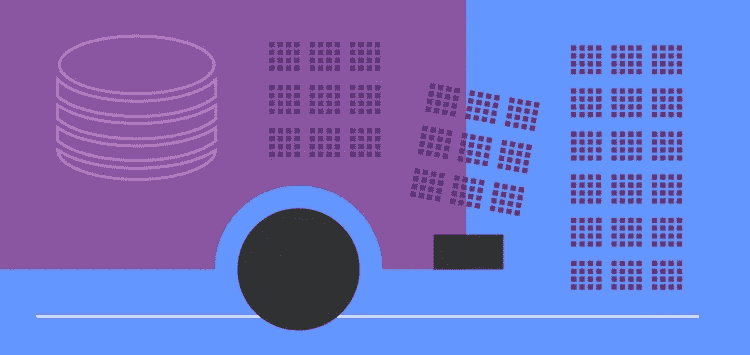

# 找到在数据仓库中加载数据的最佳方式

> 原文：<https://medium.com/nerd-for-tech/find-the-best-way-to-load-data-in-a-data-warehouse-e19a5488640?source=collection_archive---------22----------------------->

数据仓库是收集和管理不同来源的数据以提供有意义的业务见解的过程。

数据仓库的概念可以追溯到 20 世纪 80 年代。它最初是为了帮助转移电力运营数据以支持管理商业智能的系统而开发的。

因此，如今数据的大量使用极大地强调了正确存储数据的必要性。

# 数据仓库是如何工作的？

数据仓库结合了多种技术和组件，极大地有助于战略性地使用收到的信息。

该过程围绕着企业获得的大量信息的电子存储，用于查询和分析，而不是交易处理。

简而言之，数据仓库是一个将数据转化为信息并使其及时、即时地为所有用户所用的过程。

# 简单地说，ETL

ETL 代表了基于三个关键元素的数据集成过程——提取、转换和数据加载。该过程综合了来自多个来源的数据，构建了一个可靠的数据仓库、数据中心或数据湖。

您可以将基本的 ETL 过程分为四个阶段:

*   数据析取
*   数据清理
*   转换
*   数据加载

# 数据析取

在 ETL 中，‘E’代表提取，它代表最初的数据操作。

从不同的源系统中提取数据可以让您轻松地从给定的源系统中获取所有必要的数据。因此，开发一个提取过程以避开源系统的不利影响是必须的——特别是在其操作过程、平均响应和锁定方法方面。

您可以使用以下两种技术之一来实现正确的数据提取:

# 完全提取

在完整的数据提取过程中，所有可用的英特尔都是外包的或从源系统中提取的。因为此过程反映了所有源系统信息，所以不需要跟踪自上次成功提取以来源数据的变化。

# 增量提取

增加的负载通常可以通过实时存储库更新来解决低延迟需求。因此，您只能检索在某个时间点发生更改的数据。

在大多数情况下，您可以使用这种数据提取技术来开发适合数据立方体的事实表。当系统不提供修改记录的详细信息时，完全提取是唯一的办法。

要正确管理数据，您可以采取两种方法之一:

# 在线提取

在这种情况下，您提取直接来自源系统的数据。

这个过程可以直接将您连接到源系统，允许您访问源表。您还可以通过一个中间系统来完成同样的工作，该系统使用预先配置的设置(如更改表、事务日志等)来保存数据。

# 离线提取

对于许多用户来说，直接访问源系统是不可能的。

在这种情况下，您也可以离线或在源系统之外获取数据。您通常可以使用提取过程收集这些数据，并以未定义的通用格式作为平面文件获取这些数据。您还需要收集关于源对象的附加信息，以便正确处理手头的信息。

# 将数据加载到仓库的最佳方式

最初的数据仓库加载包括填充模式数据仓库中的表，然后检查它是否可以使用。

加载数据仓库事实表的步骤包括:

1.  创建临时表
2.  填充临时表
3.  更新现有记录
4.  插入新记录
5.  执行错误处理和记录

当加载的数据接近固定周期的提取过程时，或者当您使用反向取消时，数据删除可能也是一个值得考虑的好选择。

需要注意的是，在某些情况下，将数据加载到事实表(从阶段表)可能还需要对记录进行重复数据删除。

# 数据清理

数据清理允许您检测和分离无效、重复或不一致的数据，提高提取数据的质量和有用性。数据清理过程在确保决策分析中使用干净、准确的数据方面发挥着越来越重要的作用。

数据清理通常发生在将信息存储到数据仓库之前。

# 数据转换

数据转换通常是指清理、聚合和结构化数据，并为分析做准备。

在从源系统提取数据的过程中，您可以执行许多数据转换。完成后，您可以将该卷移动到目标系统，以进一步处理收集的信息。

成功实施 ETL 过程有两种主要方法:

*   多阶段数据转换——在这里，您可以将提取的数据移动到发生转换的地方。这个过程发生在您将这些数据存储到其最终目的地—数据仓库之前。
*   仓库内数据转换——在整个过程中，ELT 将充当流程，因此您可以将提取的数据加载到仓库中，在那里进行转换。

# 下一步是什么？

一旦数据被成功接收并转换到数据仓库中，您就可以通过高级查询或模型从中获得有价值的见解。这些被具体化为表并存储在您的仓库中。

像[**ruder stack**](https://rudderstack.com/)这样的客户数据管道可以让您将这种丰富的分析从您的仓库发送到您的整个客户数据堆栈。了解更多关于 [**RudderStack 的仓库动作特性如何解锁你的仓库**](https://rudderstack.com/blog/rudderstack-warehouse-actions-unlocks-the-data-in-your-warehouse) 中的数据。

# 免费注册并开始发送数据

测试我们的事件流、ELT 和反向 ETL 管道。使用我们的 HTTP 源在不到 5 分钟的时间内发送数据，或者在您的网站或应用程序中安装我们 12 个 SDK 中的一个。 [**入门**](https://app.rudderlabs.com/signup?type=freetrial) 。

**本博客最初发表于**[**https://rudder stack . com/blog/find-the-best-way-to-load-a-data-warehouse**](https://rudderstack.com/blog/find-the-best-way-to-load-data-in-a-data-warehouse)**。**