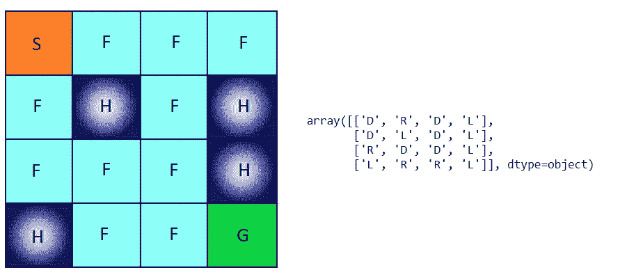
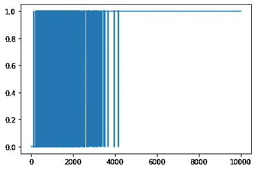
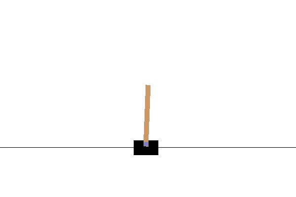
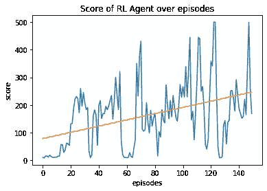
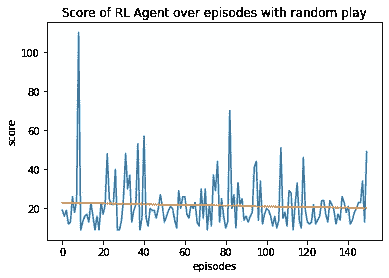
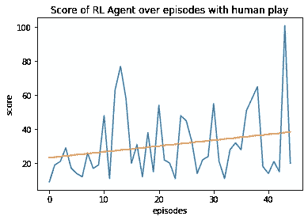
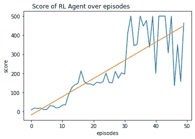

# 强化学习初探

> 原文：<https://medium.com/nerd-for-tech/first-look-at-reinforcement-learning-67688f36413d?source=collection_archive---------14----------------------->

我们在机器学习中听到的一种学习类型是强化学习，其中代理通过奖励和惩罚在已知或未知的环境中学习目标。与监督和非监督学习等学习方法不同，强化学习完全不需要数据。在我的课程 CS4100 中，该课程简要介绍了这种学习方法的实践，所以我想进一步探索。强化学习的许多应用是在游戏或复杂且计算昂贵的现实世界问题中，所以很难找到“有意义地”应用强化学习的东西。尽管如此，这仍然是一个超级有趣的话题，在这个话题中，一个代理可以在不知道其环境的情况下建立一个最大化回报函数的策略。我想探索强化学习的高层次视图，所以我将使用 OpenAI 的健身房库，其中有预构建的环境，具有定义的观察和行动空间，并为不同的状态分配奖励值。

我首先处理的一个简单任务是 FrozenLake 游戏。游戏很简单，环境是一个 4×4 的平铺方块，玩家从 S 方块开始，导航到 G 方块。掉进一个洞，或 H 方块意味着游戏结束。这个游戏在健身房图书馆的实现有一个简单的奖励功能。如果代理达到目标，则为 1；如果没有达到目标，则为 0。行动空间是四个基本方向，观察空间是玩家可能在的 16 个方格。这个游戏也有一个陷阱:地板很滑，你有可能每一步都朝一个随机的方向走。然而，为了查看构建的策略是否有效，我将关闭滑动模式。

不滑的冰湖

那么代理人是如何制定政策的呢？有许多不同的方法来实现强化学习，如价值或政策迭代，解决 MDP，TD-learning，但我将探索 Q-learning。

在 Q-learning 中，代理希望最大化“Q”值，这是从特定状态和动作映射到的值。开始时，Q 表将被初始化，其中 Q(s，a)的基数是*动作空间* × *观察空间*。代理人在许多集里玩这个游戏，并在此过程中建立 q 表。

首先，代理人选择一步棋。一个策略，我将使用ε贪婪算法，在这个算法中，一个代理会选择一个随机行动。否则，它将选择 Q 值最高的动作。ε是勘探与开发之间的平衡，通常，存在ε衰减因子，勘探的机会随着迭代次数的增加而下降。

ε贪婪算法

代理选择操作后，我们将使用下面的等式，以便代理可以“学习”。在等式中，max_a Q(S_t+1，a)是代理执行其动作后下一个状态的最佳动作的 Q 值。Q(S_t，A_t)是当前状态的 q 值。下一个状态的 q 值乘以γ，γ是一个折扣因子，因为它在一个时间步长之外，这是一个未来奖励的价值小于即时奖励的概念。R_t+1 是你执行动作后的奖励。总的来说，奖励+贴现的未来效用和当前效用之间的差额就是代理人认为当前 q 值应该是多少。目标值与 alpha 相乘，alpha 是将当前 q 值向“真实”q 值推进的学习速率，代理将随着时间的推移学习“真实”q 值。

更新方程式

在让代理学习了 10，000 集之后，我们建立了一个为每个状态选择最佳动作的策略。请注意，由于没有光滑地板的 FrozenLake 是确定性的，所以这可以用动态规划来解决。

我们的政策经过 10000 次反复。每个字母对应一个动作:下、上、左、右。

绘制每集的奖励给了我们一个看起来非常奇怪的图表。因为奖励是二元的，要么你达到目标，要么你没有达到目标。你可以看到这个谜题在 4000 集左右就被解开了。

虽然所有这些都很简单，计算成本也很低，但 FrozenLake 问题只需要一个 4*16 = 64 大小的 q 表。如果我们想在更复杂的环境中使用 Q-learning 呢？让我们以横竿问题为例。

OpenAI 健身房的钢管舞-v1

CartPole 问题是一个游戏，在这个游戏中，一根杆子被放在一辆可以向左或向右推的车上保持平衡。对于这个问题，可能采取的措施只是施加+1 或-1 的力。然而，观察空间是连续的。观察空间中的给定状态由小车位置、小车速度、极角和极角速度组成。在这种情况下，q 表不起作用。这就是深度 Q 学习的用武之地。

在深度 Q 学习中，我们可以将 Q(s，a)视为一个函数，而不是查找表 Q(s，a)。如果我们回顾一下 Q 更新方程，它类似于神经网络如何学习。回报+贴现的未来效用这个“目标”就是 q 值应该是多少。Q(S_t，A_t)是模型认为的当前 q 值。它们之间的差别就是损失，我们可以用学习率慢慢更新网络的权重。使用神经网络，我们可以通过提供状态和目标 q 值来拟合网络，当我们使用网络进行预测时，网络将返回每个动作的动作空间和 q 值。

更新方程式

掷骰子游戏的奖励系统很简单。对于柱子直立的每一个时间步，你将得到+1。在尝试为 CartPole 游戏实现深度 Q 学习后，尽管运行了 100 集的算法，我还是得到了平均 10 分。事实上，一段时间后，ε衰减导致ε接近 0，因此 Q 函数收敛到一个次优策略。问题是，当我们用最新的状态拟合网络时，模型会慢慢“忘记”过去的障碍，并回到起点。虽然模型确实学会了如何越过某个障碍，但后来的状态不会遇到该障碍，因此网络的权重将从解决方案转移到该障碍。

对此的解决方案是体验重放。我们保留过去状态和动作的“记忆”,并重放这些记忆以保持模型了解其过去。体验重放的实现将是保持(状态、动作、奖励、新状态、isOver)元组的阵列，其中网络适合随机的一批状态，而不仅仅适合最新的状态。使用这种方法，代理在测试策略时，在 50 次行动中平均得分为 430.26。

特工训练超过 150 集

我们来对比一下随机播放，平均 21.48 分。

代理人玩随机行动策略

让我们把这比作人类的游戏。我在 45 次游戏中平均得分为 30.8，但与随机游戏不同，人类游戏会随着时间的推移而“学习”。

人类游戏

如果我们对比人类游戏和深度 q 学习的学习速率，我们可以观察到机器的学习速率更快！很明显，人类游戏的基准只有一个玩家，那就是我，所以这不是对人类表现的准确衡量。让我们看看是否可以改进我们的强化学习算法。我们可以调整的几件事是批量大小，以允许更长的“记忆”，奖励系统，我们神经网络的超参数，可能更多，但这里我们要改变奖励系统。我们将缩放奖励以匹配极角的范围，而不是简单的每个时间步长+1。CartPole-v1 在极点角度超过[-0.418，0.418]弧度后终止，因此我们将让 reward = 1-|a/0.418|以弧度表示极点的角度，以便为更加垂直的极点角度赋予更大的权重。结果如下:

代理人在玩新的奖励系统

看起来性能好多了。请注意在 10 集之后，评分从未低于 100，相比之下，原始策略的评分在 120 集之后仍会偶尔暴跌。我假设这可能是因为极点被激励保持在 0 弧度，所以极点下降的空间更小，而旧的奖励系统仍然给出相同的奖励，如果极点即将下降但在界内。在 50 场比赛中，我们测试了这一策略，平均得分为 489.88。这比我们旧系统的平均值高出整整 50 分。

总的来说，这是对强化学习的有趣的初步观察。在未来的帖子中，我可能会尝试查看一些更复杂的环境，如 OpenAI 健身房中的 Atari 游戏，或者尝试自己编写一个环境。当我浏览健身房的环境时，有一个 Box2D 部分，那里有一堆用 Box2D 物理库模拟的场景。这是一个惊喜，因为我在创建 RPGConcept 时曾与 Box2D 合作过(参见我 2018 年的帖子)！也许我会用 Java 来制作我的环境。最终，我希望能够在《我的世界》使用 Malmo T1 做一些事情，这是微软在《我的世界》上建立的一个人工智能实验平台。

代码:[https://github . com/cheng i600/rl stuff/blob/master/Q % 20 learning/QLearning _ dqn . ipynb](https://github.com/chengxi600/RLStuff/blob/master/Q%20Learning/QLearning_DQN.ipynb)