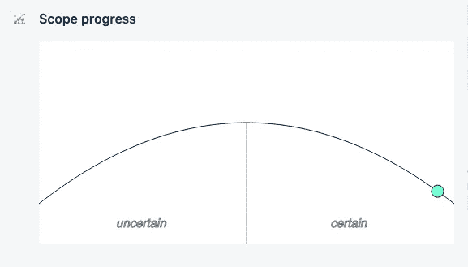

# 第一次参加 Basecamp 的比赛

> 原文：<https://medium.com/nerd-for-tech/first-time-with-basecamps-shapeup-d5831cbefb7a?source=collection_archive---------13----------------------->

照片由[德鲁·海斯](https://unsplash.com/@drew_hays?utm_source=unsplash&utm_medium=referral&utm_content=creditCopyText)在 [Unsplash](/t/business-work?utm_source=unsplash&utm_medium=referral&utm_content=creditCopyText) 上拍摄

在过去的几个月里，在 [Tjekvik](https://www.tjekvik.com/) ，我们已经对我们的工作流程做了很多试验。大约一年前，我们的开发团队只有 4 个人。我们用 SCRUM 启发的方法工作，一切都很好。我们推出了新功能，修复了错误，让客户满意。

在这段时间的某个时候，我们开始有更多的事情在进行中。估计中等的任务变成了大任务。大的变成整个项目。sprint 中期出现的 bug 和客户请求变得很正常。我们的盘子里有很多东西，看起来我们的盘子越来越大了。而且，团队发展到 10 人。

我们不知道到底要改变什么，但我们想要改变。我们知道我们不想深入 SCRUM，我们从来不认为它适合我们。我们有这样的想法，人们在“基于项目的工作”中独立工作。会议越少越好。但这与谷歌的建议大相径庭，我们不确定该如何走这条路。

那就是我们偶然发现了 Basecamp 的“塑造”方法。这立即引起了我们的共鸣，因为我们已经有了想法，但无法付诸行动。

# 启动

我们看了看整个“形状”,划掉了目前感觉不像我们的东西。我们对*投注*和*整形*阶段说“不”，直奔*楼*。我们有一个重要的项目，我们已经在考虑如何确保我们实现它。所以我们以此为例。该项目旨在创建一种方法，根据一些规则过滤来自各种 API 的数据。

我们设置了 6 个星期的胃口，并承诺 1 名开发人员只在这件事上工作。我和产品负责人会兼职帮助他。我们最初的调查并不是最好的，所以我们确保不会因为遗漏产品细节而陷入困境。

我们将第一周用于研究和计划。我们设定了一个目标，在本周末之前建立一个工作范围列表。这就开始了实验。

# 第一课

第一周之后，我们看了看望远镜，大概是这样的:

*   跨提供者实现一致的数据模式
*   提供者 X 的后端提取数据
*   供应商 Y 的后端提取数据
*   存储提供商 X 的过滤规则的后端
*   存储提供商 Y 的过滤规则的后端
*   在所有字段上为提供者 X 实现过滤
*   在所有字段上为提供商 Y 实施筛选
*   在前端显示提供商 X 的数据
*   在前端显示提供商 Y 的数据

啊哦。这正是范围**不应该是**的样子。以及我们之前是如何分工的。为整个项目做一些后端工作。在分离时做些前端工作，也是为了整件事。然后在项目进行到一半的时候，把这两个粘在一起。现在，最后，展示整合的东西，并获得反馈，希望一切顺利。当然，从来没有。

这种方法没有什么问题。在整合所有部分之前，它不会给客户带来多少价值。如果缺少其中的一个部分，整个项目就没用了。很难从非技术人员那里得到有价值的反馈。当反馈最终出现时，这会导致巨大的变化。

这么晚才进行集成，我们要么交付整个产品，要么什么都不交付。因为我们不能中途停下来。这是一种孤注一掷的工作。这很危险，会导致*陷入*陷阱，我们已经为此投入了太多时间，再多两周是值得的。

无论如何，这次我们知道我们有一个期限——6 周。一天也不会多。要么在 6 周内完成，要么什么也没做。从这个项目的第一天开始，就有一种轻微的焦虑感伴随着我们。焦虑不是一件坏事吗？从长远来看是真的。但在这种情况下，这是一种变革的驱动力和巨大的动力。我们想给**送点东西**。

所以我们采取了照章办事的方法，把我们的观测范围变成了:

*   对提供者 X 的一个字段应用一个过滤器
*   实现接口来管理已经应用的过滤器
*   对提供者 X 的其他字段应用过滤
*   呈现用于调试的过滤前和过滤后视图
*   为其他提供商实现上述所有功能

哈！好多了！我们没有考虑所有的提供者，而是专注于为一个数据源提供一个过滤器。我们必须从 API 中提取数据，并在向客户展示之前对其进行一些转换。即使这拖了整整 6 周，我们什么也没做，我们仍然带来了价值。我们的客户可以看到不同之处。我们还通过这种方式集成了我们的整个堆栈。我们提取数据，过滤后呈现在前端。在这个范围之后，我们对下一个范围的潜在问题变得更加聪明。

还要注意最后一个作用域有多宽。我必须承认，在看到第一个供应商所需的所有工作后，我从来不相信我们会找到其他供应商。那一刻，我意识到，如果我们用老方法，我们会失败。第一周就已经上了这样一课？该死，太好了。

# 建筑物

接下来的 4 周相当顺利。我们构建了支持第一个提供商所需的所有东西。在此期间，我们最初的工作范围发生了一些变化，出现了一些新的工作，也有一些被拒绝。但总体方向与我们在第一周的发现保持一致。我们一直遵循简单的流程。开发人员每天与产品负责人交谈，以消除所有的疑虑，并交付代码。我做了代码审查，并提供了一些问题、测试和工作流程想法。

我们使用 Trello 来计划和跟踪我们的工作。在这个实验中，我们创建了一个新的板，称为“TjekShape ”,并将所有的示波器作为卡片放在一列中。我们想用图表来跟踪进度，所以我为此创建了一个简单的 Trello PowerUp。这让我们可以专注于工作本身，而不用花时间去学习新工具。我们还在常规的 Trello 板上保留了一张卡，整整 6 周都在进行中。这给了我们在每日脱口秀上更新项目的机会。因为这是一个实验，我们不想把示波器作为任务放入当前的电路板。我们也不想把自己完全排除在团队之外，因此我们的设置与卡和新的董事会。

希尔图刚好够玩。

# 包裹

5 周后，我们完成了第一个供应商。这是产品方想要的吗？不。已经比以前好了吗？他妈的，是啊！尽管我们没有交付所有我们梦想的东西，但我们交付了一些让我们的产品变得更好的东西。

我们也学到了很多过滤数据的复杂性。因此，现在我们可以更好地决定何时以及如何接触其他供应商。让我们回顾一下我们在这个项目中学到的主要东西。

## 从食欲开始

这是思想上的第一次转变，改变了很多。有了明确的时间和预算界限，我们就可以推理出符合这些界限的解决方案。一个估计需要 6 周时间才值得做的项目，可能要花 3 个月的时间才完全没意思。有了一开始就设定的胃口，我们可以考虑一个可行的解决方案，而不是一个完美的方案。我们还可以更好地决定哪些事情是真正需要做的。

## 最小的变化，整个堆栈

这是我们在许多地方反复听到的事情。早期整合，展示，获得反馈。但是当你开始工作的时候，你会感到困惑和困难。从所有后端工作开始，然后是所有前端工作，最后是集成，这很有诱惑力。即使砍成小块，还是那么经常一个接一个。在 20 个输入中只构建一个似乎有点可怕。或者从一个地方而不是三个地方获取数据。最后，什么可能会出错呢？结果是——很多。通过在众多过滤器中只做一个，我们就可以把它展示给那些愿意使用和学习这个特性的人。了解到把表单放在这个地方根本没有意义。不清楚如何使用它。如果不清楚如何使用只有一个字段的表单，当我们添加 5 个或 10 个字段时，它不会变得更容易。所以我们很早就知道，我们需要改进。

## 专注，专注，专注

这个我怎么称赞都不为过。这完全是完全不同的工作，有一件大事，知道这是你未来几周的重点。没有什么会打扰你。你可以切割它，分割它，在这几周内以你喜欢的任何方式接近它。

没有错误修正，没有“你能不能……”没有“你觉得……”没有“我知道你很忙，但是……”。这似乎是显而易见和自然的事情，但在许多公司中却很少见。

## 更进一步

自从我们做了第一个实验已经有一段时间了。在这之后，我们会更加努力地塑造我们将要做的工作。我们在较小的(两周)项目上做了一些实验。我不认为我们会达到完美的状态。我们与 Basecamp 处于如此不同的阶段、规模和行业。然而，我们仍然可以从他们的方法中吸取许多好的东西，并把它放进我们的工具箱。

每种方法都有好的和不好的部分。对 A 公司有效的方法很可能永远也不会对 b 公司有效。所以，采用对你有效的方法，不要害怕建立你自己的 ShapeSCRUMbanster。最后，什么可能会出错呢？