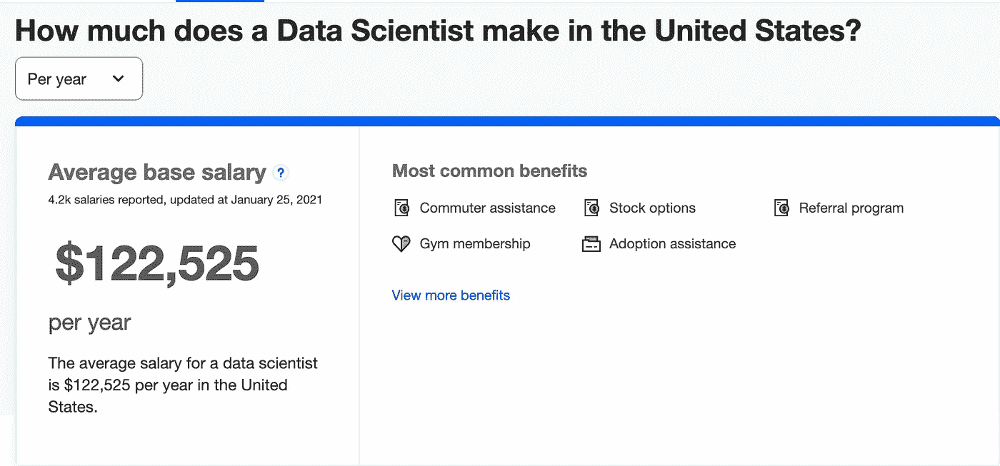

# 关于数据科学家的五个神话

> 原文：<https://medium.com/nerd-for-tech/five-myths-about-data-scientists-9557958dce15?source=collection_archive---------7----------------------->

来自 [Pixabay](https://pixabay.com/?utm_source=link-attribution&amp;utm_medium=referral&amp;utm_campaign=image&amp;utm_content=2713360) 的 [Gerd Altmann](https://pixabay.com/users/geralt-9301/?utm_source=link-attribution&amp;utm_medium=referral&amp;utm_campaign=image&amp;utm_content=2713360) 的原始图片

作为一名数据科学家，我已经工作了几年，我听到了一些关于数据科学家的神话/误解。今天，我想分享我经常听到的五大误区。希望这能通过打破神话为你提供一些关于数据科学家的事实。

详情请参考我的 [YouTube 频道](https://youtu.be/fZHwzWy78vM)！

# 1.数据科学家收入丰厚

嗯……这取决于你现在从事什么行业，你现在居住在哪个州，以及你的工作经验。根据 Indeed 发布的薪资数据，美国的数据科学家平均年薪约为 12 万美元。

图一。在美国工作的数据科学家的年收入

正如我前面提到的，不同地区和不同行业的工资不同。例如，根据 Indeed 的数据，纽约市的数据科学家年收入约为 14 万美元，而杰克逊维尔的数据科学家年收入约为 11 万美元。还有，以谷歌为例，一个数据科学家平均每年可以赚 17 万左右。然而，正如你在这里看到的，工资范围从 42K 到 280K 变化很大，这证实了工资的差异不仅取决于行业的类型，还取决于工作经验的年限。

# 2.你需要获得博士学位才能成为一名数据科学家

不不。相信我，要成为现实世界中的数据科学家，你不需要获得博士学位。如果你看一下 Indeed 或 LinkedIn，你会看到一些公司特别要求数据科学相关工作的博士学位。然而，相信我，事情并不总是这样。我和朋友都只有硕士学历，都在大公司上班，没有博士也不要苦恼。拥有它可能很好，但它绝对不是必需的。

我可以提供的另一个证据是使用 Kaggle 调查数据集对我之前的 YouTube [视频](https://youtu.be/SphYZ78moE0?t=226)的分析结果，该视频于 2020 年 10 月发出，并获得了 20000 条有效回复。根据人口统计学数据分析，全球数据科学家的前两个最高教育水平是硕士和学士学位。希望这能给你一些信心。请记住，你可能会攻读博士学位。如果你喜欢某个领域的研究过程，不要只是为了成为一名数据科学家。

# 3.数据科学家的日常工作是构建一个完美的模型

不完全是。在开始构建模型之前，需要多个步骤。通常，每个数据科学项目都从数据预处理开始，我认为这至少需要 70%的时间，然后是相关性分析、可视化，然后是构建模型。因此，数据科学家的日常工作不仅仅是改变参数来构建一些花哨的模型。

# 4.成为一名数据科学家只需要编码技能

当然不是，但是不要误解我。正如我在成为一名数据科学家的五大必备技能中提到的，编码技能肯定是至关重要的，但它不是数据科学家应该获得的唯一技能。编码的能力固然重要，但讲好故事的能力更重要。讲故事是一项重要的软技能，可以帮助你将数据转化为对听众有用的信息。

# 5.人工智能最终将取代数据科学家

这个神话经常出现在我的日常对话中。人们总是问我——你们这些数据科学家最终会被人工智能取代吗？我的答案总是很难回答不。人工智能更像是数据科学家的工具，因为它提供了高计算能力，这是我们任何一个人都无法用自己的大脑实现的，而且永远不会涉及到情绪。然而，如果没有数据科学家，人工智能将不会知道如何自动解决数据质量问题，输入缺失的数据，选择合适的算法，并根据各种场景调整参数。此外，当涉及到视觉识别和/或文本注释时，没有数据科学家，人工智能不会产生高性能。

就是这样！非常感谢你的时间，如果你喜欢我的帖子，请击碎鼓掌按钮！一定要看看我的 [YouTube 视频](https://youtu.be/fZHwzWy78vM)！