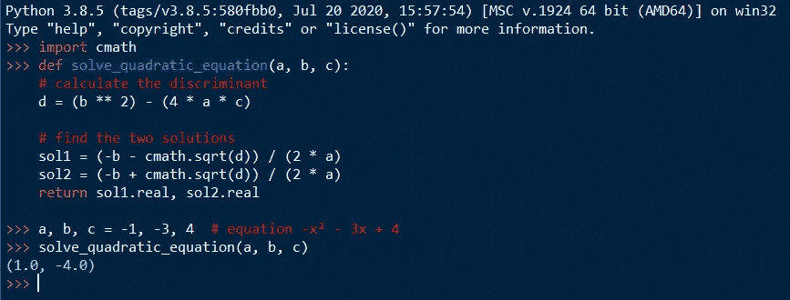
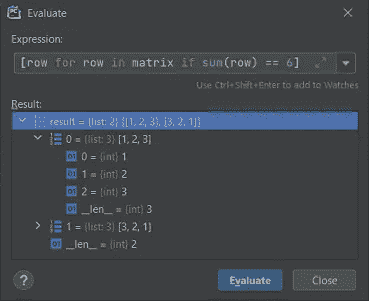
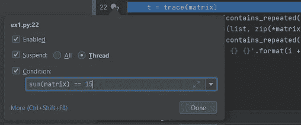
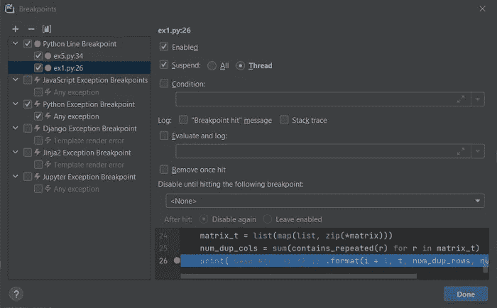

# 使用调试器轻松修复错误

> 原文：<https://medium.com/nerd-for-tech/fix-bugs-easily-using-a-debugger-17fb3bd75b55?source=collection_archive---------17----------------------->

软件工程师、数据科学家、web 开发人员(或者任何不用手工作的人)的能力取决于他或她所使用的工具。对于需要编写和修复计算机代码的人来说，调试器是最重要的工具之一。因此，我很惊讶会遇到程序员，尽管通常是新手，却不得不去发现调试器的威力。

通常，当有人刚开始学习编程时，他们希望看到程序不同位置的变量的值。最直接的方法是在代码中插入“print”或“log”语句，这也是编程课程开始时经常推荐的方法。一旦他们学会了这种所谓的*打印语句调试*，他们就会热情地开始用这些来帮助他们理解他们的代码是如何运行的。

使用“打印”语句当然是一种简单可行的可视化程序状态的方法。更重要的是，在只能访问程序输出的系统中，这是唯一的方法。但是，每次在程序中添加“print”语句时，都需要重新编译(对于编译的编程语言)并再次运行。这使得这种反复试验的过程相当耗时。

只是一张彩色的 stockphoto(你大概知道打印报表是什么样子吧！).照片由[克里斯里德](https://unsplash.com/@cdr6934?utm_source=medium&utm_medium=referral)在 [Unsplash](https://unsplash.com?utm_source=medium&utm_medium=referral) 上拍摄

也有更多的交互式方法来编写代码，这在您开发时给了您额外的反馈。一些开发人员喜欢使用*读取-评估-打印循环*(简称 *REPL* )工具。 [Jupyter notebooks](https://jupyter.org/) 就是这样一款深受数据科学家欢迎的工具。

基于 REPL 的工具评估开发人员提供的简短代码片段，并立即返回结果。每一段被评估的代码也会影响当前的 REPL 状态。可以定义新变量或修改现有变量。这使得开发人员可以一点一点地运行程序，并获得代码结果的即时反馈。

REPL 工具是打印语句调试的一个很好的替代品。它们使得调整程序状态或您想要测试的位并查看结果变得容易。他们的挑战最终是重建你的程序的状态。为此，必须首先导入或重新创建所有需要的变量和函数。此时，一些开发人员可能会想“但是有更好的方法吗？”。答案是“是”。准备好进入编程生涯的新篇章吧。

在 Python REPL 上测试二次方程求解器的示例。这需要:导入库、定义函数、定义输入和运行函数。咳😩

一个*调试器*是一个交互式运行你的代码的计算机程序。它允许你定义程序中断的条件。一旦中断，您就可以检查此时的程序状态。或者，您可以逐行运行您的程序，查看程序运行时状态如何变化。这些特性极大地提高了程序员的工作效率，因为它们让您能够找出代码中错误的来源。

但不仅如此。调试器还可以帮助您理解您自己的代码、您同事的代码，甚至是来自导入的库和框架的代码。对我来说，进入项目依赖项的代码来理解它为什么以某种方式运行并不罕见。它甚至帮助我对开源项目做出了贡献，准确地指出了修复一个 bug 需要纠正哪些行。

[开发人员花了大约 50%的时间](http://citeseerx.ist.psu.edu/viewdoc/summary?doi=10.1.1.370.9611)让他们的代码工作并修复错误。使用调试器可以大大加快这个过程，因此开发人员可以将更多的时间花在真正有价值的工作上:添加新功能。

调试器有两种类型:*源代码级调试器*和*机器语言调试器*。我们将把重点放在源代码级调试器上，因为你需要调试机器语言(即汇编代码)的机会是极小的，除非你在编译器上工作或者需要优化低级例程。

调试工具可以比较的另一个轴是它们是否提供命令行界面(CLI)或图形用户界面(GUI)——有些两者都提供。当没有可用的图形环境时，CLI 调试器会很有用，例如，如果您正在一台机器上通过 SSH 进行开发。但是对于所有其他情况，我建议使用 GUI 调试器。或者更好的是，集成到您的 IDE 中的调试器。这些图形化调试器的学习曲线要温和得多。通常，与 CLI 调试器相比，它们显示的信息更多，所需的击键更少。

# 如何使用调试器

在这里，我将讨论调试器中常见的一些概念，以及它们如何帮助您变得更加高效。

目前我最喜欢的调试器是集成到 JetBrains IDE 中的那个(我不隶属于他们)。因此，在本文的其余部分，我将应用他们使用的相同术语。但是先不要点击离开！其他调试器功能类似，应用相同的概念。因此，即使您偏爱像 Visual Studio Code、Eclipse 或 NetBeans 这样的 IDE，这对您仍然有用。

## 显示

若要开始调试，请在调试模式下运行代码。这通常可以通过点击一个带有 beetle 图标或文本“Debug”的按钮来完成。我建议你尽早查找这种模式的快捷键，因为你可能会非常需要它！

按钮以调试模式启动程序

启用调试模式后，调试器将运行您的代码，同时跟踪当前变量及其值。当您挂起调试器时(稍后您将了解如何挂起)，您将能够检查所有的变量。在 JetBrains IDE 中，您还可以通过在定义变量的地方单击鼠标右键来查看当前变量值。

显示线程、框架和变量的挂起调试器

你通常可以看到的其他东西是程序的堆叠框架。框架本质上是程序的当前范围。如果执行一个函数，就会创建一个新的框架。对于多线程应用程序，导航不同的线程也很有用。每个线程都有自己的一组帧和各自的可变状态。

当你的程序被挂起时，你也可以计算复杂的表达式。只需用当前编程语言提交一个表达式，然后按“求值”。这使您可以深入到每个变量的底部。您可以检查 JSON 对象中列表或特定项目的内容。如果你发现自己经常评价同一个表情，可以考虑把它添加为*手表*。这将把表达式添加到被跟踪的变量中，这样您就可以随时看到结果。

用 PyCharm (Alt+F8)计算表达式

## 断点

当您以调试模式启动程序时，它将持续运行，直到完成或遇到异常。为了开始检查程序状态，需要设置*断点*。这些是条件，当满足时，暂停程序执行。此时，您可以访问作用域中的所有变量，执行表达式和控制进一步执行的选项。即使是 wilder 也能够在运行时编辑变量值，并查看它如何影响您的程序。

设置了附加条件的断点

有不同类型的断点。您可以在代码中的特定行中断。这通常是通过点击该行左边的空白，或者当您的插入符号在该行上时点击某个键盘组合来完成的。此外，还可以添加一个条件，该条件必须满足，程序才能在该断点处暂停。

查看和修改所有断点的按钮(Ctrl+Shift+F8)

另一种可能是在引发异常时中断。这对于找出哪种情况下出现了 bug 非常有用。在 JetBrains IDE 中，你首先需要打开显示所有断点的菜单。默认情况下，任何异常都会显示中断选项。要中断特定的异常，请单击“+”按钮。

查看和修改所有断点

一些调试器能够在特定变量的值改变时中断。这些是所谓的*观察点*或*数据断点*。不幸的是，JetBrains IDE 没有这个功能。

也可能有这样的情况，您希望暂时禁用断点，以便让程序正常运行。在 PyCharm 调试器和大多数其他调试器中，您可以启用/禁用单个断点或暂时禁用所有断点。此外，也有可能删除一次命中断点，所以它只中断一次。

启用、禁用或设置新断点可以在程序执行期间完成。这是一个致命的特性，它使调试比无休止地添加和删除“print”语句更令人愉快。

## 控制执行

一旦你的程序遇到一个断点，你就可以使用一系列的选项来控制进一步的执行。您可以决定使用 s *tep over* 函数逐行运行代码。或者你可以用 s *单步执行*来跳转到函数调用。还有 s *步进出*选项，从当前功能返回后步进到第一行。这些不同类型的步骤可以让您在程序中上下移动，以达到您想要的细节深度。要理解导入的模块是做什么的，进入它们的函数并跟着做是很有用的。

从左到右:显示执行点、单步执行、单步执行、单步执行我的代码、强制单步执行、单步执行、运行到光标处、计算表达式…

一些调试器可以选择进行*反向调试，*这实质上也给了你后退的能力。不幸的是，我们还没有在 JetBrains IDEs 中看到这个特性。

其他可用的命令有*完全停止*程序，*重新启动*程序，*正常继续*(直到下一个断点)，或者*运行到光标处*。后者对于让你的程序达到一个兴趣点特别有用。除此之外，还可以手动暂停正在运行的程序。但是我发现这只能用于确定为什么我的程序看起来没有进展(在许多情况下是由于一个死循环)。

从上到下:重新运行、修改运行配置、恢复程序、停止、查看断点、静音断点

# 🟥停止“博客发布”

到目前为止，我希望当您定期处理代码时，您已经确信了调试器的所有优点。它们的特性可以让你跟踪和控制程序的执行，这将加深你对遇到的任何代码的理解。bug 会更容易解决，头发也会被保留。事实上，我想说，一旦你习惯了用调试器编程，你就再也不会回头了。

这是我的第一篇中型文章。请在评论中告诉我你的想法！欢呼