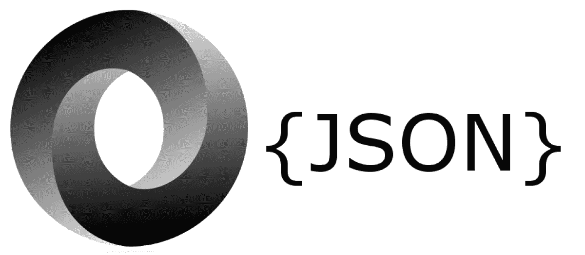

# Flutter:如何像专家一样使用 JSONs

> 原文：<https://medium.com/nerd-for-tech/flutter-how-to-work-with-json-like-a-pro-ff4b95ad7214?source=collection_archive---------1----------------------->

**更新:**这个包已经更新，支持空安全。干杯。

在成为 Flutter 开发人员之前，我来自 JavaScript 世界。我最怀念的一件事是`[npm](https://www.npmjs.com/)`上强大的 JavaScript 包，尤其是`[lodash](https://lodash.com/)`和`[ramda](https://ramdajs.com/)`，它们为我们访问嵌套的 JSON 对象提供了极大的便利。

在开发 Flutter 应用程序时，我们经常需要从 API 响应中解析 JSON 对象，然后相应地访问或操作它们。遗憾的是 dart 语言对`Map`对象的支持不是很丰富，因此我创建了这个包:`[map_enhancer](https://pub.dev/packages/map_enhancer)`。

**用途**

实际上这个包并不局限于 Flutter 和`JSON(Map<String, dynamic>)`对象，你可以在任何 dart 项目中使用它，或者在任何 dart 的本地`Map`对象上使用它。

仅此而已。访问 [pub.dev](https://pub.dev/packages/map_enhancer) 来安装这个包，或者在 [GitHub](https://github.com/crizant/dart_map_enhancer) 上提交问题/请求。

你知道你可以为一篇文章鼓掌 50 次吗？去砸那个按钮！