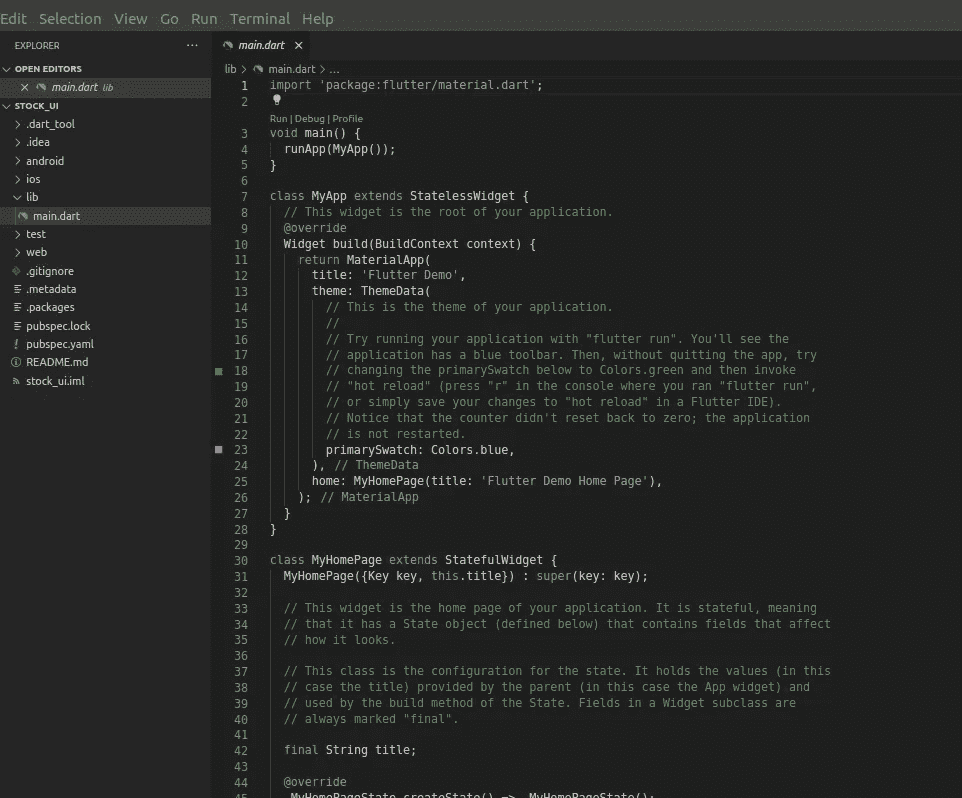
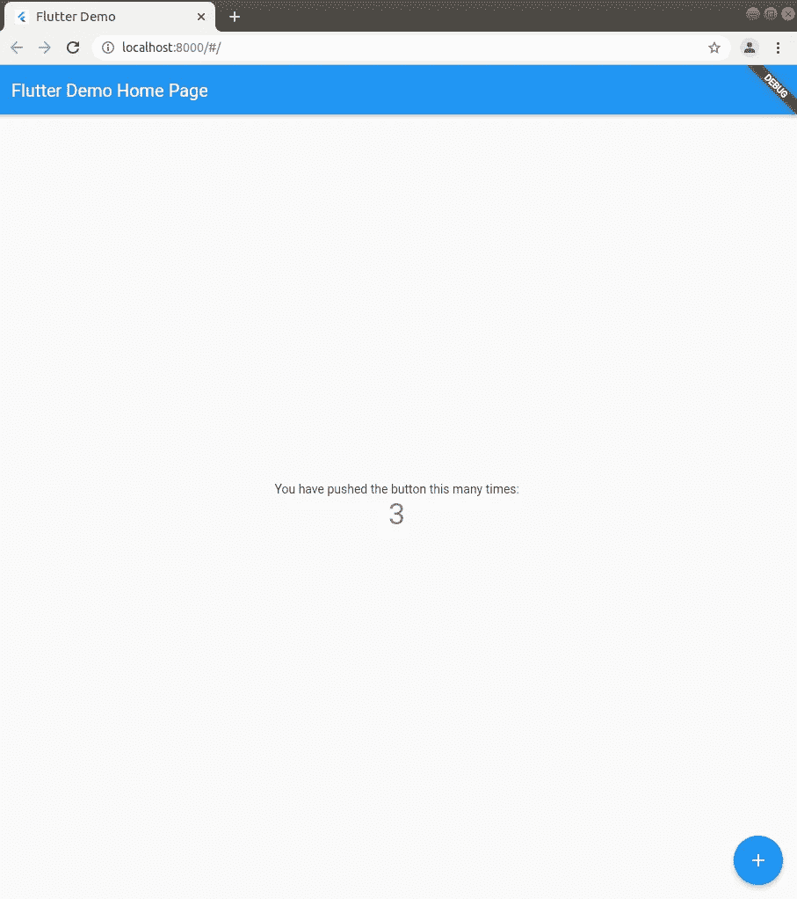
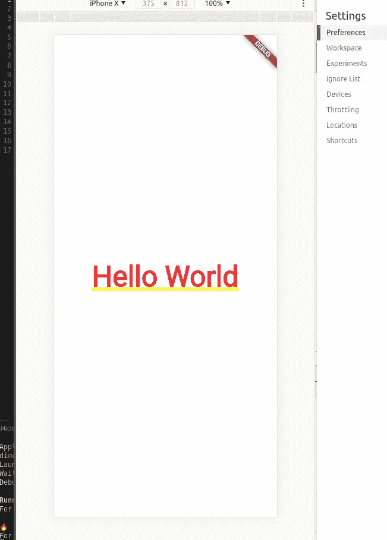

# 颤振系列——创造第一个颤振应用

> 原文：<https://medium.com/nerd-for-tech/flutter-series-creating-the-first-flutter-application-793e5816f816?source=collection_archive---------11----------------------->

嗨伙计们。因此，在我们的系列教程中，我们创建了一个 spring boot 应用程序，其端点可以获取一组符号的股票市场数据。现在，我们将在观察列表中显示这些数据。该观察列表将使用 Flutter 创建。我不会在这里教你基本的摆动。我只是在指导你做一个自己的很棒的应用程序。这是你需要的东西。

*   Microsoft Visual Studio 代码(VS 代码)

使用 VS 代码集成开发环境，我们将安装 flutter。为此，导航到 VS 代码中的扩展(或者简单地 ctrl + shift + x)。现在在搜索栏搜索 Flutter 并安装到 VS 代码。现在转到菜单栏中的视图，并单击它。现在点击命令面板(或者你可以使用 ctrl + shift + a)。在搜索框中输入 Flutter，现在你会看到有一个名为**“Flutter:New Application Project”**的建议。点击它，给它一个名字，然后创建这个项目。现在 VS 代码将下载必要的库，在成功创建后，您将得到一个这样的项目。



所以这个 main.dart 文件是首先加载的文件。现在让我们快速运行应用程序，然后我们将更改代码来理解这一点。要运行代码，请在 VS 代码中打开一个终端并键入。

```
flutter run -d chrome --web-port 8000
```

在这里，我已经指定了网络端口，如果没有，它将运行在一个随机的端口。所以现在你会得到一个这样的 chrome 浏览器。



这是一个简单的应用程序，它将显示你在应用程序中按下加号按钮的次数。如果我们看代码，它真的很乱，因为这么多类包含在一个文件中。因此，在第一个教程中，我们将制作一个应用程序，在应用程序的中心打印“Hello World ”,让我们尝试保持一个愉快的代码。现在我将删除大部分代码，只保留 main.dart 文件中的这几行。

```
import 'package:flutter/material.dart';

void main() {
    runApp(MyApp());
}

class MyApp extends StatelessWidget {
    // This widget is the root of your application.
    @override
    Widget build(BuildContext context) {
    return MaterialApp(
        title: 'Flutter Demo',
        theme: ThemeData(
    primarySwatch: Colors.blue,
),
    home: MyHomePage(title: 'Flutter Demo Home Page'),
);
}
}
```

现在有一个明显的问题，因为我们还没有定义 MyHomePage 类。为此，我将创建另一个名为 home_page.dart 的文件。

```
import 'package:flutter/material.dart';

class MyHomePage extends StatelessWidget {

    @override
    Widget build(BuildContext context) {
        // *TODO: implement build* throw UnimplementedError();
    }

}
```

这里我们扩展了 StatelessWidget 类，所以我们必须在那里实现 build 方法。现在，我将把这个文件导入 main.dart，我们的 main.dart 文件将如下所示。

```
import 'package:flutter/material.dart';
import 'package:stock_ui/home_page.dart';

void main() {
    runApp(MyApp());
}

class MyApp extends StatelessWidget {
    // This widget is the root of your application.
    @override
    Widget build(BuildContext context) {
    return MaterialApp(
            title: 'Flutter Demo',
            theme: ThemeData(
                primarySwatch: Colors.blue,
            ),
            home: MyHomePage(title: 'Flutter Demo Home Page'),
        );
    }
}
```

现在我们可以看到，我们正在用一个名为 title 的参数初始化 MyHomePage 构造函数。所以我们必须将它添加到 home_page.dart 文件中。现在让我们在 MyHomePage 类中实现 build 方法。我们需要在屏幕中间添加一个文本“Hello World”。为此，我将使用一个名为 center 的包装器，并在其中添加文本。现在我们的文件看起来像这样。

```
import 'package:flutter/material.dart';

class MyHomePage extends StatelessWidget {
    final title;

    MyHomePage({this.title});

    @override
    Widget build(BuildContext context) {
        return Center(
            child: Text(
                "Hello World"
            ),
        );
    }
}
```

现在使用命令再次运行，

```
flutter run -d chrome --web-port 8000
```

现在你可以看到我们得到了我们需要的结果。



快乐的编码伙计们。在下一个教程中，我们将修改这个项目，以创建最终的市场观察列表应用程序。