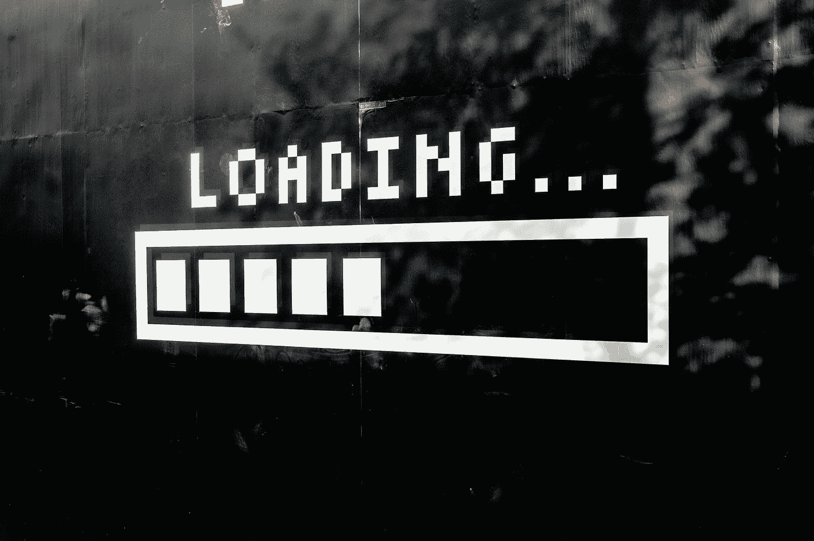

# 忘记 Angular 应用程序中的进度加载器

> 原文：<https://medium.com/nerd-for-tech/forget-the-progress-loader-in-your-angular-application-ed160175a7ab?source=collection_archive---------4----------------------->

## 一劳永逸的通用进度加载器，将自动和一致地显示整个角度应用

照片由[迈克·范登博斯](https://unsplash.com/@mike_van_den_bos?utm_source=medium&utm_medium=referral)在 [Unsplash](https://unsplash.com?utm_source=medium&utm_medium=referral) 拍摄

后端的工作是确保遵循业务逻辑，而前端的工作是确保用户可以轻松找到他要找的东西并完成他们的任务。为了解决这个问题，用户需要在整个应用程序中寻找一致的视图和看起来相同或相似的页面。行动号召按钮需要看起来一样，放在同一个地方，表格需要看起来和感觉上相似，细节视图也是如此。作为前端开发人员，您的工作就是确保这一点——考虑到您可能在一个更大的团队中与具有不同想法的开发人员一起工作，这并不是一件容易的工作。这就是为什么一些重复的事情，比如进度加载器，以一劳永逸的方式处理是非常重要的——你做一次，然后它们就工作了。这是达到一致性的最简单的方法，尽管不是在所有场景中都可能。

进度加载器是一个非常重要的 UX 组件，因为它们向用户反馈正在发生的事情。很可能你正在你的应用程序中使用一个。最有可能的是，代码看起来像这样:

这将完成工作，但我在一个开发团队中遇到过这样的解决方案，一些视图丢失了`isLoading`未在`error`上取消设置的部分，因此加载器只是继续显示，或者根本没有加载器的视图。不过，有些视图是正确完成的，尽管是通过重复相同的代码。所以这个解决方案被证明是不可持续的，并且产生了不一致的 UX。

即使有一些 progress loaders 的库，它们仍然需要您在每个组件的基础上管理它们。我们想摆脱这种情况。

## 解决办法

我们的进度加载器只是在有网络调用时自动显示，所以作为开发人员你不必考虑它。你甚至不知道有一个进度加载器，直到你运行你的代码来测试。

我们所做的是，我们把一个进度条放在应用程序的顶部，所以它在所有页面上都是可见的。你可以在`app.component`中，或者在你的应用程序中的其他有意义的组件中这样做。也许你有一个显示在所有页面上方的工具栏，或者你有某种主页或布局组件，它是所有其他组件的基础——你也可以把进度条放在那里。

然后，用一个`Boolean`创建一个服务。这个想法是当有网络调用时设置这个`Boolean`，当网络调用结束时将它复位。然而，该服务只会声明`Boolean`，但是由于它无法知道何时有网络调用，所以它不会做任何其他事情。

然后，确保当这个服务是`true`时显示进度条，当它是`false`时隐藏进度条。简单的`ngIf`就可以了。

最后，创建一个拦截器，它将在加载服务中设置和取消设置`Boolean`。

从这一点开始，你就不需要关心进度加载器了。每当有网络呼叫时，它会自动并一致地显示在每个页面上，让用户知道后台正在发生一些事情。

## 结论

这将减少组件中的样板代码，让开发人员关心其他东西而不是一致性，因为这已经实现了。如果你希望在所有组件中重复代码以达到一致性，你将会失败。有时候，开发人员会忘记重复代码，或者会提出一个不同于以前的解决方案(我不会责怪他们)，或者如果你决定更改部分设计，检查应用程序中的所有组件并更新它将成为一个乏味的过程。这样，你只有一个地方可以改变它。