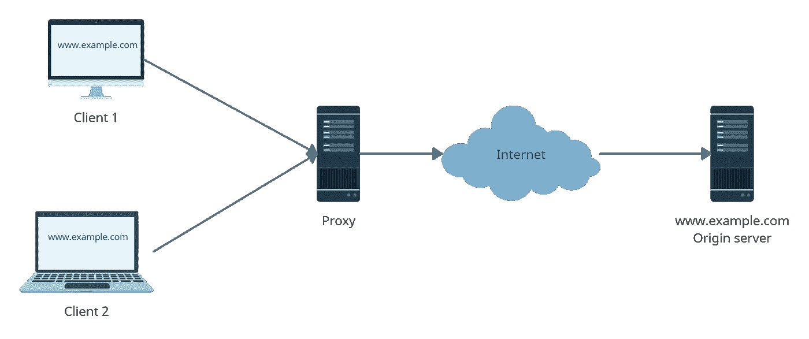
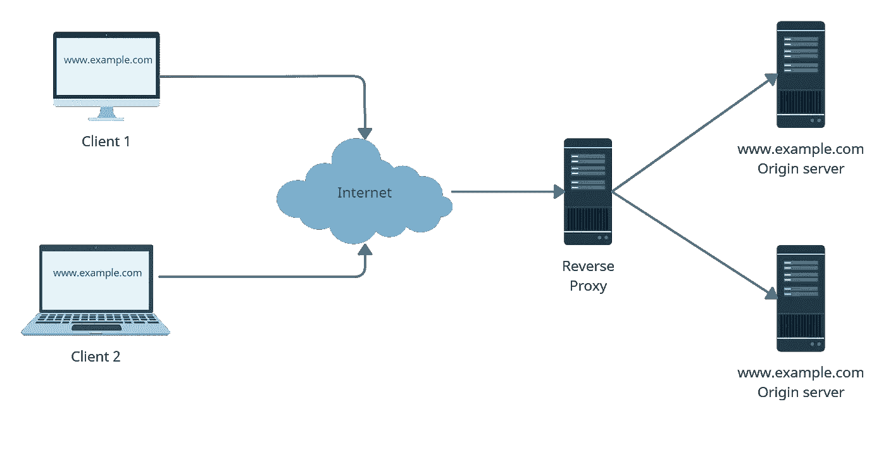

# 正向代理与反向代理

> 原文：<https://medium.com/nerd-for-tech/forward-proxy-vs-reverse-proxy-9c39221fdd6a?source=collection_archive---------21----------------------->

潘卡杰·帕特尔在 [Unsplash](https://unsplash.com?utm_source=medium&utm_medium=referral) 上的照片

代理是一种设备，流量通过它进行路由:它是客户端和 web 服务器之间的中介。

有许多类型的代理，每一种服务不同的服务。在本文中，我们将解释正向代理和反向代理之间的区别。

# 正向代理

代理人

当人们说代理时，他们通常指的是远期代理。

在标准通信中，当用户连接到 web 服务器时，请求直接从客户端发送到 web 服务器。有了转发代理，客户端发出的流量将到达代理，然后代理将流量转发到互联网。在这种情况下，代理将代表客户端与 web 服务器通信。

转发代理位于客户端的前面。简单来说，代理处理传出的请求。

举个例子，假设你在一家大公司工作，那里有很多电脑，这些电脑向同一个网站发出很多请求来获取一些信息。公司可以设置一个代理，这样所有员工都可以向这个转发代理发出请求，这个代理可以在将请求转发到服务器之前做很多事情。

让我们看看代理可以做的一些事情:

*   **内容过滤**:管理员希望阻止某些流量进入，或者公司认为某些网站不合适或不能使用(审查)
*   **缓存**:许多员工一次又一次地获得相同的信息，代理可以缓存请求并返回，请求不必通过互联网发送，这通过减少带宽使用节省了公司的资金，并通过更快的响应提供了更好的用户体验。
*   **日志**:这可以让公司获得有关网络活动、下载了多少数据以及经常使用的网站的信息，从而更好地调整公司内的客户端基础架构。
*   **客户端匿名化**:如果你请求一个服务器，你的网络信息会被发送到服务器，这样服务器会给你回复，但是这会给服务器带来很多信息，可能是你的位置。在请求发出之前，人们使用代理来做一些匿名化处理，这样服务器就有了更少的关于客户端的信息，你可以在你的身份和位置上感到更安全。

# 反向代理

反向代理

反向代理是放置在一个或多个 web 服务器前面的服务器，它拦截来自客户端的请求。它不同于放置在客户端前面的转发代理。使用反向代理，客户端发送到网站源服务器的请求会在网络边缘被反向代理服务器拦截。然后，它将请求发送到原始服务器。

正向代理和反向代理之间的区别是微妙但重要的。一种简单的总结方式是，转发代理位于客户端的前面，并保证在源服务器和该特定客户端之间没有直接通信。另一方面，反向代理位于原始服务器的前面，确保客户端和受保护的原始服务器之间没有直接通信。

让我们来看看反向代理可以做的一些事情:

*   **负载均衡器**:一个每天拥有数百万用户的热门网站可能无法使用一台原始服务器处理所有的输入流量。相反，网站可以分布在一组不同的服务器上，所有这些服务器都专用于处理对同一网站的请求。在这种情况下，反向代理可以作为负载平衡解决方案，在不同的服务器之间平均分配传入流量，以避免其中一个服务器过载。如果一台服务器完全故障，其他服务器可以接管处理流量。
*   **SSL 加密**:就计算而言，加密和解密每个客户端的 SSL(或 TLS)通信对于源服务器来说是非常昂贵的。因此，反向代理可以被配置为解密所有传入的请求并加密所有传出的响应，以便释放源服务器上的宝贵资源。
*   **缓存**:内容缓存改善用户体验。例如，在伦敦访问与反向代理相关联的网站(并且在悉尼具有 web 服务器)的用户可以连接到在伦敦的本地反向代理服务器，该服务器然后将负责与源自悉尼的服务器通信。然后，代理服务器将缓存(或临时保存)响应数据。随后访问该站点的伦敦用户将从伦敦反向代理服务器获得本地缓存版本的响应，从而获得更快的浏览体验。这也将减少后端服务器上的负载。
*   **认证**:在某些情况下，当一个应用程序部署在许多服务器上时，在每个服务器上实现认证可能很难管理。在这种情况下，身份验证可以在反向代理中实现，只有通过身份验证的请求才能访问后端服务器。在服务器端，当请求到达反向代理之外时，我们知道身份验证成功了，请求可以被正确处理。

# 摘要

在本文中，我们研究了不同类型的代理，并描述了可以使用每种代理的不同情况。如今，了解网络中的请求流以及使互联网上的通信可靠且经济高效的机制是非常重要的。