# 从原型到艺术作品

> 原文：<https://medium.com/nerd-for-tech/from-prototype-to-work-of-art-949cc7a5f4a2?source=collection_archive---------13----------------------->

现在，我们的基本原型已经建立并运行，是时候开始添加我们的资源，将这个关于立方体在黑屏中射击胶囊的 3D 游戏转换为一个真实的 2D 游戏，在这个游戏中，玩家可以在太空中击退成群的敌人。

***3D 到 2D :***

本项目使用的所有资产均来自 [GamedevHq](https://filebase.gamedevhq.com) 。让我们开始添加一个精灵(2D 图像)到我们的项目中，它将作为我们场景的背景。这就像把我们想要的精灵拖到我们的场景视图中，然后按照你想要的方式塑造它一样简单。

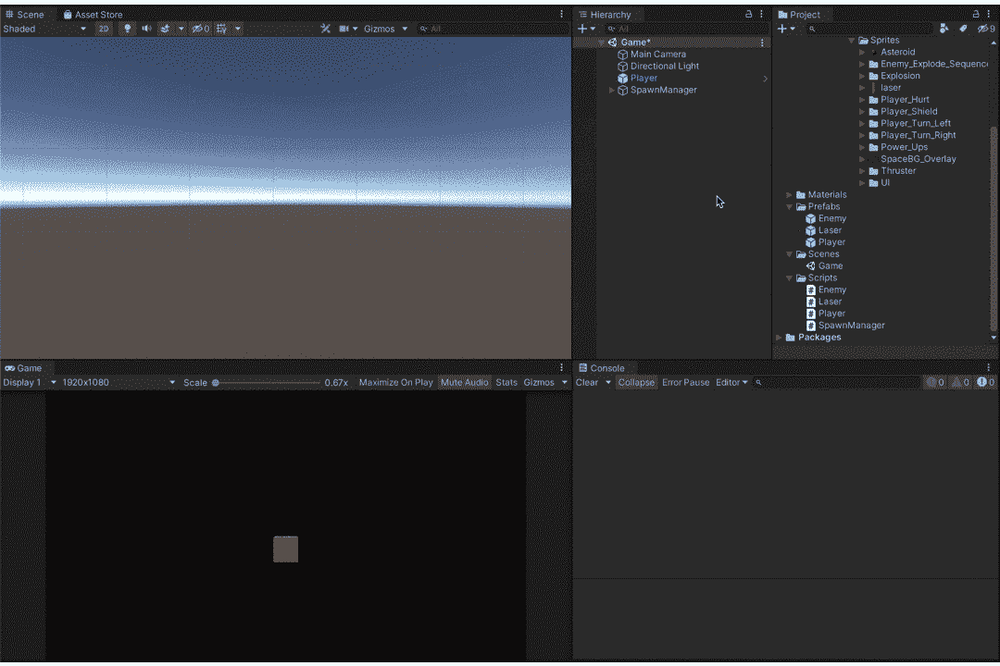

在你继续下一步之前，确保你已经在场景视图中打开了 **2D** 选项，这会将你的视图转换成二维视图。

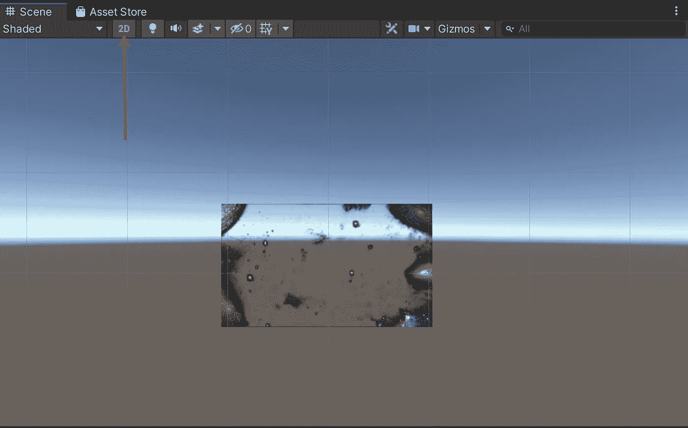

同样，将您需要的所有资源添加到场景视图中。完成后，下一步是将我们所有的组件添加回这些精灵中，但是会有一点小小的改变。让我们从添加组件到我们的播放器精灵开始。

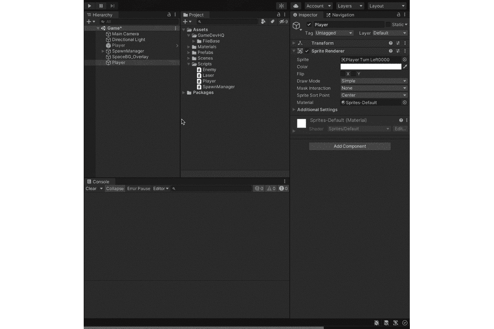

如上所述，我们增加了一个**箱式碰撞器 2D** 和一个刚体 2D，而不是它们的非 2D 版本，因为我们正在开发一个 2D 游戏，所以我们不需要第三维。

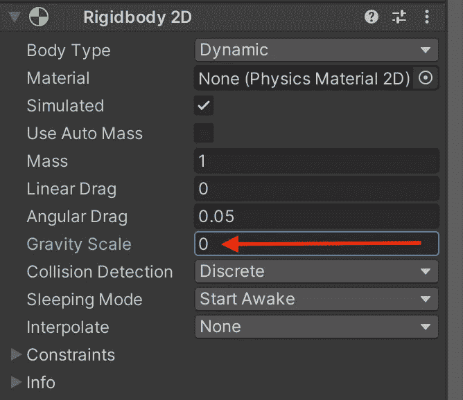

确保你把它设置为零。

敌人预制体和激光预制体也需要被改造成 2D 变种。确保他们的“ **IsTrigger** ”也打开。我们基本上是以完全相同的方式重建我们所拥有的一切，但他们现在将拥有一个二维组件，而不是三维组件。

但是当转换到 2D 时有一个问题，因为我们所有的游戏对象都在 2D，我们试图让所有的游戏对象都在同一个平面上，这就产生了一个冲突的行为。

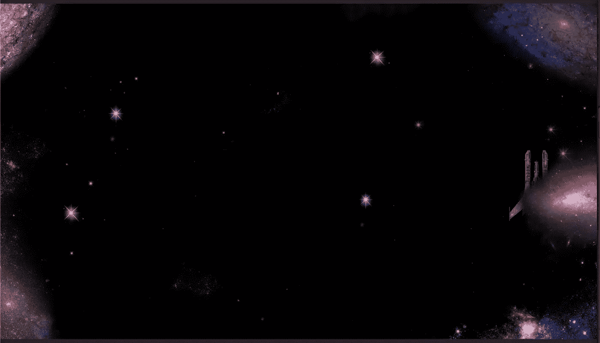

我们在这里观察到我们的玩家游戏对象被背景重叠。但这可以通过添加一个排序层和该特定层中的顺序来轻松解决。这将让 Unity 知道哪些对象应该在哪些对象上渲染。

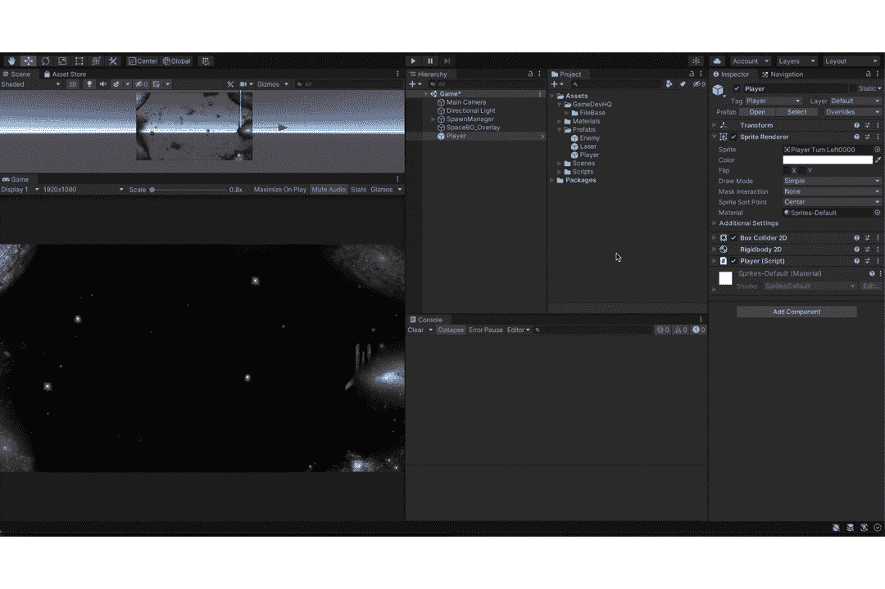

选择一个排序层使我们的玩家出现在前面，但是如果我们有两个物体在同一个排序层呢？在这种情况下，我们可以在层中使用**顺序，较高的值出现在前面。例如，让背景和玩家在同一个排序层，**

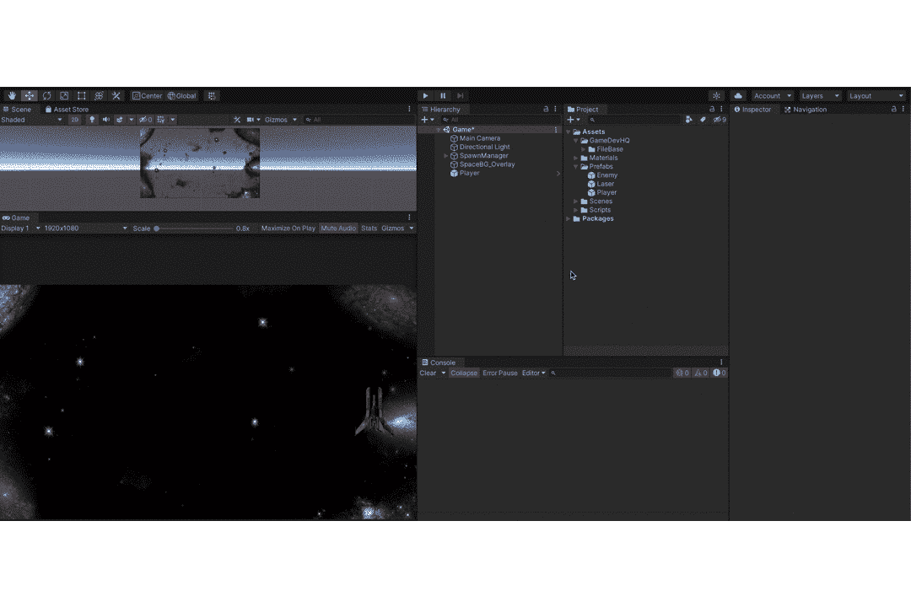

现在这已经完成了，让我们继续修正我们的游戏对象的行为，就像我们让事情保持原样一样，这就是我们将要得到的，

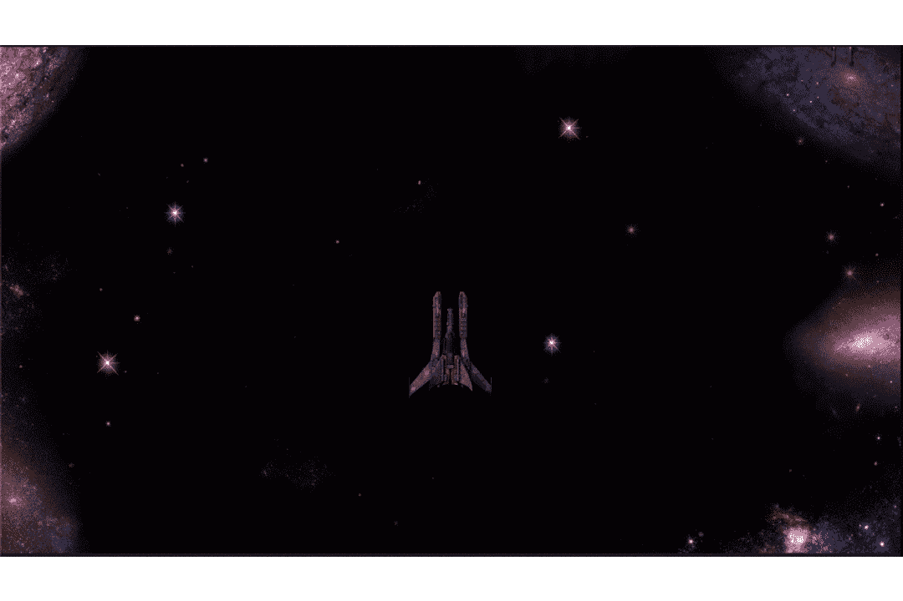

这是因为我们的触发函数检查的是 3D 碰撞，而不是 2D 碰撞。要解决这个问题，我们所要做的就是将我们的 **OnTriggerEnter()** 改为 **OnTriggerEnter2D()** 。

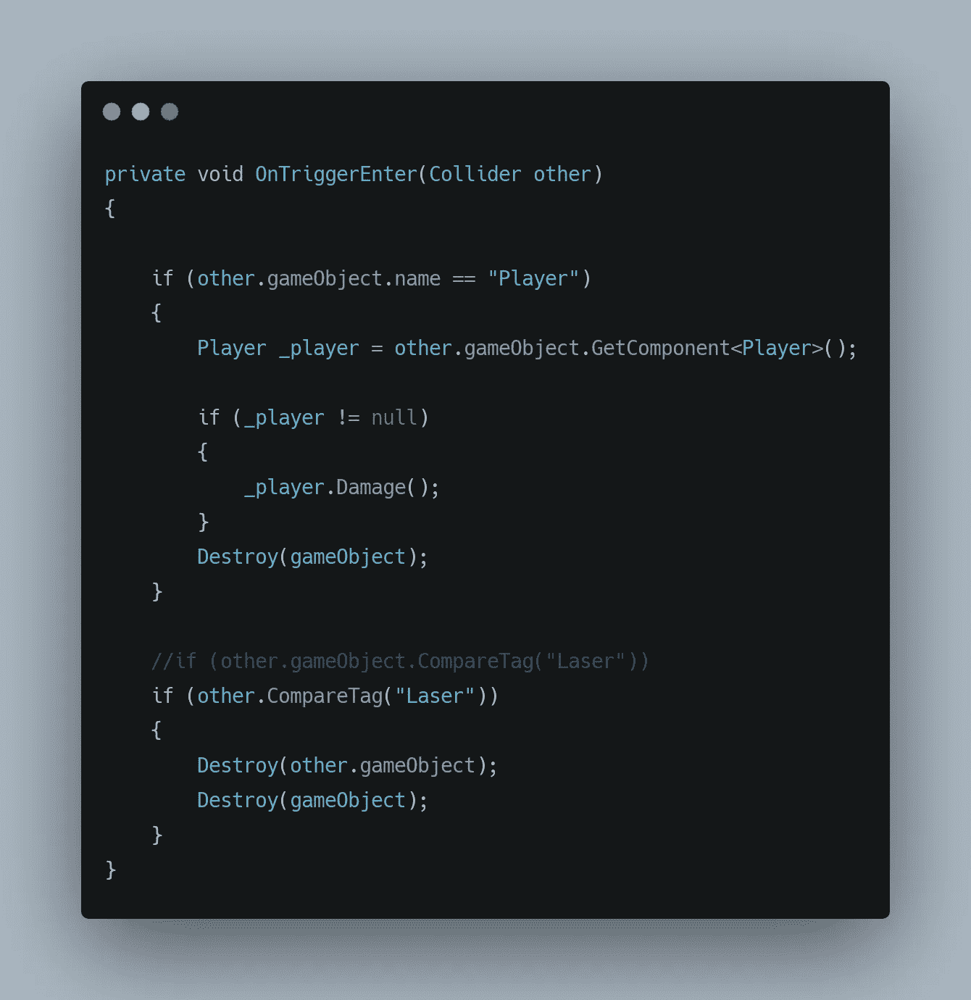

这就变成了，

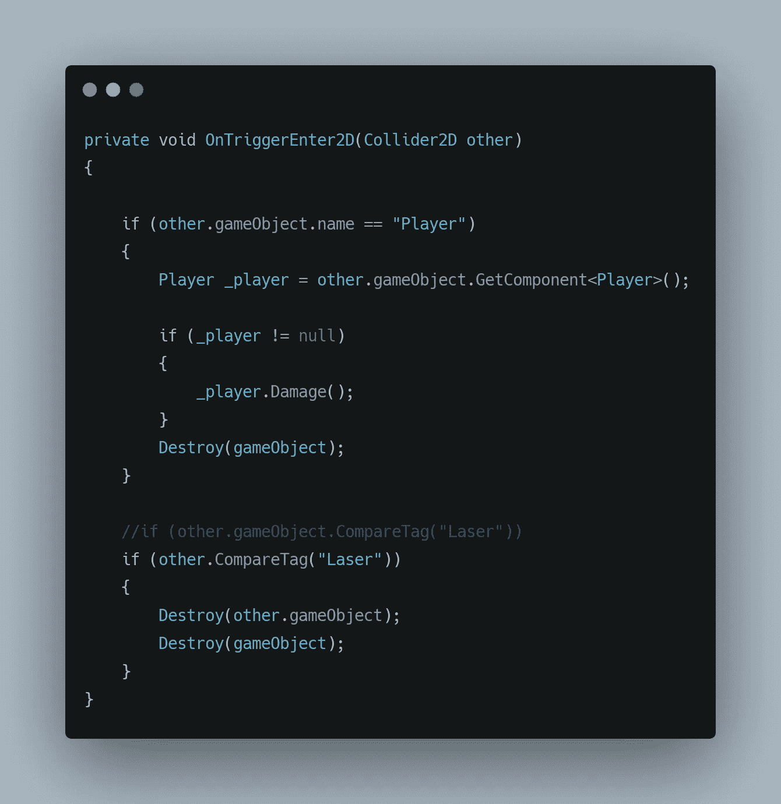

有了这个我们应该准备好了！！！！！！！！！！

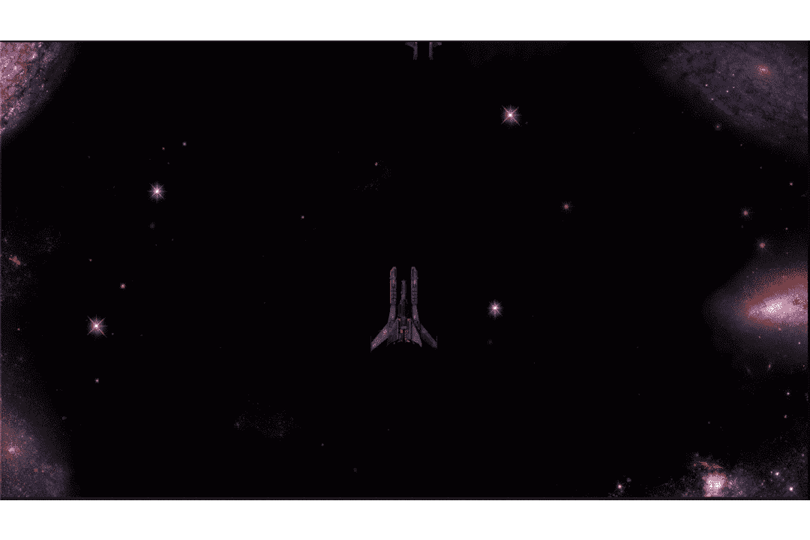

感谢您的阅读。更多即将推出！！！！！！！！！！！