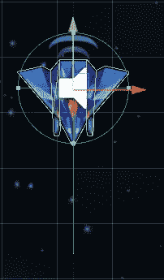
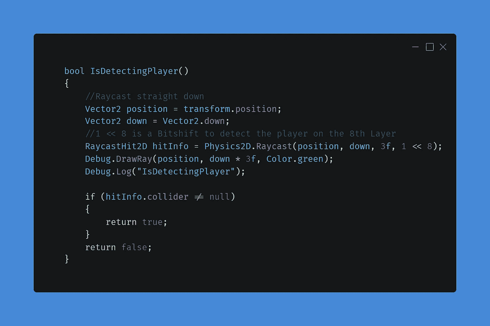
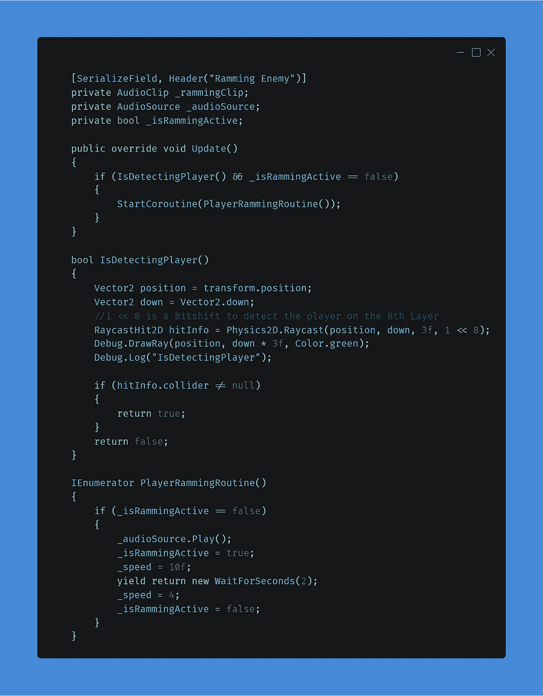
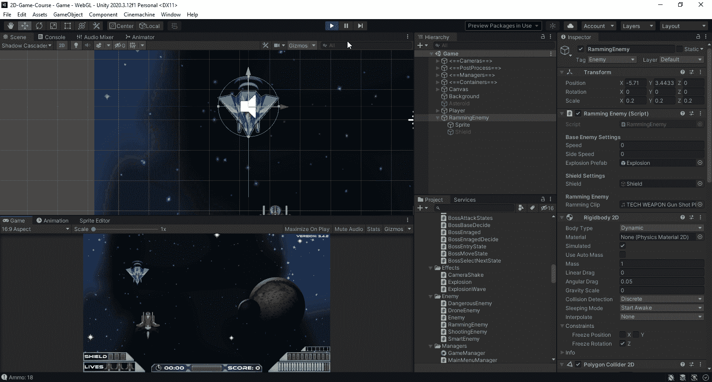
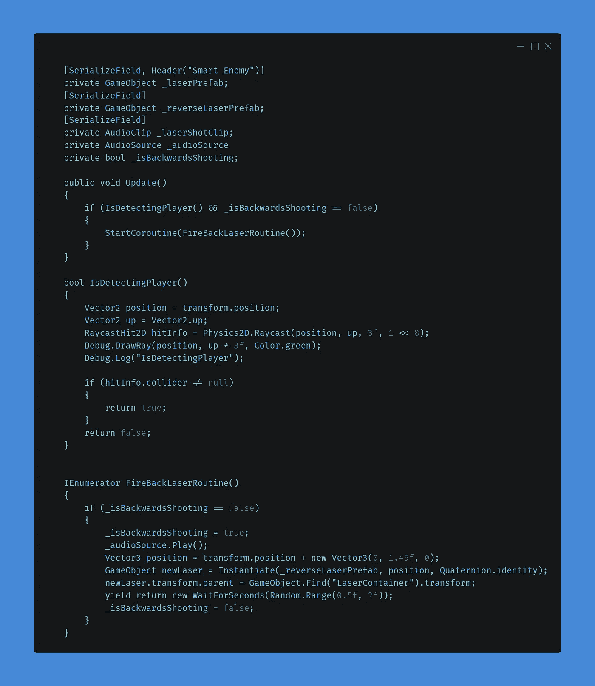
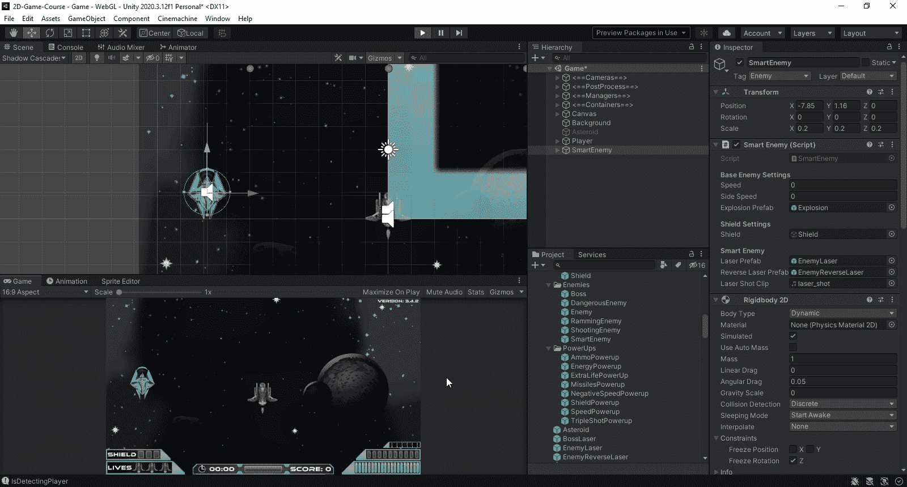
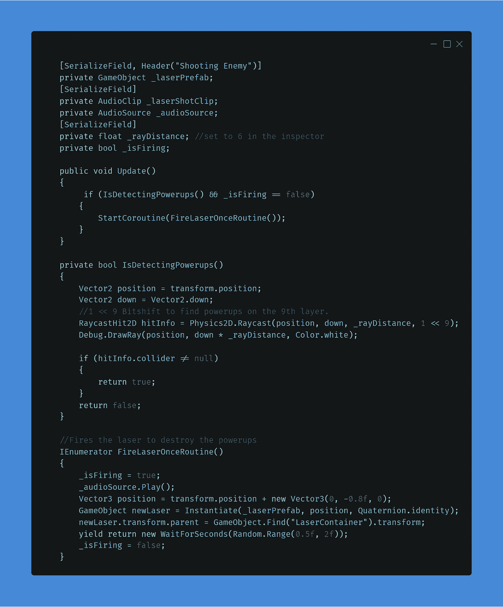
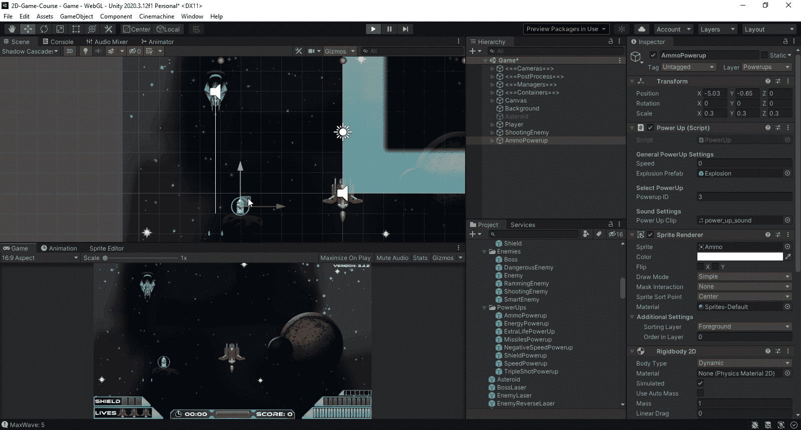
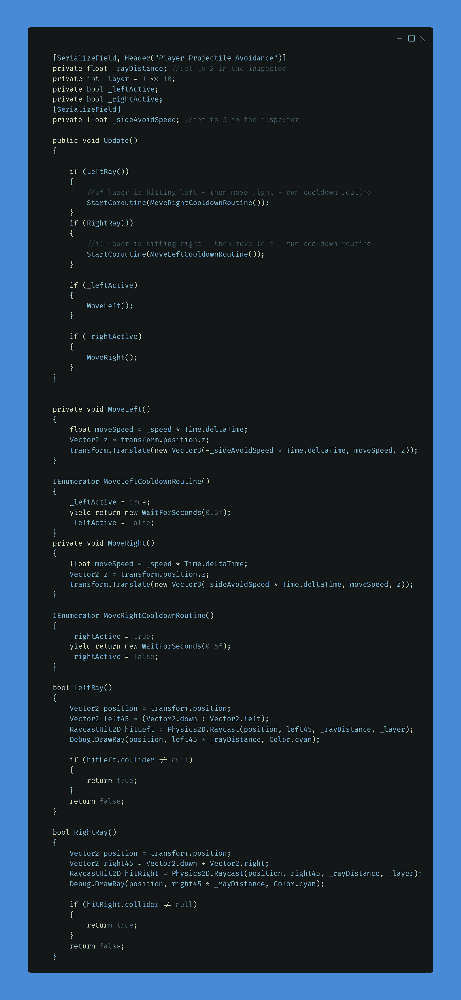
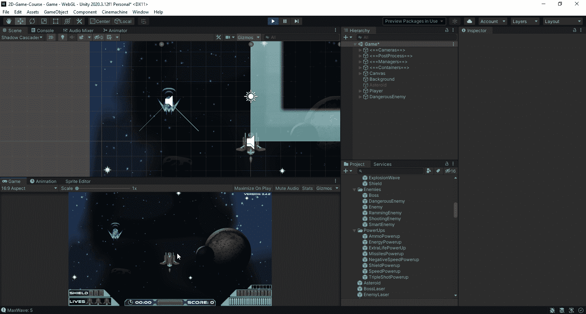

# 射线的乐趣

> 原文：<https://medium.com/nerd-for-tech/fun-with-rays-aaf72e46937f?source=collection_archive---------16----------------------->

大家好，我又带来了一篇关于 GameDevHQ 太空射击游戏第二阶段挑战的文章。我有四个独立的挑战，但它们都需要一个基本的原则，从文章的标题你已经猜到它是射线，或者更好地说是射线投射。

*   创建支持敌人侵略的功能。如果有敌人靠近玩家，敌人会试图“撞”它。
*   创造一种敌人类型，它知道什么时候在玩家后面，并向后发射武器。
*   如果一辆皮卡(powerup)在敌人面前，敌人会在玩家拿到它之前开火摧毁它。
*   创造一个可以避开玩家武器的敌人类型。当你开枪时，敌人应该在射程内发现一个大便，并设法避开它。

所有这四种挑战都有相同的行为，检测其范围内的某些东西并做出反应。就像每次挑战一样，我会事先做一些研究，寻找挑战的最佳解决方案。在大多数情况下，我们可以使用碰撞器和其他东西，但有些容易出错。每个挑战中最合理的答案是光线投射。

# 什么是光线投射？

射线投射(Raycasting)是从一个点，在特定的方向上发射不可见的射线(想象成激光束，但你看不到它)来检测它是否与任何东西碰撞的过程。在此过程中，您可以使用*位移*明确指定要检查冲突的层。光线投射分为 2D 和 3D 两个不同的部分。

现在你可能已经看到了一个没有意义的词，那就是*位移*。在 Unity 中，我们使用位移来明确地告诉光线投射要检查哪一层或哪几层的碰撞。在我的项目中，大多数情况下，我们检查敌人的光线是否击中了玩家，除此之外，一个敌人检查激光是否在光线投射附近，最后另一个敌人检查它的光线投射是否击中了异能。但是不要担心。我将仔细检查每个敌人，并解释他们的逻辑是如何工作的。

# 冲击敌人

这个敌人需要检查玩家是否在它前面很短的距离，并提高速度撞向玩家。

投射光线最常见的方法是使用布尔函数创建一个函数。在这个函数中，你需要声明一个起始位置。这是光线投射开始的地方。接下来，你需要一个方向，这可以是一条直线，也可以是一个角度。为了创建实际的光线投射，我们使用一种叫做 Physics2D 的东西。光线投射，在那里我们输入起始位置，方向，距离，最后是我们想要检测碰撞的层。在我的项目中，我的播放器位于一个名为 player 的层上，但是从层列表来看，播放器位于列表中的第 8 层，因此我们使用一个 bitshift 1 << 8。

现在我们有了实际的光线，我们看不到它，因此我们需要使用 Debug.DrawRay。这里，我们将再次使用我们的位置方向和距离，但这一次我们需要指定一个颜色来使用。在这种情况下，我选择使用绿色。

我们的功能还没有完成。如果光线与我们的玩家发生碰撞，我们需要将 bool 设置为 true 或 false。这里我们使用 if 语句来检查我们的 ray.collider 是否不为空。如果这是真的，那么我们返回真，否则我们返回假。

这本身并没有多大作用。在我们的更新方法中，我们现在需要通过运行 IsDetectingPlayer()函数来检查我们是否正在检测一个玩家，然后在 bool 为真时做一些事情。我选择创建一个协程，在那里敌人的速度增加，播放一个音频剪辑，在短暂的延迟后，敌人的速度恢复正常。为了确保奇怪的事情不会发生，我创建了一个私有 bool 来检查碰撞是否活跃。

如您所见，这个脚本一点也不复杂，在本文的剩余部分您会看到很多 bool 函数。

# 聪明的敌人

在这个挑战中，我们必须创建一个功能来检查玩家是否在敌人后面，如果是这样，那么敌人应该向后开枪。类似于我们如何创建撞击敌人，我们将改为创建一个指向上的光线，并且我们将再次使用位移法 1<<8 来检查第 8 层上的碰撞。

对于我们的方向，我们使用 Vector2.up 而不是 Vector2.down。其他的都差不多。我的反向激光预制工作就像一个普通的激光器，但这个是向上而不是向下发射。

# 向电源开枪

下一个挑战中，敌人必须向能量炮射击，这与冲撞敌人的方式非常相似。只有两个很大的不同。这一次，我们正在检查另一层(9)，我们的射线会更长。能够足够快地发现和反应。此外，我们不会飞得更快，而是发射一束激光。

如您所见，功能保持非常相似，只有微小的变化。

# 躲避敌人

在这个挑战中，敌人应该向两边移动以避开玩家射向敌人的激光。诚然，这种设置确实有效，但我确实觉得有改进的空间，但那是另一天。

这个挑战的合理解决方案是创建两个光线投射。每侧一个，用于检测激光从哪一侧射出。如果激光从左边通过，敌人应该向右移动，反之亦然。但这些不应该是 90 度的直线，而是 45 度角，以足够快的速度检测激光，以避免射击。有许多方法可以做到这一点，但最简单的是用 Vector2.left 加上 Vector2.down 以获得指向左侧的光线，并对右侧进行同样的操作，但我们使用 Vector2.right 而不是 Vector2.left。我们还需要更改位偏移以检查第 10 层上的冲突。我决定，因为我将再次使用位偏移来创建一个变量，这一次两个射线都将使用。

现在这个脚本中发生了很多事情，但这只是因为我们有两条单独的光线要跟踪，而且每条光线都有自己的函数要运行。

如你所见，光线并不总是能探测到激光

# 结论

我在应对这些挑战和学习光线投射以及移位是如何工作的过程中获得了很多乐趣。还有其他类型的射线，如球形射线，但我还没有用它做实验。到那时，你一定会找到一篇关于这方面的文章。