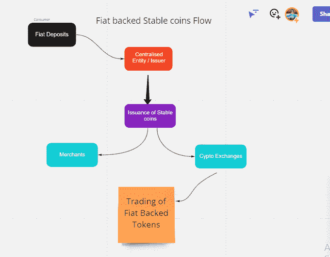
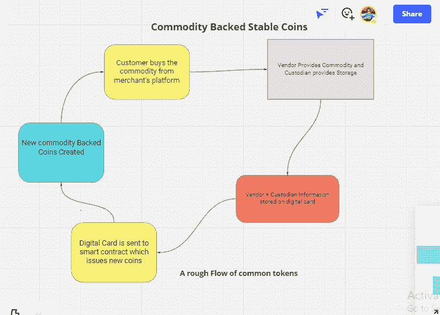
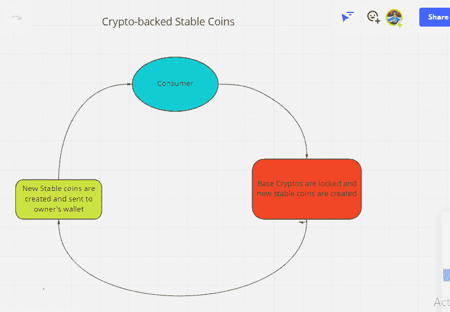

# 货币的未来:密码、稳定硬币和中央银行

> 原文：<https://medium.com/nerd-for-tech/future-of-money-crypto-stable-coins-and-cbdcs-7b7daaa2a0b7?source=collection_archive---------16----------------------->

过去和现在的大多数货币形式都有超过其内在价值的名义价值。这种差距让金钱陷入了漫长而悲伤的贬值历史。恐惧和历史教训导致大多数国家现在选择中央集权的法定货币来提供可信且易于使用的货币。

显然，一个结合了制度框架的强大基础设施正在发挥作用。这为不同形式的货币竞争设置了很高的门槛。

本文旨在不带任何偏见地让你了解这种情况，同时反思这些其他形式的金钱，并讨论采用它们的可能性和挑战。

**加密货币的出现**

"《泰晤士报》03/1/2009 财政大臣濒临第二次银行救助."

2008 年的金融大危机催生了比特币的想法。中本聪意识到世界对银行作为所有金融交易中介的依赖程度。随着银行从金融交易中去中介化的计划，比特币是一种点对点交易系统，不需要依赖第三方确认。

比特币的波动性及其类似于资产的行为，使得它成为一种货币的可能性遭到了质疑。然而，由于加密货币的匿名性、免于贬值和独立性，替代加密货币 Altcoins 可能仍有机会。一些人认为，加密货币可能比中央法定货币更有效，因为它们的点对点性质。

然而，潜在的分布式分类帐技术的前景有点可疑。截至目前，由于交易费用高、速度慢，加密货币的效率很低。

让我们看看经济学家如何定义货币，加密货币在多大程度上符合定义

钱是一种:

1.  **价值储存库**:用它把购买力转移到未来。

加密货币波动性很大，这反映出它们既没有内在价值，也没有任何外部支持。他们的价值取决于他们对未来供求的信念。

**2。交换媒介:用来购买商品和服务。**

接受加密货币作为支付方式有其复杂性。尽管已经成为热门话题，并被 PayPal 和 Xbox 等公司采用，但这种采用仍有很长的路要走。

**3。记账单位**:用来衡量特定商品、服务、储蓄或贷款的价值。

鉴于加密货币是一种糟糕的价值储存手段和低效的交易媒介，很少有证据表明它们被用作记账单位。

上述原因可能足以解释为什么加密货币无法取代法定货币，但仍有一些希望。

**稳定币**

稳定硬币可以被认为是一种新形式的加密货币。你会问，它们有什么不同？稳定币稳定(是)。

与其他加密货币不同，稳定硬币的价值取决于外部参考，如法定货币、贵金属甚至加密货币。

让我们更深入地了解他们的类型

1.  **菲亚特支持:**

最常见的稳定硬币形式，法币支持的是完全由法币支持的硬币。换句话说，在真实的银行账户中，1 枚硬币价值 1 美元(或其支持的任何货币)。

,

在确保稳定性的同时，法币相当简单明了。

但并非所有的亮点都是金子，存在集中化的风险，这很容易出现漏洞，如单点故障、破产或道德风险。不知何故，扼杀了加密货币的主要优势。在一个充满加密货币的世界，集中化这个词侮辱了与之相关的项目。

1.  **商品抵押:**

顾名思义，这些硬币是由商品支持的，最常见的是贵金属，如黄金或白银。带回了对黄金和商品支持的货币作为交换媒介和价值储存手段的时代的怀念。

与法定支持的硬币一样，商品支持的硬币通常以 1:1 的比例运作，即 1 枚硬币可以相当于 1 克黄金(不是 1 巴，咄)。

虽然商品支持的稳定硬币作为一种良好的价值储存手段和稳定的交易媒介，符合“货币标准”，但集中化的风险仍然存在。

3 ) **支持的加密货币:**

加密支持的稳定硬币通常由最高等级的货币支持，如比特币和以太坊。有时也可能有加密货币的组合支持它们，这允许稳定性。

加密支持的稳定硬币，同时也是高效的，符合去中心化的规则。这些硬币的稳定性令人怀疑。

4) **铸币式稳定币**:

铸币税是唯一一种没有任何资产支持的稳定硬币。他们依靠一种算法方法来控制货币供应。目标是将价格尽可能保持在 1 美元左右。

它们的分散性、稳定性和无抵押性似乎超过了问题的复杂性。由于其复杂性，基于铸币税的稳定硬币并不流行，但它们开始获得一些牵引力。

稳定的硬币是一个相当复杂的概念，尽管它增加了加密货币取代法定货币的可能性，但公共政策和技术挑战仍是一大障碍。

我们经历了一些貌似合理的法定货币替代品。然而，货币最有可能的未来仍有待思考。

**中央银行数字货币**

本质上，充当第三方是央行的职责。换句话说，商业银行充当中介(第二方呵呵)，同时可以接触到央行的资产负债表。其目的是将央行资产负债表的获取渠道从商业银行扩大到普通大众。

从某种意义上说，中央银行是中国自己的加密货币。这些货币将基于 DLTs(分布式账本技术:区块链的底层技术)。各国正在大力研究 CBDCs。中国甚至在 2021 年 4 月推出了自己的数字元。

由于 DLT 的优势，如数据管理效率的提高、无中心故障点、透明性以及与智能合约等创新的简单互操作性，CBDCs 似乎是最有可能的未来货币

像这样的概念应该得到关注。下周将发布关于 CBDCs 的详细见解。