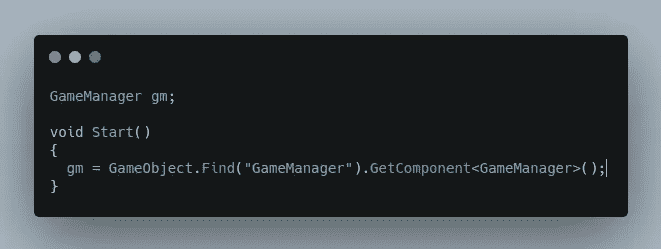
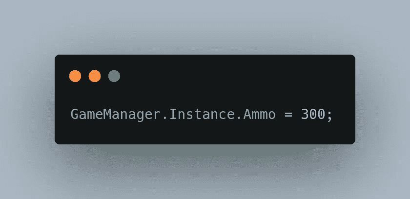
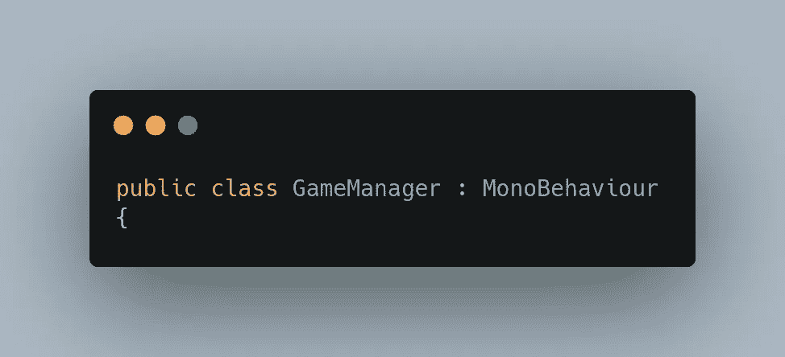
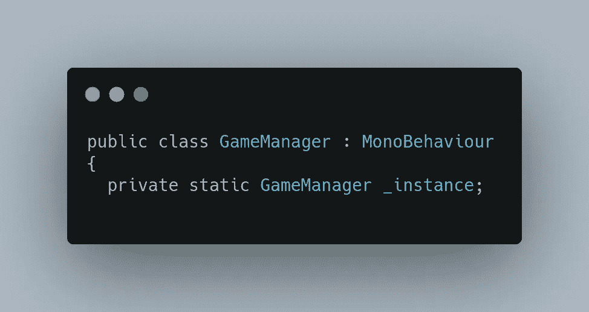
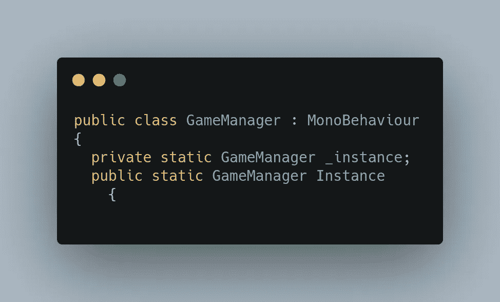
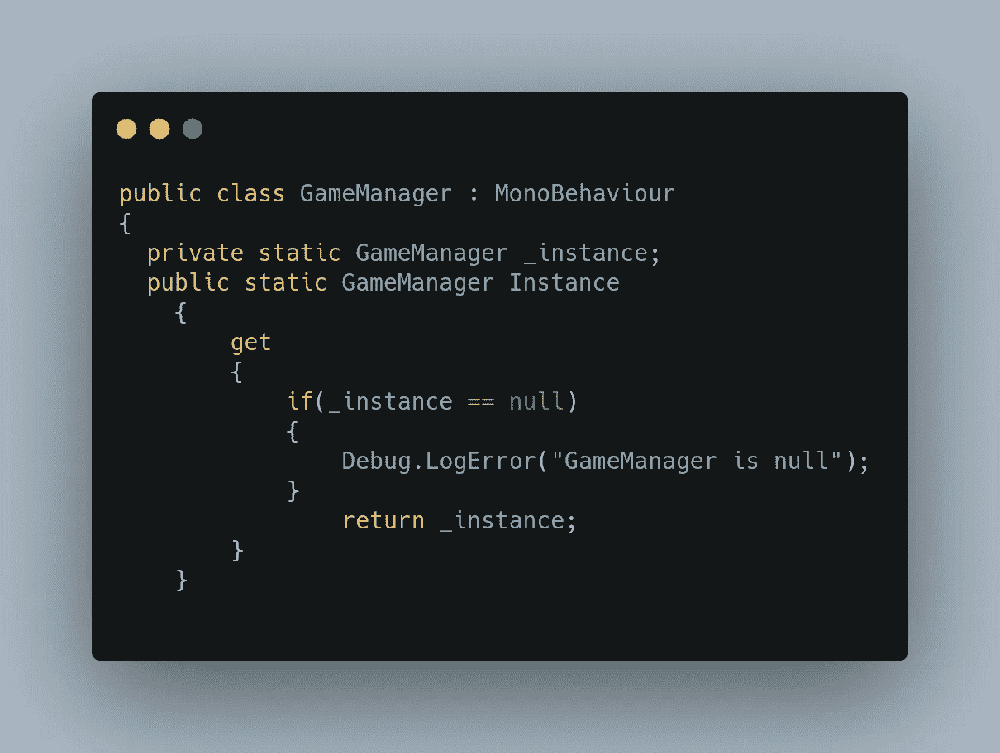
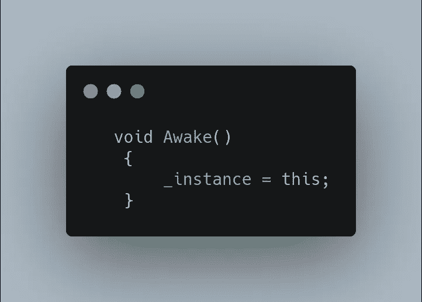

# 游戏编程模式:Singleton

> 原文：<https://medium.com/nerd-for-tech/game-programming-pattern-singleton-acd839dc0e24?source=collection_archive---------14----------------------->

我可能是辛格尔顿的市长，但我知道一件事，那就是只有一个我！

单例模式最大的优点是什么？是他们让你在你的非编程朋友和家人面前听起来很酷、很专业、很有权威的方式吗？我的意思是，是的，有这种情况，但是当你在 Unity 中编程时，当你需要在类之间交流时，单例使事情变得容易得多。

通常情况下，你必须获得另一个类的句柄，在其上添加一个 GetComponent，再次告诉它你试图访问的内容，然后实际做一些有成效的事情。这类似于在发布消息之前需要按下一大堆自行车验证码照片。很烦人，但是如果你想让别人明白你的意思，就必须这么做。

通过 GetComponent 访问类

进入单例模式！只需几行代码，您的类就可以直接使用，不需要任何中间人！

一些警告。尽管很诱人，但你不应该什么都穿单衣。一般的经验法则是，如果你的游戏中只有一个东西，比如游戏管理器、音频管理器、UI 管理器等等。你可以让它成为一个单胞胎。

假设我们刚刚开始一个新的游戏管理器。

我们需要做的第一件事是让游戏管理器成为静态的，当某个东西是静态的时，它在游戏运行期间的任何时候都可以被游戏中的所有职业使用。

但是等等…你刚刚把它变成私人的了！私有变量不是每个人都可以使用的！是的，确实如此！我们只想要这个实例..游戏管理器的 or _instance 只对它自己可用。很珍贵。它需要保护。这就是为什么我们有:

我们仍然通过公共实例向所有人提供我们的游戏管理器类！请将此视为我们 _instance 的防火墙。注意这里也有括号，我们马上要把一些东西放到我们的实例中！

一个 getter 会给另一个类信息，在我们的例子中，我们在返回它之前检查 _instance 是否确实存在。setter 将允许另一个类更改信息。

你知道吗？我们这里不需要二传手。最好保持该类可供阅读，而不是大的修改，所以我们将删除它，因为它有点挫败了我们的防火墙的目的。

好多了！这只是模式的一半，还有一个重要的元素，那就是 GameManager 类型的变量在类的 Awake 函数中是这样的:

这就完成了这个循环，现在，你可以在任何地方访问游戏管理器了！经过一点点实践，这种模式不仅会成为你的第二天性，而且会成为你不断增长的编程能力库中的一个常用工具！

明天，我们将讨论如何在 Unity 中制作装载场景！