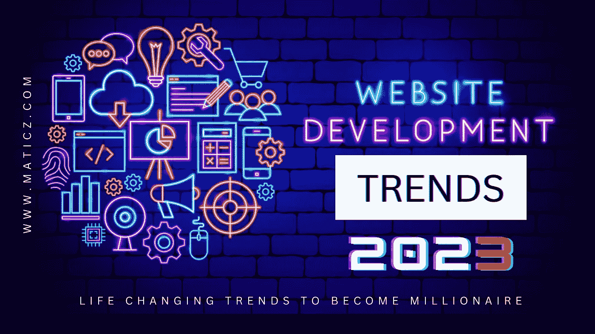

# 2023 年及以后改变游戏规则的网络发展趋势

> 原文：<https://medium.com/nerd-for-tech/gaming-changing-web-development-trends-2023-beyond-75f1d5fe368b?source=collection_archive---------4----------------------->

第一个网页于 1991 年上线，我们的生活被彻底改变了。今天，数百万人花费数小时上网冲浪，赚钱和投资，获得大学学位，听音乐，看电影，教育理论视频等等。

开发网站和网络应用有助于强化你的商业品牌和公司品牌。公司不会在任何时候创建网站。为什么？因为网络发展趋势和技术将统治商业市场。尽管是 2023 年，网络开发公司一直在飞速发展，每个垂直行业都在争夺商业市场

今天，我们将看看未来五年将会发生什么，以及为什么您的企业现在就需要开始考虑这个问题。

# 【2023 年网络发展趋势

网站的发展趋势总是取决于用户的需求。预计[网站发展 2023 年](https://bit.ly/3IZl6K3)是这十大趋势的高峰期。

## **(一)前端发展趋势**

前端 web 开发人员只需要知道 HTML、CSS 和 Javascript。前端开发人员的以下职责是软件、网站和编程语言代码的面向用户和客户端的部分。他们正在为客户创建一个用户界面，以实现他们的业务目标

*** JAVASCRIPT**

Javascript 是创建网站的通用编程语言。据统计，65%的前端开发人员都在使用这种流行的编程语言来完成他们的工作。

*** JAMSTACK**

JAM 代表 Javascript、API 和标记，这种架构使您的网站更加安全，无需担心服务器保护和数据库。

***网站开发中的移动优先方法**

移动优先原则在网站开发和设计中有着重要的作用。Mobile-first 的目标是在为桌面或其他设备设计之前，为移动设备开发在线体验。

***无头内容管理**

让内容传递更快更容易。在无头内容中，前端和后端没有墨迹。这些是连接的，而不是直接连接的。这些转载自两个不同的系统，一个是内容创建和存储，另一个是呈现。无头架构使用 API 交付，在任何设备上都好看。

***运动 UI**

一个名为 Motion UI 的前端框架使您能够做出完全响应的站点设计。开发者可以在原生应用设置中做出一个动作&最重要的是，它加快了 UI 设计。这是网络发展的主要趋势

## **(二)后端发展趋势**

*** Python**

Python 语言为 web 开发提供了很多健壮的框架，比如 false & Django。这两个框架都非常快速、安全和可伸缩。当我们使用 Python 语言时，将机器学习和人工智能(AI)集成到您的网站开发中。

像谷歌、脸书和 Spotify 这样的大公司都依赖 python 语言。

***网络安全**

在你的网站开发中拥抱网络安全。Web 开发人员需要了解攻击是如何工作的，并使用他们自己的代码来破解它。公司和企业防范勒索软件攻击、数据泄露和财务损失。

***数据库功能**

*   市场上仍在使用传统的 SQL 数据库。基于云数据库已经可用。
*   结构化事务用例的 RDBMS
*   用于分布式低延迟数据库的宽列数据库
*   具有键值存储的分布式缓存
*   对于强关系数据，使用图形数据库。
*   用于全文和复杂搜索的引擎(例如，基于位置的搜索)
*   使用分布式 SQL 的低延迟分布式数据库，具有事务保证
*   用于分析和数据存储的 OLAP 数据库

## **(三)网络发展趋势**

*   **渐进式网络应用(PWA)**

渐进式网络应用将成为领先的网络发展趋势，这是世界各地的大公司使用的最先进的网站技术。

例如，虽然他们的应用程序规模缩小了近 97%，但 Twitter 的每次会话页面增加了 65%，推文增加了 75%，跳出率下降了 20%。转换为 PWA 后，日经指数的有机流量增加了 2.3 倍，订阅量增加了 58%，日活跃用户增加了 49%。

*   **加速移动页面(AMP)**

AMP 将是整个 web 开发过程中的一个突出趋势。由 Google、Twitter 和 yahoo 合作创建的加速移动页面，使移动页面速度更快。AMP 网页加载速度很快，只需 2 秒钟，而非 AMP 网页需要 22 秒钟

这项 AMP 技术旨在帮助小型企业建立与移动设备兼容的网站

*   **API —首次开发**

API 给予网站开发很高的优先级，使连接新技术成为可能。API 优先开发提供了一些好处，比如以用户为中心的东西、减少开发时间等等。，这是 web 开发的一个增长趋势

*   **语音搜索优化**

它是 web 开发技术的关键组成部分&为语音搜索优化网站页面的简单过程。Web 开发服务的最新发展包括语音搜索、独立设备和网站语音优化。到 2023 年，将有 80 亿数字语音助手投入使用。为了跟上不断变化的趋势，亚马逊、苹果和谷歌公司在其网站上推出了智能扬声器。

*   **AR & VR**

流行的网络发展趋势包括增强现实和虚拟现实。它带来了所有垂直行业的重大变化，如零售商、电子商务、商务旅游、医疗保健、房地产等。上述行业正在启动虚拟现实技术，以使用户获得实时体验。这将是 2023 年未来网络发展的趋势。

*   **由聊天机器人驱动的人工智能**

由聊天机器人驱动的人工智能预计将成为对用户需求和要求的自我学习，Facebook Messenger 和 WhatsApp 正在使用聊天机器人，一些 B2B 公司正在整合聊天机器人。有两种聊天机器人。一个是基于文本的，另一个现在是语音助手。这具有全天候可用性和解决问题的潜力，可以获得类似人类的体验。这是网络发展的趋势。

*   **黑暗模式**

脸书、推特、Instagram、谷歌和更多的公司已经改变了黑暗模式。95 %的极地用户选择了黑暗模式，而不是灯光模式。很多好处包含了一个黑暗模式，使得 UI 内容对每个用户来说都是可访问和易读的。

*   **Web 3.0**

互联网发展的下一阶段将提供一种链接所有数据的方式&实时搜索。Web 3.0 似乎正在互联网上快速发展，它是一个语义 Web，综合了机器学习和人工智能，提供更加个性化的用户体验，使企业能够更好地了解他们的客户。

*   **自动化代码审查**

自动化代码审查是一种提高代码质量和减少编程语言中错误数量的形式。静态分析评估应用程序的源代码而不运行它，这是自动代码审查用来检测问题的一种技术。因为你不需要理解系统如何运行，或者什么样的输入会对结果产生影响，静态分析比人工评估更快更准确。

## **结论**

2023 年及以后，Web 开发行业将会受益匪浅。这些网站发展趋势将受到未来网络体验交付方式的影响。这些趋势将帮助你击败你的竞争对手。