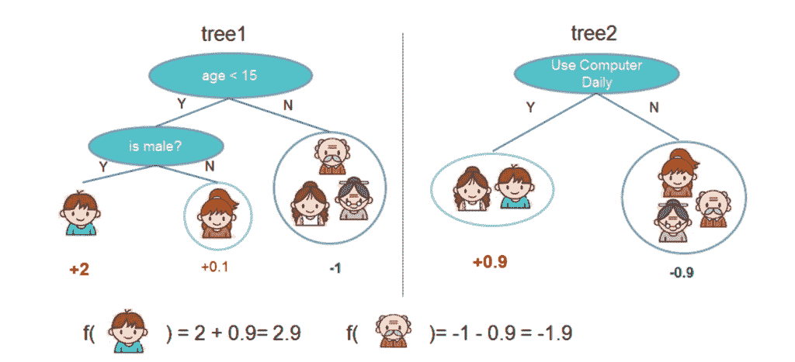
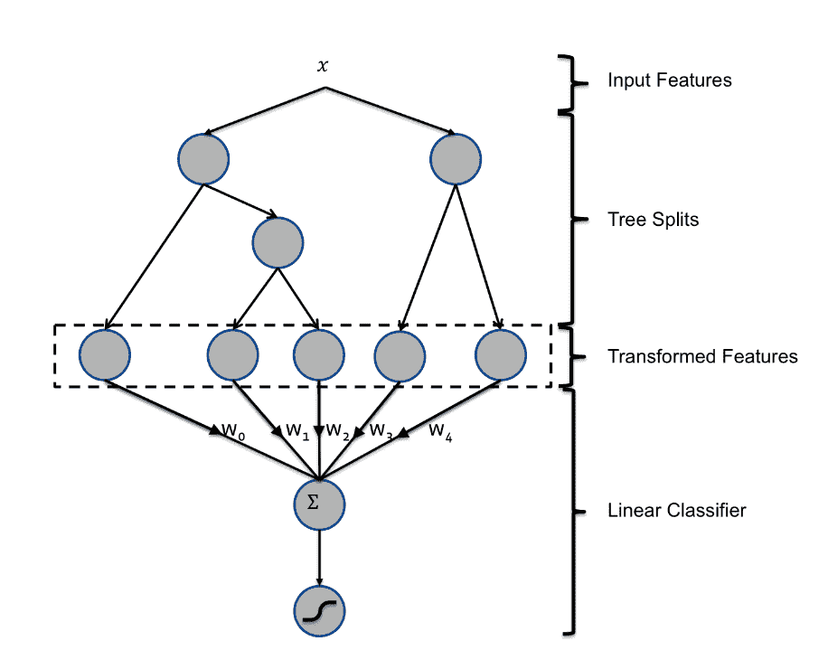
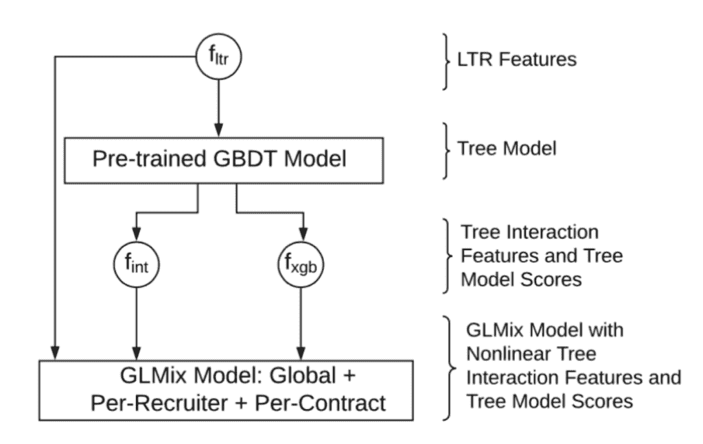

# GBDTs &作为功能转换器的随机森林

> 原文：<https://medium.com/nerd-for-tech/gbdts-random-forests-as-feature-transformers-cd0fcf2be89a?source=collection_archive---------4----------------------->

## 脸书和 LinkedIn 使用的特征工程技术

在训练机器学习(ML)模型时，我经常会达到模型精度不再提高的地步。我开始问问题，“我是否充分利用了我的数据？”，“我如何从现有的数据中创建更多有用的功能？”因为这种好奇心，每当我看到一个新的特性构建技术，我都会兴奋不已！随着这些天来深度学习的大量涌现，找到一些聪明的新功能工程技术就像是一股新鲜空气。

在这篇文章中，我将讨论梯度推进决策树(GBDT 或 GBT)和随机森林(RF)作为特征转换器的使用。在这里，我更感兴趣的是解释核心思想，如何使用它来训练 ML 模型，以及谁在使用它。如果你愿意，你可以查看 scikit-learn 页面上的一个例子[用系综树](https://scikit-learn.org/stable/auto_examples/ensemble/plot_feature_transformation.html)进行特性转换，并关注这篇文章以获得清晰的结果。

# GBDT 和 RF 用于功能转换

GBDT 和 RF 是通过组合许多单独的决策树建立的集合模型。GBDT 根据迄今为止构建的树的综合性能迭代地/顺序地构建每棵树，而 RF 独立地构建每棵树。还有其他有趣的差异，但是为了讨论的目的，如果您理解这一点就足够了

1.  GBDT 和 RF 是模型集合类型
2.  GBDT 和 RF 中的系综由决策树组成

是的……还有一件事，这是标准决策树的样子，

来源: [XGBoost:一个可伸缩的树提升系统](A Scalable Tree Boosting System)

这里需要注意的重要事情是:

1.  决策树有许多叶节点，并且
2.  当你把一个数据点，比如说 x，放入一个决策树时，它会在一个叶节点中结束(或者激活)。

现在，假设你已经训练了一个有 N 棵决策树的 GBDT 模型。让我们给这 N 棵决策树的每个叶子节点编号。它看起来会像这样…

树的集合，每棵树的叶子从 1 到该树的叶子节点数进行编号

当你通过这个集合传递一个数据点 x 时，每棵树的 1 个且只有 1 个叶节点将被激活。如果您将每个激活的叶节点表示为一个独热编码向量，1 表示激活的节点，0 表示非激活的节点，那么您将有 N 个独热编码向量，每个向量的大小与它所关联的树的叶节点的数量相同。现在，把这些向量连接起来。

你现在拥有的是 GBDT 变换的特征向量:)RF 作为特征变换器背后的思想是完全相同的。

我们在这里做了什么？仔细想想，这种转换会把密集特征转换成稀疏特征。这有点奇怪，不是吗？所以…

# 这里的主要想法是什么？

如果你深入研究开创性的论文[Greedy Function Approximation:A Gradient Boosting Machine](https://statweb.stanford.edu/~jhf/ftp/trebst.pdf)，我强烈推荐你阅读，你会发现 GBDTs 迭代地构建为

等式 1: GBDT 迭代

指示器功能 *1(。)*本质上是数据点 x 到决策树叶子节点 *m* 的映射。如果 *x* 属于叶节点，则指示符函数值为 1，否则为 0。事实上，对于树 *m* 和数据点 *x* ，总和是代表由 *x* 激活的节点叶的独热编码向量和由伽马值表示的叶节点的权重向量之间的点积。如果你继续展开整个 GBDT，你会发现这个方程是，

1.  一个二进制向量，等于所有树的叶节点总数的大小，当您传递一个数据点 *x* 时，在树中被激活的节点处组合 1，否则组合 0。而且，
2.  由 GBDT 每个叶节点的 gamma 值组成的权重向量

除了这个点积，GBDT 中还有一个常数/截距项，它来自预测的初始估计值，通常是平均值。初始估计/截距可以被认为是γ值，即γ_ 0。

在迭代构建树的 GBDT 训练期间，伽马值被优化以最小化损失。

您可能还注意到，上面的等式 1(即使展开)在伽马方面是线性的。这就是这个伟大想法的起源……为什么不从 GBDT 那里获得叶片激活的一键编码向量，然后拟合一个新的模型，如逻辑回归，以优化线性参数？

这让你大吃一惊吗？听起来很有趣，对吧…但是有人在实践中真正使用它吗？请继续阅读…

# GBDT/RF 作为特征转换器在脸书和 LinkedIn 的应用

来源:[脸书](https://research.fb.com/wp-content/uploads/2016/11/practical-lessons-from-predicting-clicks-on-ads-at-facebook.pdf)预测广告点击的实践经验，使用 GBDT 变换特征+ LR 作为广告模型

这正是在[脸书](https://research.fb.com/wp-content/uploads/2016/11/practical-lessons-from-predicting-clicks-on-ads-at-facebook.pdf)预测广告点击的实际经验中讨论的想法，它被实现了，并给了他们比单独的 GBDT 或 LR 更好的表现。

来源:【LinkedIn 招聘人员搜索和推荐系统背后的人工智能，使用 GBDT 变换特征和 GBDT 分数作为下游线性模型的特征

同样的技术也用于【LinkedIn 招聘人员搜索和推荐系统背后的人工智能，但有趣的是，他们还包括 GBDT 模型分数作为训练线性模型的特征。这意味着 LinkedIn 正在使用 GBDT 进行功能工程和堆叠。

鉴于脸书和 LinkedIn 正在使用这种技术解决他们的一些核心问题，并取得了令人鼓舞的结果，我确信在未来的时间里会看到它在更多生产系统中的应用。

# 最后备注和资源

在实时系统中使用 GDBT 作为特征变换器来训练线性模型的一个实际优点是——线性模型比 GBDT 更容易训练。作为数据漂移/变化频繁的域/问题的结果，线性模型可以被更频繁地训练以适应这些变化，然后 GBDT 变换器可以在非高峰时间和非高峰日以较低的频率被训练。这种结合可能会使系统在预测质量方面更加稳健。

你可以按照 scikit-learn 在[用系综树进行特征转换](https://scikit-learn.org/stable/auto_examples/ensemble/plot_feature_transformation.html)提供的例子来尝试这种技术。

让我知道进展如何:)