# 使用柏林噪声生成数字世界

> 原文：<https://medium.com/nerd-for-tech/generating-digital-worlds-using-perlin-noise-5d11237c29e9?source=collection_archive---------3----------------------->

由 [Ales Krivec](https://unsplash.com/@aleskrivec?utm_source=medium&utm_medium=referral) 在 [Unsplash](https://unsplash.com?utm_source=medium&utm_medium=referral) 上拍摄的照片

# 介绍

如果现实有一个很大的缺点，那就是它不够。我们的太阳系和周围的星系充满了不可思议的东西，但最终我们将耗尽探索的东西。宇宙常数把我们禁锢在一个永远不会离开的泡泡里。这是真的，更令人难以置信的是，你正在阅读这篇文章的计算机能够在一瞬间生成**无限**数量的世界。怎么会？使用一个叫做柏林噪声的概念。

# 什么是柏林噪声？

柏林噪声是一种生成随机结构数集合的方法。虽然普通的随机数生成器会产生彼此完全独立的输出——如果您试图生成密码或洗牌，这是非常好的，但在很多情况下，您希望随机性具有一定的一致性。

柏林噪声就是这么做的——它生成遵循平滑梯度的随机数。这意味着，如果您在两个邻近点(比如 0.5 和 0.6)对生成器进行采样，您将得到两个相似的结果(0.143 和 0.144)。这些结构化随机数可用于许多应用，如云生成、水模拟和**地形生成。**

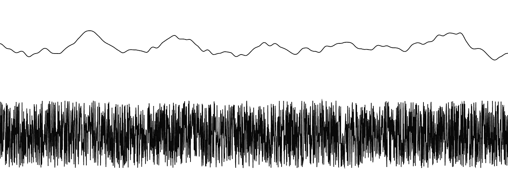

[柏林噪声与随机噪声的示例](https://editor.p5js.org/Nova_Studios/sketches/dVlsI-pgG)

# 生成高度图

如果我们有一个算法可以生成平滑的随机数梯度，我们如何把它变成一个高度图？好吧，看看上面的柏林噪声样本——它看起来有点像山脉，不是吗？有山峰、山谷和许多其他有趣的形状。如果我们能以某种方式产生 2D·柏林噪声，那么我们就能利用它来绘制高度图。

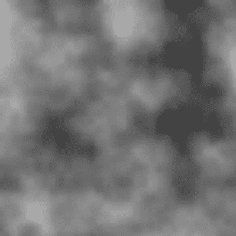

[柏林噪声高度图生成示例](https://editor.p5js.org/Nova_Studios/sketches/0y_d704QM)

幸运的是，大多数编程语言都允许你给柏林噪声发生器输入两个数字，一个 x 坐标和一个 y 坐标，而不仅仅是一个数字。这样做会让你产生 2D 柏林噪音(见这里)。较亮的点有较大的值，把它们想象成山峰。较暗的地方是山谷或河流，离假想的海平面要近得多。

虽然这种纹理很有趣，但它仍然不是完美的。看看任何一张[真实世界的身高图](https://tangrams.github.io/heightmapper)，你会发现它们看起来要复杂得多。

制作一张 100%真实的高度图太复杂了，但是我们可以做得比这更好。这里有一些方法可以用来提高这些高度图的质量。

## 生成一个岛

岛屿看起来总是很酷。它们被水包围，所以如果你只需要一小部分高度图，就很容易绘制它们。由于它们有明确的结构，它们看起来也更自然。

现在的问题是，我们如何把一个没有边界的高度图变成一个岛？最显而易见的解决方案是从中心剪出一个圆，但这看起来不太自然。相反，我们生成一个平滑的圆形渐变来掩盖岛屿的高度。这产生了相对自然的形状。

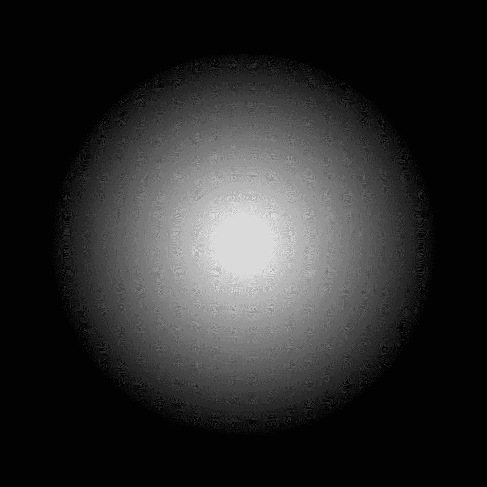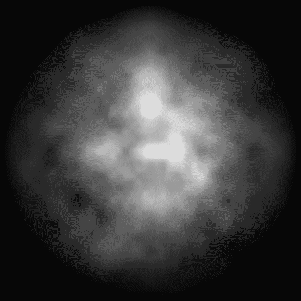

圆形遮罩(左)和遮罩高度图(右)的示例

## 阈值滑块

下一个改善高度图的方法是使用一个阈值滑块。把这个门槛想象成海平面——随着它的上升，更多的陆地将被淹没，直到只有最高的山峰保持在水面之上。我们可以将同样的想法应用到地形生成中，这会产生更有趣的结果。

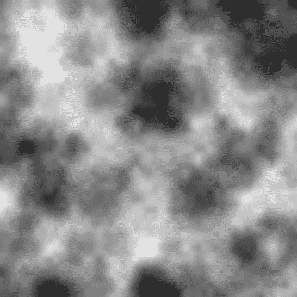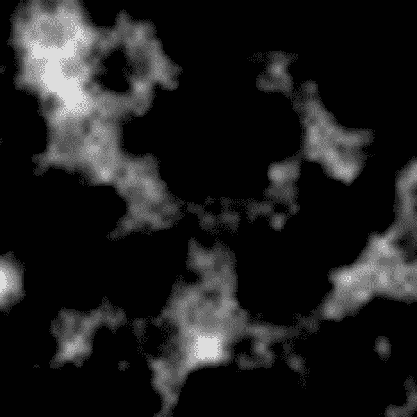

阈值设置为零(左)和 0.5(右)的高度图示例

## 结果

结合上述两种方法将允许生成一个更加有趣和真实的高度图。它将会是一个岛，它将会有有趣的形状，而且它将会是简单宏伟的。

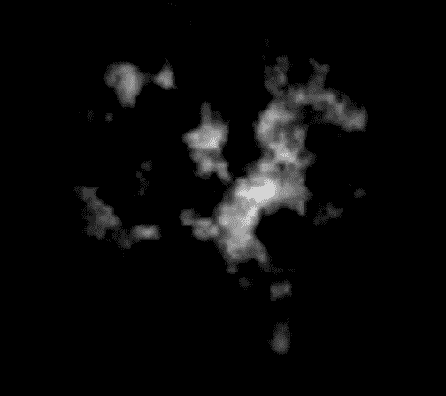

[生成高度图的交互示例](https://editor.p5js.org/Nova_Studios/sketches/ukG4xu2_O)

# 增加了复杂性

现在我们有了生成有趣的高度图的方法，我们能用它们做什么呢？下面列出了另外三种方法，可以用来提高高度图的视觉和技术质量。

## 彩色岛屿

上面的高度图看起来很复杂，但并不美观。这是个问题。即使是最铁杆的计算机程序员，他们的生活中也需要一些漂亮的东西(事实上，他们通常比大多数人更需要)。

让我们把那些难看的灰度高度图变成更吸引人的彩色高度图吧！这真的没有那么复杂，只需找到一些颜色，在我的例子中，我选择使用这些漂亮的蜡笔，并选择像素的颜色不是从柏林噪声，而是从柏林噪声最接近的颜色。

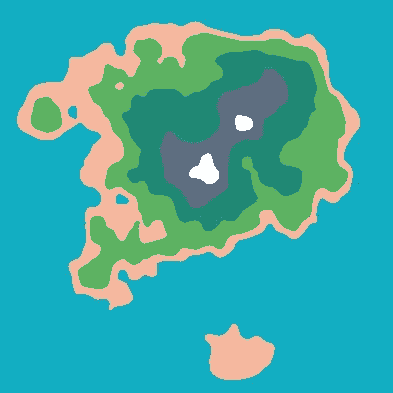

[尝试生成自己的岛屿！](https://editor.p5js.org/Nova_Studios/sketches/phm7pkppC)

## 脊状噪声

脊状噪声正是它听起来的样子:柏林噪声的一种应用，用于生成类似山脊的形状，类似于山脉。本质上，它的工作原理是从柏林噪声中提取值并进行转换，使峰值位于明暗之间的阈值处。这可以通过下面的等式来实现。

> new_height =绝对值((old_height - 0.5) * 2)

从下面的例子可以看出，这种新算法产生的柏林噪声看起来更像一座山脉。使用上面概述的岛生成方法，这导致更清晰和更具几何形状的岛。

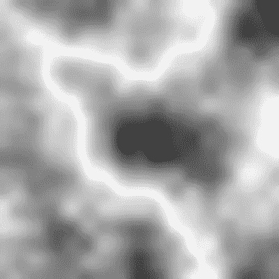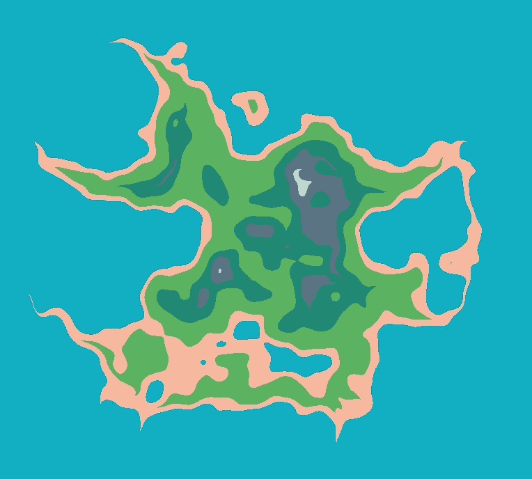

[脊岛生成的交互示例](https://editor.p5js.org/Nova_Studios/sketches/8aCOi9Ocx)

你不会想对所有东西都使用脊状噪声，在我看来，常规的柏林噪声通常看起来更好，但它可以用于生成山脉或洞穴系统。它还可以用于为闪电或其他粒子效果生成程序纹理。

## 翘曲噪声

另一种可以在常规柏林噪声之上分层的方法是扭曲噪声。扭曲噪声是通过将输入输入到柏林噪声发生器，并使用独立的柏林噪声函数以随机量对其进行偏移而产生的。

到目前为止，我们已经远远超过了岛屿生成的最初目标。你可以试着使用它作为高度贴图，但更实际的是，它可以用来为液体或气体生成程序纹理。

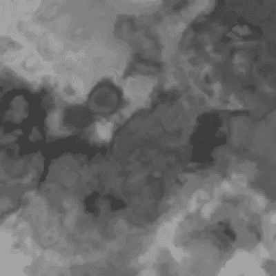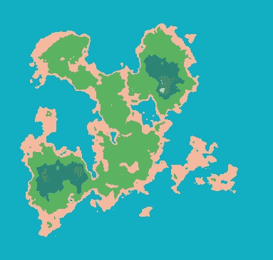

[翘岛世代互动示例](https://editor.p5js.org/Nova_Studios/sketches/XHp4Ddvla)

# 进一步扩展

至于 2D·柏林噪音，你只需要知道这些。有一些更复杂的算法，让人们产生不同的形状或图案，但一般来说，大多数算法都是在三维空间中使用噪声的假设下运行的。如果你对这个想法感兴趣，我建议你考虑以下三件事。

1.  三维网格。这更多的是下两个建议的先决条件，但是把你的世界带入第三维度会让它有趣得多。我推荐使用 [Unity 游戏引擎](https://store.unity.com/download-nuo)或者[处理 Java IDE](https://processing.org/download/) 。处理更容易投入，但 Unity 将使您更容易创建复杂的环境。
2.  体素地形。听说过《我的世界》吗？是的——试着做你自己的版本。不要在二维空间采样柏林噪声，而是尝试在三维空间采样，并在大于某个阈值的地方放置一个立方体。它不像基本网格那样简单，但是它可以让你创建复杂的特征，比如洞穴和突出物。
3.  行进立方体。这种算法基本上是一种方法，采取体素地形，使其看起来更平滑。如果你对此感兴趣，我建议查看一下 [Sebastian Lague 的](https://www.youtube.com/watch?v=M3iI2l0ltbE)编码冒险，或者随意从 Github 上窃取[我的代码](https://github.com/Robert-MacWha/Marching-Cubes-in-Unity)。

如果这三个想法都不能激起你的兴趣，那么我有最后一个想法给你。创造一些从未有人做过的酷东西。假设你想做一个生成天空岛的算法——去做吧。靠你自己去建立它会更加困难，但是最终会有无限的回报。我们谈论的是程序性的一代——实际上有无限多的世界要被创造。

> 感谢阅读我的文章！如果你有什么想说的，请随时在 [LinkedIn](https://www.linkedin.com/in/robert-macwha-0555141b6/) 上给我发消息，或者在 Medium 上关注我，当我发布另一篇文章时，你会收到通知！