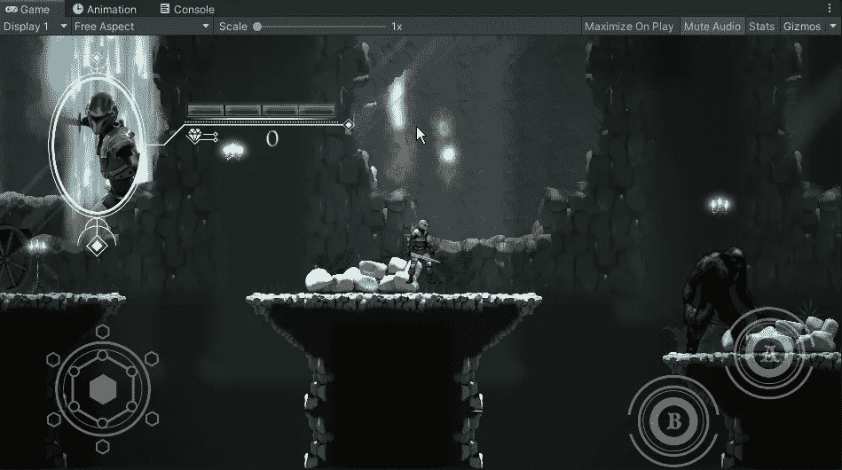
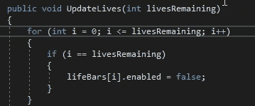
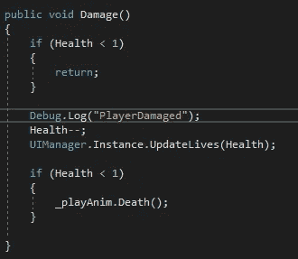
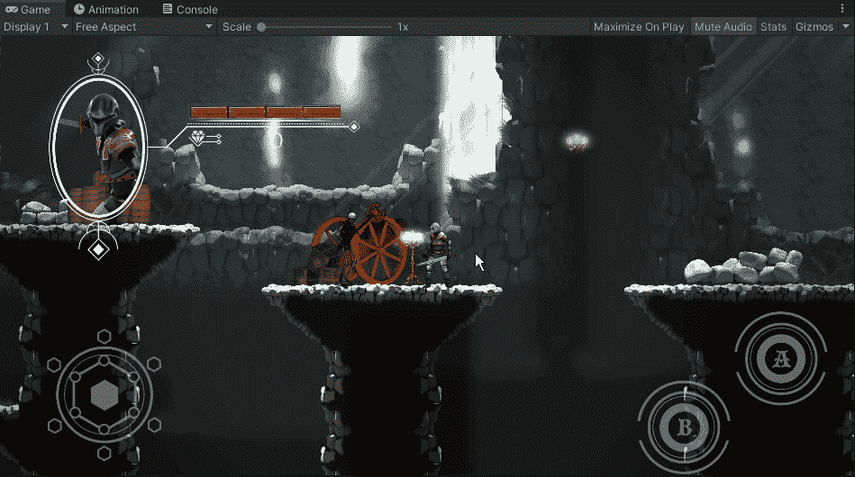
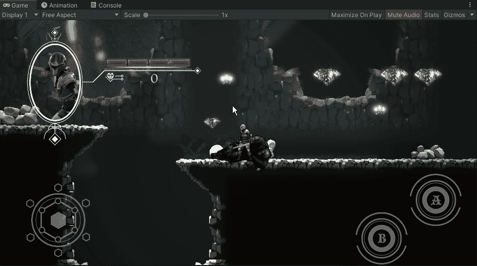

# 让我们的游戏平视显示器建成

> 原文：<https://medium.com/nerd-for-tech/getting-our-game-hud-built-511f9ff358f?source=collection_archive---------5----------------------->

现在我们有了内置的商店设置，让我们得到它，这样我们就有一个 HUD 来让我们知道我们手头有多少钻石，以及查看我们当前的健康池。首先，让我们把我们的平视显示器安装到位。我们将创建一个新的面板，并开始放置游戏所需的所有部件:

我们可以看到在左下角有一个类似操纵杆的图标，当我们转换到移动控制时，还有一个 A 和 B 键用于跳跃和攻击。这些功能我们将在另一个时间讨论。现在，我们将把重点放在我们的健康和钻石上面。在这种情况下，我们将让生命值分段生效，一旦受到伤害，我们将一次失去一段生命值。为了创建这个逻辑，我们需要创建一个 for 循环，以便它知道关闭哪个图标:

这里将会发生的是，当我们的玩家受到伤害时，它会将信息传递到这里，UIManager 将禁用正确的健康段:

在我们的玩家脚本中，我们将会有一个类似于怪物的过程，除了这里没有运行死亡动画，我们将它链接到我们的玩家动画脚本。从这里，我们可以看到它是否正确地显示了球员被损坏:

正如我们所看到的，每次骷髅向我们挥动，我们的健康就会减少一大块，一旦我们达到 0，我们的玩家就会死亡。
接下来，让我们为收集宝石内置跟踪器:

这里，我们刚刚在玩家脚本和 UIManager 脚本之间创建了一个基本链接，让它知道玩家有多少宝石，并相应地更新它:

现在我们的玩家有了一个可用的血量条和宝石收藏，我们要看看如何准备和移动控制。