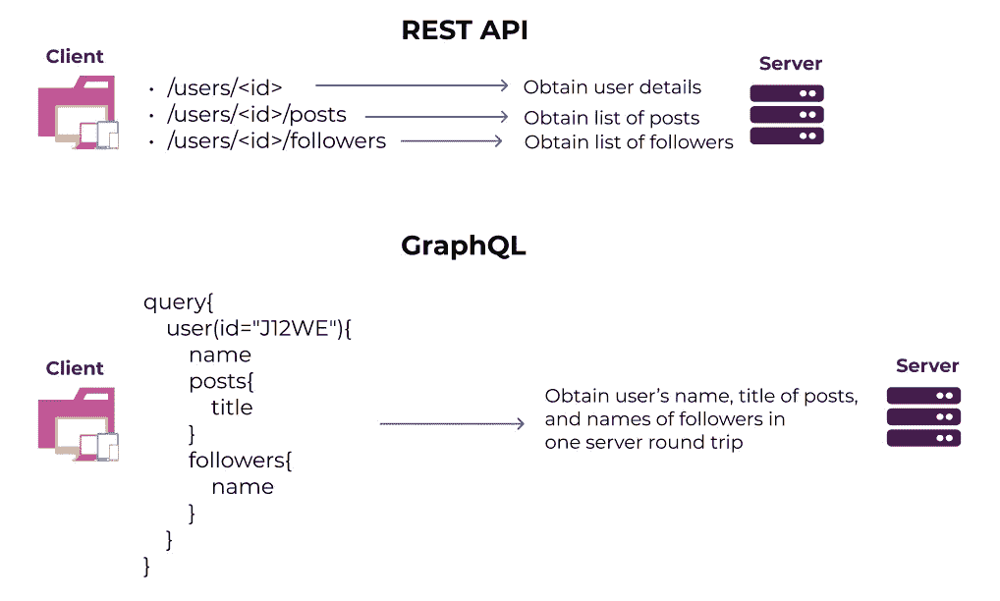
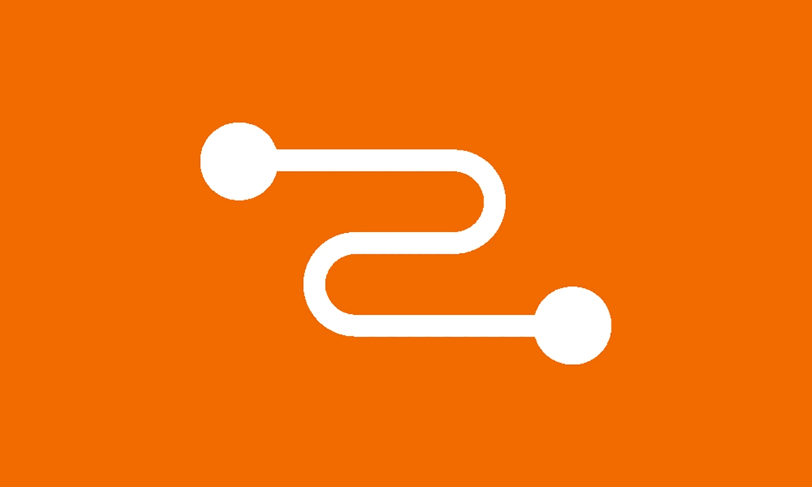
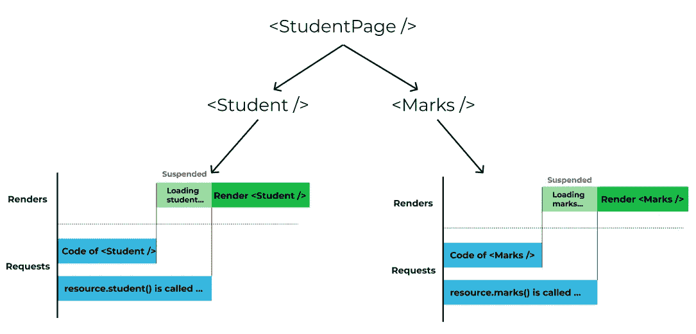
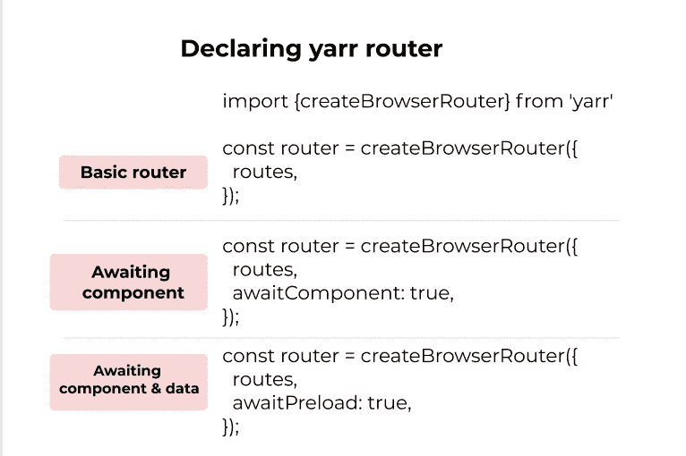
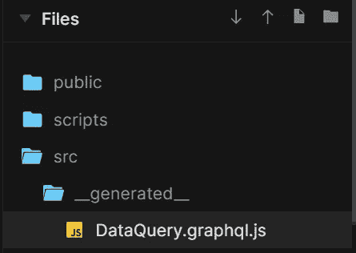
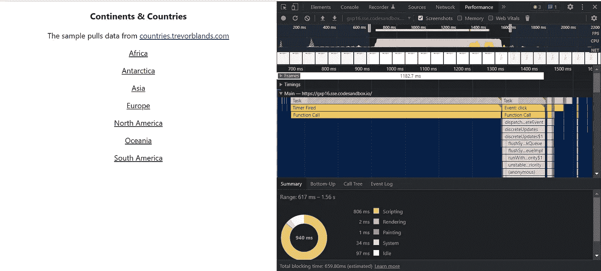
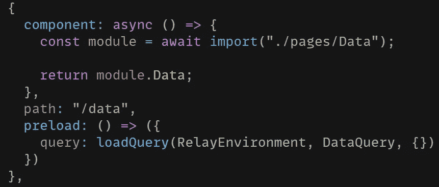
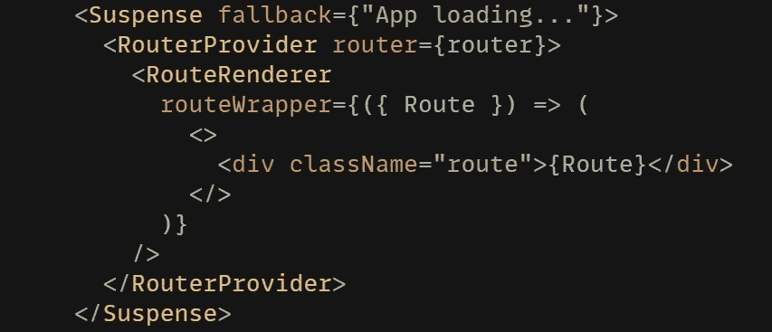
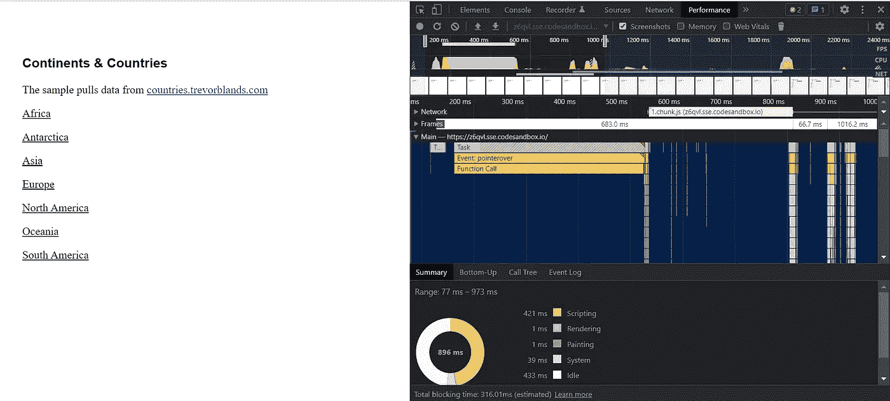

# Yarr 入门！

> 原文：<https://medium.com/nerd-for-tech/getting-started-with-yarr-7d864266b9d1?source=collection_archive---------1----------------------->

在您的应用程序中使用 React router 有许多优点，但是随着数据驱动应用程序的复杂性增加，我们的路由策略需要与高效的数据获取方法兼容，以实现一致的 UI。

[Yarr](https://github.com/contra/yarr) 是“**又一个反应路由器**”，一个由 [Contra](https://contra.com/) 开发的库，用于实现*即取即渲染模式*，以提供改进的用户体验和更好的导航。Yarr 在路由级实现的**组件预加载和**数据预加载的帮助下实现了这一点，这使得 React 应用程序的显示和性能更快。

Yarr 还使与“Relay”的合作变得容易，Relay 是一个 GraphQL 客户端，用于有效管理应用程序中的数据获取，Contra 的目标是**通过使 yarr 开源来促进 Relay 的采用**。

现在您可能想知道，既然已经有一个 React 路由器库，为什么还需要另一个呢？这将如何帮助我们为客户开发更好的 UI？“取即渲染”到底是什么？为什么这里会提到 GraphQL 和 Relay 这样的术语？！

让我们深入回答所有这些问题，以便您也可以开始试验和测试 yarr 为您准备的惊人特性！


# React 中为什么需要 GraphQL 客户端？

我们先来了解一下什么是 GraphQL。GraphQL 是传统 REST 的一个新的替代品。在我们的大多数应用程序中，我们需要来自各种 API 的数据，但是如果您可能已经注意到，REST APIs 返回的响应可能会导致两种情况:

1.  **超取** : API 返回的数据比客户端要求的多。
2.  **提取不足** : API 没有返回足够的数据，需要发送多个请求。

GraphQL 是一种用于我们的 API 的查询语言，它消除了上述两种情况，并返回客户端所需的准确数据。为了进一步理解这一点，考虑下面的例子:

让我们假设我们正在开发一个博客页面。在这个页面上，我们需要显示 3 个项目，这是用户的详细信息，由用户发布，和用户的追随者。



REST API v/s GraphQL

在使用 REST API 时，我们必须定义 3 个端点来获取所需的数据，而在 GraphQL 的情况下，API 请求(也称为“查询”)可以定义为一个模式，该模式需要一个端点，并将准确返回我们需要的数据。

通过比较通过 REST 和 GraphQL 发送的请求，使用 GraphQL 优于 REST API 的几个优点是:

1.  GraphQL **通过准确返回与页面上下文相关的响应，减少了需要通过互联网传输的数据量**。
2.  它**消除了多个端点**，将数据获取的复杂性推到了服务器端。
3.  最后，GraphQL 在客户端提供了一个非常需要的“**声明性数据获取**的方法，这极大地影响了客户端和服务器之间的数据交换速度。

如您所见， **GraphQL 在客户端数据获取方面带来了显著而强大的变化**。各种 GraphQL 客户端库(如 Relay for React)有助于管理应用程序中的 GraphQL 数据。

# 继电器反应



Relay 是 React 应用处理 GraphQL 数据的 Javascript 框架，用来**实现声明性数据获取**并确保数据与 UI 一致。

**Relay 只要求组件指定它们需要什么数据，而不是让组件获取数据**。

它是构建 Javascript 数据驱动应用的强大工具，自 2019 年年中以来，已被广泛用于构建新脸书网站和移动应用(使用 React native 构建)的基础设施。

## 在 React 中，数据获取是如何声明的？

*   在继电器的帮助下，每个组件可以声明其数据，这些数据**允许组件隔离运行**。
*   Relay 负责将所有组件的数据请求组合成最有效的 GraphQL 查询，然后获取数据。
*   这种实践**促进了应用**的稳定性，并允许开发者控制那些还没有显示数据的组件的“加载状态”。

到目前为止，我希望你们都惊讶地看到数据获取在现代 React 应用程序中的重要性。 **Yarr 让使用 Relay 变得简单高效**。在进入编码之前，还有一个概念必须引入，这就是 yarr 中内置的“即取即渲染”模式。

# “随取随渲染”模式

在介绍 yarr 时，有人提到它实现了一种“取即渲染”的模式。既然我们知道了反应中接力的目的，让我们来看看这个模式。

React 中有两种传统的数据提取方法被大多数开发人员使用: **Fetch-on-render** (数据提取在组件代码加载后开始)和 **Fetch-then-render** (在组件呈现前尽可能早地提取数据)。

然而，这些方法存在某些缺点，如-

*   瀑布
*   用户必须等待很长时间才能看到下一个屏幕的内容等。

理想情况下，我们希望在这两个极端之间找到一个中间点，以获得最佳性能。如果我们在获取数据时显示一些用户界面，而不是像上面两种方法那样按顺序显示，不是更好吗？

“提取即渲染”是一种模式，它让您“**在开始使用数据**渲染组件的同时，开始提取您需要的数据”。这意味着数据加载和组件加载是并行触发的，当服务器返回数据时，这可以显示在屏幕上。通过这种方式，用户在进入下一个页面之前，可以避免一系列的加载程序和长时间的黑屏等待。

React 可以使用 **<悬念>** 组件实现随取随渲染，这是在 16.6 版本中引入的。**悬念让我们的组件“等待”被请求的数据，然后才能呈现**。这使得开发人员可以灵活地显示各种组件的加载状态。

## 提取时渲染示例

考虑以下显示学生页面的代码，该页面由显示学生详细信息的<student>和显示学生分数的<marks>组成。</marks></student>

```
const resource = getStudentData();function Student() {
     const student = resource.student();
     return <h1>{student.name}</h1>;
}function Marks() {
     const marks = resource.marks();
     return (
         <ul>
             {marks.map(subject => (
                 <li>{subject.name} {subject.score}</li>
             ))}
         </ul>
     );
}function StudentPage() {
     return (
         <Suspense fallback={<h1>Loading student…</h1>}>
             <Student />
             <Suspense fallback={<h1>Loading marks…</h1>}>
                 <Marks />
             </Suspense>
         </Suspense>
     );
}
```

上述代码将以下列方式实现:

1.  “getStudentData()”是数据提取库的一个特殊对象，它将与悬念进行通信并支持悬念。比如《接力》支持悬疑整合。悬念帮助 React 组件操纵这种数据获取库的响应。
2.  数据提取已经通过“getStudentData()”对象中的请求触发。
3.  现在 React 尝试呈现 StudentPage。返回的 2 个组件是<student>和<marks>。</marks></student>
4.  React 试图呈现<student>组件。在<student>中，调用 resource.student()。让我们假设到目前为止没有获取任何数据，因此 React“挂起”这个组件，并继续呈现层次结构中的其余组件。</student></student>
5.  React 试图渲染<marks>组件。在<marks>中，调用 resource.marks()。让我们假设没有提取数据，因此 React 也挂起<marks>。</marks></marks></marks>
6.  现在没有更多的组件需要渲染了。由于<student>暂停，调用<student>上方最近的<suspense>回退，因此显示“加载学生…”。</suspense></student></student>
7.  当我们调用 resource.student()或 resource.marks()等“资源”的数据读取方法时，要么获取数据，要么“挂起”组件。
8.  稍后，当获取更多数据时，组件将从“暂停”状态中移除。
9.  因此，当“getStudentData()”获取数据时，组件会呈现在屏幕上，因此实现了“随取随渲染”！



并行调用代码和数据的“取即渲染”模式示例。

“取即渲染”消除了 if-else 的样板代码，并确保 UI 随传入的数据更新。Yarr 在更高的层次上实现了“取即渲染”的能力，这是在路由逻辑本身中。点击<link>组件后，可以同时调用下一页的代码和数据！

# 使用 Yarr 改善用户体验

Yarr 旨在通过强调“*”的概念来提升用户体验。*

*提供了一个简单的 API 来为每条路由分别声明组件和查询。一旦触发了对路由的网络请求，就会预加载数据和组件，这在呈现新页面时节省了大量时间。由于它内置了“取即渲染”模式，用户可以通过三种方式定制路由体验:*

1.  ***无需等待的基本路由**:当用户导航到特定路由时，立即触发数据和代码预加载。将在不检查组件和数据是否已加载的情况下渲染路线。*
2.  ***等待组件**:只有为新路径声明的组件成功加载后，新路径才会被渲染。在此之前，前一个屏幕将显示给用户，因此其名称为“await component”。*
3.  ***等待组件和数据**:只有在提取了为新路线声明的组件和数据时，才会渲染新路线。在此之前，前一个组件将显示给用户，因此其名称为“await component and data”。*

**

*使用 3 种方法创建 yarr 路由器。*

*现在让我们看看 yarr 如何提高应用程序的性能。下面有两个示例应用，一个带有 **React 路由器和中继**，另一个带有 **yarr 和中继**。*

*在这两个示例中，Relay 用于使用 Trevor Blades 的 Countries GraphQL API 获取国家和大陆的数据，并以不同的路径显示这些数据。你可以从 [codesandbox.io](https://codesandbox.io/) 中的这个[继电器启动器模板](https://codesandbox.io/s/relay-starter-template-kpvxy)入手。*

## *使用 React 路由器和中继的示例*

*在本例中，我们对 starter 模板做了一些修改。你可以在这里查看最终的沙盒。对于此示例，可以注意以下几点:*

*   *Data.js 负责显示洲数据，作为对该文件中定义的“DataQuery”的响应。**preload query()/load query()功能将被转移到 Yarr** 中的路由逻辑。*
*   *React-router 组件被导入，路由在 App.js 文件中定义。路由逻辑使用 react-router-dom 的 BrowserRouter、Routes 和 Route 组件实现。*
*   *BrowserRouter 是在历史 API 的帮助下被告知 URL 改变的路由器。这个 URL 更改被传递到在<routes>中定义的路由，并且与 URL 匹配的<route>组件被呈现在屏幕上。</route></routes>*
*   *您可能会注意到沙箱中有一个“__generated__”文件夹。该文件夹包含中继编译器在扫描沙箱中的所有 Javascript 文件后生成的最佳查询代码。*

**

*__ 已生成 _ _ 文件夹*

*这个例子的性能可以通过用 chrome 开发工具开始“剖析”来记录。我们注意到，从点击“获取大陆”链接到“/数据”路线中显示的数据所记录的总时间为**940 毫秒**。*请注意，这个时间可能会有所不同，不会每次都得到相同的答案。**

**

*当用户点击“获取国家”并使用 React 路由器登陆“/数据”路线时的性能。*

**

*使用 chrome 开发工具进行剖析时记录的时间特写。*

## *使用 yarr 和继电器的示例*

*现在让我们集成 yarr 来代替上面例子中的 React 路由器，以展示使用 yarr 的好处。你可以在这里找到这个例子的沙箱。*

*我们将理解所有文件中的代码，以了解 yarr 是如何集成到 React with Relay 中的:*

*   ***Home.js** :该页面将成为主屏幕，我们将在其中包含一个链接，导航到“Data.js”以查看各大洲。“Link”的功能与 React router 相似，允许用户在 URL 改变时转换到不同的 UI。*
*   *然而，link 也处理 yarr 中的" ***意图预加载*** "，鼠标悬停在 Link 上将预加载代码，而鼠标按下将预加载代码和数据。这使得 yarr 的预加载稍微快了一点。*
*   ***Data.js** :该页面负责显示 GraphQL API 返回的路线“/data”上的洲名。我们将该页面的查询定义为“DataQuery”。这是将被发送到 GraphQL 服务器的请求的模式。*

**

*两个示例中都使用了 GraphQL 查询来获取国家和大洲的信息。*

*   *" **usePreLoadedQuery** "是一个中继挂钩，用于实现取即渲染模式。它跟踪来自“loadQuery”钩子的响应状态，这将在后面的步骤中讨论。如果数据已被提取，则显示该数据。如果仍在获取数据，组件将被挂起。*
*   *注意“usePreLoadedQuery”是**不执行实际的数据提取**，它只是维护一个对“loadQuery”钩子中使用的查询的引用。*
*   ***routes.js** : Yarr 是为了用 Relay 轻松实现数据预加载而构建的。使用 yarr，我们可以声明一个“route”对象数组。在每个对象中，我们可以指定为路线预加载的组件和为路线预加载的数据。在我们的例子中，我们声明了 2 个路由:/和/data。*
*   *正如您在 routes.js 代码中看到的，每个 route 对象都有以下键:*

```
****component**: define the component to be preloaded and displayed for the path in the object.
***path**: define the path for which the route object is created.
***preload**(optional, but advantageous for data preloading): define the query which needs to be preloaded for the route.*
```

*   *仔细查看“/data”的路由对象:*

**

*使用 yarr 为每条路线声明组件和查询。*

*   *一旦发送了对“/data”的网络请求，yarr 就开始预加载 route 对象中指定的组件和查询。*
*   ***loadQuery()** 是一个中继钩子，负责通过将 GraphQL 查询作为输入来获取数据。获取数据后，它返回一个对输入查询的引用，该查询作为 props(**{ data . js 中的 preloaded }**)传递给组件，以决定是显示数据还是挂起组件。*
*   ***App.js** :在 App.js 中，我们执行创建路由器和使用 yarr 渲染路线的最后步骤。*
*   *" **createBrowserRouter** "是一个实用程序，用于使用 routes.js 中定义的路径组件映射创建 yarr 路由器。这将创建一个带有" browserHistory "的路由器。*

**

*创建 yarr 路由器*

*   *yarr 中的" **RouterProvider** "组件负责通过将" router "(在上一步中使用 createBrowserRouter 创建)作为道具，将路由信息传递给子组件。*
*   *还应该定义"**router renderer**"组件，以便使用 RouterProvider 传递的路由器配置，按照 URL 中的路径名呈现组件。*
*   *最后，我们可以在我们的应用程序中定义一个**暂挂边界**,用于暂挂那些数据获取仍在转换中的组件。*

**

*App.js 中的 Yarr 路由器配置*

*在这个例子中，我们实现了**基本的 yarr 路由，其中没有对组件或数据的等待**。组件和数据将在获取时呈现，在此之前，悬念将负责 UI。*

*现在让我们来衡量这个例子的性能。正如您在下面的输出中所看到的，从单击“Get Continents”链接到显示 continentals 数据的总时间为 **896ms，比 React 路由器示例的时间短！***

**

*使用 yarr 代替 React 路由器的示例应用程序的性能。*

**

*上述示例的工作原理是在获取数据时呈现数据。这似乎是性能上的一个小变化，但是随着应用程序复杂性的增加，您可以试验一下性能，看看 yarr 的工作有多出色！希望这篇文章能让您清楚地了解如何在您的项目中开始使用 yarr。*