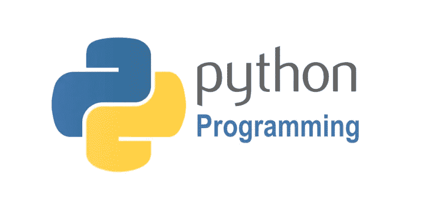
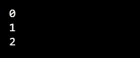

# 通过 Python 中的循环从列表中获取值或索引。

> 原文：<https://medium.com/nerd-for-tech/getting-values-or-index-from-list-through-loop-in-python-ed17ec215a87?source=collection_archive---------16----------------------->

在我看来，python 是最容易理解语法的计算机语言。因为它的可读性和英语的使用，它可以成为新手程序员的好语言。Python 超越了基本的 web 开发。它可以用于数据科学、机器学习、数据挖掘等等。

Python 计算机语言

Python 使用与其他语言相同的逻辑或概念，但有些概念是其他编程语言所没有的，例如列表、元组、字典等。在这篇博客中，我们将讨论遍历这些实体，并通过遍历它们来获取值或索引。让我们对 python 语言中的循环概念有一个大致的了解(特别是对于循环)。

For 循环语法:

for 循环用于遍历序列(列表、元组、字典、集合或字符串)。“X”用作变量，您可以为该变量使用不同的名称。该变量与 python 或其他语言中的其他变量工作方式相同。

现在让我们进入主题，获取列表、元组、字典等的值或索引。有时，当我们想得到项目的索引，但我们得到了值，这是令人困惑的。让我们走出这个困惑。

想想上面的例子，我们会得到什么样的输出。是的，你是对的，答案是价值观。
输出:

在循环中，我们对值进行迭代，这就是我们获取值的原因。如果我们想得到列表项的索引。
看下面这个例子:

现在事情又有了结果。这一次结果将会不同。这次将对结果进行索引。记住，在编程语言中索引是从零“0”开始的。
输出:

在上面的例子中，我们迭代了条目的长度，这就是为什么我们得到的条目索引从零“0”到比条目长度小 1。