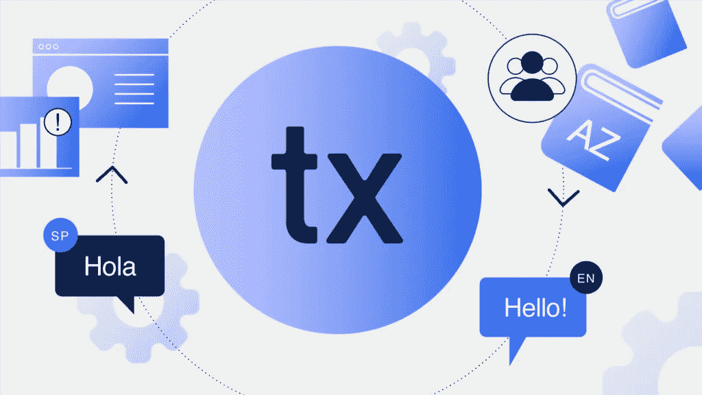
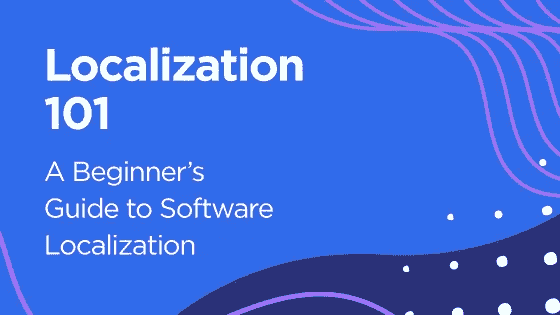
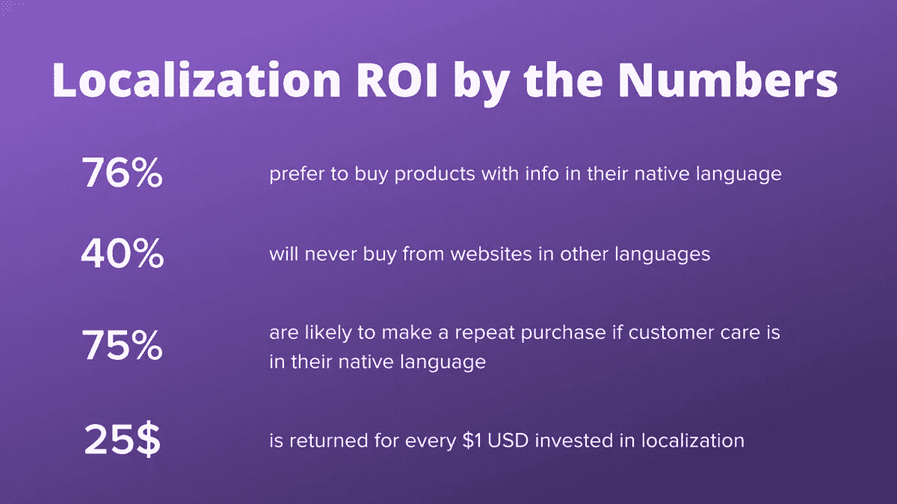

# 具有持续本地化战略的全球战略愿景

> 原文：<https://medium.com/nerd-for-tech/global-strategic-vision-with-a-continuous-localization-strategy-6a164520cbb2?source=collection_archive---------6----------------------->

几乎地球上的每个行业都是全球性企业。我们生活在一个全球数字社会。无论你是一家大型企业集团还是一家精简的 SaaS 公司；你只需通过数字展示就能接触到国际观众。但是，如果没有一个合适的本地化策略，这种数字存在可能不会是最好的。

在没有将基本元素嵌入品牌 DNA 的情况下，导航您的全球战略可能会很复杂。想象您的用户和客户生活在世界各地，并制定一个旅行计划，以应对和适应。

对于任何成长型企业来说，错过全球数字领域的关键机遇都是致命的。拥抱本地化是每一个 T2 增长战略的关键组成部分。在这里，我们计划探索如何将本地化融入您的企业生态系统。

为你的全球增长战略设定一条清晰的行进路线，就是要有能力预见并敏捷地跳过任何可能的障碍。这是任何成功商业计划的核心。数字世界是国际化的。

我们的目标是让未来的消费者，无论他们住在哪里，都知道他们的用户体验将如何转化为可访问、可消费和个性化。我们通过语言、内容、功能增强，尤其是响应能力来实现这一目标。

对于大多数公司来说，疫情已经快速跟踪了数字用户体验的[竞争格局](https://www.mckinsey.com/business-functions/mckinsey-digital/our-insights/the-new-digital-edge-rethinking-strategy-for-the-postpandemic-era)。今天的市场是无接触的、可及的、包容的。争夺依赖无缝、个性化体验的用户和客户，这种体验不仅考虑到语言，还考虑到文化、政治、法规和消费。

# 建立您的敏捷本地化团队

有时，我们开始我们的公司精益，只有必要的团队成员到位。打造和发展您的本地化团队是对您产品的全球采用的直接回应。这并不意味着本地化专业人员和翻译技术是事后才想到的。恰恰相反。

拥有一个强大的核心基础，通过了解如何接触合适的人和将与您一起发展的技术，可以快速做出响应和适应。

# 全球增长需要灵活性

敏捷通常被认为是软件的项目管理方法。但其本质是敏捷性。能够灵活应对变化，而无需中断或从头开始。这其中的一个基本要素是您用来管理技术堆栈的软件。组织使用项目管理工具，如 Monday.com 的吉拉、特雷罗、阿萨纳等。融入生态系统，管理沟通和工作量。

然而，管理内容全球化和翻译的[工具是高度专业化的，因为围绕内容本身的交流非常复杂。寻找最优秀的专业人员、服务提供商和系统，以适应您独特的商务旅程。](https://www.transifex.com/blog/2022/localization-tools/)

# 逐步本地化战略

本地化领域中的许多人使用术语“[持续本地化](https://www.transifex.com/blog/2021/what-is-continuous-localization/)”这个短语通常指的是过程和工具的实现，这些过程和工具是为了适应和促进参与适应你的产品和信息的每一个利益相关者之间的持续交流而构建的。以下是每个公司都需要具备的要素指南。

# 1:使用适合您的堆栈的本地化/内容管理工具

采用最佳解决方案来管理您的软件版本和全球内容的最重要的第一步。这就是翻译管理技术发挥作用的地方。然而，并非所有的翻译管理系统都是一样的。甚至“翻译管理”这个名字也不能恰当地解释它们的目的和功能。

一个优秀的 TMS 的核心是能够管理具有多个版本的各种内容以及随之而来的团队。这些人通常是翻译、语言学家、质量保证、工程师、内容/本地化经理等等。

对你的团队来说，最好的解决方案是能够成为你独特的公司现有 DNA 的一部分，并随着你向全球市场的扩张而发展。这就是一个[健壮灵活的 API](https://www.transifex.com/blog/2021/localization-api/) 以及[集成](https://www.transifex.com/integrations/)能够派上用场的地方！

许多人可能认为共享驱动器上的电子表格将完成这项工作。不幸的是，它们总是无法捕捉到内容全球化中许多移动部分的范围。我们不再是简单地翻译一个静态的文档，或者获取相同的 web 内容，并以其他语言提供。我们正在调整用户体验。

# 2:将本地化集成到开发过程中

认识到你的产品最有可能走向全球，你就不应该等到国际消费者知道你的产品。相反，建设时要考虑增长。在典型的 CI/CD 管道中，您正在构建持续更新的软件。

在引入敏捷之前，有一种被称为“瀑布”的软件开发方法。您可以在“[软件本地化 101](https://www.transifex.com/resources/software-localization-guide/) ”指南中了解更多信息。

工程师们会尽最大努力解释那些对所涉及的机制一无所知，也不知道如何交流他们实际需要什么的人提出的要求。

一旦他们收到他们的“成品”,它就不再是他们想象中的样子，到那时，他们的业务已经演变成软件根本无法处理的东西。整个系统将会崩溃，永远无法跟上数字世界的发展。在整个开发过程中，首先考虑本地化，这是您能够不断适应和发展的地方。

# 3:优先考虑分层结构的区域

消费者要求个性化。为全球每个客户定制产品是不现实的。本地化策略的目的是根据能引起尽可能多的消费者共鸣的内容来限制个性化。采用分层方法效果最佳。

不断评估全球市场和这些地区的消费者需求将使您能够优先考虑对您的[投资回报(ROI)](https://www.transifex.com/resources/localization-roi-by-the-numbers/) 最有意义的事情。

一线国家或地区代表着最具增长潜力的市场，您需要特别关注这些客户的需求。第二层、第三层、第四层等将根据需要进行调整，减少对每个个性化请求的关注。

# 4:超越翻译

过去，本地化和翻译被认为是一回事。今天的本地化策略包括根据消费者需求、法规和可访问性调整内容和体验。在数字空间中竞争需要基于许多变量的几个级别。设计中的元素、文本中出现的图像以及文本中的引用必须能引起用户和客户的共鸣。

# 5:衡量和适应

敏捷性和持续本地化的一个关键要素是响应数据。不断衡量消费者的行为和反馈是必不可少的。能够根据响应度、使用情况、搜索引擎优化关键词、接触点以及最终销售额快速确定重点。这是一个不断变化的过程，需要不断的监控，以确保通过将资源集中在正确的地方来有效地工作。

# 本地化整合策略

在每个组织中，本地化可能看起来不同。根据公司结构中的结构和使命，有不同的团队提供不同的功能。对于一个人身兼数职的公司来说，有支持单个部门的指定角色。这是一项重要的战略资源和功能，很容易被遗忘。

理想情况下，是通过将本地化翻译给我们的同事和最重要的关键影响者，以便每个人都理解本地化如何使组织取得成功。整个组织应该精通数字体验全球化的重要性以及战略规划和评估的价值。

分享例子是轻松传达本地化重要性的一种方式。这样，您的团队就有能力可视化可能的结果，并共享量化价值的必要数据。只要看看大公司犯下的代价高昂的错误就知道了，这些错误可能已经吸收了不幸，但会使你的企业瘫痪。

以下是一些有影响力的例子:

*   [影响设计的文本大小和长度](https://www.gala-global.org/knowledge-center/professional-development/articles/5-software-internationalization-i18n-best)
*   令人不快的翻译标题
*   直译时无法理解的参考文献
*   在某些市场中被视为冒犯性的图像
*   关于无障碍的规定
*   有关隐私的规定
*   市场中的文化灾难
*   SEO 本地化

与您的团队分享[本地化示例](https://www.transifex.com/blog/2022/localization-strategy-examples/)将让您的同事了解本地化战略合作伙伴关系的价值以及支持全球化所需的技术。这涉及到在整个战略、生产等过程中的持续整合。

管理数字体验的全球化需要独特的技术，能够随着本地化的复杂性和品牌的发展而发展。凭借合作伙伴关系和持续的战略和分析，我们可以在不断变化的国际市场中不断进行竞争。本地化是扩展几乎所有业务范围的关键组成部分。

本文原载于本页:[https://www.transifex.com/blog/2022/localization-strategy/](https://www.transifex.com/blog/2022/localization-strategy/)