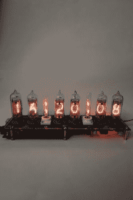

# 用一个发散计谢妮时钟回到过去

> 原文：<https://medium.com/nerd-for-tech/go-back-in-time-with-a-divergence-meter-nixie-clock-14a11f3418a1?source=collection_archive---------22----------------------->

时钟是有用的东西，主要是他们告诉时间，这通常是一件好事。

虽然我们生活在一个数字时代，但人们确实对钟表情有独钟，尤其是那些戴在手腕上的钟表，而且种类繁多。这些都是模拟的，然后是数字手表的发明，然后人们又在模拟版本上花了很多钱。

时钟(就像真正的时钟一样)倾向于保持模拟的圆盘，指针四处移动，指向边缘绘制(或压印)的数字。时钟可以由一些智能电子设备驱动，因此它们可以精确地计时，例如使用无线电时间信号。

数字钟的存在，他们使用平面显示器，如电子墨水，有机发光二极管或液晶显示器。他们往往不太漂亮。

过去，许多设备使用一种叫做谢妮显示器的东西，它们看起来像真空管，只是它们内部有各种各样的冷阴极，看起来像数字或数字，而不是预热。它们在 20 世纪 60 年代很受欢迎，但最近有所复苏，IN-14 的数字品种仍然可用。

谢妮管充满了低压氖气(有时还有一些其他气体或水银来改变颜色)，当施加电压(大约 200 伏)时，阴极就会发光。如果气体是氖气，通常会发出漂亮的橙色光。

一些有事业心的乌克兰人已经决定基于谢妮电子管设计和制造漂亮的时钟。这些产品有多种类型，可以基于 Arduino 或 Raspberry Pi，使用 IN-14 或 IN-18 谢妮管，以套件形式或预先组装。这篇评论是关于 [Arduino Shield NCS314 IN-14](https://gra-afch.com/catalog/shield-nixie-clock-for-arduino/nixie-tubes-clock-arduino-shield-ncs314-for-xussr-in-14-nixie-tubes/) 品种，有一个外部 DS18B20 温度传感器。也可以连接使用 NMEA 协议的外部 GPS，时钟将保持时间，但是 GPS 单元需要保持天空的能见度，因此可能不适合室内使用。

还有照亮谢妮管底部的 RGB LEDs，但这些会分散注意力，而不是增加美感。这也使用运行软件的 Arduino MEGA 板(全部可在 [Github](https://github.com/afch/NixeTubesShieldNCS314) 上获得)。

有一个模式按钮，可在时间、日期和闹铃模式之间切换(以及上下按钮来更改设置)。长按向下按钮，然后使用向上和向下按钮改变颜色，即可打开和关闭 led。

如果你喜欢非常老式的“数字”钟，谢妮钟绝对不会错(它很漂亮)。根据选择的选项(有/没有电子管、插座、温度传感器、GPS、Arduino Uno/MEGA)，价格会有所不同，但显示的版本大约为 170.00 美元

*最初发表于*[*【http://eurotechnews.blogspot.com】*](https://eurotechnews.blogspot.com/2020/05/go-back-in-time-with-divergence-meter.html)*。*