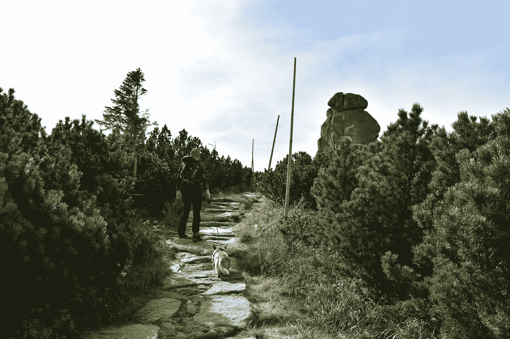
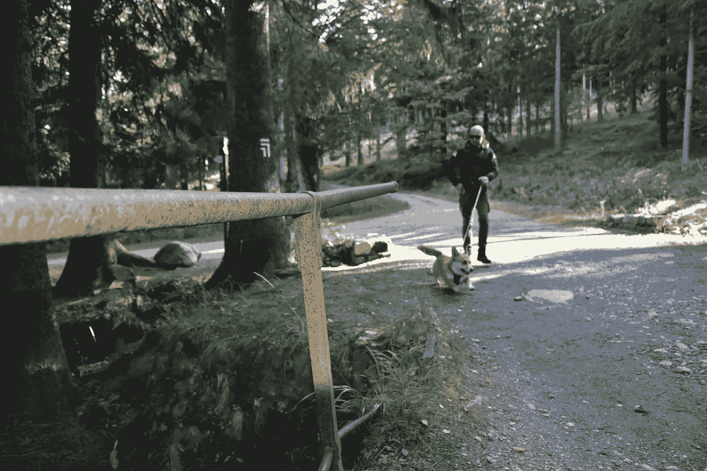

# 走进 PHP CQRS

> 原文：<https://medium.com/nerd-for-tech/going-into-php-cqrs-85cf8e21fa57?source=collection_archive---------2----------------------->

约翰独自坐在办公室的电脑后面。唯一的光亮是他桌上的灯和笔记本电脑。他感到筋疲力尽，但是他知道他必须找到问题的原因。

又经过一个小时的调试，约翰随机重现了 bug，他终于搞定了。在他的代码中，他重用了产品服务来从数据库中检索产品。然而，他不知道的是，无论何时有人调用它，这个代码都在改变和保存产品的大量视图。约翰运气不好，因为他的队友在代码中引入了一个错误，存储了不正确的值。

有多少次你不得不深入调试代码，而函数看起来很明显，实际上却在做一些意想不到的事情？

在这种情况下， *CQRS* 会帮助我们。因此，随着代码变得更加清晰和简单，我们可以对代码进行更多的推理。

# 输入命令查询责任分离(CQRS)

在他的原则中， *CQRS* 定义了*查询*和*命令*的区别。

**查询**是获取数据的方式，**命令**修改数据。
这个简单的区别允许开发者之间达成一致，即他们可以安全地使用查询任意多次**而不会产生副作用**。

查询和命令**是可识别的**，这意味着我们知道特定的查询或命令应该做什么。这比 CRUD 有巨大的优势，因为它允许捕捉用户的意图。

如果用户想改变他的电子邮件地址。然后，我们可能只要求电子邮件，因此，发送给他特定的通知，以确认他的新电子邮件地址。
从查询端，我们可以提供针对特定视图的查询。这允许我们知道它在哪里被使用以及它在什么决定之前。对于更改电子邮件，只检索当前电子邮件而不是完整的用户详细信息可能就足够了。

# 实践中的 CQRS

# 西蒙·CQRS

为了给 *Symfony* 安装*生态区*支架，执行以下操作:

> 作曲家要求[生态交错带/](https://packagist.org/packages/ecotone/) symfony-bundle

# 拉勒维尔·CQRS

为了安装*生态交错带*支架用于*拉韦勒*，执行以下操作:

> 作曲家要求[生态交错带/](https://packagist.org/packages/ecotone/) 拉勒韦尔

# 注册命令

让我们定义第一个**命令**，它将改变电子邮件地址。

**命令处理程序**是我们实际处理已定义命令的地方。

这就是我们如何将**命令**与**处理程序关联起来。** *交错区*正在查看方法声明中的**第一个类型提示，以了解该处理程序应该使用哪个命令。为了发送这个命令，我们将使用 **CommandBus，**，我们将把它注入到我们的 *HTTP* *控制器*中。**

**命令总线自动注册在您的依赖容器**中。他知道路由到特定的处理程序，所以您需要做的就是发送命令。

> *上面的控制器当然是伪代码，但是调整到* Symfony *或* Laravel *应该很简单。*

# 注册查询

让我们注册**查询**，它将返回用户的送货地址。

现在**查询处理器**将处理我们的*GetUserShippingAddressQuery*。

> 如果需要，你可以在同一个类中定义多个查询/命令处理程序。这有助于保持您的逻辑，并避免代码样板。

由于我们已经使用*#【Query Handler】*注释注册了查询处理程序，现在我们可以发送查询了。

现在我们调用 QueryBus 并返回帐单地址。

# 强大的功能，但使用简单

当你开始使用*生态区*时，你会发现自己做的**配置**要少得多，结果代码会变得更容易阅读和理解。

**econtero 遵循编程的新趋势**，旨在保持框架的业务逻辑清晰。在大多数情况下，你将只使用 PHP 8 的属性，而*生态区*将一起处理点火和连接。

你可以在官方的[生态区文档](https://docs.ecotone.tech/modelling/command-handling)中读到更多关于命令处理程序和查询处理程序的信息。