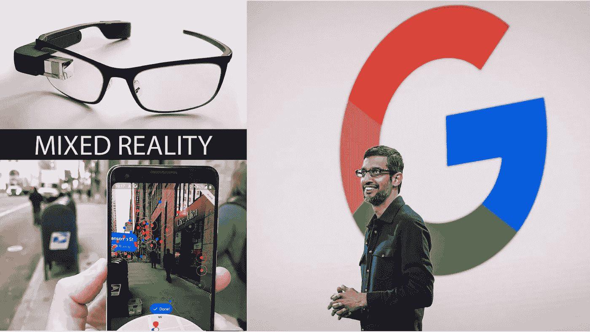

# 谷歌重申其在混合现实中的安卓战略

> 原文：<https://medium.com/nerd-for-tech/google-reiterating-its-androids-strategy-in-mixed-reality-a5a2bcee6871?source=collection_archive---------2----------------------->

谷歌的首席执行官戴着谷歌眼镜

谷歌正试图实施使其成为智能手机市场革命主要参与者的战略，该战略是关于公开一个移动操作系统，任何智能手机制造商都可以使用该系统向市场提供自己的智能手机产品系列。

人们可以预计，PC 和智能手机市场发生的事情也将发生在混合现实设备市场，这意味着许多品牌的 OEM 制造商将试图向消费者提供 VR 和 MR 设备，这些 OEM 制造商中的每一个都将试图根据价格和质量瞄准该市场的特定细分市场。同样的行为发生在几乎所有主要类别的创新硬件上，比如曾经公开的收音机和电视机。

谷歌将自己定位为将混合现实硬件市场向任何愿意在市场上提供设备的 OEM 硬件企业开放的公司，而其他大型科技公司正在寻求一个封闭的混合现实硬件解决方案，其专有的 MR 操作系统可能会嵌入每个混合现实应用市场，就像谷歌对 play store 和苹果对 Apps Store 所做的那样，因为 MR 和 VR 应用将是所有开发者和初创公司的事情，就像移动应用实际上是什么一样。

三星等低成本智能手机市场时代的制造商将等待谷歌以其混合现实操作系统为他们设计和构建混合现实硬件铺平道路，这种硬件将基于开放的混合现实硬件架构，使这种技术能够为更广泛的受众所用。谷歌在 android 操作系统上执行了同样的策略，但我猜测微软也将为其他硬件合作伙伴开发混合现实设备的操作系统，因为这是一个成功的战略，它作为一家试图成为个人电脑操作系统领导者的初创公司，即使这一战略在 Android 面前失败了，因为微软未能在智能手机设备市场培育出领先的移动操作系统。

然后，我们可以预计谷歌和微软在混合现实领域将进行非常激烈的竞争，但苹果不太可能遵循他们针对大众市场混合现实硬件的战略，因为我们都知道苹果如何关注一种差异化战略，即通过利用一小部分市场来寻求溢价和高利润，这些市场愿意购买昂贵的设计良好的技术产品，并且不愿意向其他技术公司开放其专有技术。

事实上，谷歌的混合现实战略对于任何利用过去的技术竞争动态来看待技术竞争的人来说都是显而易见的。这一战略再次使混合现实操作系统对所有混合现实设备制造商开放，因为 MR 设备也是用户输入搜索的入口，搜索是谷歌的核心业务。

我们都已经看到搜索量是如何从 PC 迁移到移动设备的，鉴于混合现实设备有可能成为大规模使用的设备，如智能手机，我们可以预计搜索量也会从智能手机迁移到这些新采用的混合现实设备。消费者可能总是随身携带一个混合现实设备，以便定制他们的现实生活体验，以适应他们的实际目标，我们知道，无论我们在哪里，我们总是在搜索一些东西，那么认为有了这些混合现实设备，人们会进行搜索并不愚蠢，即使我们现在不能说这些搜索将以什么形式进行和呈现。如果谷歌无法找到一种方法，成为这个广泛采用混合现实硬件的时代的关键参与者，它可能会面临风险，如果这些设备扰乱智能手机的使用，这种风险就会放大。一个混合现实设备比智能手机使用更多的世界完全不是不可能的。与其他科技公司不同，谷歌不能对混合现实视而不见，保持沉默，因为它的核心业务是搜索，如果这项技术被像我们这样的消费者广泛采用，它将面临风险。

如果谷歌未能推出一款受欢迎的大众市场混合现实硬件，它应该有可能与一家或多家硬件制造商合作，谷歌不能依赖微软、苹果或亚马逊进行这种合作。谷歌进行第二次变革的唯一方式是向其他大大小小的科技公司开放市场，让它有更多的机会与一个主要的混合现实硬件合作，或者从长尾战略中受益，利用许多中型硬件制造商使用其混合现实操作系统，很可能还有其混合现实应用市场。除了搜索引擎之外，谷歌没有生产封闭系统的习惯，但在混合现实的情况下，这种开放性将让谷歌有更多机会保护自己，免受用户搜索媒介可能发生的变化的影响。

对于个人电脑市场，谷歌避免采取提供操作系统的策略，因为在网景公司让浏览器成为不同于个人电脑用户操作系统的产品之前，甚至连制造商也因反垄断法和担忧而被迫推荐其他浏览器。网景的这一早期举措为谷歌不走个人电脑操作系统的道路奠定了基础，并使自己成为浏览器解决方案市场的主要参与者之一，因为浏览器是个人电脑用户搜索的入口，而不是操作系统，因为用户可以自由选择和使用他们想要的浏览器。我们可以强调的是，在笔记本电脑革命期间，谷歌尝试了 Chrome Os，这是一种主要为笔记本电脑设计的轻型操作系统，但在微软 windows 面前，这种操作系统未能成为该市场的主要领导者，因为用户的转换成本非常高。台式机用户更容易购买配备与台式机相同操作系统的笔记本电脑。

鉴于随后的观点，谷歌没有办法不向那些自愿拿出自己硬件的人开放混合现实设备市场。历史和过去的竞争动态表明，很可能会有硬件品牌向消费者提供低成本的混合现实设备，低成本是一个非常难以维持的战略，但这是一个在消费者选择中总是有很大空间的战略，因为人们需要省钱和有更多的购买力。

总之，我们可以说，这一战略的实施是以开放的混合现实操作系统的形式进行的，这使得创建一个具有嵌入式混合现实市场的新品牌的 MR 硬件变得容易，这将使任何初创公司的开发者都可以轻松地构建混合现实应用并向消费者提供这些应用。通过这样做，谷歌将向任何硬件企业家和品牌以及整个创业公司和应用程序开发者社区开放混合现实硬件机会，但微软也想遵循同样的战略道路，我们有脸书，它将挑战他们，这家科技公司正在花费所有的精力在 Oculus VR 上。但我在混合现实中看到了很多机会，比如 Airbnb 等初创公司，他们对如何应对即将到来的混合现实革命保持沉默。

**PS:** 这篇文章是关于强调所有这些大型科技公司在混合现实领域的战略和可能性，但最终只涉及[谷歌](https://arvr.google.com/)，因为它太长了。接下来几天我会和大家分享关于[微软](https://docs.microsoft.com/en-us/windows/mixed-reality/discover/mixed-reality)、[苹果](https://www.apple.com/augmented-reality/)、 [Airbnb](https://fr.airbnb.com/experiences/120483?_set_bev_on_new_domain=1648793232_ZDYwZmM2M2I4Yzc5) 的文章。