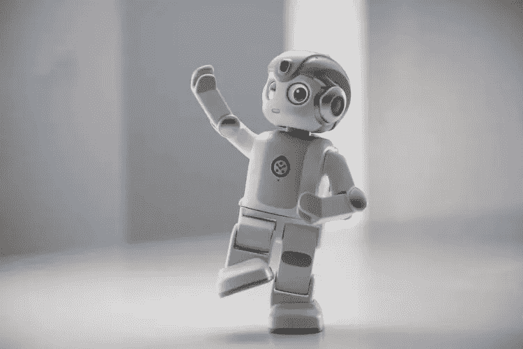

# 谷歌 X 机器人开始工作

> 原文：<https://medium.com/nerd-for-tech/google-x-robots-start-to-work-7c3eb6636d53?source=collection_archive---------2----------------------->

https://baike . Baidu . com/item/% E6 % 82% 9F % E7 % A9 % BA % E6 % 9C % BA % E5 % 99% A8 % E4 % BA % BA/22882822

最近 Google X 的登月工厂开发了一个机器人，可以在咖啡馆里擦桌子，还可以监控会议室！看来，日常机器人的时代正在来临。

事实上，咖啡馆服务员机器人已经在加州山景城的谷歌园区使用。

这个机器人来自 Google X 的日常机器人项目，是在 Moonshot 工厂开发的。目标是生产在日常生活中为人服务的机器人。每天他们会把机器人送到实际的工作现场，比如咖啡店。

这些机器人在咖啡馆里寻找桌子，将其中一个轮子放在桌子上，花几秒钟时间确定是否有人坐在那里，直到找到一张空桌子。

接下来，机器人开始擦桌子两次。机器人扭曲并展开四肢，将手臂伸向桌子，并用透明的消毒方法覆盖表面。然后它缩回手臂，将多余的液体挤入底部的桶中。一旦任务完成，它就开始移动并寻找下一个空表。

自从机器人正式值班几周以来，咖啡馆的顾客已经习惯了这项服务。

## **日常机器人难题**

在其他领域，机器人可以导航复杂的交通路线，驾驶汽车比人类更安全，等等。然而，在日常机器人的世界里，似乎很难穿过一个凌乱的房间，打开一个门把手。这个任务看起来仅仅是清理茶几，但实际上，里面有一系列的操作。例如，当其他人或物体阻挡了路径时，机器人也应该找到正确的解决方案。

对于机器人来说，需要正确回答的问题是——是否有足够的空间在这个方向上顺利移动，或者是否需要完全重新规划路线？

领导整个日常机器人团队的美国-挪威工程师布朗德莫认为，通过在机器学习方面取得最新进展，有可能创造出真正通用的机器人。工程师使用机器学习来识别物体，然后运行模拟数百万次，这可以将数周的测试压缩到数小时。这种方式还可以帮助实验室中的机器人了解自己的实际工作环境，积累解决野外作业中不可避免的困境的技能。

比如门锁训练不到 10 个小时，机器人一旦学会了什么，就会把“知识”送回整个集体云智能，然后所有机器人就可以用同样的技能锁门了。

布朗德莫希望他们的机器人能和人类一起生活和工作，而不是机器人的世界。

# 人工智能对高质量数据的依赖

人工智能行业有一个重要共识:

训练数据的质量直接决定了最终 AI 模型的性能。数据的可伸缩性和准确性越高，算法就越稳健。

随着 AI 商业化进程的加快，以及辅助驾驶、客服聊天机器人等 AI 技术在各行各业的应用，人们对特殊场景下的数据质量的期望越来越高。高质量的标签数据将是人工智能公司的核心竞争力之一。

如果说之前的算法模型使用的一般数据集是粗粮，那么算法模型目前需要的是定制的营养餐。如果公司想要进一步提高某些模型的商业化，他们必须逐步从通用数据集向前发展，以创建独特的数据集。

# 结束

将你的数据标注任务外包给 [ByteBridge](https://tinyurl.com/4bedeyp8) ，你可以更便宜更快的获得高质量的 ML 训练数据集！

*   无需信用卡的免费试用:您可以快速获得样品结果，检查输出，并直接向我们的项目经理反馈。
*   100%人工验证
*   透明标准定价:[有明确的定价](https://www.bytebridge.io/#/?module=price)(含人工成本)

**为什么不试一试？**

来源:https://www . robot-China . com/news/202111/30/68642 . html