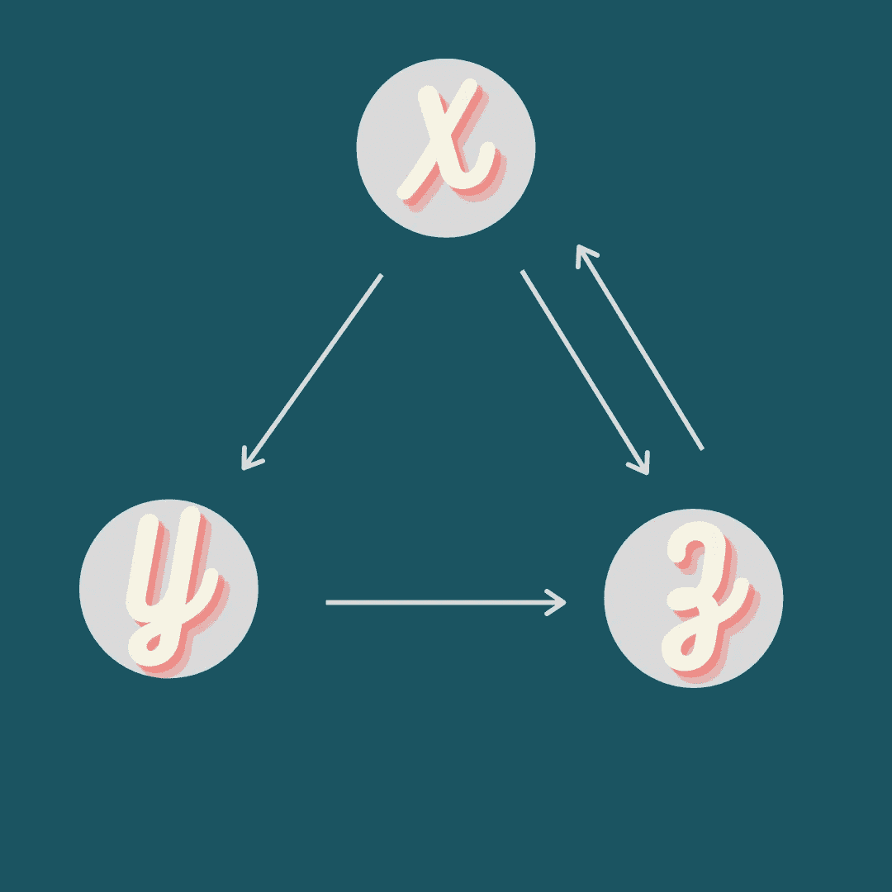
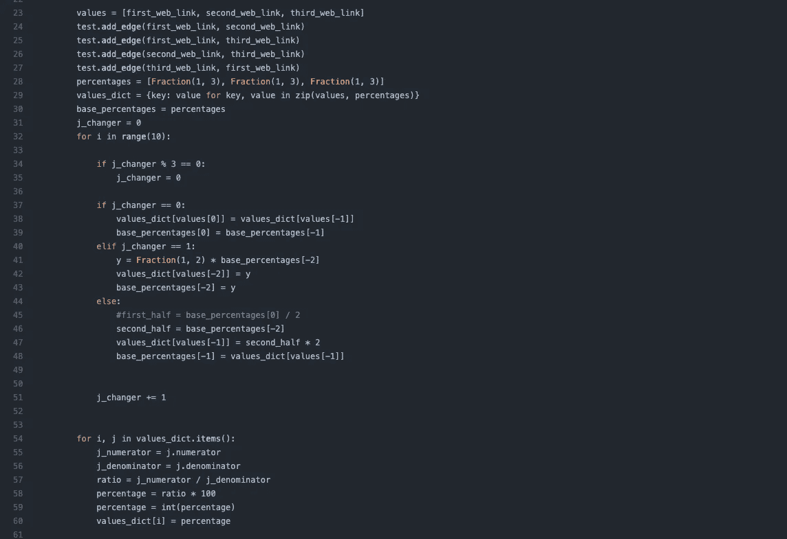

# 谷歌久负盛名的 PageRank 算法彻底改变了网上冲浪。

> 原文：<https://medium.com/nerd-for-tech/googles-prestigious-pagerank-algorithm-that-revolutionalized-web-surfing-f48c4e2b21?source=collection_archive---------13----------------------->

很久以前，在谷歌还不存在的时候，搜索网络本身就是一项完全不同的活动。这就像在完成交叉训练后跑 10 公里。老的搜索引擎推荐的网站往往是不相关的，陈旧的，而你真正想要的网站要么被埋没在结果列表的底部，要么完全消失了。这主要是因为没有基于访问量和基于时间的相关性的自动排名算法。对于所有的计算机科学爱好者来说，你甚至可以说网络只是一个队列。

这个网站的全部目的是尽可能快地返回你所有问题的最佳和最相关的答案。让你的网络代表一个不断无限增长的队列，会让寻找答案变得像聚会后在水槽里的一堆盘子里寻找你的幸运勺子一样困难。

然而，在线性代数，更具体地说是矩阵和向量的帮助下，链接分析拯救了我们。无论您想要检测大型数据集中的模式还是执行涉及数百万变量的庞大计算，线性代数都有您需要的工具。例如，就像谷歌如何用他们的 PageRank 算法革新网络一样。这个算法就是为什么今天，我们可以快速找到我们大多数问题的相关答案的原因。

担心内容被证明是一种不切实际的网页排名方式。计算机对此并不擅长，人类法官也跟不上每天增加的成千上万的页面。共同创立谷歌的研究生拉里·佩奇和谢尔盖·布林采用的方法是让网页通过用脚投票，或者换句话说，通过它们的链接来排名。

基本 PageRank 模型

谷歌的算法给每个页面分配一个 0 到 1 之间的分数。这个分数叫做 PageRank。它主要是通过计算一个假想的网上冲浪者在该网页上花费的时间来衡量该网页相对于其他网页的重要性。每当有一个以上的出站链接可供选择时，冲浪者就以相等的概率随机选择一个。根据这种解释，如果页面被更频繁地访问，则它们被认为更重要。并且因为页面等级被定义为比例，所以当在整个网络上求和时，它们必须加起来为 1。

创建这样一个强大的算法听起来很容易，对吗？我也是这么想的。在过去的周末，我试图创建一个非常基本的算法，仅用 3 个节点(这些节点代表网站)来反映 PageRank 算法的一般物理性质。

类 Alg 下的 PageRank 算法计算

最初，算法会给每个网站 1/3 的同等排名。在每次迭代之后(在该模拟中总共 10 次)，每个顶点的等级基于 3 次计算进行更新:

x = z
y =(1/2)x
z =(1/2)x+y

规则是，每个页面从上一轮中获取其 PageRank，并将其平均分配给它链接的所有页面。因此，在一轮之后，X 的更新值仍然等于 1/3，因为这是它从 z 处获得的 PageRank。但是，Y 的得分下降到 1/6，因为它从上一次迭代中仅获得 X 的 PageRank 的一半。另一半归 Z 所有，这使得 Z 成为该迭代中排名最高的网站，因为除了从 X 获得的 1/6 之外，它还从 Y 获得了全部的 1/3，因此总计为 1/2。

经过 10 次迭代后，我们可以得出结论，算法的最终结果遵循类似的线性模式，x = 2y= z。这意味着 X 和 Z 是同等重要的页面，即使 Z 有两倍多的链接进入。这是一个转折，因为 X 和 Z 一样重要，因为它得到了 Z 的全力支持，但得到的回报只有 Z 的一半。另一半再发给 Y，这也解释了为什么 Y 的秩只有 X 和 z 的一半。

就我的代码而言，它并不像从概念定义上听起来那么复杂。图形数据结构用于为算法的计算提供底层基础，以提供更多的流量。`Class Alg`和`.PageRank()`是实际算法所在的位置。在用代表不同网站的所有顶点初始化该图之后，我们提示 for 循环迭代 10 次，以基于它们的线性关系来改变每个顶点的每个值(分数模块用于在使用 floats 时使计算更精确)，这在上面定义。`base_percentages`是`percentages`的复制列表，用于引用每个顶点排名的更新，最后，为了完成算法，我们打印了一个简单的语句，打印每个顶点的值和它们的 PageRank，在 10 次迭代后转换为百分比。

总的来说，该算法的复杂度是 O(N ),并且该算法描绘了顶点之间的比例 2:1:2。

这是我的项目的链接:[https://github.com/GEEGABYTE1/PageRank_Alg_Simulation](https://github.com/GEEGABYTE1/PageRank_Alg_Simulation)

当你处理大量变量时，线性代数是很棒的，就像在现实网络中一样。换句话说，当试图开发越来越快的算法来解决大量方程组时，它非常有效。每个微小的差异都会对前端产生巨大的影响，从多个方面(如 web 本身的性能)到 web 上不同来源的可访问性。这个小项目对于理解线性代数能做什么，以及 Google 的 PageRank 算法到底有多强大非常有用。虽然我的算法只解了 3 个基本方程，但实际上，谷歌的算法一次可以解几十亿个！