# 石墨烯场效应晶体管

> 原文：<https://medium.com/nerd-for-tech/graphene-field-effect-transistors-b21daf900d38?source=collection_archive---------6----------------------->

## 彻底改变生物医学产业

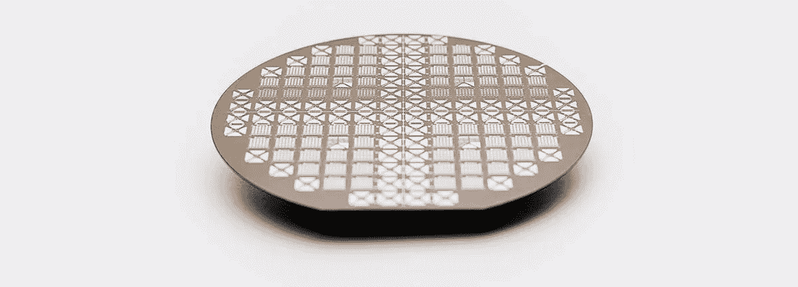

[GFET 纳米传感器](https://www.graphenea.com/pages/what-are-graphene-field-effect-transistors-gfets)

"*纳米传感器——它们可能很小，但却有巨大的影响力*"纳米技术是一项令人难以置信的迷人技术，它已经颠覆了世界上数以千计的重要行业。该领域的一项重要技术是使用**纳米传感器**。纳米传感器的进步可以为各个领域的应用打开前所未有的前景，如**医学中的分子水平**诊断和治疗仪器。石墨烯场效应晶体管( **GFET** )是一种非常令人兴奋的纳米传感器，它可以让我们在分子水平上了解我们的身体，并在前所未有的水平上检测[生物标记](https://www.fda.gov/drugs/biomarker-qualification-program/what-are-biomarkers-and-why-are-they-important-transcript)，**革命性的个性化医疗保健**。

# 内容大纲

1.  石墨烯
2.  纳米传感器
3.  定义 GFET 传感器
4.  GFET 传感器的内部工作原理
5.  门控 GFETs 的类型
6.  GFET 优于常规 FET
7.  制造 GFETs
8.  GFETs 在医疗保健中的应用
9.  GFETs 面临的挑战
10.  GFETs 的未来
11.  TL；速度三角形定位法(dead reckoning)

# 石墨烯

石墨烯是地球上用途最广、强度最大的金属之一。它是碳的同素异形体，由单一的碳原子层组成，所有的碳原子都在一个平面上，排列成紧密的 2D 六角晶格结构。

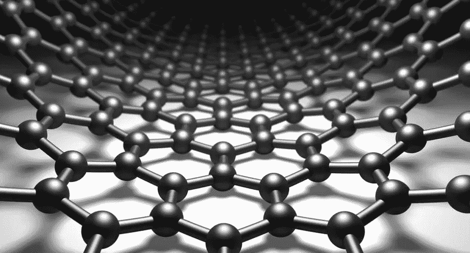

厚度只有一个原子的石墨烯是一种难以置信的轻质导电材料[NGI/曼切斯特大学](https://www.forbes.com/sites/scottsnowden/2020/07/24/ground-breaking-method-to-make-graphene-from-garbage-is-modern-day-alchemy/?sh=180b9e3f50d7)

石墨烯的一些有助于提高纳米传感器性能的优越特性包括:

*   **光吸收:**石墨烯是一种极其薄且透明的材料，能够吸收大约 2.3%的白光，这对于一种 2D 材料来说是相当多的。
*   **极轻:**石墨烯比羽毛还轻，非常薄，这一特性使其非常适合可穿戴设备，同时还具有极高的柔韧性。
*   **高导电性:**石墨烯理论上可以 100%的效率传输电流。
*   **高导热率:**石墨烯是一种各向同性的导体，具有向各个方向散热的能力，比包括钻石在内的任何其他材料都具有更好的导热率。
*   **优异的化学性质:**在一定条件下，石墨烯可以吸收改变其性质的不同分子和原子，使其适用于化学和生物传感器等应用。

要了解更多关于石墨烯的特性，请阅读我的文章[石墨烯:改变世界的材料](https://charlotte-innovate.medium.com/graphene-the-material-that-is-changing-the-world-fd32575bccd5)。

# 纳米传感器

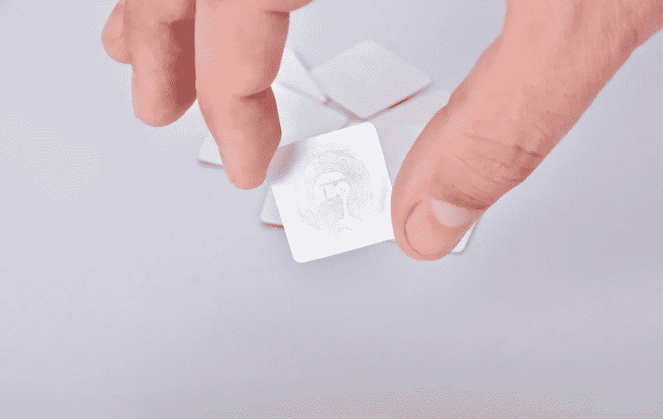

[纳米传感器:简介](https://www.azonano.com/article.aspx?ArticleID=4933) Shutterstock | vetkit

纳米传感器是检测和测量小粒子或微小物理量的纳米级设备。纳米传感器然后将这些信号转换成可以检测和分析的信号。他们通过识别活性传感材料电导率的变化来工作。简单来说，纳米传感器是一种极其微小的传感设备，可以在纳米尺度上收集信息和数据。

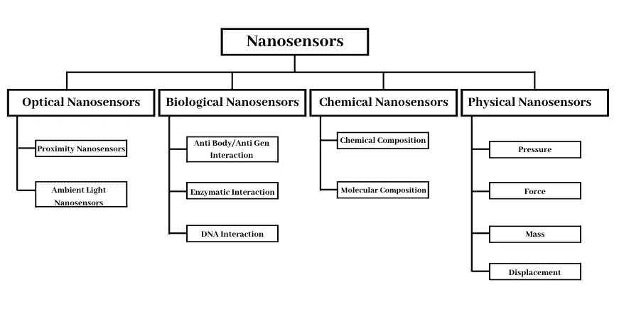

不同类型的纳米传感器。

有许多不同类型的纳米传感器。主要的两种纳米传感器是**化学**和**机械**传感器。纳米传感器在几乎每个领域都有大量的应用，包括国防、环境和医疗保健行业。

## 生物传感器

[生物传感器](https://www.electronicshub.org/types-of-biosensors/)是生物传感元件和传感器的组合，将数据转换成电信号。它通常具有由信号调节单元、处理器或微控制器和显示单元组成的电子电路。

石墨烯场效应晶体管( **GFET** )传感器是一种被称为**生物分析传感器**的[生物传感器](https://www.electronicshub.org/types-of-biosensors/) 。生物传感器是检测生物过程变化的分析装置(任何生物元素或材料，如酶、组织、微生物、细胞、酸等)。)并将它们转换成一个**电信号**。生物分析传感器设计用于生物相关分子的**定量分析**，如核酸、蛋白质、代谢物、药物等。**石墨烯生物传感器**旨在提供电子和生物的融合，从根本上改变生物测试能力、传感器速度和尺寸。

# 定义 GFET 传感器

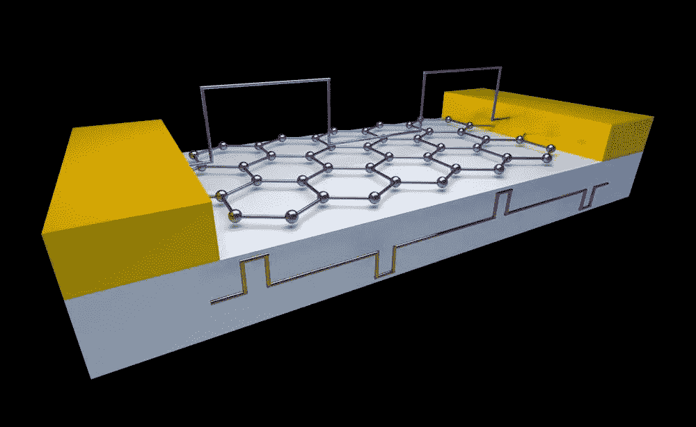

[石墨烯纳米带场效应晶体管](https://www.eeweb.com/graphene-nanoribbon-field-effect-transistor/)

石墨烯场效应晶体管( **GFET** )由两个电极之间的石墨烯沟道，以及调节沟道电子响应的栅极触点组成。

当**目标分子**与石墨烯通道上的 [**受体**](https://www.merriam-webster.com/dictionary/receptor) (即葡萄糖、血红蛋白、胆固醇、过氧化氢等)结合时，电荷重新分布，产生通道区域电场的变化。这改变了沟道的**电子电导率**和整体器件响应。虽然石墨烯一般不会与大多数材料反应或结合，但它是由碳组成的，并且有几个程序允许通过在表面上形成结合位点来使 [**功能化**](https://www.sigmaaldrich.com/technical-documents/articles/materials-science/graphene-field-effect-transistors.html) 。

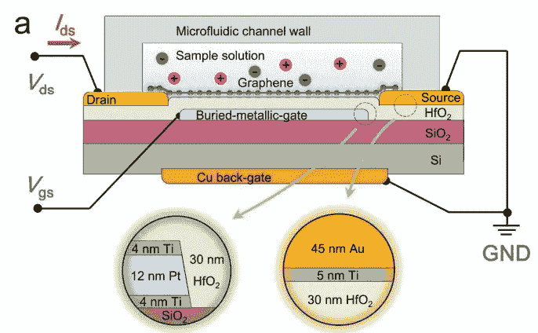

[高κ固体栅 GFET 器件的原理图和制作](https://sci-hub.st/https://onlinelibrary.wiley.com/doi/abs/10.1002/adfm.201602960)

**可以通过[吸附](https://www.merriam-webster.com/dictionary/adsorption)或附着在通道表面的[连接分子](https://www.sciencedirect.com/science/article/abs/pii/S1359029403000827#:~:text=Linker%20molecules%20are%20amphiphiles%20that%20segregate%20near%20the,the%20surfactant%E2%80%93oil%20interaction%20and%20the%20oil%20solubilization%20capacity.)添加生物受体**如氨基酸、抗体或酶。然后，分子可以通过[共价键](https://www.britannica.com/science/covalent-bond)、[静电力](https://www.thoughtco.com/definition-of-electrostatic-forces-604451)或[范德华力](https://byjus.com/chemistry/van-der-waals-forces/)附着到这些生物受体上，这将在整个传感器中产生电子转移。

通过正确的功能化，GFET 传感器能够利用全电子设备控制和读数来检测**目标分析物**,该全电子设备控制和读数为:

*   高度敏感
*   高度选择性
*   直接的
*   无标签

# GFET 传感器的内部工作原理

石墨烯片连接源电极和漏电极，其下嵌入固体栅电极，通常在硅衬底上。

**GFET 通常包括:**

1.  石墨烯通道
2.  两个电极:源极和漏极
3.  浇口:顶浇口、背浇口或双浇口

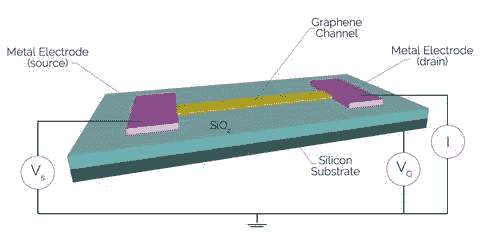

## 石墨烯通道

GFET 的**石墨烯沟道**只有**一个原子厚**，这意味着整个沟道实际上都在表面上。附着在通道表面的任何分子都会影响整个器件的电子转移。该沟道在**源极**和**漏极**电极之间延伸。

## 电极:源极和漏极

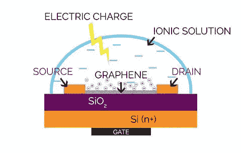

*德拜-胡克尔屏蔽现象是对*[*gfet*](https://www.graphenea.com/pages/what-are-graphene-field-effect-transistors-gfets)*的挑战，影响离子溶液内场效应晶体管的灵敏度*

当在栅极施加电压时，该器件改变源极和漏极之间的导电性，以控制它们之间的电流。**源**是分子进入通道的地方。**排放口**是分子离开通道的地方。

## 背栅 GFET

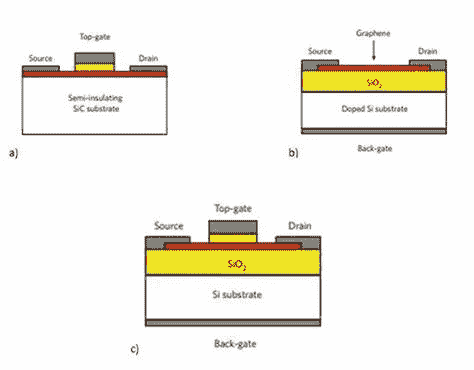

*石墨烯场效应晶体管中不同的栅极配置:a)顶栅极 GFET，b)背栅极 GFET，以及 c)双栅极 GFET*

栅极是调节沟道导电性的终端。**背栅 GFET** 是最常见的 GFET 传感器配置。在这种类型的 GFET 中，首先制造栅极，然后与另一层漏电极和源电极堆叠。

## 顶栅 GFET

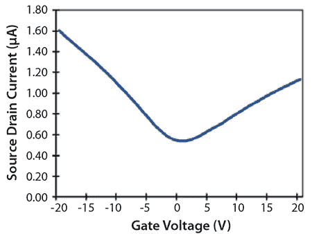

[GFET 器件响应作为栅极电压的函数。](https://www.sigmaaldrich.com/technical-documents/articles/materials-science/graphene-field-effect-transistors.html#:~:text=A%20graphene%20field%20effect%20transistor%20%28GFET%29%20is%20composed,binding%20of%20receptor%20molecules%20to%20the%20channel%20surface.)

栅极控制着电子的反应，从而控制着沟道的行为。**顶栅** **GFET** 传感器使用双层栅电介质提出了一种新的补偿机制，从而实现了**高工作稳定性。**使用薄的顶栅绝缘体改善了 GFET 参数，包括[开路增益](https://www.calculatoratoz.com/en/open-circuit-voltage-gain-calculator/Calc-4396#:~:text=The%20Open-Circuit%20Voltage%20Gain%20is%20the%20ratio%20of,as%20Av%3DVo%2FVi%20or%20voltage%20gain%3DOutput%20voltage%20%2FInput%20voltage.)、[正向传输系数](https://www.sciencedirect.com/topics/engineering/transmission-coefficient)和[截止频率](https://www.electrical4u.com/cutoff-frequency/)。

## 双栅 GFET

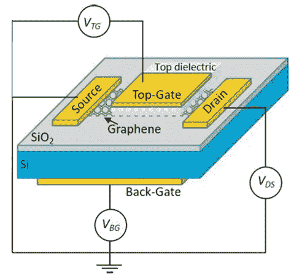

[双栅极 GFET](https://www.allaboutcircuits.com/technical-articles/graphene-field-effect-transistor-gfet-construction-benefits-challenges/)

在典型应用中，**双栅极 GFET** 使用两个栅极偏置来控制沟道的电荷浓度。双栅极 GFET 使**能够用**两个不同的电压**偏置**沟道。

# 门控 GFETs 的类型

石墨烯用于在场效应晶体管中形成导电通道，这允许对**分析物**进行高灵敏度的电检测。当在液体介质中工作时，GFET 传感器通常采用**溶液门控**或**固体门控**配置。

## 溶液门控 GFET

在溶液门控 GFET 传感器(也称为**液体门控** GFET)中，导线(通常为 Ag/AgCl)被插入[电解质溶液](https://chem.libretexts.org/Bookshelves/Physical_and_Theoretical_Chemistry_Textbook_Maps/Supplemental_Modules_(Physical_and_Theoretical_Chemistry)/Physical_Properties_of_Matter/Solutions_and_Mixtures/Solution_Basics/Electrolyte_Solutions#:~:text=An%20electrolyte%20solution%20is%20a%20solution%20that%20generally,some%20cases%20where%20the%20electrolytes%20are%20not%20ions.)中，并与石墨烯接触。这作为[栅电极](https://www.sciencedirect.com/topics/engineering/gate-electrode#:~:text=The%20gate%20electrode%20and%20the%20source%2Fdrain%20formed%20by,metal%20composites%2C%20such%20as%20WN%2C%20TiN%2C%20or%20TaN.)，而在溶液-石墨烯界面形成的**双电层** ( [EDL](https://www.sciencedirect.com/topics/chemistry/electric-double-layer) )提供了[**栅介质**](https://www.sciencedirect.com/topics/engineering/gate-dielectric) 。使用电解质溶液的各种成分，这些纳米传感器已经能够检测[物理化学参数](https://www.coursehero.com/file/76904999/Physicochemical-parameters-for-monitoring-water-qualitydocx/)，包括 pH 值和生物化学分析物，如 DNA。

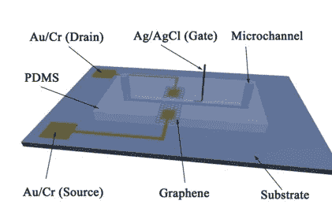

[集成在微流控芯片中的溶液门控石墨烯场效应晶体管(SGGT)的示意图](https://pubs.acs.org/doi/full/10.1021/nl2040805)

溶液门控传感器可能**阻碍传感器的集成**和**小型化**，因为它们通常需要一个插入电解质溶液的外部电极。EDL 电介质层或[栅电容](https://www.sciencedirect.com/topics/engineering/gate-capacitance)易受液体介质的干扰。这可能导致石墨烯特性的电学测量的波动，包括 [**电导**](https://www.electrical4u.com/conductance/) 和**狄拉克点**的位置。

## 固体门控 GFET

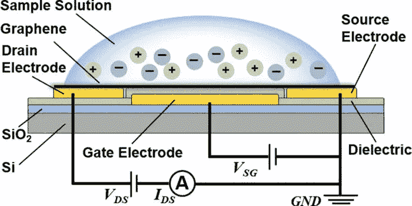

[固体门控 GFET 纳米传感器示意图](https://www.researchgate.net/figure/Schematic-of-the-graphene-based-FET-nanosensor-Graphene-serves-as-the-conducting_fig1_274140273)

在典型的固体栅极 GFET 中，石墨烯和下面的**硅衬底**之间的 **SiO2 介电层**用作栅电极，提供栅极电容。通过消除将任何外部导线插入电解质溶液的需要，固体门控传感器**可以集成**和**小型化**。然而，由于二氧化硅层固有的低电容，固体栅极 GFETs 通常需要**不需要的高栅极电压** (40~50 V)。这可能会妨碍传感器在液体介质中的生物传感应用。

# GFET 优于常规 FET

GFET 比**大块半导体器件**有几个优点。这些优势包括:

*   空前的敏感
*   增强的性能和效率
*   更少的分子缺陷
*   优于 1D 材料的制造优势
*   极限表面体积比

## **空前的**灵敏度

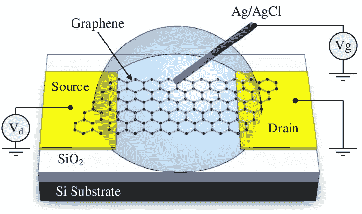

[以 Ag/AgCl 参比探针为栅电极的石墨烯基场效应晶体管示意图。](https://www.researchgate.net/figure/Schematic-of-a-graphene-based-field-effect-transistor-with-an-Ag-AgCl-reference-probe-as_fig4_258657562)

在传统的 FET 传感器中，**硅**作为一个薄的导电通道。当在 GFET 传感器中用石墨烯代替硅时，传感器产生更薄、更灵敏的沟道区。普通半导体器件的响应**灵敏度**受到**限制**，因为沟道表面的局部电场变化对器件沟道深处的影响很小。大多数半导体晶体管传感器都是三维的，这意味着电荷在沟道表面发生变化，但并不总是深入器件内部。

## 增强的性能和效率

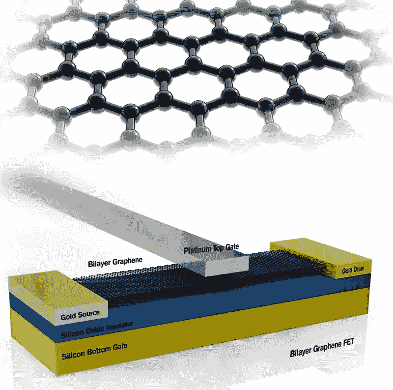

[*室温下具有高开关电流比和大输运带隙的 GFET*](https://3dciencia.com/blog/2011/01/graphene-field-effect-transistor-fet/)

石墨烯晶体管有可能提供增强的性能和效率，因为它的**优越的电学**和**热导率**导致**低电阻损耗**和**比硅更好的散热**。gfet 的载流子迁移率**比常规 FET 传感器的载流子迁移率**高。对于 hBN 封装的单晶 CVD 石墨烯，If 通常达到大于 100，000 cm2V-1s-1 [的水平。GFET 传感器还具有大约 5×1011cm-2 的剩余电荷载流子密度。](http://advances.sciencemag.org/content/1/6/e1500222)

## **更少的分子缺陷**

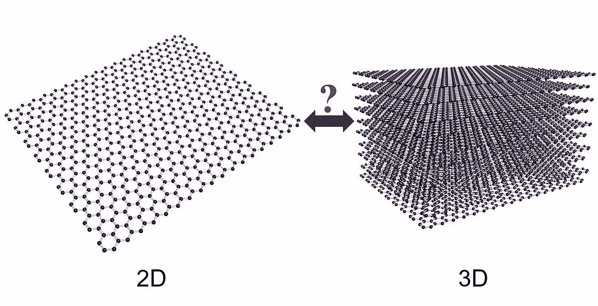

[石墨烯](https://www.techexplorist.com/graphene-both-3d-2d-material-study/26652/)因为是 2D 材料，所以没有表面悬空键形成缺陷

使用像石墨烯一样薄的硅(或其他块状半导体)也是无效的，因为它会导致表面缺陷主导**材料特性**。这些键在半导体沟道中形成额外的缺陷，并使得非特异性结合成为可能。这可能会导致**假阳性**。石墨烯是一种二维材料，因此它没有**表面悬挂键**形成缺陷。这导致高导电性和对表面缺陷的敏感性，并且由于材料没有悬挂键，它消除了**非特异性结合**和**假阳性**。GFET 传感器非常敏感，它可以检测到从表面脱离或附着到表面的单个分子。

## **优于 1D 材料的制造优势**

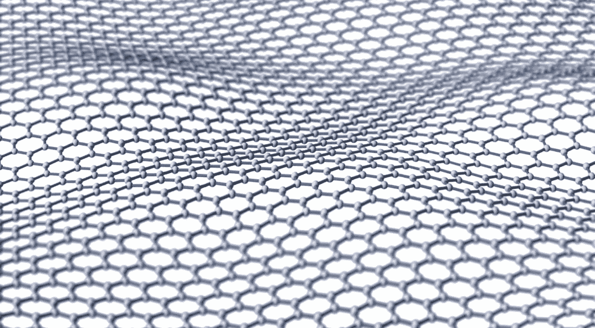

[石墨烯](https://www.extremetech.com/extreme/211437-extremetech-explains-what-is-graphene)与一维材料相比具有明显的制造优势

石墨烯场效应晶体管传感器与使用碳纳米管和纳米线等**一维材料**制造的设备相比，具有明显的制造优势。1D 材料目前无法制造出同样的**一致性**，而石墨烯可以在具有材料特性的均匀薄膜中生产。2D 材料提供了实现器件间一致性的途径。均匀的石墨烯薄膜也可以通过**化学气相沉积**生产，这些薄膜可以响应为集成电路制造工艺开发的**光刻制造技术**。

## 极限表面体积比

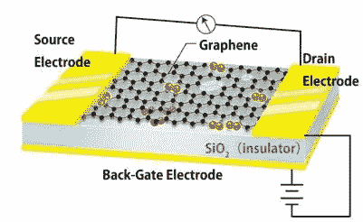

[gfet 是一种吸引生物分子附着的装置](https://www.graphene-info.com/oxygen-adsorption-graphene-can-be-controlled-using-field-effect-transistor)

石墨烯具有广泛的**电化学势**和**功能化的能力**，GFETs 是一种吸引生物分子附着的设备。由于石墨烯的极端**表面体积比**，即使附着分子的浓度最小，沟道电导率也很容易发生变化。

# 制造 GFETs

**有许多不同的方法来制造纳米传感器**和**石墨烯**，这些方法包括:

*   自上而下纳米制造
*   自下而上纳米制造
*   化学气相沉积(石墨烯)

## 自上而下纳米制造

最能描述自上而下制造纳米传感器方法的一个类比是，把它想象成一个雕刻家从模板上雕刻出一个雕像，然后去除材料。一块基底材料被逐渐侵蚀，直到获得所需的形状。采用自上而下的方法时，从毛坯件的顶部开始，向下加工，去除任何不必要的材料。

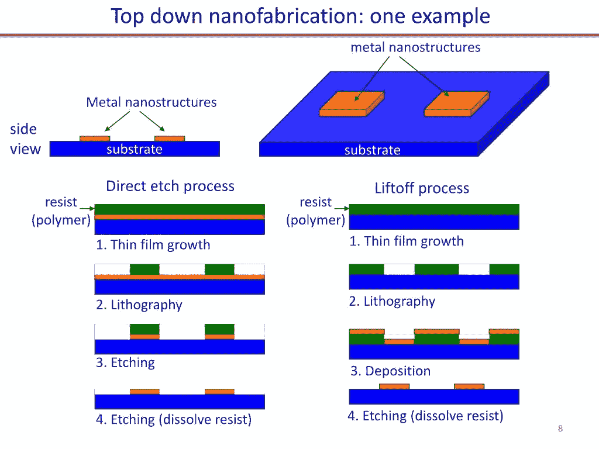

[自上而下纳米制造的例子](https://www.slideserve.com/ariane/fabrication-in-the-nanoscale-principles-technology-and-applications)

半导体工业中一种重要的自上而下的方法是**光刻**。通过这种方法，使用短**波长光**(电子束光刻中的电子)在**光致抗蚀剂**和**蚀刻**中创建期望的图案，以通过移除下面的材料来形成纳米结构。不同类型的蚀刻方法可以包括化学、等离子或反应离子蚀刻。使用的其他类型的自上而下的方法是**化学**或**电抛光**以平滑表面，或**纳米压印**技术，涉及使用微型印模压入材料以形成所需的纳米结构。

## 自下而上的纳米制造

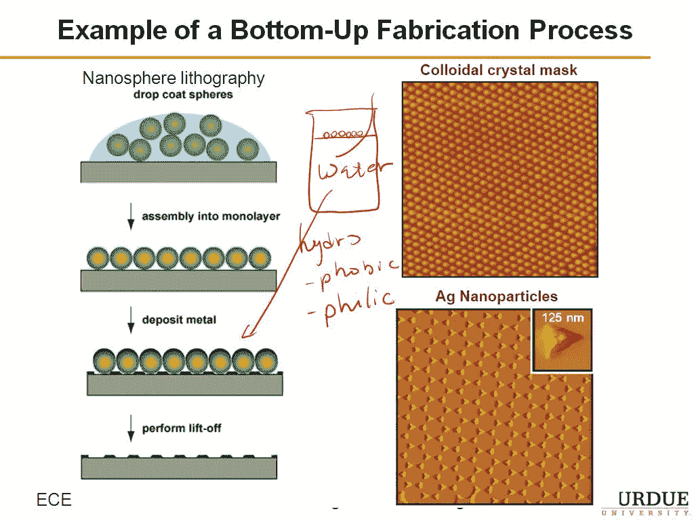

[自下而上纳米制造示例](https://nanohub.org/resources/24029/watch?resid=24179&time=00:07:25)

一个很好的自下而上建造的类比是**建造一个砖房，**当你一次一个地把砖块放在另一个的上面来建造一个房子。自下而上的制造方法不是一次一个地将砖块放在另一个上面来建造房子，而是一次一个地将**原子**或**分子**放在另一个上面来建造想要的**纳米结构**。由于这些过程非常耗时，所以使用了自组装技术，这是一种原子根据需要自行排列的方法。

## 化学汽相淀积

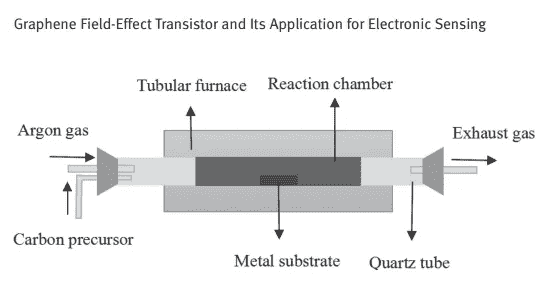

[化学气相沉积装置示意图。](https://scihubtw.tw/10.1002/smll.201400463)

GFET 传感器通常制造在具有金属触点的**硅片/SiO2 衬底**上，以利用集成电路行业的低成本、高可靠性**光刻**、**沉积**和**集成工艺**。石墨烯薄膜由大气压形成，通过 [**化学气相沉积**](https://www.graphenea.com/pages/cvd-graphene) **(CVD)** 沉积在晶片上。

**化学气相沉积的主要步骤有:**

1.  碳源在高温下分解。需要小心使用铜、镍或铁等催化剂，以将所需的有效温度从 2500°C 以上降至 1000°C。必须小心谨慎，确保催化剂不会在石墨烯中产生杂质。
2.  在此之后，碳原子被放置在沉积基底上，在此将形成连续的单层六方晶格，石墨烯(全部在五分钟内，取决于气体流量比和所需层的尺寸)。

然后，石墨烯层从沉积基底转移并覆盖在通常由**硅**制成的晶片上。接下来，金属电极被光刻沉积在石墨烯**上**，这进一步用于将石墨烯通道改变成期望的形状和尺寸。

# GFETs 在医疗保健中的应用

## GFET 核酸传感器

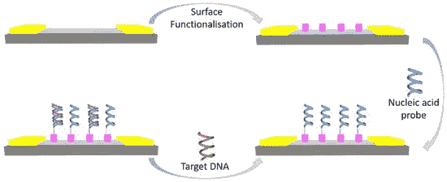

[示意图](https://www.mdpi.com/2075-4418/7/3/45/htm)表示开发用于核酸检测的 G-FET 的工艺流程。金色—接触垫，深灰色—二氧化硅，浅灰色—石墨烯，紫色—表面功能化。

**核酸**如 **DNA** 、 **RNA** 、 **miRNA** 在许多疾病中起主要作用，这意味着核酸异常/表达的快速和高灵敏度检测方法对于**疾病诊断**极其重要。当核酸与石墨烯通道表面非常接近时，它们会通过**掺杂**石墨烯而显著改变石墨烯的电子属性。这导致石墨烯性质的直接变化，以允许传感器检测这些核酸异常或表达何时存在。

## DNA 传感器

DNA 包含一个人的全部遗传密码，因此能够评估一个人的遗传组成不仅有助于许多疾病的诊断，而且还能揭示一个人的遗传疾病和癌症的易感性。已经开发了许多 GFET DNA 生物传感器，使用不同的传感方法，例如背栅 GFET 和液栅 GFET。

[gfet 已经被证明可以检测到的](https://www.mdpi.com/2075-4418/7/3/45/htm)基因序列中最常见的突变之一是**单核苷酸多态性** (SNP)，也称为 DNA 序列中的单核苷酸突变。单核苷酸多态性与癌症和遗传疾病的发展有关。这种突变会对个体的健康产生巨大的影响。这种测试将大大有助于疾病诊断、基因筛查、分子诊断、药物基因组学、药物发现，甚至通过实现早期治疗预防疾病。

## 免疫传感器

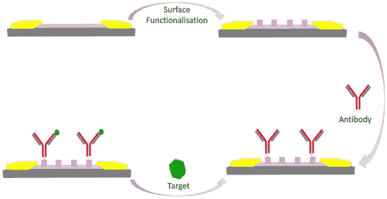

[示意图](https://www.mdpi.com/2075-4418/7/3/45/htm)表示开发基于免疫的 GFET 的工艺流程。金色—接触垫，深灰色—二氧化硅，浅灰色—石墨烯，紫色—表面功能化。

**免疫分析**是生物分子识别测试，通过**抗体-抗原相互作用**分析**生物识别**。免疫传感器的工作原理是将抗体固定在 GFET 传感器的通道表面。传感器检测**目标分析物**何时与抗体的抗原结合片段结合，如上图所示。[某些 GFET 免疫传感器](https://www.mdpi.com/2075-4418/7/3/45/htm)甚至能够在复杂的全血样品基质中区分 **BNP** (脑钠肽与抗 BNP 的结合)和其他**蛋白质**。

## 监测葡萄糖水平

最近开发了某些 GFET 传感器，能够无创测量葡萄糖水平**。**随着 GFET 传感器的精度和效率不断提高，以及实际上无止境的应用，这些发展是革命性的。

[本文](https://www.sciencedirect.com/science/article/pii/S2352847819302266#:~:text=Diabetes%20is%20a%20chronic%20metabolic%20disease%20that%20has,glucose%20using%20pyrene-1-boronic%20acid%20%28PBA%29%20as%20the%20receptor)介绍了一种灵活且可重复使用的 GFET 纳米传感器，它使用**芘-1-硼酸** (PBA)作为受体来检测葡萄糖。简单而准确地监测一个人的血糖水平对于有效治疗糖尿病是必不可少的，糖尿病是一种慢性代谢疾病，会影响血糖水平，并影响世界上数百万人。

[本文](https://www.researchgate.net/publication/295246901_A_Graphene-Based_Affinity_Nanosensor_for_Detection_of_Low-Charge_and_Low-Molecular-Weight_Molecules)提出了一种 GFET 纳米传感器，用于以葡萄糖为代表的低电荷、低分子量分子的 **affinity-based 检测**。该传感器能够在 2 μm 到 25 mM 的相关范围内测量**葡萄糖浓度**，该论文指出该 GFET 传感器有可能用于**无创葡萄糖监测**。

# GFETs 面临的挑战

## 缺乏带隙

虽然 GFET 传感器是一个**快速**和**高效**晶体管，但它没有带隙。传感器的无间隙结构意味着**价带**和**导带**都在**零伏**相遇，从而使石墨烯表现得像金属一样。在像硅这样的典型半导体材料中，两个带被一个间隙分开，在正常情况下表现得像绝缘体。

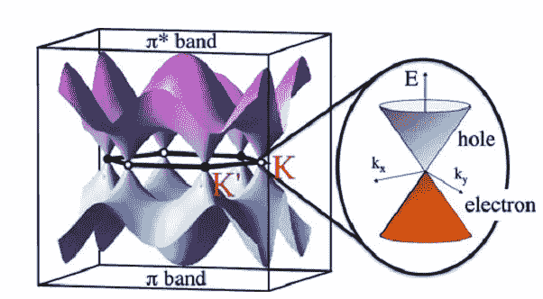

[*石墨烯的 E-k 图。*](https://www.graphenea.com/blogs/graphene-news/6969324-a-bandgap-semiconductor-nanostructure-made-entirely-from-graphene) *放大部分显示狄拉克点的零带隙。*

电子通常需要额外的能量从价带跳到导带。fet 有一个**偏置电压**，使电流能够流过能带。当没有偏置时，它充当绝缘体。GFET 传感器中的 l **ack 带隙**使得晶体管很难关闭，因为它不能像绝缘体一样工作。因为它不能被完全切断，所以存在大约 5 开/关电流比(对于逻辑操作来说相当低)。这意味着在**数字电路**中使用 GFET 传感器对我们来说是一个挑战。然而，对于**模拟电路**，这不是问题，因此 GFETs 适用于混合信号电路、放大器和不同的模拟应用。

## 可量测性

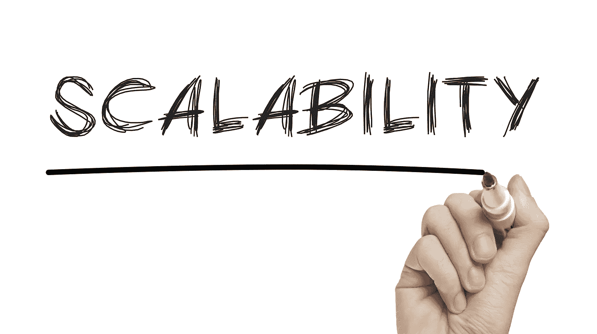

大规模生产没有缺陷或杂质的石墨烯非常困难(图片由马克·InvoiceBerry.com 提供)

大规模生产没有缺陷或杂质的石墨烯是制造 GFET 传感器的主要困难之一。然而，正在采取措施实现[更高质量的 CVD 石墨烯生长和转移](https://www.sciencedirect.com/science/article/abs/pii/S0008622315002134)。这些步骤将有助于防止石墨烯被任何金属污染物、裂缝、孔洞、褶皱、残留物等破坏。尽管**可扩展性问题**可能仍然是一个问题，但将 GFET 传感器的生产从实验室转移到工业的工作仍在继续。

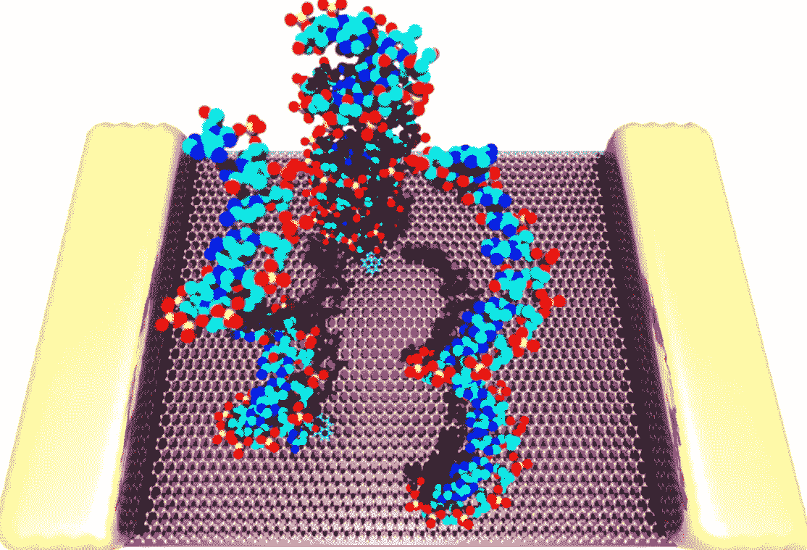

大规模生产无标记 GFET 生物传感器- [宾夕法尼亚大学物理与天文学系](https://pubs.acs.org/doi/full/10.1021/acsnano.6b04110)

欧盟石墨烯旗舰产品是在该领域开展研究的倡议之一，旨在 2025 年至 2030 年开发**石墨烯消费产品**。宾夕法尼亚大学物理和天文学系的研究人员也正在发现一种方法，通过化学气相沉积制造工艺大规模生产无标签 GFET DNA 生物传感器，他们发现这种方法的产量超过 90%。

## 模拟电路中的饱和

阻碍 GFET 传感器广泛应用的另一个主要挑战是电流饱和不足。这防止晶体管在 [RF 应用](https://www.analog.com/en/applications/technology/rf-leadership/rf-applications.html)中达到**最大电压增益**和**振荡频率**。

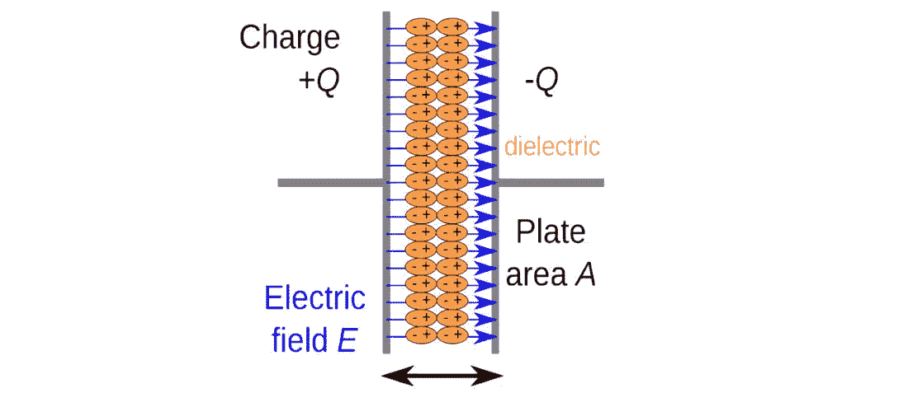

[电介质材料](https://www.doeeet.com/content/eee-components/passives/what-is-a-dielectric-constant-of-plastic-materials/)

制造商正在学习通过优化绝缘 GFET 传感器顶部栅极的**电介质材料**来克服这一挑战。良好的电介质栅极材料通常可以提供对石墨烯沟道中的**载流子**的更好控制，以提高整体器件的性能。

# GFETs 的未来

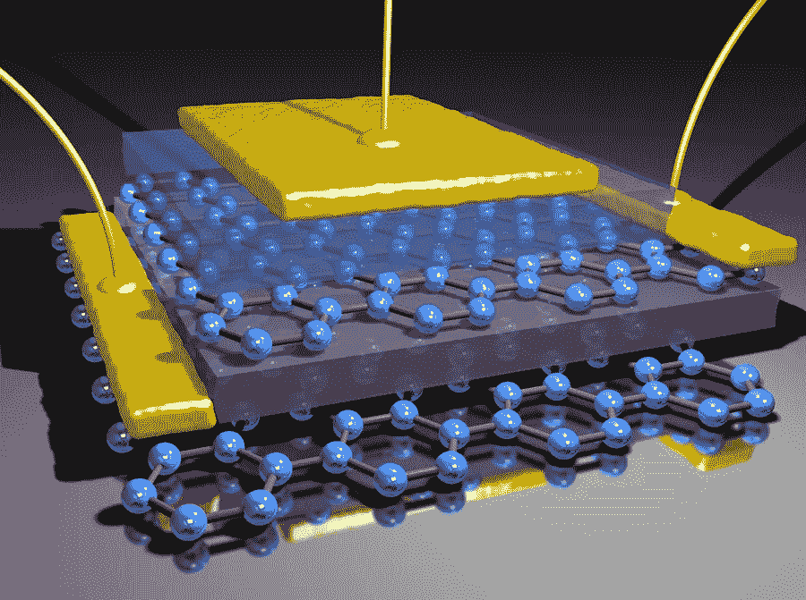

[*基于垂直石墨烯异质结构的隧道晶体管(署名:L. Britnel 等人/Science)*](https://www.kurzweilai.net/multi-layer-3d-graphene-transistor-breakthrough-may-replace-silicon)

石墨烯优异的电子性能继续为传感应用和纳米传感器的进步带来巨大的希望。GFET 传感器可以实现对生物和化学应用的**快速**、**灵敏**、**特异、低成本**和**全电子**检测和分析。由于 GFETs 也可以**复用**，所以它们有可能**在*一个微小的芯片*上快速测试数千个** **高灵敏度的目标**。可能性是无限的，因为 GFET 传感器有可能颠覆医疗保健、药物研发、化学检测市场以及世界上更多的行业。

# TL；速度三角形定位法(dead reckoning)

*   **石墨烯**是单层碳原子，它们都位于一个平面上，排列成紧密堆积的 **2D 六角晶格**结构。石墨烯的性质包括光吸收、极轻的重量、高导电性、高导热性和优异的化学性质。
*   **GFET** 传感器是一种被称为**生物分析传感器**的[生物传感器](https://www.electronicshub.org/types-of-biosensors/) 。生物传感器是检测生物过程变化并将其转换成电信号的分析装置。
*   石墨烯场效应晶体管( **GFET** )由两个电极之间的石墨烯沟道以及用于调制沟道的电子响应的栅极触点组成。
*   GFET 传感器的三种不同栅极配置:**背栅极、顶栅极和双栅极。**背门是最常见的配置。
*   GFETs 优于**大块半导体器件**的优势包括前所未有的灵敏度、增强的性能和效率、更少的分子缺陷以及极高的表面体积比。
*   GFET 传感器通常使用集成电路工业的**光刻**、**沉积**和**集成工艺**在具有金属触点的**硅片/二氧化硅衬底**上制造。石墨烯薄膜由大气压形成，通过 [**化学气相沉积**](https://www.graphenea.com/pages/cvd-graphene) **沉积在晶圆上。**
*   GFET 传感器在医疗保健和**生物医学产业**中有许多令人难以置信的**应用**，例如用作核酸传感器、DNA 传感器、miRNA 传感器和免疫传感器。
*   GFET 传感器的一些**挑战**包括模拟电路中缺乏带隙、可扩展性和饱和。