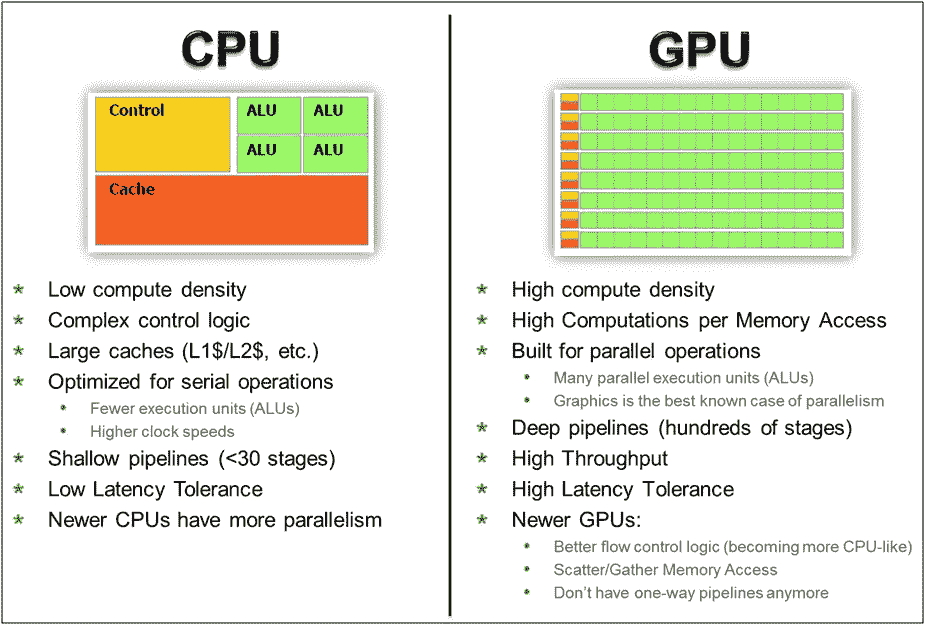
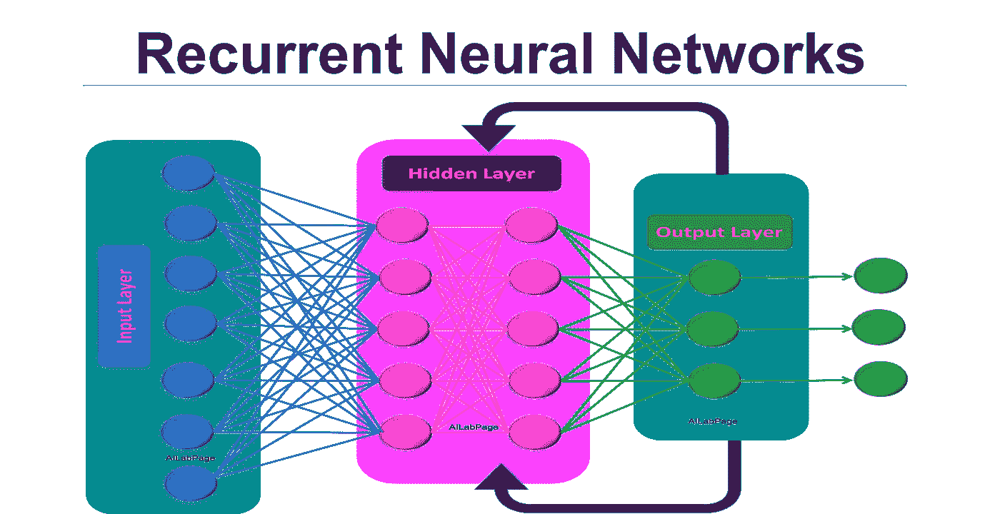

# 除了游戏之外，图形处理单元(GPU)还可以用于深度学习

> 原文：<https://medium.com/nerd-for-tech/graphical-processing-units-gpus-can-be-used-for-deep-learning-apart-from-just-gaming-714dae18555b?source=collection_archive---------10----------------------->

当我们看到图形处理单元时，我们认为它们是可以用来增强游戏性能并确保它们在计算机上运行时为我们提供良好图像的设备。需要考虑的一点是，这些 GPU 也可以用于深度学习和机器学习。事实上，它们可能分别比传统的 CPU 快 100 倍。

# **为什么要用 GPU 做深度学习？**

我们经常在网上看到有人会推荐深度学习的图形处理单元。然而，深度学习也可以在 CPU 的帮助下完成。但是使用中央处理器(CPU)时的计算速度通常受限于每秒的计算次数。因此，我们将使用图形处理器，使计算速度大幅提高。

GTX Geforce 图形处理器

# **CPU 和 GPU 有什么区别？**

我们看到一个 CPU 分别包含 ALU(算术逻辑单元)、控制和缓存。相反，GPU 是由大量的小核组成的。如果我们的预期任务是串行执行任务，那么 CPU 将是一个不错的选择。如果我们的目的是执行高密度计算，GPU 是最好的选择。除此之外，GPU 还具有高吞吐量和高延迟容忍度。此外，与 CPU 相比，GPU 中的管道非常深。图形处理单元也在每次存储器访问时执行更高的计算。这些分别是 CPU 和 GPU 的主要区别。现在，我们必须看到与 CPU 相比，我们将更多地使用 GPU 进行深度学习的不同方式。

CPU 和 GPU 的区别

# **GPU 是如何用于深度学习的？**

有几个库我们可以用于机器学习应用。NVIDIA 开发的 CUDA 可用于深度学习应用。我们看到，在过去几年中，深度学习的应用数量急剧增加。我们必须利用深度学习的技术，并使用它来执行各种机器学习和深度学习操作。

# **深度学习是如何工作的？**

我们看到深度神经网络可以有效地执行各种操作。深度神经网络分别有许多潜在的应用。我们将有不同的节点进行预测，这些预测将被传递到相邻的节点，直到到达输出节点。我们还看到，我们对深度神经网络的训练越多，它容易过度拟合的机会就越大。因此，我们必须使用正确的工具和技术，以便在分别训练深度神经网络时没有问题。

下面我们看到一个简单的有两个隐藏层的深度神经网络的图像。我们看到有一个包含要素的输入图层。我们将为深度学习模型提供功能，并分别在输出层获得输出。对于每一个隐藏层，我们将有权重和偏差，它们将被乘以并线性相加，然后分别传递到网络深处。最后，输出层将决定输出的类别，并根据输入层权重和先前节点的输出进行预测。

典型的深度神经网络

深度神经网络可能包含许多阶段，我们将使用深度神经网络的不同阶段。为了建立这个概念，还有其他类型的神经网络，称为回旋神经网络(CNN)和递归神经网络(RNNs)。

# **卷积神经网络**

在这个网络中，我们看到有一组盒子形式的层，可以在 3D 空间中可视化，如下图所示。

当我们训练深度学习模型时，我们会随机给出不同的权重和偏差，然后，我们会训练深度学习模型直到最后一层，以便给我们正确的预测。考虑人类的情况，他/她在分别理解物体之前必须使用不同的感觉，例如视觉和听觉。类似地，深度神经网络将在分别得出结论之前考虑不同的节点及其输出。因此，我们将使用机器学习模型进行预测，而复杂的神经网络模型将能够分别在测试集上表现良好。

我们可以使用常规的深度神经网络分别进行预测。但是，该模型在使用常规深度神经网络的测试集上表现不佳的可能性更高。因此，我们将使用卷积神经网络(CNN)来预测我们分别考虑的图像。

# **递归神经网络(RNN)**

还有其他类型的神经网络，分别称为递归神经网络(RNNs)。在进行预测之前需要记忆序列的情况下，我们将使用递归神经网络。使用递归神经网络的一个例子是在语音识别中。

当我们考虑语音识别时，我们看到递归神经网络会考虑前一个单词，并根据记忆进行预测。因此，在递归神经网络中，我们会考虑记忆元素，并分别进行预测。

递归神经网络

这些是一些最常用于不同应用的神经网络。我们看到在所有这些网络中，我们发现它们分别用权重和偏差进行计算。我们将分别采用权重和偏差并执行计算，并了解机器学习和深度学习模型在现实生活中的表现。

在所有这些步骤中，有些计算非常容易执行，因为它们只涉及每个节点的乘法和加法。因此，不需要为模型提供高计算设备，因为它们不需要对每个节点进行大量计算。因此，我们需要执行并行化，以确保速度大幅提高。

现在让我们来讨论实际问题。为什么我们需要 GPU 而不是 CPU 来提高计算能力？我们看到深度学习涉及并行执行计算，而不是串行。因此，每个计算单元不需要来自单元的大量资源来执行。如果我们只需要连续执行高度复杂的任务，CPU 将会非常有用。相反，神经网络中的计算不需要对网络的每个节点进行大量计算。因此，GPU 的小个体单元被考虑，并且分别在该单元上执行计算。累积地，结果被考虑在内，我们分别得到模型的精度。

这就是图形处理单元(GPU)发挥作用的地方。我们将执行分析，并确保我们理解模型中存在的权重和偏差。一旦我们知道了网络，我们将给出模型，用 GPU 对其进行训练，并分别了解模型在测试集中的表现。因此，在 GPU 的帮助下，运行一个 GPU 所需的时间会增加很多。

# **结论**

我们看到神经网络如何在权重和偏差的帮助下执行计算。我们还分别看到了 CPU 和 GPU 之间的差异，以及使用它们将如何改变深度神经网络的训练性能。除此之外，深度神经网络的性能在 GPU 的帮助下显著提高。我们看到这些不同的深度学习模型是如何在 GPU 的帮助下分别使用的。希望这篇文章有所帮助。如果你觉得这篇文章有帮助，请随意评论和鼓掌。谢了。