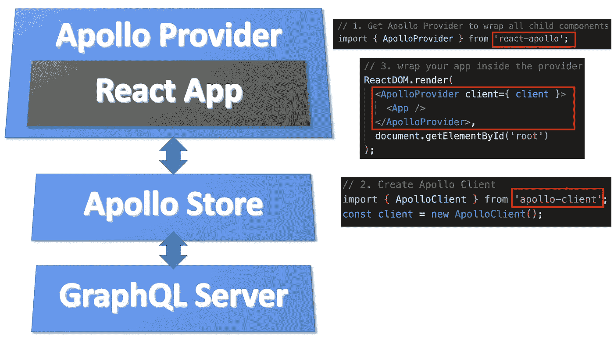
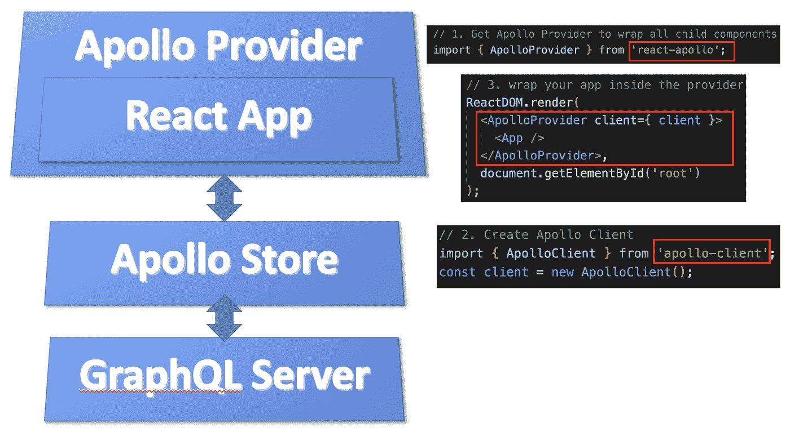
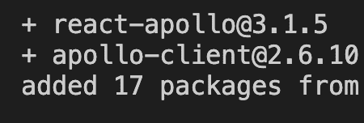
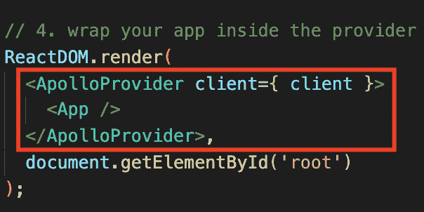
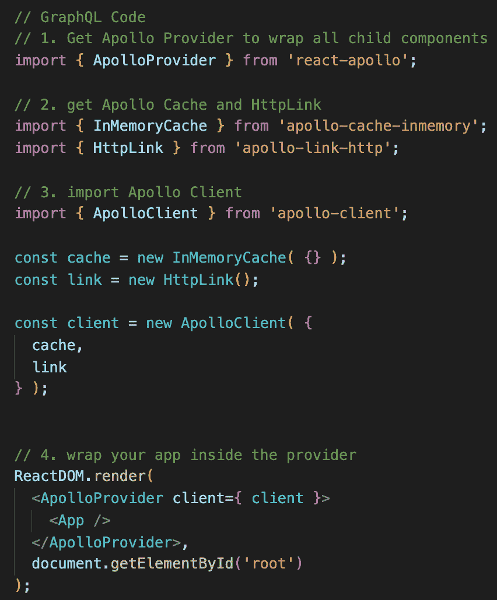
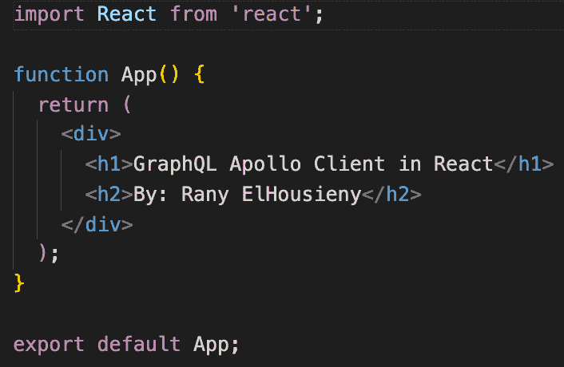
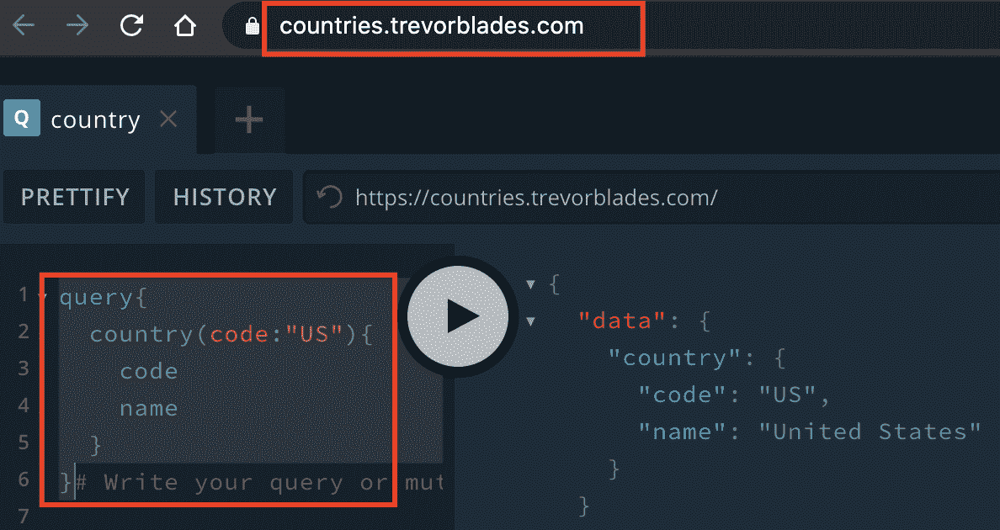
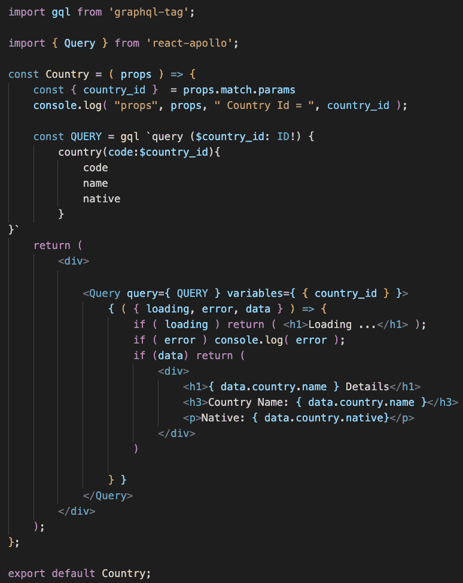
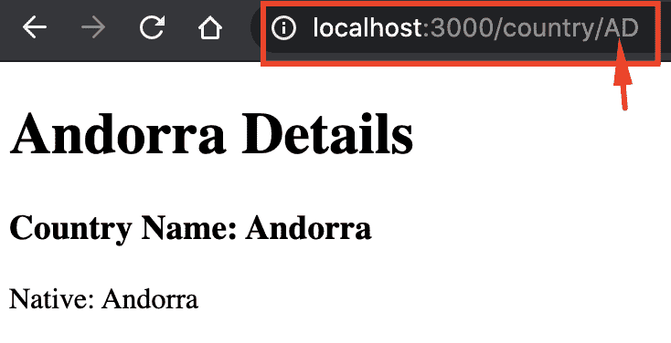

# React 中的 GraphQL 阿波罗客户端:一步一步搭建 GraphQL 客户端 React-App

> 原文：<https://medium.com/nerd-for-tech/graphql-apollo-client-in-react-build-an-app-step-by-step-2461574f16c8?source=collection_archive---------3----------------------->



在下面的文章中，我将一步一步地解释如何使用 Apollo 客户端的最新版本构建一个 GraphQL React 应用程序。这将是一些文章/步骤的汇编

完整的代码可以在

[](https://github.com/ranyelhousieny/GraphQL_ApolloClient_React/tree/master/fetch-data) [## ranyelhousieny/graph QL _ ApolloClient _ React

### https://ranyel . medium . com/graph QL-Apollo-Client-in-react-build-an-app-step-by-step-2461574 F16 c8 graph QL 阿波罗客户端…

github.com](https://github.com/ranyelhousieny/GraphQL_ApolloClient_React/tree/master/fetch-data) 

1.  第一步:[设置主项目并查询](https://www.linkedin.com/pulse/graphql-apollo-client-react-step1-setting-up-base-rany/)[https://www . LinkedIn . com/pulse/graph QL-Apollo-client-react-step 1-setting-up-base-rany/](https://www.linkedin.com/pulse/graphql-apollo-client-react-step1-setting-up-base-rany/)

[](https://www.linkedin.com/pulse/graphql-apollo-client-react-step1-setting-up-base-rany/) [## React 中的 GraphQL Apollo 客户端:步骤 1-设置基础项目

### 在这篇短文中，我将解释如何使用 Apollo 客户端与 React 中的 GraphQL API 进行交互。我将建立一个…

www.linkedin.com](https://www.linkedin.com/pulse/graphql-apollo-client-react-step1-setting-up-base-rany/) 

[2**。步骤 2 —使用来自 react-apollo**](https://www.linkedin.com/pulse/graphql-apollo-client-react-step-2-query-present-rany/) 的查询来查询和呈现数据:[https://www . LinkedIn . com/pulse/graph QL-Apollo-client-react-step-2-Query-present-rany/](https://www.linkedin.com/pulse/graphql-apollo-client-react-step-2-query-present-rany/)

[](https://www.linkedin.com/pulse/graphql-apollo-client-react-step-2-query-present-rany/) [## React 中的 GraphQL Apollo 客户端:步骤 2——使用 react-apollo 中的查询查询并显示数据

### 上一步(https://www.linkedin。

www.linkedin.com](https://www.linkedin.com/pulse/graphql-apollo-client-react-step-2-query-present-rany/) 

3.步骤 3 —从 GraphQL 查询中打印列表:[https://www . LinkedIn . com/pulse/graph QL-Apollo-client-react-step-3-Query-present-rany/](https://www.linkedin.com/pulse/graphql-apollo-client-react-step-3-query-present-rany/?published=t)

[](https://www.linkedin.com/pulse/graphql-apollo-client-react-step-3-query-present-rany/) [## React 中的 GraphQL Apollo 客户端:步骤 3 -使用 Query…查询并显示数据中的项目列表

### 在之前的文章中，我们创建了一个 react 应用程序，并从 GraphQL 中获取数据。我们只印了一个国家。

www.linkedin.com](https://www.linkedin.com/pulse/graphql-apollo-client-react-step-3-query-present-rany/) 

[4。第四步:React 中的 GraphQL 阿波罗客户端:第四步—传递变量](https://www.linkedin.com/pulse/graphql-apollo-client-react-step-4-passing-rany-elhousieny-phd%E1%B4%AC%E1%B4%AE%E1%B4%B0/):[https://www . LinkedIn . com/pulse/graph QL-Apollo-Client-React-Step-4-Passing-rany-elhousieny-PhD % E1 % B4 % AC % E1 % B4 % AE % E1 % B4 % B0/](https://www.linkedin.com/pulse/graphql-apollo-client-react-step-4-passing-rany-elhousieny-phd%E1%B4%AC%E1%B4%AE%E1%B4%B0/)

[](https://www.linkedin.com/pulse/graphql-apollo-client-react-step-4-passing-rany-elhousieny-phd%E1%B4%AC%E1%B4%AE%E1%B4%B0/) [## React 中的 GraphQL Apollo 客户端:步骤 4 -传递变量

### 这个很有意思。我们将传递 country_id，然后使用查询 GraphQL 来查找拥有这个国家的…

www.linkedin.com](https://www.linkedin.com/pulse/graphql-apollo-client-react-step-4-passing-rany-elhousieny-phd%E1%B4%AC%E1%B4%AE%E1%B4%B0/) 

==================================

# 步骤 1-设置基础项目

在这篇短文中，我将解释如何使用 Apollo 客户端与 React 中的 GraphQL API 进行交互。我会搭建一个非常简单的 app(最终代码可以在 [找到](https://github.com/ranyelhousieny/GraphQL_ApolloClient_React/tree/master/fetch-data)[)https://github . com/ranyelhousieny/graph QL _ Apollo client _ React/tree/master/fetch-data](https://github.com/ranyelhousieny/GraphQL_ApolloClient_React/tree/master/fetch-data)。

由于这更侧重于前端，所以我将使用一个公共的 GraphQL API 来获取数据(https://countries . Trevor blades . com/)。我不会解释 GraphQL 服务器端、GraphQL 基础知识或 React 基础知识。我假设您了解 GraphQL 和 React 基础知识，并且知道如何使用 create-react-app 创建应用程序。本文将展示如何使用 Apollo 客户端从 GraphQL API 获取数据。



在开始编写代码之前，让我们先了解 React 如何与 GraphQL 和 Apollo 交互。阿波罗客户端，我们可以从阿波罗-客户端不知道反应。Apollo 客户端的工作是与一个 GraphQL 服务器进行交互，并将数据存储在 Apollo Store 中(类似于 Redux store:)。然而，我们将 react-apollo 客户端与 React-Apollo 的 ApolloProvider 链接起来。ApolloProvider 将包装我们的 React 应用程序，并允许所有子应用程序与商店进行交互。如果你以前用过 Redux，你会觉得这很熟悉。

# 1.使用 npx create-react-app <app name="">创建一个 react 项目</app>


或者您可以克隆我的项目并跟随

git clone[https://github . com/ranyelhousieny/graph QL _ Apollo client _ react . git](https://github.com/ranyelhousieny/GraphQL_ApolloClient_React.git)


# 2.在 src/index.js 上导入 Apollo React 提供程序


# 3.将 Apollo 客户端导入 src/index.js


# 4.导入并初始化 InMemoryCache 和 HttpLink


# 4.创建基本客户端

从 Apollo 2.0 开始，您必须使用缓存和链接初始化客户端，如下所示:


# 5.安装依赖项

npm 安装阿波罗-客户端反应-阿波罗阿波罗-缓存-内存阿波罗-链接-http-保存



# 6.将 React 应用程序包装在 Apollo 提供程序中



# 下面是迄今为止的 [index.js](https://github.com/ranyelhousieny/GraphQL_ApolloClient_React/blob/master/fetch-data/src/index.js) :

[https://github . com/ranyelhousieny/graph QL _ Apollo client _ React/blob/master/fetch-data/src/index . js](https://github.com/ranyelhousieny/GraphQL_ApolloClient_React/blob/master/fetch-data/src/index.js)



您可以使用 npm start 启动您的 web 应用程序，在屏幕上看到您正在构建的内容。我把 App.js 修改如下(目前可选)[https://github . com/ranyelhousieny/graph QL _ Apollo client _ React/blob/master/fetch-data/src/app . js](https://github.com/ranyelhousieny/GraphQL_ApolloClient_React/blob/master/fetch-data/src/App.js)

你可以通过进入 [https://localhost:3000](https://localhost:3000) 在浏览器上看到输出



# 添加 GraphQL 服务器的 URL

现在，让我们将 GraphQL 服务器的 URL 添加到[package . JSON](https://github.com/ranyelhousieny/GraphQL_ApolloClient_React/blob/master/fetch-data/package.json)[https://github . com/ranyelhousieny/graph QL _ Apollo client _ React/blob/master/fetch-data/package . JSON](https://github.com/ranyelhousieny/GraphQL_ApolloClient_React/blob/master/fetch-data/package.json)

" proxy ":" https://countries . Trevor blades . com/"


# 从[https://countries.trevorblades.com](https://countries.trevorblades.com)处获取查询

现在，让我们去[https://countries.trevorblades.com](https://countries.trevorblades.com)并尝试一个查询把它放入代码中



在左侧尝试上面显示的以下查询，然后单击箭头在右侧查看结果

```
query{ country(code:"US"){ code name }}
```

# 向代码中添加查询

现在，让我们将查询添加到代码中，并将结果打印到控制台

1.  导入 gql

```
import gql from 'graphql-tag';
```

2.将您复制的查询添加到客户端，如下所示(请注意中间的符号`表示您编写查询的位置)


您可以在控制台上从浏览器验证结果，如下所示(我假设您仍然有 npm 开始运行)


# 步骤 2——使用 react-apollo 中的查询来查询和显示数据

在前面的[步骤](https://www.linkedin.com/pulse/graphql-apollo-client-react-step1-setting-up-base-rany/?published=t&trackingId=GN85mLfQ0CHINZ1gkqRmyg%3D%3D)(https://www . LinkedIn . com/pulse/graphql-Apollo-client-react-step 1-setting-up-base-rany/)中，我们创建了基础项目并发出 graph QL 查询来获取一个国家。为了简单起见，我在 index.js 中实现了所有内容，并将结果打印到控制台。在本文中，我们将在浏览器上呈现查询结果。

# 1.将查询添加到 App.js 中的全局变量


# 2.将结果打印到屏幕上

我们将利用来自 react-apollo 的查询

从“react-apollo”导入{ Query }；

完整代码可以在[这里找到](https://github.com/ranyelhousieny/GraphQL_ApolloClient_React/blob/master/fetch-data/src/App.js)[https://github . com/ranyelhousieny/graph QL _ Apollo client _ React/blob/master/fetch-data/src/app . js](https://github.com/ranyelhousieny/GraphQL_ApolloClient_React/blob/master/fetch-data/src/App.js)


# 步骤 3 —使用来自 react-apollo 和 map 的查询，查询并显示数据中的项目列表

在之前的文章中，我们创建了一个 react 应用程序，并从 GraphQL 中获取数据。我们只印了一个国家。

1.  [https://www . LinkedIn . com/pulse/graph QL-Apollo-client-react-step 1-setting-up-base-rany/](https://www.linkedin.com/pulse/graphql-apollo-client-react-step1-setting-up-base-rany/)
2.  [https://www . LinkedIn . com/pulse/graph QL-Apollo-client-react-step-2-query-present-rany/](https://www.linkedin.com/pulse/graphql-apollo-client-react-step-2-query-present-rany/)

让我们打印一个带有“详细”链接的国家列表(我还没有使用任何 css，所以它很简单)。代码位于:[https://github . com/ranyelhousieny/graph QL _ Apollo client _ React/blob/master/fetch-data/src/components/countries list . jsx](https://github.com/ranyelhousieny/GraphQL_ApolloClient_React/blob/master/fetch-data/src/components/CountriesList.jsx)

最终页面将如下所示:


# 1.该查询是从网站直接复制的


# 2.国家列表组件

让我们在 components 文件夹下为 countries 列表创建一个新组件，并像前面一样添加查询


唯一的新东西是我们将接收、排列和使用 map 来打印每个项目


我们将从 App.js 调用这个组件


# 步骤 4 —传递变量

# 首先，让我们添加一个路由切换到一个新的页面的细节

```
index.jsimport { BrowserRouter, Route } from 'react-router-dom';....ReactDOM.render(
  <ApolloProvider client={ client }>
    <BrowserRouter>
      <Route exact path='/' component={ App } />
      <Route exact path='/country/:country_id' component={ Country} />
    </BrowserRouter>
  </ApolloProvider>,
  document.getElementById('root')
```

然后在列表中的每个国家/地区下添加路线(CountriesList.jsx)

```
<Link to={ `/country/${country.code}` } >Details</Link>
```

创建一个新的功能组件 Country.jsx 并导入 gql，查询同上

```
import React from 'react'; import gql from 'graphql-tag'; import { Query } from 'react-apollo';
```

我们将国家代码作为参数接收。让我们把它打印到控制台上，看看它是什么样子

```
const Country = ( props ) => {
    const { country_id }  = props.match.params
    console.log( "props", props, " Country Id = ", country_id );
```


正如您在上面看到的，它是一个具有另一个名为“match”的对象的对象。内部匹配另一个名为“params”的对象，它具有我们要寻找的变量“country_id”

让我们按如下方式提取 country_id:

```
const { country_id }  = props.match.params
```

现在我们需要将它添加到查询中。像往常一样，让我们先在服务器上试试，然后从那里复制(https://countries.trevorblades.com/)


您会注意到，我们在查询旁边添加了一个强制变量“$id”。GraphQL 查询中的所有变量都以$开头。它的类型是 ID 和！旁边表示它不能为空

```
query($id: ID!){
```

此外，我们需要提供代码来标识哪个国家，我们将从变量$id 中获取它

```
country(code:$id){
```

注意底部的变量，我们在那里传递这个变量的值

```
{
  "id": "US"
}
```

复制查询并将其添加到代码中

```
const QUERY = gql `query ($country_id: ID!) {
        country(code:$country_id){
            code
            name
            native
        }}`
```

现在，您需要在查询中将它作为变量传递

```
<Query query={ QUERY } variables={ { country_id } }>
```


下面是完整的文件[https://github . com/ranyelhousieny/graph QL _ Apollo client _ React/blob/master/fetch-data/src/components/country . jsx](https://github.com/ranyelhousieny/GraphQL_ApolloClient_React/blob/master/fetch-data/src/components/Country.jsx)



这是浏览器上的输出



作者:兰尼·埃尔豪斯尼

[](https://www.linkedin.com/in/ranyelhousieny/) [## 兰尼·埃尔豪斯尼，PhDᴬᴮᴰ -软件工程高级经理- Zulily | LinkedIn

### 𝙈𝙞𝙘𝙧𝙤𝙨𝙚𝙧𝙫𝙞𝙘𝙚𝙨解决方案架构师𝘼𝙒𝙎𝙎𝙤𝙡𝙪𝙩𝙞𝙤𝙣𝙨𝘼𝙧𝙘𝙝𝙞𝙩𝙚𝙘𝙩𝘾𝙚𝙧𝙩𝙞𝙛𝙞𝙚𝙙…

www.linkedin.com](https://www.linkedin.com/in/ranyelhousieny/) [](https://rany.elhousieny.com) [## 兰尼·埃尔豪斯尼简历

### 使用 MongoDB，Elastic Search，AWS，React，CSS3，html 5……

rany.elhousieny.com](https://rany.elhousieny.com)