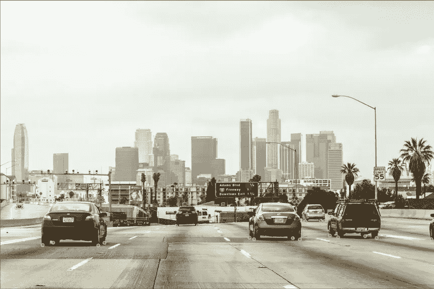

# 车轮的地面点注释

> 原文：<https://medium.com/nerd-for-tech/ground-point-annotation-of-wheels-6ce77aee3b58?source=collection_archive---------4----------------------->

## **障碍物类型**

1.乘用车:汽车、SUV、跑车、皮卡。

2.三轮脚踏车:三轮车、快递卡车和老人用三轮代步车。

3.小型货车:小型货车、MPV、20 人以下的都标为小型货车。

4.货车:后面有封闭装载部分的，后面有集装箱的不属于货车。

5.公交车:公交车(类似于公共汽车)，大型公交车。那些能容纳 20-30 人的应该被称为公共汽车。

6.带料斗的卡车和车辆；大型三轮车也被贴上货车的标签(大小和功能都和货车差不多)。

7.拖车:拖动不能行驶的车辆。带警灯的道路救援车。卡车上拉的挖掘机不是拖车。

8.分体卡车:卡车的前部可以与棚车分开。注意，那些没有车头的卡车仍然需要贴上拖车的标签。

## **地面点的**障碍物

1.对于地面上的车辆，贴标机需要标记它们的接触点。

2.需要用圆点标注前轮胎和后轮胎的接地点。

3.对于接地点，贴标签机要贴左前、左后、右前、右后(以车头为前)的标签。

4.地面点和对应障碍物的方框需要有关系。需要知道地面点属于哪个障碍物。

## **可见和不可见属性**

地面点(包括人体地面点)应标注可见和不可见属性。

*   可见:完全没有遮挡时可见。
*   不可见:完全遮挡的情况下不可见。

对于地面点，无论是否被任何物体或自身遮挡，都需要想象地面点的位置。

## **特殊说明**

1.用圆点标记轮胎和地面相交处的接地点。接地点需要标记在轮胎外侧。

2.对于有 4 个以上前后轮胎的卡车和拖车，只需标记前后轮胎，不包括中间轮胎。

3.地面点在被截车辆图像中的实际位置应该是想象出来的。

## 结束

把你的数据标注任务外包给 [ByteBridge](https://tinyurl.com/mrxyttnn) ，你可以更便宜更快的获得高质量的 ML 训练数据集！

*   无需信用卡的免费试用:您可以快速获得样品结果，检查输出，并直接向我们的项目经理反馈。
*   100%人工验证
*   透明和标准定价:[有明确的定价](https://www.bytebridge.io/#/?module=price)(包含人工成本)

## 为什么不试一试？