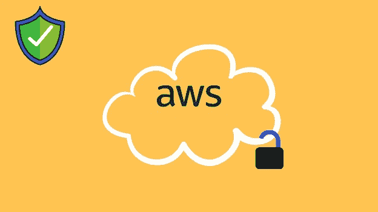
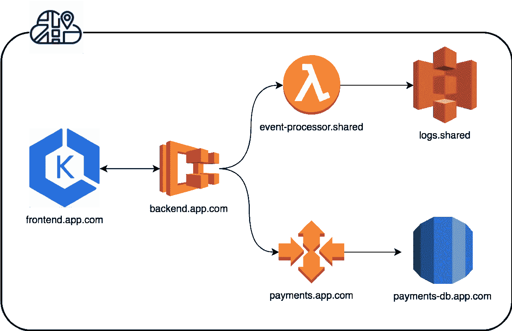
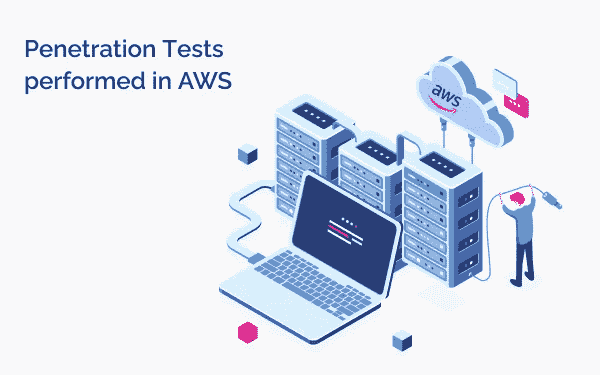

# AWS 渗透测试指南

> 原文：<https://medium.com/nerd-for-tech/guide-to-aws-penetration-testing-441b05b8183e?source=collection_archive---------5----------------------->

不可否认，云计算的受欢迎程度正在上升，其中一些因素包括可扩展性、效率、灵活性和降低的 it 成本。然而，随着受欢迎程度的上升，组织和个人都出现了一种令人担忧的网络安全趋势。

根据 [2020 年 Trustwave 全球安全报告](https://www.trustwave.com/en-us/resources/library/documents/2020-trustwave-global-security-report/)，与去年相比，2020 年对云服务的攻击数量翻了一番。云环境现在是仅次于企业和内部网络的第三大网络攻击目标。

借助先进的云计算技术，许多组织正在采用或投入云计算提供的服务。报告中提供的统计数据是一个警告，说明云安全和保护是多么重要，应该是所有使用这些服务的人的优先事项。

## 什么是 AWS

亚马逊网络服务或 AWS 是 Amazon.com 提供的云平台。AWS 由许多云计算产品和服务组成。它拥有超过 100 万的活跃用户群，在全球 190 多个国家开展业务。

其云基础设施平台为所有行业的组织提供广泛的云解决方案和服务。

其解决方案产品包括全球计算、在线存储、数据分析、数据库、不同应用程序的支持以及部署服务，帮助公司扩展业务并降低 IT 成本。

AWS 为运行在 AWS 基础设施上的应用程序和平台提供了固有的自动和手动安全措施。然而，在公司决定扩展到 AWS 之前，它必须考虑合规性和法规要求、数据处理和攻击威胁等方面，以及如何通过云平台的默认安全性和其他措施来解决这些问题。

为了应对这些挑战，该公司可以在 AWS 中对其基础设施进行漏洞评估和渗透测试，以开发一个强大而可靠的安全系统来抵御网络攻击，并帮助保护公司的数据和资产免受网络犯罪分子的侵害。

> **阅读也:** [最佳渗透测试工具](https://securetriad.io/popular-penetration-testing-tools/)

## AWS 渗透测试

AWS 渗透测试与传统渗透测试的不同之处主要在于所有权，因为 AWS 的平台归 Amazon.com 所有，因此需要遵循他们的政策和程序。

主要用于 web 应用程序或[网络笔测试](https://securetriad.io/network-penetration-test-2/)的传统道德黑客方法不允许用于测试 AWS 基础设施，因为它违反了 AWS 的可接受政策。AWS 基础设施 pen 测试涉及符合 AWS 政策的具体程序，具体如下:

AWS 渗透测试与传统渗透测试的不同之处主要在于所有权，因为 AWS 的平台归 Amazon.com 所有，因此需要遵循他们的政策和程序。

主要用于 web 应用程序或网络笔测试的传统道德黑客方法不允许用于测试 AWS 基础设施，因为它违反了 AWS 的可接受政策。AWS 基础设施 pen 测试涉及符合 AWS 政策的具体程序，具体如下:

**您的 AWS 云的外部基础设施**

图片来源:aws.amazon.com

从本质上来说，AWS 为公司提供了一个安全的云计算环境，但如果允许入站访问，它也有其弱点。通常，外部基础架构是最容易暴露的表面，是第一个攻击点。

这就是为什么外部基础设施应该包括在渗透测试的范围内，但大部分预算不应该分配给这一点，因为 AWS 已经提供了一些安全措施。

**您在自己的平台上托管/构建的应用**

它们是仅次于外部基础设施的进入系统的第二简单方式，如果开发不当，很容易受到攻击。

根据组织的风险状况和预算，应用程序渗透测试应包括在 AWS pen 测试的范围内。

**您的 AWS 云的内部基础设施**

这是第二层攻击，如果外部基础设施遭到破坏，就会暴露出来。默认的 AWS 环境不同于传统的基础设施服务，允许服务器之间更紧密的控制和有限的横向移动，这对攻击者来说是一个严峻的挑战。

然而，如果公司有一个更复杂的专用网络系统，并提供访问和 EC2 *之间的自由横向内部移动或自由数据流，pen 测试将增加价值。

如果他们只是运行一些 EC2，渗透测试不会有太大帮助，因为 EC2 配备了安全措施。

EC2 亚马逊的弹性计算云虚拟计算机，用户可以租用来运行他们的应用程序。

**AWS 配置**

AWS 配置的渗透测试是测试的最后一个组成部分，它基本上告诉你你的安全系统有多健壮。

# AWS 中执行的渗透测试

对于**用户运营的服务**，包括由用户创建和配置的云产品，组织可以全面测试其 AWS EC2，不包括影响 AWS 业务连续性的测试，如拒绝服务(DoS)攻击。

对于**供应商运营的服务**，其中云组件和产品由第三方供应商拥有和管理，测试仅限于云环境的实施和配置，而非内部基础设施。

EC2 是一种 AWS 服务，通常经过渗透测试。在 AWS EC2 实例中，允许渗透测试的特定领域包括:

应用编程接口(API)，例如 HTTP/HTTPS。

组织托管的网络和移动应用程序。

应用服务器和相关联的栈(例如 Python 之类的编程语言)做出反应。

虚拟机和操作系统。

与基础设施即服务(IaaS)模型相比，AWS 中的大多数产品都基于软件即服务(SaaS)模型，这意味着用户不拥有环境，并且由于法律和技术限制，它不能进行 pen 测试。

*这些包括:*

属于 AWS 的服务或应用程序，

属于 AWS 的物理硬件、底层基础设施或设施，

属于其他组织(如合作伙伴或供应商)的 EC2 环境，

其他供应商管理但未经其许可的安全设备，

亚马逊的小型或微型关系数据库服务(RDS)。

## 渗透试验前要采取的步骤

SaaS 组件可以通过黑盒项目或安全审计进行笔测试。
在云基础设施上执行 pen 测试需要规划和专业知识。开始笔测试前的准备步骤是:

1.  定义 AWS 环境和目标系统上渗透测试项目的范围。
2.  确定要进行的笔测试的类型(例如:黑盒、白盒)
3.  定义利益相关者——客户和渗透测试公司——的期望和风险。
4.  确定技术评估的时间表，准备正式报告，以及潜在的补救措施和后续测试。
5.  如果 pen 测试显示客户端已经受到攻击或数据遭到破坏，则制定参与协议和规则。
6.  获得相关方进行测试的书面批准，包括填写测试批准表、通知 AWS 日期、通知 AWS 测试将来自的 IP 地址范围和正在测试的范围。

清楚地定义 pen 测试的范围目标和规则将导致有效的时间管理和资源不被浪费。

## 结论:

亚马逊网络服务在其云基础设施中提供各种系统和应用的托管，这有助于扩大业务规模。它还为外部基础设施提供了一些内置的安全特性，但是内部基础设施的安全规定完全取决于使用 AWS 的公司。

充分的计划、正确定义目标和规则以及选择合适的渗透测试方法是测试成功的重要步骤。组织应该意识到他们的能力、资源和限制，以避免时间和资源的浪费。

SecureTriad 提供全面的 [AWS 渗透测试服务](https://securetriad.io/aws-penetration-testing/)。联系我们，讨论您的需求并获得报价。

**原载于此**[https://securetriad . io/essential-guide-to-AWS-penetration-testing/](https://securetriad.io/essential-guide-to-aws-penetration-testing/)2021 年 5 月 3 日**。**