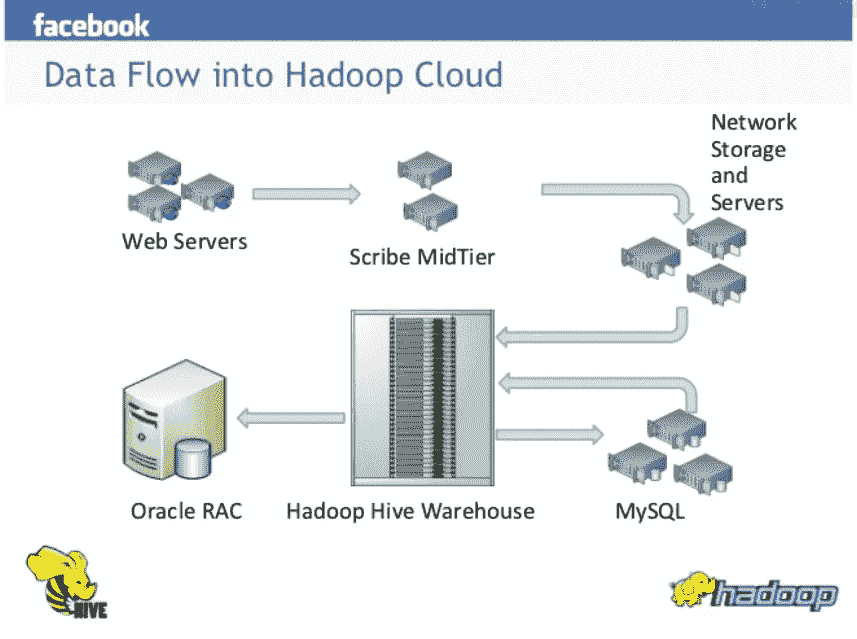

# Hadoop:跨国公司高速高效存储和处理海量数据的技术

> 原文：<https://medium.com/nerd-for-tech/hadoop-the-technology-behind-mncs-storing-and-manipulating-huge-data-with-high-speed-and-c53aefcac86b?source=collection_archive---------27----------------------->

# 什么是大数据及其问题？

让我们以 Instagram(社交媒体平台)为例。大约有 6 亿 Instagrammers，其中大约有 4 亿每天都很活跃。每天约有 9500 万张照片和视频在 Instagram 上分享，每天约有 1 亿篇帖子。这是 Instagram 每天收到的数据。如果你谈论那将会是多少数据，用数字来说，它在太字节(TB)、太字节(PB)和太字节(EB)附近。不仅如此，人类每天还会产生 2.5 艾字节的数据。那不是很大吗？

当我们上传一些数据时，我们并没有考虑到幕后发生的事情，不是吗？让我告诉你这些事情是如何运作的。

我们每天都在网上上传大量数据，当我们搜索一些东西来检索数据时，我们得到了它。这个过程发生得非常快。我们只看到这些平台的功能，但实际发生的是，当我们上传数据时，为了使其持久，它被存储在一些存储设备中。当我们搜索某样东西时，存储的数据被读取，然后我们得到我们的信息。但是，也遇到了一些问题。首先，数据是巨大的，我们需要大容量的硬盘来存储信息。从技术上来说，如果公司真的制造硬盘来存储数十亿字节的数据，存储数据和再次检索数据将需要大量时间。这就是所谓的“大数据”问题，数据过于庞大，速度非常慢。

让我们更好地理解这一点。假设我们在文本编辑器中写一些信息，这些信息被临时存储在我们的 RAM 中。当我们保存信息时，它会被复制到我们的硬盘上。但是把这些数据复制到硬盘上是一个很慢的过程，在 SSD 上复制更慢。如果我们做一个比较，将 1 GB 数据复制到 RAM 上所需的时间大约为 1 秒，而将数据从 RAM 复制到硬盘上大约需要 1 分钟。现在想想，即使我们有一个大容量的硬盘，存储数据可能需要 1 天，而检索数据可能需要另一天。但当我们打开谷歌搜索引擎或脸书搜索某些东西时，这种情况不会发生。所有的过程只需要几秒钟。

现在，有一件事值得怀疑。这些公司是如何快速完成这些流程的？

# 大数据是如何处理的？

今天，世界正面临着以 zettabytes(大约 10 GB)和 yottabytes(大约 10 ⁵ GB)产生的数据的问题。如上所述，这些面临的挑战可以通过使用一种称为**“分布式存储”的技术来克服。**

简而言之，分布式存储系统是一个概念，其中数据被分割成几个块，并且每个数据块被存储在不同的存储单元中，其中每个存储单元协调并使用数据同步机制。这些存储单元一起形成一个集群。例如，假设我们需要存储大量数据，但我们没有一个具有足够内存的存储设备。为了存储这些数据，我们将数据分成“n”个部分，并将每个数据发送到“n”个不同的存储单元(统称为一个组，称为一个集群)。由于这“n”个数据块同时并行分布，如果所有数据都必须存储在一个存储单元中，那么存储数据的过程将比我们预期的快“n”倍。现在，我们可以通过持久化和快速处理来有效管理我们的海量数据。

然而，分布式存储只是一个概念。做一个集群，实现这个概念，我们需要一些软件，比如**“Hadoop”**(一个开源的软件框架)。

为了更好地理解这一点，让我们深入了解一下关于**脸书使用 Hadoop 的一些信息。**

# Hadoop 的使用案例

在 2008 年之前，脸书的数据处理基础设施是围绕基于一些商业关系数据库管理系统的数据仓库而构建的。当时，它足以处理脸书的数据需求。但是，当数据需求开始快速增长时，随着数据从 2007 年的 15 TB 数据集扩展到 2009 年的 2 PB 数据，管理和处理数据的挑战也随之增加。因此，脸书想出了使用 Hadoop 框架来解决这个问题的主意。

脸书已经从最初的日子走过了漫长的道路，现在已经部署了多个 Hadoop 集群，最大的集群拥有大约 2500 个 CPU 核心和 1pb 的磁盘空间。他们每天将超过 250 的压缩数据(超过 2tb 的未压缩数据)加载到 Hadoop 文件系统中，并且每天针对这些数据集运行数百个作业。

你可能认为 100 对任何企业来说都是足够大的数据，但对脸书来说却不是。

脸书的 Hadoop 和 Hive 开发

Hadoop 是脸书使用的关键工具，不仅用于分析，还作为引擎来支持脸书网站的许多功能，包括消息传递。就原始 Hadoop 容量而言，脸书已经达到了上限。该公司最近宣称自己拥有可能是世界上最大的 Hadoop 集群，重达 100，但该公司表示，这还不够大。脸书的棱镜项目是该公司在 Hadoop 能力方面达到新高度的答案。

Hadoop 的问题在于它必须将数据限制在一个物理数据中心位置。虽然 Hadoop 是一个批处理系统，但它是紧密耦合的，它不能容忍 Hadoop 集群中服务器之间超过几毫秒的延迟。借助 Prism，添加了一个逻辑抽象层，因此 Hadoop 集群可以跨多个数据中心运行，有效地消除了容量限制。

因此，我们看到脸书如何首先放弃 MYSQL，采用一种称为 Hadoop 的新技术，现在通过启动其 Prism 项目来推动 Hadoop 的极限。

~Ishika Sinha

*最初发表于*[*【https://www.linkedin.com】*](https://www.linkedin.com/pulse/hadoop-technology-behind-mncs-storing-manipulating-huge-ishika-sinha)*。*