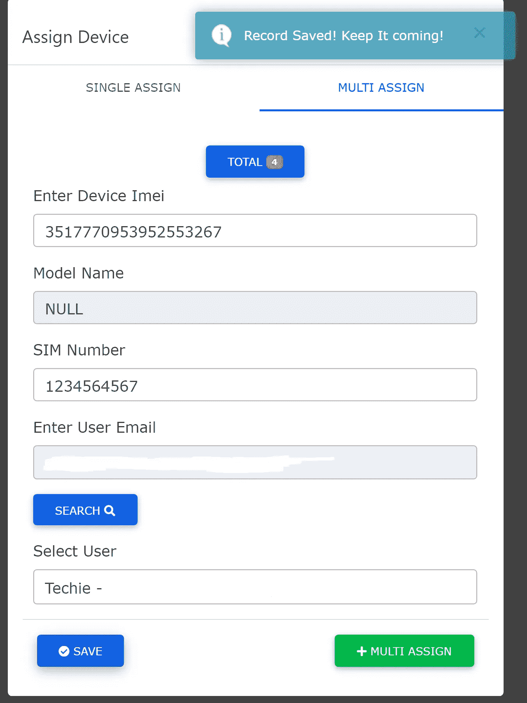

# 使用 JavaScript 和 Ajax 处理多表单上传

> 原文：<https://medium.com/nerd-for-tech/handle-multi-form-upload-using-javascript-and-ajax-3fb2dc32f141?source=collection_archive---------4----------------------->

我最近用 JavaScript 和 AJAX 建立了一个多表单上传，我将在下面和你分享这个过程。

假设你有一个允许上传公司员工档案数据的应用程序，如果你必须单独上传 20 名或更多员工的数据，这可能是一个令人生畏的过程。但是这里有一个好消息，使用数组会节省你很多时间。

我该如何开始？

# **HTML**

让我们用下面的字段创建一个简单的表单。

*   西方人名的第一个字
*   姓
*   电子邮件地址

请注意，上面的表单上有一个保存按钮。该按钮将使我们能够不断地将数据保存到我们将在下面声明的数组中。

# java 描述语言

我将从基本的 JavaScript 开始。我们必须声明数组来保存用户需要的上述每个字段的数据。

现在我们已经声明了它们的数组，我们需要创建一个函数来接受表单输入并将它们存储到数组中，注意重复的记录。放心吧！这很容易。

# 保存表单()

让我们从函数开始

请注意，我们声明了函数参数来接受 3 个参数，它们是(名字、姓氏和电子邮件)。所以我们的保存按钮现在就派上用场了。

[如果你看过我以前的帖子，你会注意到我谈到了在表单输入中使用事件监听器，但重点是(this)关键字。](https://simon-ugorji.medium.com/using-javascript-this-keyword-in-a-function-9da61cf6f248)

让我们使用一个事件侦听器来监视 save 按钮，并在单击该按钮时执行一个操作。

使用 **JQUERY** ，可以简化上面的代码

现在我们已经完成了目标的 50%。让我们把它变成 100%。

Save 按钮被指示，当它被点击时，保存对它们各自的数组可用的任何表单输入。

请注意，我们没有包括检查以确保所有字段都已填写(包含值)。

这将非常重要，因为我们不想上传不相关的数据。

我们可以编辑我们的函数来轻松检查。

我们已经更新了函数来检查表单字段，如果满足所有输入，那么继续。

但是我们还必须检查重复的记录。我们该如何着手呢？

这又很容易了。让我们使用 includes() JavaScript 方法来实现这一点。

您可以使用[嵌套租赁操作](https://simon-ugorji.medium.com/how-to-write-a-nested-tenary-operator-287f304cfe27)使上面的代码更加高级

我谈到了嵌套租赁操作，在这里，您可以很好地利用它。如果您注意到，else 和 else if()关键字不再需要，因为我们已经使用了 tenary 操作符(:)来替换它。

你可以通过重新访问帖子来了解更多信息。

# 差不多完成了

现在我们已经接近目标的 95%。让我们推它 5%好吗？

我们有存储表单输入的数组，我们如何提醒用户到目前为止他已经保存了 x 条记录？

因为我们的数组接受必须包含输入的记录，它们的长度(里面记录的总数)必须相同。这意味着，他们都是平等的。

您可以在页面上创建一个 HTML 元素

然后在你的函数中使用 **JQUERY** 或者 **NATIVE**

您也可以阻止表单提交，直到记录总数**大于 1** ，这样，他们就上传了一个多记录。

# 创建交互式、快速动态网页应用的网页开发技术

我们已经建立了我们的逻辑，现在是提交的时候了。根据你使用的语言，我想这个过程还是一样的

# 服务器端

您现在可以使用 foreach 一个接一个地处理记录了！

# 额外的

*   您可以考虑使用一个函数将数据存储到浏览器的存储区域，以防止在浏览器重新加载时丢失保存的记录
*   您还可以考虑通知用户，如果他们在尝试重新加载他们的浏览器时不上传，保存的记录将会丢失。

我们百分百成功了！

你如何在你的代码中实现这个函数？

如果你需要帮助理解这篇文章，请在下面留下你的评论。

谢谢大家！