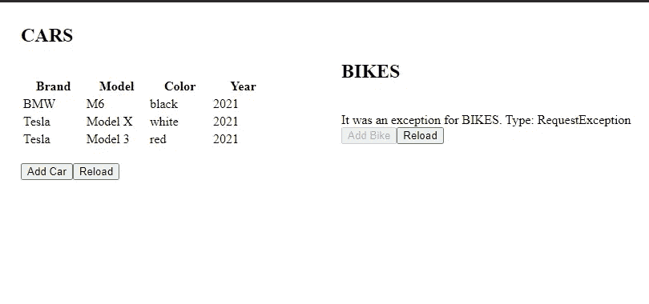

# 用 Rxjs 和 React 钩子处理异常

> 原文：<https://medium.com/nerd-for-tech/handling-exceptions-with-rxjs-and-react-hooks-52a2c1436c59?source=collection_archive---------7----------------------->

React 钩子是 React 的一个非常棒的特性，当我们决定使用定制钩子时，它们允许我们以一种最佳的方式重用我们的很多逻辑。甚至在我第一次有 React 的概念之前，我就已经学会了 Angular，在开始时，这个特性有点挑战性，因为它意味着范式的改变。

经过一些练习，我注意到一些模式可以节省我很多时间。对于包含可重用层的应用程序，我认为有一个方面非常重要:异常处理。这必须是自然的，易于其他开发人员使用，提供完整的覆盖范围，也是一种根据异常数据本身执行逻辑的方法。

在这一点上，我发现了一个缺口，它激发了这里提出的解决方案，因为我找不到一个明确的方法来处理异常。例如，当您有一些相互嵌套的自定义钩子时，如果您用最后一个异常实现一个对象的 useState，那就有点奇怪了。在多个钩子层之间传递回调似乎并没有更好。

然后我想到了 Observables，如果我可以在一个自定义的钩子中公开一个 Observables，消费者可以订阅它，并在应用程序需要时执行相应的操作。另一个非常重要的方面是，如果我有两个可能的异常源，我可以将它们合并到一个流中，并保留模式。最后，如果我需要在应用程序的不同层进行不同的操作，我可以公开一个主题而不是一个可观察对象，就这样！。

## 预热

我将把解释的重点放在 Rxjs 和 Hooks 细节上，我假设您对 React 的 Typescript 设置有点熟悉。当然这是回购，所以你可以试验一下:

 [## herber 230/react-hooks-rx-异常

### 此时您不能执行该操作。您已使用另一个标签页或窗口登录。您已在另一个选项卡中注销，或者…

github.com](https://github.com/Herber230/react-hooks-rx-exceptions) 

另外，你可以查看 Rxjs 网站和 T2 关于芬兰语符号的帖子。

## 给我看看代码！

这是一个我们如何在钩子内部使用可观察对象的基本例子:

前面的代码片段是如何处理观察者和订阅的基本示例，它让我们了解了如何在两个 API 之间创建协同作用。

好吧，假设我们有一个可以处理的异常流，当然，如果我们可以将该流用作多播，我的意思是多个独立订户，那就太好了:

嗯，我也有同样的想法。不同之处在于，我们使用主体而不是可观察对象，并且我们使用异常类型来定义我们的异常。我认为这是有用的。

为了创建异常流，让我们看看如何使用一个用户请求挂钩:

这里我们有一个自定义钩子，允许我们执行异步请求。单个参数是 performer 函数，它返回一个处理结果的承诺，并通过类似于前面钩子的 useCallback 来使用。您可以注意到，这个 promise 的 catch 函数使用了上面创建的主题。最后，也是最重要的一点，我们需要在每个钩子实例中实例化一次 Subject，所以我们使用了一个 useRef 钩子。

以及如何使用 useRequest 钩子？…好吧，让我们再做一个可重复使用的层。useEntity 挂钩:

这个新的层使用了两个 useRequest 钩子来实现我们通常对实体 crud 需要的两个可能的操作。正如你所注意到的，我们重命名了反编译的对象，我们有两个异常流，每个处理相应的可能破坏我们代码的场景。另外，您肯定会注意到新的奇怪的异常，useMergedException$ hook:

这对我来说是最神奇的。随着我们添加越来越多的可重用代码层，我们将会发现更多的异常流，将它们分开真的很糟糕。我们能做的最好的事情就是将它们全部合并到一个流中，然后作为我们自定义钩子的结果返回，并保留一个模式。

因此，从 rxjs 导入的合并操作符是指定的，但是这创建了一个可观察的，并且作为我们试图创建的模式，最终的流必须是主题。这就是为什么我们创建了一个新的主题，并将其订阅到合并的结果中，以多播流。

使用 useMergedException$ hook，您可以根据需要合并任意多的流。

最后，我们可以实现我们的 useEntity 钩子:

这只是一个片段，你可以在回购里面找到完整的实现。但是您可以看到，DummyCarService 提供了异步请求来启用 useEntityHook，并且通过 useException$ hook 的实现，我们可以处理所有可能在自定义钩子中抛出的异常。

## 包扎

这是您在运行回购时应该看到的屏幕:

主组件有一个 useEntity 钩子的双重实现。还有两个虚拟服务，它们以随机方式(50-50)抛出异常，因此您可以看到它们是如何处理的。

感谢阅读。希望这能对你有用。