# 通过 CI/CD 实践自动化应用部署

> 原文：<https://medium.com/nerd-for-tech/hands-on-automating-the-app-deployment-through-ci-cd-4e51a680eae0?source=collection_archive---------2----------------------->

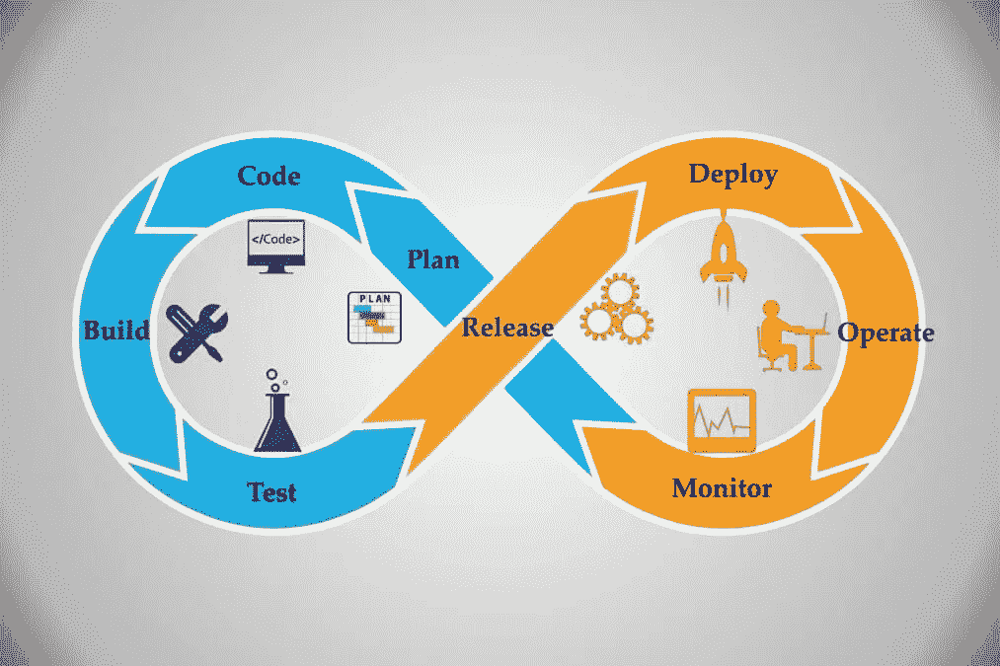

**概述:**
在本文中，我们的目标是构建一个 CI/CD 管道来自动化应用程序部署，这意味着对项目所做的任何更改都将被自动部署。

我们将要实现的图形:

**第一步:派生回购** 我们将从 LUIT 网站为这个特定的任务派生回购。

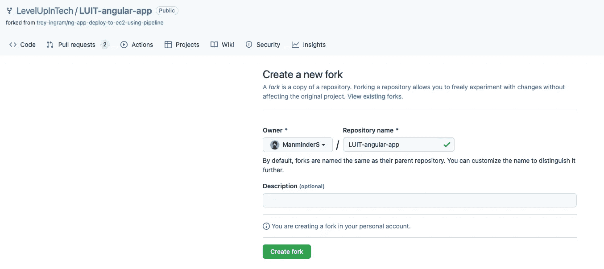

分叉的原因:我们将使用这个网站的源代码来工作，并将使用 GitHub 作为我们代码管道的源代码。

**步骤 2:创建并配置 S3 存储桶。** 现在是时候创建 S3 桶了，并将它配置为托管一个静态网站。

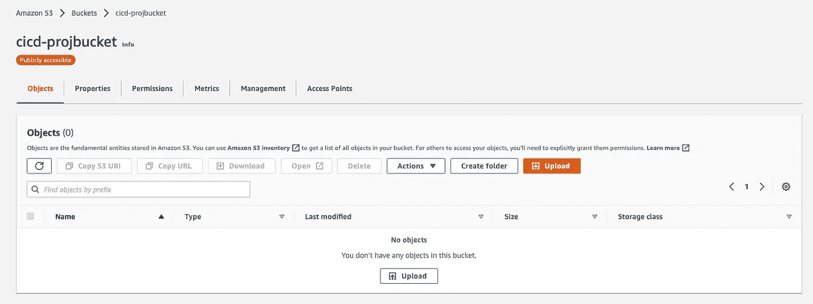

要了解如何创建 s3 bucket 来托管静态网站[请点击这里](/nerd-for-tech/how-to-configure-a-static-website-using-a-custom-domain-registered-with-route-53-6f633fb86581)。这个 s3 存储桶将作为 CI/CD 管道中的“部署提供者”。这意味着，当我们创建 CI/CD 管道时，这个 S3 存储桶将托管网站，其端点可用于查看我们网站的变化。

**步骤 3:创建 CI/CD 管道** 下一步是使用 AWS Codepipeline 服务创建管道。转到 AWS 代码管道并创建一个新管道。

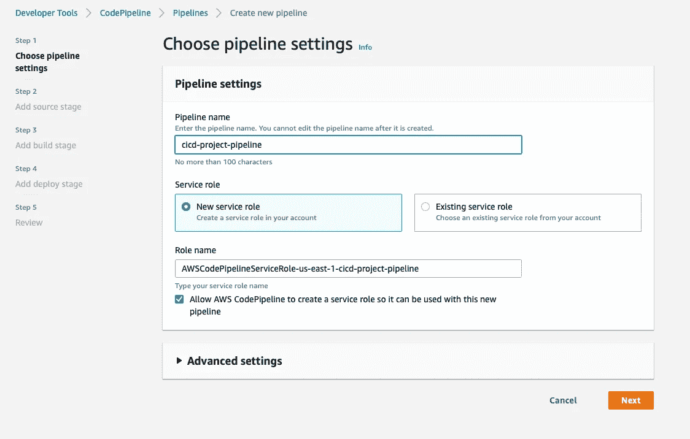

*命名管道后，单击下一步添加源阶段。*

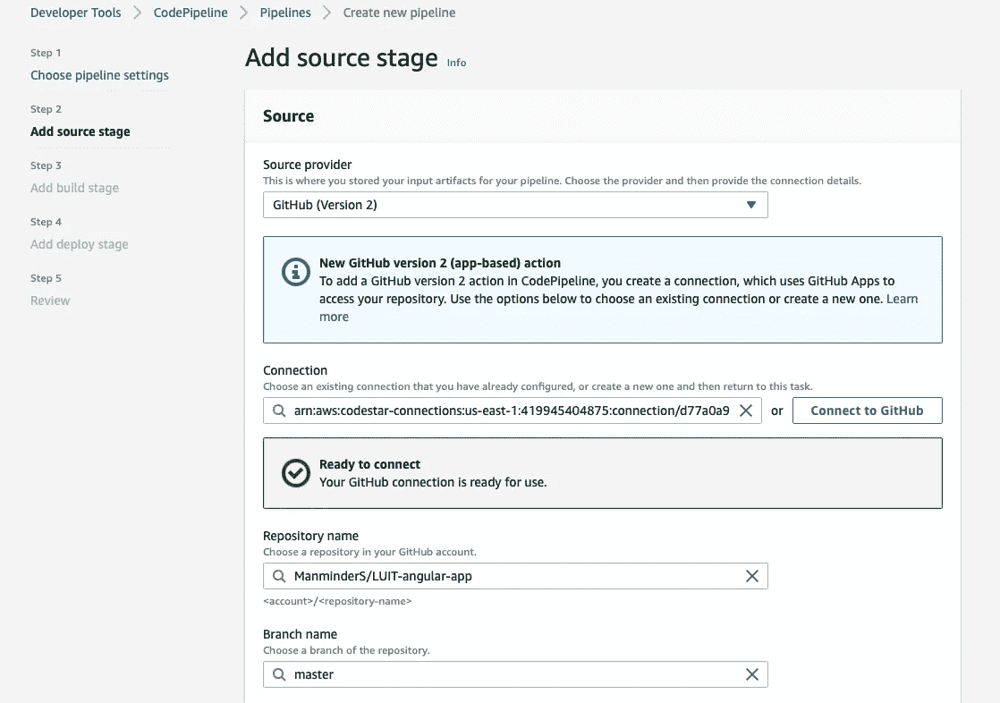

添加 GitHub 版本 2 作为源代码提供者(这意味着代码管道将使用 GitHub 和指定的 repo 作为源代码的来源)。选择您的连接、repo 和 master 作为分行名称。

*点击下一步进入构建阶段*

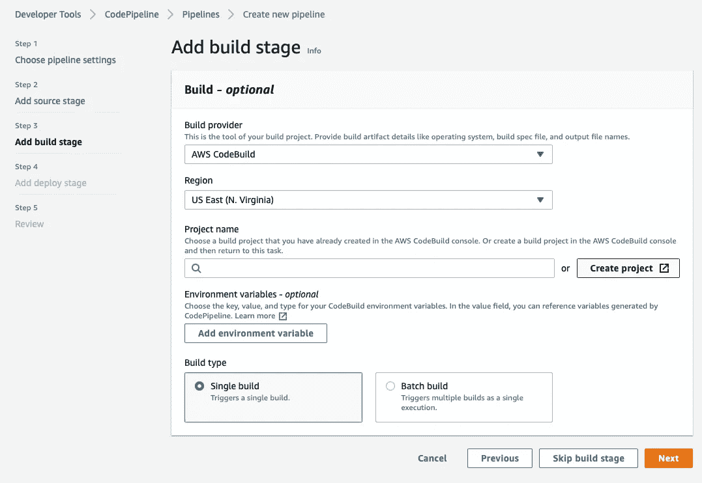

添加 CodeBuild 作为构建提供程序，单击“创建项目”并命名您的项目，在“环境”下选择“托管映像”，选择“运行时”作为标准，选择映像的最新版本，并选择“新服务角色”。在 BuildSpec 下选择默认设置，然后继续管道化。

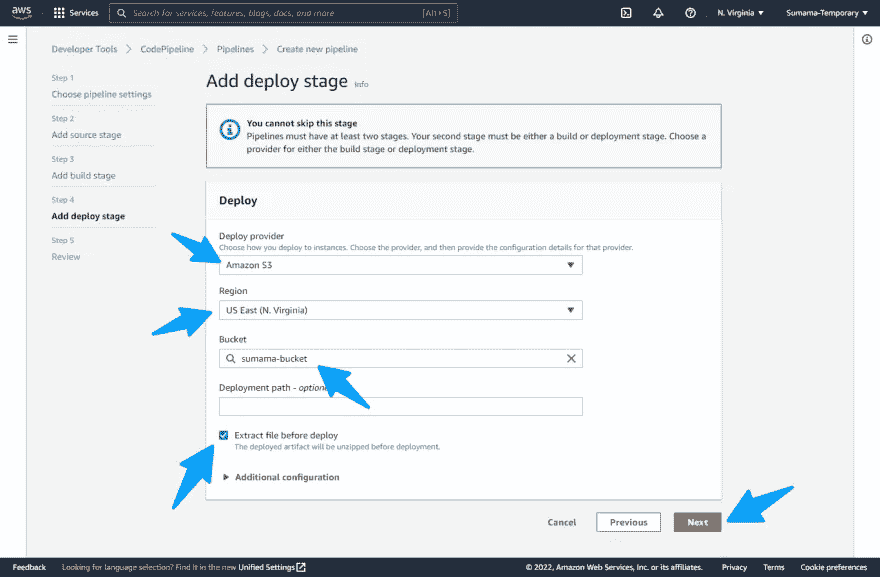

添加 s3 bucket 作为部署提供者，这是网站托管的位置。因此，每当我们在源代码中进行任何更改时，都会触发 ci/cd 管道，因此，这些更改将反映在 s3 存储桶中，并进一步反映在网站的 UI 上。

创建代码管道后，您的控制台将如下所示

当你点击这条管道时，它看起来像这样

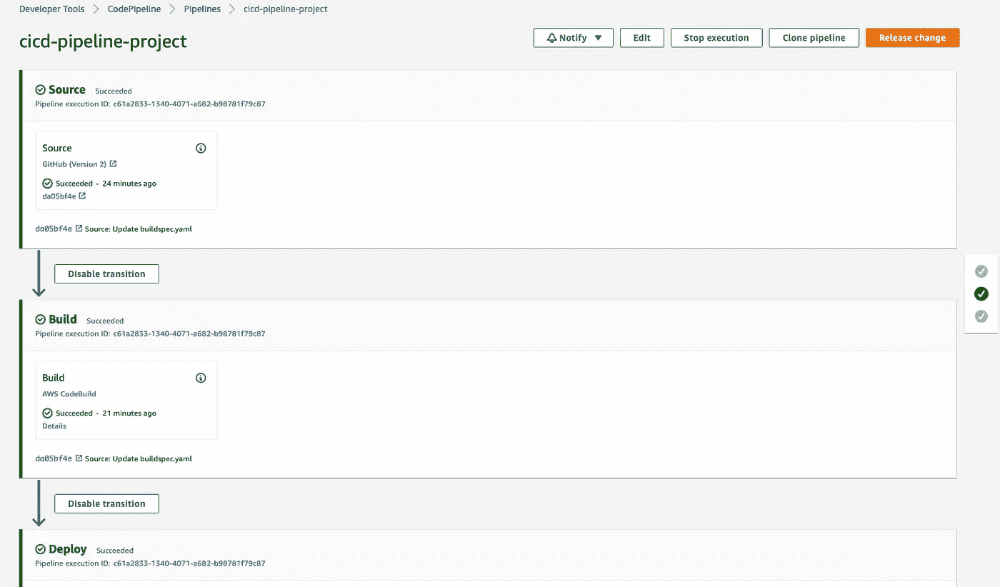

现在，既然我们能够成功地创建我们的代码管道，那么是时候回到 index.html 文件的 S3 桶并检查其输出了

**步骤 3:验证您可以访问静态网站** 我们现在将检查我们的 s3 存储桶是否能够成功托管静态网站。在检查 index.html 的端点时，我们得到下面的输出

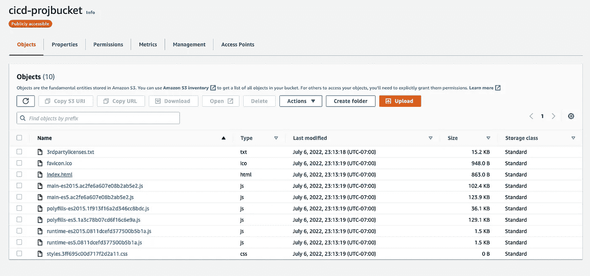

单击 index.html 并在新窗口中打开其端点

这证明它在工作。现在我们需要检查我是否对我的代码或文件做了任何更改，它是否会自动部署更改。

**步骤 4:验证代码中的变更是否通过 CI/CD 自动部署变更**
现在是测试我们的 CI/CD 的时候了，它应该通过触发代码管道自动部署变更。为此，我在 GitHub 上编辑了 Index.html。我将标题改为“使用管道将代码部署到 S3 ”,这是前面的“使用管道将代码部署到 EC2”。

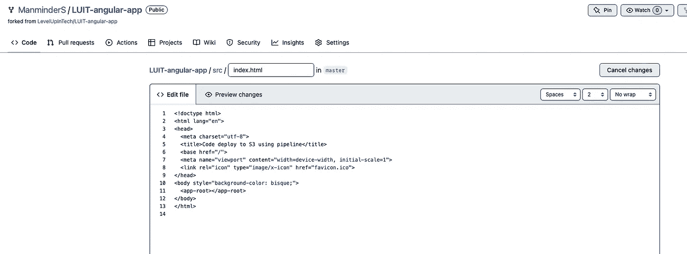

一旦我完成了我的更改，codePipline 就进入了 progress 状态。

部署成功一段时间后，我重复了步骤 3 来查看我的更改，并且我得到了下面的结果，而不必手动部署它。

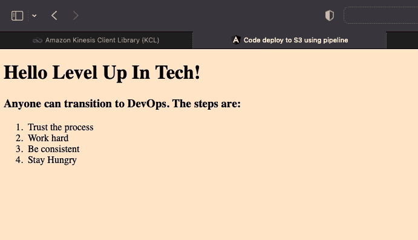

感谢阅读！继续推