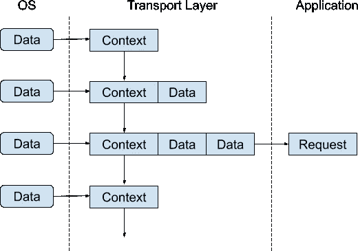

# 后端应用程序的隐藏剖析:上下文生命周期

> 原文：<https://medium.com/nerd-for-tech/hidden-anatomy-of-backend-applications-context-lifecycle-47f8d48dd4b6?source=collection_archive---------2----------------------->

在[上一篇文章](/nerd-for-tech/hidden-anatomy-of-backend-applications-50c9c9b67ed9)中，我们已经从 I/O 的角度研究了后端应用程序与外部世界的通信。现在我打算研究另一种处理模式，这种模式显式或隐式地存在于每个后端应用程序中。

让我们从非常简单的 HTTP 端点开始。这一次，我们将着眼于在我们使用的框架或库的深度中，在我们的代码被调用之前发生的过程。为了方便起见，我们称框架或库的这一部分为*传输层*。

让我们暂时把客户机连接到服务器时发生的事情放在一边。我们稍后将回到这一部分，但是现在让我们假设连接已经建立，并且客户端向服务器发送请求。一旦操作系统在服务器端接收到数据，它们就被传送到我们的后端应用程序。收到的数据还不是请求。它只是一个字节数组。传输层需要转换这些数据，提取必要信息，然后才调用我们的代码。

这里有一个陷阱:接收到的数据可能不代表整个请求。这可能由于各种原因而发生。例如，客户端可以将请求编写为几个部分。或者可以将一个长的请求拆分成数据包，操作系统可以在数据包可用时立即传送它们，而无需等待其余的数据。在这两种情况下，由于没有完整的请求，传输层需要将已经收到的数据保存在某个地方，直到可以解码请求并调用处理程序。

保存数据的位置是与客户端连接相关联的上下文。在建立连接之后，上下文是空的，只包含连接本身。然后，随着我们接收和处理数据，上下文不断增长，在某个时候，我们获得了足够的数据来提取请求信息，然后调用处理请求的应用程序代码。

这个过程可以用下图来表示:

上下文转换

如果从数据流的角度来看这个图，我们可以这样描述它:操作系统向应用传输层发送数据包，应用传输层收集解码请求所需的数据。一旦请求被解码，它就被发送到应用程序代码中。注意，可能有几个类似的阶段，例如，被解析的请求可能被传递到提取请求参数、认证信息等的框架部分。一旦提取了所有必需的部分，它们就被传递给用户级处理程序。通常，后续阶段是“一次性的”，它们为发送给它们的每个请求调用用户级代码，但也可能有例外，例如，文件上传功能可能会推迟调用用户级代码，直到文件完全下载并保存在临时位置。

整个处理模式并不特定于 HTTP 协议或后端应用程序。例如，我们可以在基于推的 XML 解析器中观察到一个非常相似的模式:它们只在识别特定元素时才调用客户机，所有中间步骤对客户机代码都是隐藏的。这种相似性不是偶然的——解析请求和解析 XML 文档是非常相似的过程，只是我们解析的语法不同。传输层的一些实现，例如 [Netty](https://netty.io/) ，向库的用户公开了这个处理模式。

现在是时候将上下文生命周期作为一个整体来看待了，从端到端。

在基于连接的协议(例如，TCP)的情况下，上下文是在客户端连接到服务器时产生的。通常，初始上下文仅包含可以在建立连接时获得的信息，例如可以用于向客户端发送响应的客户端地址和套接字。当服务器出于某种原因决定关闭连接时，上下文的生命周期就结束了。请注意，在上下文生存期中，可能会处理几个请求。

在无连接协议(例如 UDP)的情况下，上下文通常在接收到来自客户端的分组时产生，并且上下文寿命相当短，因为一旦应用处理了接收到的分组，就不再需要它。然而，一些应用程序使用 UDP 模拟基于连接的协议进行传输。如果是这种情况，那么上下文生命周期与上述基于连接的协议非常相似。

# 结论

理解上述处理模式和上下文生命周期在许多情况下都是有帮助的——优化应用程序性能、实现资源管理或设计框架/库。