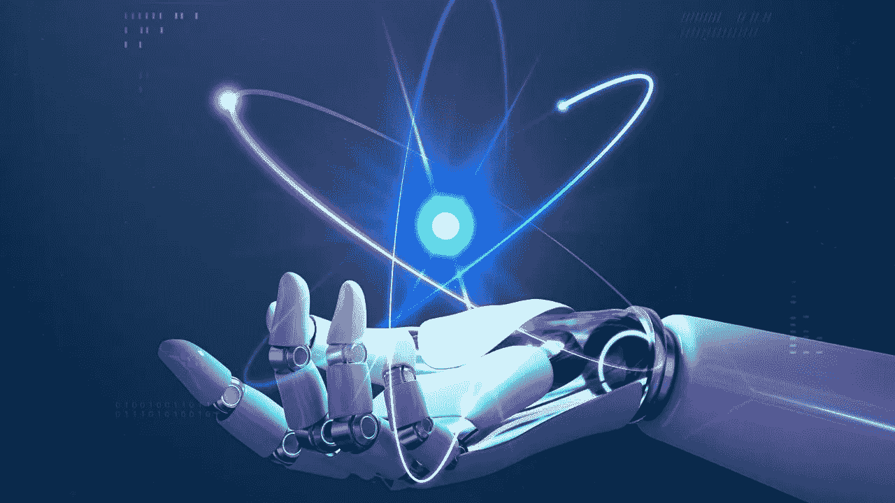

# 人工智能和区块链如何帮助管理食物浪费？

> 原文：<https://medium.com/nerd-for-tech/how-ai-blockchain-can-help-to-manage-food-waste-aaaf244bf93a?source=collection_archive---------4----------------------->

世界饥饿不会立即根除，它需要同等数量的同情心、独创性和创造力。

一个开始的领域是减少世界各地每天堆积如山的食物浪费——这可以从一些技术援助中受益。

世界饥荒迫在眉睫，长期和意想不到的干旱、疫情和持续的贫困加剧了饥荒。与此同时，每年有三分之一供人类使用的粮食被浪费掉，总计 13 亿吨。

区块链技术正在个人加密矿工和企业中获得牵引力，他们对该技术在商业运营中提高效率、不变性和安全性的承诺感兴趣。另一方面，区块链科技能给非营利事业带来任何价值吗？这篇文章的主题是区块链技术是否有助于减少食物浪费，从而改善环境条件——如果是，如何改善。

对区块链专家的需求很高，因此越来越多的人对[区块链学位](https://www.blockchain-council.org/online-degree/online-degree-blockchain/)表现出兴趣

课程。

**保障食品安全**

使用区块链，供应链的透明度提高到一个全新的水平。它还允许整个供应链在发生食品安全事件时更快地做出反应。出于这个原因，像雀巢和联合利华这样的大公司正在关注区块链技术。

此外，区块链可以随时跟踪特定产品，这有助于减少食物浪费。例如，受污染的产品可以简单而迅速地被追踪，而安全的食品留在市场上，不会被填埋。

**欺诈防范**

然而，由于现有的行业方法更容易出现人为错误，因此只有在数据源数据正确的情况下，它才能运行。受信任的第三方审核大部分合规性数据，然后将其记录在纸上或集中的数据库中。信息不足、黑客攻击、昂贵的运行费用以及腐败和欺诈行为导致的故意错误使这些数据库极易受到攻击。

因为区块链是匿名的，错误可以追溯到具体的个人。这一点并非无关紧要，特别是考虑到最近加拿大和其他地方的食品欺诈丑闻。区块链技术提供了一种无限期存储记录的方式。

最重要的是，它使食品价值链中不同参与者之间的数据共享更加容易。不知不觉中，许多零售商提供了假冒的食品。多亏了区块链技术，那些日子可能已经过去了。

**更快更公平的支付**

从农场到餐盘，区块链将允许每个人更快地得到补偿。农民将能够更快地出售，并获得足够的补偿，因为市场数据将很容易获得和审查。

那些感到不得不依靠销售委员会销售商品的农民可能会发现区块链技术是一个可行的选择。在食品供应链中观察到的价格胁迫和追溯支付，可以通过使用区块链来避免。

**结束**

在农业食品方面，区块链技术提供了希望，但仍需进一步完善。行业高管应该将区块链视为一个机遇，并将其纳入目前正在影响整个食品行业的数字化战略。农业食品部门的透明度、生产率、竞争力和可持续性都应该得到改善。

在我们过于兴奋之前，研究应该寻找产生基于证据的区块链解决方案的方法，以使整个系统的数据民主化。区块链教育很有必要。报名参加[区块链开发者](https://www.blockchain-council.org/certifications/certified-blockchain-developer/)课程，立即开始。