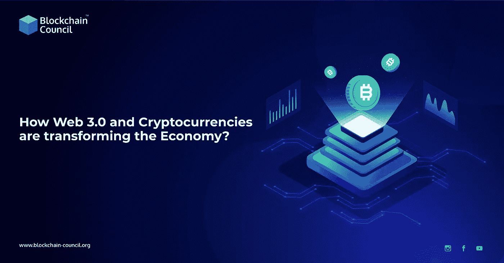

# Web 3.0 和加密货币如何改变经济？

> 原文：<https://medium.com/nerd-for-tech/how-are-web-3-0-and-cryptocurrencies-transforming-the-economy-fdbc7951945d?source=collection_archive---------5----------------------->

加密货币引发了一些反思。尽管令人兴奋的用例，如分散融资(DeFi)和比特币将其用作企业货币，已经开发出可编程的货币政策工具，但支撑许多加密货币实际使用的内聚哲学仍然是一个谜。

除了财务动机，典型用户的采用相对较慢，很少有人理解使 [**加密货币认证**](https://www.blockchain-council.org/certifications/certified-cryptocurrency-expert/) 如此有益的底层设计。许多人喜欢收益或利润，他们在“何时”和“因为”获得投资收益是经常被问到的问题。

Web 3.0 作为统一思想的替代品是有意义的，它将加密货币绑定到一个统一的经济理论中，对经济产生更广泛的哲学和实践影响。

# 是什么让 Web 3.0 在当今世界如此重要？

对于不知情的人来说，关于 Web 3.0 的对话可能很快就会变得势不可挡。实际上，它试图使网络真正开源，从而避免黑客、泄密和对集中式存储库的依赖。在创造者驱动的生态系统中，Web 3.0 是一个由用户开发的面向消费者的网络。

2022 年，Web 3.0 也将变得越来越重要，因为大多数人将使用它来优先考虑定制和个性化的浏览体验。此外，人们越来越需要更智能、更普及、由语义、人工智能以及区块链驱动的人性化搜索助手。

# Web 3.0 区块链和加密货币之间有什么联系？

Web 3.0 和 [**区块链开发者**](https://www.blockchain-council.org/certifications/certified-blockchain-developer/) 都渴望开放和透明。但是类比并没有就此结束。正如我们所知，**在线区块链课程**的目标是保存被分组为块的洞察力，并委托加密哈希来保持它们的不可更改性和安全性。

如果 Web 3.0 成为现实，只要加密技术到位，每个人都可以访问资源、应用、内容和协议。也许有太多分散的解决方案可以让这个星球变得对我们每个人都更加友好。

# Web 3.0 对加密货币投资的现实有什么影响？

现在，我们已经为 Web 3.0 及其对区块链技术的依赖建立了基础和预期，是时候考虑这对各种加密货币和投资前景意味着什么了。

例如，由于以太网在帮助开发人员开发分散化应用方面的重要作用，它是最受欢迎的 Web 3.0 **在线区块链课程**之一。这将最终引起长期**加密货币专家**投资者的注意。虽然这是一个随意的例子，但是在 Web 3.0 的重要性方面，几个**区块链的开发者**比其他人表现得更好。Graph，Filecoin，Livepeer，Helium，以及其他链都在其中。

因此，下一次有人向你提供加密货币认证时，请记住,**加密货币认证**是一个会吹爆你所有钱的泡沫。描述加密互联网关系的细节，它超越了金融叠加。有多个例子的技术现实支撑着整个加密投资领域。

# 主流采用 PoW、NFTs 和加密技术

将 crypto 与 Web 3.0 结合起来可能需要一些时间，因为这项技术非常复杂和多变。例如，推动 Web 3.0 革命的几家领先的加密公司，如 Kadena、Helium、Flux 和其他公司，使用可靠的工作一致性方法，尽管进行了一些调整，以使新的互联网更快、更安全。

此外，随着世界的焦点转移到不可替代的代币和创意货币化，这些 Web 3.0 激励代币可能会在中长期内获得很好的认可。

然而，你必须等待这些新生但有竞争力的加密货币被广泛采用，开发人员涌入这些链条，构建分散的系统和应用程序，以引发 Web 3.0 运动。

# 加密货币的未来会怎样？

尽管密码具有巨大的潜力，但它仍然被视为仅仅是投资的可能性和交换现金的新方式。但事实是，乘着区块链的浪潮，加密玩家正在迎来 Web 3.0，只有生态系统才能产生必要的资源和应用程序。

尽管投资密码或利用它们来简化交易似乎是有益的，但未来不应该仅仅由这些特征来定义。即使交易、投资和商品交换被忽略，加密玩家将继续在 Web 3.0 复兴中发挥作用。

最后，加密货币的交易者和投资者是一个更大概念的自然结果。那些没有完全接受 Web 3.0 的人应该可以随时改变他们的想法。

# 加密货币正在重塑经济格局

Web 3.0 背后的目标是在保留用户基础的同时做一些重置——Web 2.0 的可用性和定制思想，以及应该有负责任的资产和服务的思想。Web 3.0 为其用户带来了更广泛的义务。尽管如此，它也给予了他们更多的自主权和对审查的抵制，吸取了互联网创新的前两个重要阶段的经验教训。

不同于让多家公司托管云服务来提供在线通信的主干，客户将维护他们的服务器，这些服务器为他们提供对最新资产转移等的访问。这涵盖了构成比特币网络的节点。

这一点意义重大，因为由于互联网上针锋相对的国有化，审查弹性对于经济体之间的沟通变得至关重要，这日益在它们之间建立起数字壁垒。自主权也很重要，因为越来越多的国家寻求破解端到端加密，并获取尽可能多的公民数据。在特定的环境中，指示和真正保持对话秘密和联盟的能力将变得越来越重要。

# 结论

这对整个经济有深远的影响。来自互联网的现金流可能不再以集中的广告为中心，而是以与基于民族国家的股票市场无关的分散的经济流为中心，而是以各种经济价值为中心——以加密货币为代表。

在一个国家正在分裂互联网并试图对每个人进行更详细监控的背景下，Web 3.0 和加密货币专家 T2 提出了一个令人信服的意识形态论点。