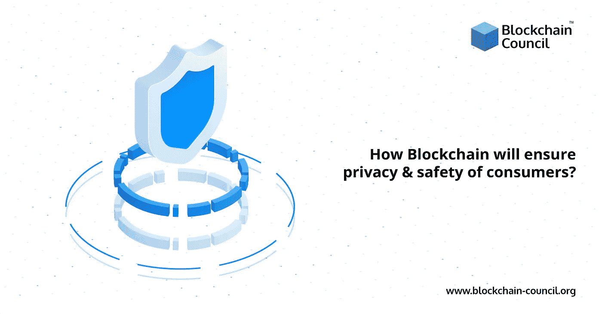

# 区块链将如何确保消费者的隐私和安全？

> 原文：<https://medium.com/nerd-for-tech/how-blockchain-will-ensure-the-privacy-safety-of-consumers-61d9f854d03a?source=collection_archive---------2----------------------->

[区块链发展](https://www.blockchain-council.org/certifications/certified-blockchain-developer/)已经成为创业公司、媒体、甚至政府走廊的热门话题，金融业务对此并不陌生。不足为奇的是，区块链是一个能够令人难以置信地安全记录信息的平台，几乎很难改变或侵入系统。区块链是一种称为区块的数据数字分类账，用于跟踪资产和记录商业网络中的交易。它被公认为在提供安全性、透明度和效率的同时使流程民主化，分散所有权是该技术最吸引人的特征之一。

区块链是一种分布式账本管理工具，可用于跟踪快递员的保管或两个人之间的交易。交易几乎是即时记录的。

此外，每笔交易都有可靠的记录，消除了修改以前交易的可能性。换句话说，[区块链科技](https://www.blockchain-council.org/blockchain/what-is-blockchain-technology-and-how-does-it-work/)可以让每一笔交易完全安全。

根据[区块链专家](https://www.blockchain-council.org/certifications/certified-blockchain-professional-expert/)的说法，认为区块链的理想方式是作为一个分散的账本，可以通过消除银行等中介机构和有效地分散信任来节省成本。该系统不是中央授权机构，而是将条目附加到分类帐中，由更大的用户群体进行验证。

该链连接每个块，每个块代表一个事务性记录。当分布式计算机网络验证记录并连续列出交易块时，就创建了区块链。

重要的是，区块链不包含任何有价值的东西，就像印刷的货币或银行的数据库一样，而有争议的加密货币比特币本质上是一种区块链应用。

那么，这个块真的是不可变的吗？不，事实并非如此。

不存在完美的不变性；和其他网络一样，区块链理论上容易受到变化的影响。然而，由于区块链网络的计算机或节点是分散的，进行修改所需的数学复杂性和计算能力使它们实际上很困难。要改变一个链条，人们需要控制同一个分布式账本中超过 51%的机器，并在短时间内改变所有的交易记录——就比特币而言，在 10 分钟内。这在以前从未发生过。

# 隐私和安全呢？

尽管在传统的信息系统中很难同时实现安全性和隐私性，但区块链可以通过“公钥体系结构”实现保密性，防止恶意篡改数据，并保持分类帐的大小不变。网络分布越广，规模越大，人们就认为它越安全。

其他提到的区块链问题包括可扩展性有限、数据保护不足以及缺乏行业标准。

## 隐私

为了避免数据隐私问题，区块链运营商可以使用数据“哈希”(将数据单向转换为不可读的数据)将个人数据和对个人数据的引用置于离线状态。

当数据存储在链外时，个人数据必须由个人持有或存储在更传统的数据库中。传统技术，如独立的数据库和应用系统，可用于存储链外的了解客户文档，如扫描的驾照或护照。

# 包扎

简而言之，区块链技术有潜力成为可靠、安全、值得信赖的私有技术。最终，可靠的架构、安全的设计原则和有效的工作流策略提供了安全性。

那么，区块链的潜在利益大于风险吗？简而言之，当然，只要做得正确。

每个系统都有缺陷。当今技术驱动型金融部门的监管和监管框架必须允许创新，同时确保稳定性、消费者保护和竞争力。区块链认证印度一直呈上升趋势。

立即在线报名参加区块链课程。