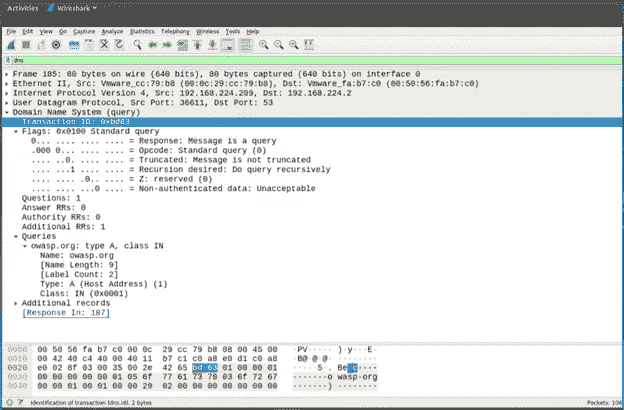
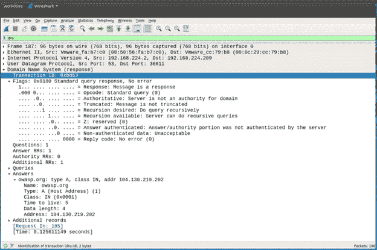
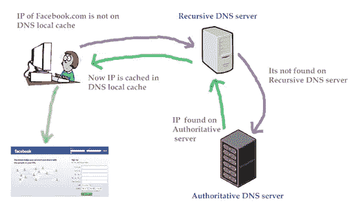
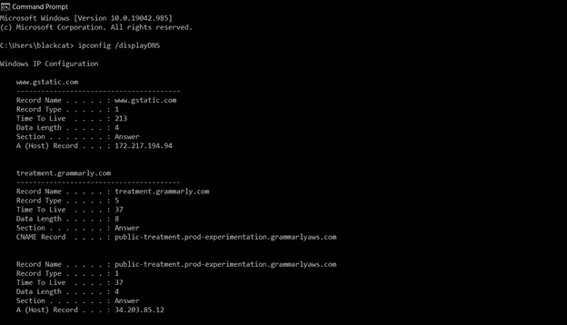
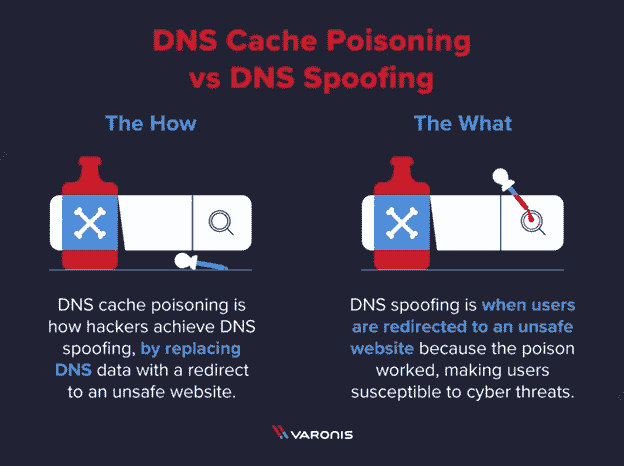
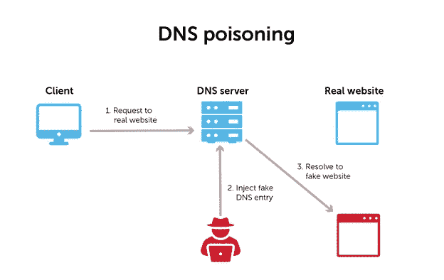
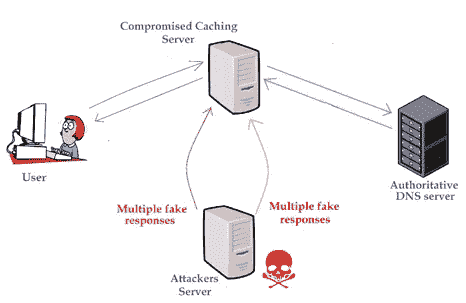

# DNS 欺骗是如何工作的

> 原文：<https://medium.com/nerd-for-tech/how-dns-spoofing-works-1bd668c940cd?source=collection_archive---------11----------------------->

来源:https://inspiredelearning.com/

1969 年 10 月，阿帕网(高级研究计划局网络)启动。ARPANET 中的每台主机都必须在主机中列出。名称到地址映射。到那时，计算机的数量很少，所以主机也很少。TXT 工作正常。但是随着阿帕网进入互联网，主机。由于流量和负载，TXT 很快变得困难。

因此，作为一种解决方案，DNS(域名系统)于 1983 年推出。

## 什么是 DNS，它是如何工作的

DNS 是如何工作的(来源:【https://www.varonis.com】T4)

既然我们有很多要谈的，那就让我们简单地浏览一下 DNS。

DNS 服务可以被认为是互联网的心脏。没有 DNS 服务，你将不得不记住所有你喜欢的网站的 IP 地址，而不是它们的域名。域名比一串数字更容易记忆(例如:facebook.com——69 . 171 . 250 . 35)。

但是，当用户想要访问“Facebook.com”时，它应该被转换为 69.171.250.35。这个转换过程由 DNS 完成。

DNS 查询(来源:[https://owasp.org/](https://owasp.org/)解析 DNS 缓存中毒攻击演示)

DNS 响应(来源:[https://owasp.org/](https://owasp.org/)解析 DNS 缓存中毒攻击演示)

让我们假设你从未去过 facebook.com。现在，您的所有朋友都在使用脸书，您也想拥有一个脸书帐户。所以，在浏览器中你输入 Facebook.com。但问题是你的浏览器从未访问过脸书，因此你的电脑不知道 Facebook.com 的 IP 地址。(这意味着它在本地 DNS 缓存上不可用，请查看下一节的描述以了解更多关于本地 DNS 的信息)。

DNS 如何工作

因此，计算机所做的是，执行 DNS 查询，并与另一个服务器(递归 DNS 服务器)连接，以获取必要的详细信息。递归 DNS 服务器通常由 ISP(互联网服务提供商)运营。大多数时候，ISP 的缓存中都有常用的域名。所以，如果脸书被缓存在这里，查询将在这里停止。如果在递归 DNS 服务器中没有找到它，它知道其他服务器可能有此信息。这些服务器被称为权威 DNS 服务器。

再次，这是一个非常简短的解释过程。

# DNS 缓存

如果你每次给你最好的朋友打电话都要翻电话簿，会发生什么？这将是非常令人恼火的，对不对？同样，你的电脑不喜欢每次需要 IP 地址时都连接到 DNS 服务器。因此，计算机将其存储在 DNS 缓存中。

因此，DNS 缓存就像是由计算机操作系统维护的临时数据库。它包含您最近访问过的网站及其域名详细信息的记录。(请看图片下方)。
Windows 用户可以通过`ipconfig /displayDNS easily`查看他们的 DNS 缓存中存储了什么。

Windows PC 中的本地 DNS 缓存

# 那么，什么是 DNS 攻击呢？

与主机相比，DNS 使事情变得简单。但是 DNS 有一些弱点，

*   **用户信任 DNS 提供的名称-地址映射。**
*   **DNS 解析器总是信任收到。**
*   **DNS 响应没有认证机制。**

因此，当黑客利用域名系统中的这些漏洞时，这被称为 DNS 攻击。

一些最常见的 DNS 攻击有 **DDoS 攻击、DNS 欺骗、分布式反射 DoS 攻击、DNS 劫持洪水和域锁定攻击**。

在本文中，让我们讨论 DNS 欺骗。

# DNS 欺骗。

DNS 欺骗也称为 DNS 缓存中毒。但是还是有区别的。

来源:[https://www.varonis.com/](https://www.varonis.com/)

**DNS 欺骗**是指用户被重定向到黑客想要的不安全网站(只有当攻击者成功毒化 DNS 缓存时才会发生)。

**DNS 缓存中毒**是黑客用来实现 DNS 欺骗的技术。

# DNS 缓存中毒是如何工作的？

来源:[https://bluecatnetworks.com/](https://bluecatnetworks.com/)

考虑一个恶作剧的情况，在这个恶作剧中，有人在一个旅馆里调换了房间号码。一名不知道正确酒店号码的新员工在目录中更新了这些号码。

现在，每个到酒店的人都走错了房间。这种情况将持续下去，直到有人发现并手动改回目录。

DNS 缓存中毒与上述情形类似，只是攻击者故意修改 DNS 记录，以便将用户重定向到黑客喜欢的位置。

攻击者使用几种技术来毒害 DNS 缓存。但首先，让我们看看最常见的技术之一，**“DNS 缓存中毒:抢先响应”**是如何工作的。

# **DNS 缓存中毒:争先恐后响应第一**

攻击者可以猜测 DNS 缓存条目的到期时间(TTL —生存时间)。当 DNS 缓存过期时，DNS 服务器将向权威服务器发送请求。

然而，在权威服务器做出响应之前，黑客会发出大量请求，要求获得该域的 IP 地址。与此同时，黑客还会发送虚假响应(就像来自权威服务器一样)，声称这是您想要的网站的 IP 地址。

如何快速响应第一次 DNS 中毒

这就是黑客要打败权威服务器的地方(顾名思义，“争着先响应”)。因为如果服务器的响应先到达 DNS 服务器，那么权威服务器的响应会被接受；如果黑客的响应先到，就会被接受。如果黑客成功了，DNS 缓存会被修改成一个虚假的 DNS 记录。

因为黑客成功地在 DNS 缓存中插入了一个虚假的地址记录，现在 DNS 缓存被认为是“中毒了”。

用户将被重定向到黑客的网站，直到 DNS 记录被删除或 DNS 记录(TTL)过期。

# DNS 中毒的危险

**病毒和恶意软件**

当用户被重定向到攻击者的虚假网站时，黑客可以在他们的计算机上安装病毒或恶意软件，导致敏感数据丢失或攻击者意图的任何其他伤害。

**盗窃**

攻击者可以通过 DNS 中毒轻松窃取用户登录任何安全网站的凭据。这可能包括信用卡号和密码以及其他个人信息。

**审查制度**

这更是对人权的侵犯。DNS 中毒可以被政府用来向人们隐藏信息(政府想要的信息)。一些国家(例如中国)使用 DNS 中毒来限制中国公民访问各种网站。

# 现实世界中的 DNS 欺骗攻击

1.  **利用 DNS 欺骗攻击窃取 MyEtherWallet 中的加密货币**

一群攻击者发起了一次 DNS 中毒尝试，持续了大约 2 个小时。在此期间，MyEtherWallet.com 的用户被重定向到一个网络钓鱼网站。当用户试图登录钓鱼网站时，用户的登录凭据被窃取，导致大约 1700 万美元的损失。

来源:[https://www . the register . com/2018/04/24/my ether wallet _ DNS _ Jackie/](https://www.theregister.com/2018/04/24/myetherwallet_dns_hijack/)

2.**马航遭“蜥蜴小组”DNS 中毒攻击**

约书亚·保罗/美联社照片

这件事发生在 2015 年。在马来西亚航空公司的网站上，一群被称为“蜥蜴小队”的黑客进行了 DNS 中毒攻击。当人们登录时(没有意识到他们在一个钓鱼网站上)，上面一只蜥蜴的图片和信息“404-飞机未找到”显示出来。不清楚在这种情况下用户数据是否被窃取。

来源:[https://ABC news . go . com/Technology/Malaysia-airlines-hit-lizard-squad-hack-attack/story？id=28489244](https://abcnews.go.com/Technology/malaysia-airlines-hit-lizard-squad-hack-attack/story?id=28489244)

# 如何避免 DNS 欺骗

DNS 中毒无疑使互联网成为一个可怕的地方。但这并不是说我们不能预防。所以，让我们看看我们能做些什么。

*   保持您的病毒防护更新。
*   **经常检查你访问的网站是否有 HTTPS 证书。**
*   **定期清理电脑上的 DNS 缓存是有好处的。**
*   **使用 DNSSEC(域名系统安全扩展)**

DNSSEC 是域名系统的延伸。DNSSEC 将加密签名附加到现有的 DNS 记录中。通过检查签名，可以验证 DNS 记录的来源(无论记录是否被更改)。

> N 注意最后一条是给 DNS 服务器操作员的。

## 参考

[DNS _ Cache _ Poisoning(OWASP _ 加纳)。pdf](https://owasp.org/www-chapter-ghana/assets/slides/DNS_Cache_Poisoning(OWASP_GHANA).pdf)([https://owasp.org/](https://owasp.org/www-chapter-ghana/assets/slides/DNS_Cache_Poisoning(OWASP_GHANA).pdf))。

 [## 关于 DNS

### 编辑描述

publib.boulder.ibm.com](https://publib.boulder.ibm.com/tividd/td/ITWSA/ITWSA_info45/en_US/HTML/guide/r-dnsinfo.html)  [## 什么是 DNS 攻击？网络新闻

### DNS 攻击是一种网络攻击，攻击者利用域名系统中的漏洞进行攻击。这是一座坟墓…

cybernews.com](https://cybernews.com/resources/what-is-a-dns-attack/)  [## 黑客如何利用 DNS 缓存中毒欺骗 DNS 请求

### 域名服务器(DNS)欺骗是一种网络攻击，它会欺骗您的计算机，使其认为自己正在进入正确的…

www.varonis.com](https://www.varonis.com/blog/dns-cache-poisoning/#:~:text=Q%3A%20How%20Does%20DNS%20Cache,attackers%20choosing%20to%20steal%20data)  [## 命名安全性

### 命名安全性。尼克 Feamster CS 6250 秋季 2011。www.cc.gatech.edu。troll-gw.gatech.edu。NS burdell.cc.gatech.edu…

www.slideserve.com](https://www.slideserve.com/razi/naming-security)  [## 幻灯片:DNS 缓存中毒是如何工作的

### 挫败 DNS 缓存中毒攻击的技巧

www.pcworld.idg.com.au](https://www.pcworld.idg.com.au/slideshow/264447/slideshow-how-dns-cache-poisoning-works/)