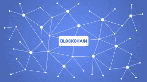

# 物联网如何与区块链协同工作？

> 原文：<https://medium.com/nerd-for-tech/how-does-iot-work-with-blockchain-6c3b2e4a82be?source=collection_archive---------5----------------------->

# 介绍

物联网允许网络上的设备向非公共区块链网络发送数据，以对共享交易进行防篡改记录。区块链长期以来一直受到吹捧，因为它是物联网系统的完美技术补充。

与区块链的物联网可能真正依赖捕获的数据。基本理念是在设备创建时为其提供一个身份，该身份将在整个生命周期内通过区块链进行验证和确认。[相信设备身份协议和信誉系统的区块链物联网系统技术能力潜力巨大。](https://www.technologiesinindustry4.com/)

通过工具身份协议，每个设备都可以拥有自己的区块链公钥，并向其他设备发送加密的质询和响应消息，从而确保工具始终处于其身份的最顶端。此外，具有身份的工具可以建立声誉或历史，并被区块链跟踪。

# 描述

区块链允许设备独立当今网络中的物联网设备在其集中管理的网络之外并不作为独立实体存在。就外界关心的而言，他们正在处理一个位于云中的超大服务器，该服务器有一些数据，但不知道信息的来源，也不知道任何与最初收集信息的设备直接交互的方式。

在区块链网络中，每个节点——连接到网络的任何参与者——都有一个单独的私钥和公钥对，可以唯一地将其标识为网络上的独立参与者。确切地说，这些字符很大程度上是通过加密签名或数字消息来明确识别发送者的。
拥有独一无二的身份是实现独立的基础，赋予每个设备代表自己行动的权力。这允许分散的网状拓扑而不是集中的服务器-客户端拓扑，其中每个节点准备好做出自己的决定，并且更重要的是，独立于相对的节点形成对其自己的资源的使用。

这种网络要安全得多，因为黑客无法通过入侵一台服务器来控制多台设备。相反，黑客不得不一个接一个地损害许多设备，每一个被损害的设备都可能因为行为不当而被网络拒绝，导致黑客获得无用的、断开的设备。
此外，采用合理共识算法的分散式网络在平衡以前由一个实体处理的工作负载方面表现更佳。这使得网络部署和维护成本大大降低，因为连接、存储甚至计算的工作量现在可以由网络中的许多设备来完成，而不需要昂贵的集中式仲裁器

# 区块链允许设备感知所有权

区块链还通过保证唯一身份的完全相同的加密原语赋予设备所有权的概念。任何设备现在都可以对其访问的任何类型的数字资产进行签名和加密。具体来说，一个工具现在可以拥有加密货币，也可以拥有它控制的其他类型的资产。

有了这种所有权的想法，物联网设备现在是一个独立的经济实体，不仅准备好行动，而且准备好为自己的最佳经济利益而行动。例如，一个工具可能计划拍卖其能力并按需收集定制数据，而不是保持闲置；为了避免过时，它可以与其他相关设备联网，以便处理固件升级等。虽然他们喜欢幻想，但这些例子在未来可能不会太遥远。
确保数字化资产的所有权也保证了资产制作者的隐私。没有发起者的特别许可，例如没有解密密钥，任何人都不能访问该信息。今天，广泛的，更重要的是，隐藏的数据收集和聚合过程将被交付到最前沿，并从信息生成者和所有者那里获得明确的许可。

# 区块链使设备能够交易

一个独立的、拥有资产的经济实体做什么？它与其他独立的、拥有资产的实体进行交易。每个区块链网络的核心可能是共识算法，该算法确保网络上的每个节点都同意网络的历史状态转换集。另外，网络发生了什么变化？这种共识允许区块链的重要功能——数字化资产的分散交易。

一旦考虑到开源开发者的全球生态系统，安全交易资产和资源的能力变得更加重要，这些开发者自然是任何开源区块链生态系统的一部分。现在有了如何以分散的方式奖励和更好地利用设备收集的信息。

任何设备或设备网络都可以选择发布其收集的数据片段，并在区块链市场上为选定的目标提供奖励，在加密保证的智能合同期间锁定奖励，并激励人们获得答案并获得奖励。[对于一个中央集权的实体来说，学习使用数据是一个非常困难的问题，但对于区块链来说，它可能会成为一个适度分散的问题，从全球各地挖掘全球化的人才库。](https://www.technologiesinindustry4.com/)

# 当前的限制

下面列出了该系统的一些主要限制。

*   他们缺乏专为物联网设备设计的主流、明显的低延迟、高容量区块链网络。
*   到目前为止，设备制造商不得不将密钥嵌入到每一个硬件中，或者使它们作为通用标准与区块链兼容。
*   确保隐私保护计算的软件加密方法非常低效且不实用，尽管硬件解决方案需要制造商以及整个制造供应链的信任，这使得很难防范数据盗版。
*   人工智能还不够复杂，无法在设备中实现这种异常自主的决策行为。
*   要进一步降低区块链交易的风险，仍需要诉诸法律，但只有有限的司法管辖区承认区块链的智能合约是具有法律约束力的离线合约。

更多详情请访问:[https://www . technologiesinindustry 4 . com/2021/07/how-does-IOT-work-with-block chain . html](https://www.technologiesinindustry4.com/2021/07/how-does-iot-work-with-blockchain.html)