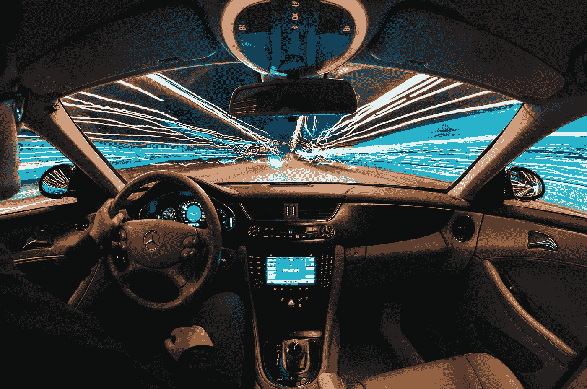

# 这家自动驾驶公司是如何在不烧钱的情况下，一年内收入翻三倍的？——第一部分

> 原文：<https://medium.com/nerd-for-tech/how-does-this-self-driving-company-triple-its-income-throughout-a-year-without-burning-money-948484032dee?source=collection_archive---------2----------------------->

## **自动驾驶曾经有两条战线:增量模式 vs 越级模式**

增量模式是指以特斯拉为代表的玩家可以在量产车上使用 L2/L3 级辅助驾驶迭代算法，不断收集数据，最终实现 L4/L5 无人驾驶。越级一指以 Waymo 为代表的 Robotaxi 玩家直接实现 L4/L5 级别无人驾驶。

现在的一个趋势是，直接开发 Robotaxi 的公司，在遇到商业化的瓶颈后，大多犹豫不前，而增量的自动驾驶公司已经在黑暗中了。

北京 Idriverplus 科技有限公司是增量自动驾驶的代表公司之一。2021 年，该公司在商业化方面取得了耀眼的成绩，营收是上一年的 3 倍。业务范围，在 T3go 的 100 辆 Robotaxi 订单之后，它还收到了 100 多辆名为 xPatrol 的自动巡逻车的订单。Idriverplus 还与广汽 R&D 中心签署了战略合作协议，同时保持与 BAIC 的项目合作。

此外，该公司被选为正在进行的北京冬季奥运会的服务提供商。搭载 Idriverplus 无人驾驶大脑、Robotaxi、沃小白等大型自动驾驶扫地机的三款无人车均已进入冬奥会，并在保障团队中发挥了重要作用，向世界展示了中国辉煌的科技冬奥会。

从订单中可以看出，与一些专注于单一场景的自动驾驶公司相比，Idriverplus 的实施场景是“多重多样的”，包括载人的高速 Robotaxi，以及其他无人驾驶的工作品种，如低速环卫车、特种车、物流车。

**如果你必须用一个简单的词来定义 Idriverplus，那将是一家“自动驾驶大脑”公司。**

Idriverplus 张德昭分析了一个“自动驾驶大脑”的商业化历程。

## 自动驾驶时代的“英特尔+安卓”模式

Idriverplus 是张的二次创业。

张表示，面对 ADAS 业务的低毛利和主机厂要求我们每年降价 10%的压力，我们度过了一段非常艰难的时期。这些让他开始思考如何改变行业格局和商业模式，从而在汽车制造商和供应商之间建立相对平等的关系。

Then autonomous driving occurred to him. He envisioned that once autonomous driving saw popularization, the business model of car companies would shift from ToC to ToB, and the core value of the industry would be about selling services instead of selling cars. This process will go through three stages:

**In the first stage**

Autonomous driving becomes vehicle infrastructure, bringing value-added services. The vehicle provides subscription services to C-end users through software to provide the automatic driving function. At this time, the roles of car companies and Tier 1 will transform with the relationship more balanced and equal.

**In the second stage**

The smart cockpit becomes the terminal entrance, extending the user life cycle. At present, smart cockpits are still being promoted as a product highlight and companies yet haven’t gained incremental benefits through it. When autonomous driving is realized, passengers’ attention is freed from driving.

**In the third stage**

The car becomes a “pipe”. At that time, the business model will change from ToC to ToB and the cars can be shared. For example, if a passenger goes on a business trip to Beijing, he/she can take a driverless taxi to Tiananmen Square after leaving the Capital Airport. The vehicle will directly bring the passenger to a hotel near the destination according to his/her preference. Operators in the mobile phone era are passing on “information flow”, while those in the autonomous driving era are dealing with “people flow”.

At present, Zhang Dezhao expects to be an autonomous driving infrastructure provider in the first stage.

## Behind Autonomous Driving, Data Labeling Service

The mainstream algorithm model of autonomous driving is mainly based on supervised deep learning. It is an algorithm model that derives the functional relationship between known variables and dependent variables. A large amount of structured labeled data is required to train and tune the model.

On this basis, if you want to make self-driving cars more “intelligent”, and form a closed loop of the business model for self-driving applications that can be replicated in different vertical landing scenarios, the model needs to be supported by massive and high-quality real road data.

## End

Outsource your data labeling tasks to [ByteBridge](https://tinyurl.com/4c222c2v), you can get the high-quality ML training datasets cheaper and faster!

*   Free Trial Without Credit Card: you can get your sample result in a fast turnaround, check the output, and give feedback directly to our project manager.
*   100% Human Validated
*   Transparent & Standard Pricing: [clear pricing is available](https://www.bytebridge.io/#/?module=price)(labor cost included)

## Why not have a try?

资料来源:https://baijiahao.baidu.com/s?id = 1724718277147582954 & wfr =蜘蛛&for=pc