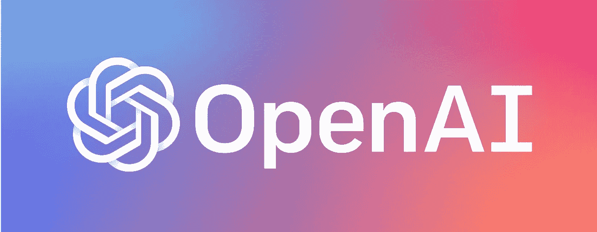
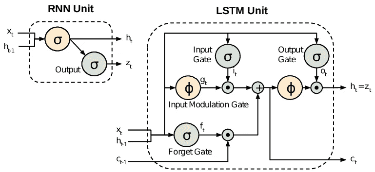
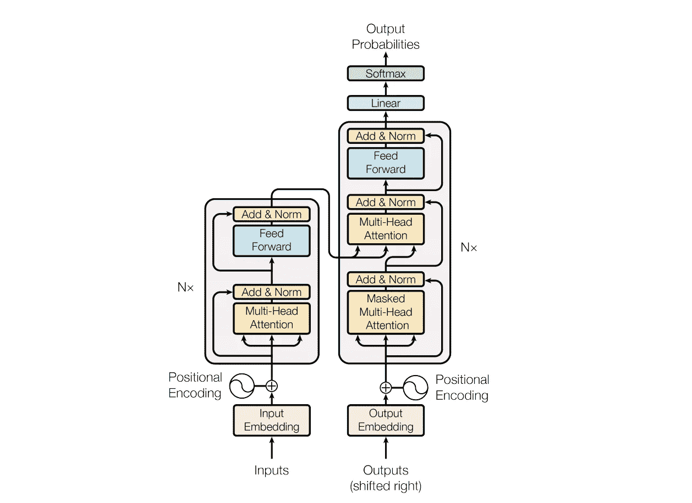
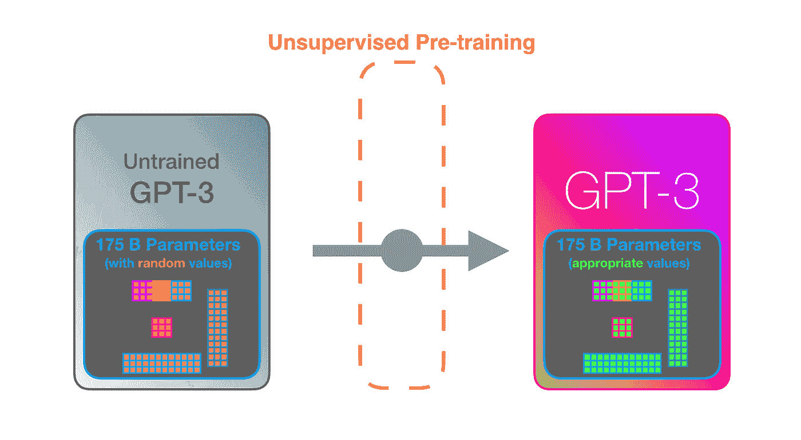

# GPT 3 号实际上是如何运作的

> 原文：<https://medium.com/nerd-for-tech/how-gpt-3-actually-works-from-the-ground-up-5714ae7f3355?source=collection_archive---------3----------------------->

OpenAI 的 GPT-3 拥有 1750 亿个参数，是有史以来最强大的语言模型。

去年 6 月，当我第一次听说 OpenAI 发布了他们语言模型的新的改进版本时，我欣喜若狂。而且看到它的全部潜力*完全*超出了我的预期。凭借复杂的架构和 1750 亿个参数，GPT 3 是有史以来最强大的语言模型。

如果你错过了炒作，这里有几个令人难以置信的例子。下面是 GPT-3 在被要求模仿一个特定的心理学家后的反应:

[来源](https://www.nytimes.com/2020/11/24/science/artificial-intelligence-ai-gpt3.html)

这是一个简单的演示应用程序，它为 web 布局生成代码:

[原帖](https://twitter.com/sharifshameem/status/1282676454690451457?ref_src=twsrc%5Etfw%7Ctwcamp%5Etweetembed%7Ctwterm%5E1282676454690451457%7Ctwgr%5E%7Ctwcon%5Es1_)

*这是如何工作的？？？它实际上是一个能做你要求它做的任何事情的机器人。为了理解这一切从何而来，我们必须将 NLP 领域作为一个整体来看待，扩展 OpenAI 的特定 GPT 技术，最后，他们如何设法训练出如此庞大的模型。*

## 什么是 NLP？

**自然语言处理(NLP)** 是对计算机编程的研究，使它们能够**解析并生成人类可读的文本**。现在，这是机器学习的一个子话题，因为 ML 是最先进的方法，使计算机程序能够理解书面语言背后的复杂细微差别。要了解更多关于 NLP 的领域和机器学习的关系，可以查看 [**这篇**](https://towardsdatascience.com/natural-language-processing-nlp-for-machine-learning-d44498845d5b) 的文章！

GPT-3 从根本上说是一个**语言模型**，一种特定类型的分析书面文本的机器学习模型。小规模语言模型的一个例子是手机上的文本预测功能。大多数移动操作系统都有一个键盘，当你键入下一个单词时，它会给出建议，这与 GPT-3 背后的基本概念相似。但是这是如何工作的呢？

## 语言模型:基础

在最基本的层面上，语言模型是一种设备，**给潜在的单词序列** *(1)* 分配一个概率。它在大量真实的人类书写数据上接受训练，绘制单词之间的关联，当给定一个 *n-* 长度的随机单词序列时，它可以根据它从训练数据中开发的上下文规则计算出该序列存在于正常人类书写文本中的概率。

语言模型可以用于各种 NLP 应用，包括语音识别、翻译、光学字符识别和文本解析。这种方法非常重要，因为它从本质上验证了一系列单词是否合法地“自然”——它是否真的可以被人类处理——使算法能够理解如何生成看起来像是人类创造的文本模式。

回到手机文本预测的例子:假设你有一个单词序列。算法需要不断预测下一个单词，直到你有一个完整的段落。为了理解下一个单词应该出现，该算法将最后几个单词作为输入，并根据它分配给单词序列的概率，它可以返回最“可能”自然出现的单词。

## 转换器语言模型

转换器模型是一种设计用于处理序列的神经网络，将输入序列转换为输出序列。在语言模型的情况下，这些是单词序列。事实上，首字母缩略词 GPT 实际上代表“生成性预训练变压器”

你可以通过把它分成两部分来思考 GPT-3 使用的语言模型的具体类型。**编码器**将初始序列翻译成**向量**，这是一个可以被计算机轻松解释的数字列表，而**解码器**将该信息解码成输出序列。

然而，变形金刚的关键部分是一个称为**注意力**的过程，它使模型能够理解在评估要产生哪个序列时，哪些词是最重要的。在编码器的每次迭代中，数字**权重**被分配给每个单词，然后由解码器进行分析，从而确定输出应该基于的输入文本的关键方面。

图示的转换器，用于机器翻译的情况。[信用](https://jalammar.github.io/illustrated-transformer/)

## **效率和比较**

NLP 技术的本质通常包括人类可读的输入和输出。如果任务是预测一个序列中的下一个单词，某种算法必须将前面的单词作为输入，并将下一个单词作为输出。直到最近，最好的方法是使用一个**递归神经网络(RNN)** ，这是一个架构，它抓取以前的单词序列，调整概率向量，并对每个新单词重复这个过程。

“展开的”递归神经网络的图示。[信用](http://www.easy-tensorflow.com/tf-tutorials/recurrent-neural-networks/vanilla-rnn-for-classification)

不幸的是，对于大的单词序列来说，这个过程变得*极其*低效。由于向量的长度有限，一旦它包含了一定量的信息，它就必须开始替换旧的概率，为新的概率腾出空间。最终，RNN 只是“忘记”了在某一点之前看到的任何相关信息，这通常会导致它遵循与原始主题无关的推理链。

对这项任务更现代的理解是使用一种称为“长期/短期记忆”网络的递归神经网络，简称为 **LSTMs** 。LSTMs 实际上被训练来学习*忘记什么*，确保被递归的向量只包含最相关的信息，而不是立即忘记超过某个点的每条信息。也就是说，LSTM *认为*是最相关的信息。

问题是，LSTMs 的工作也有一定的限制:语言建模向量的长度仍然是有限的，所以在某种程度上，处理长而复杂的文本再次变得计算量很大。此外，LSTMs 显示在大背景下难以决定忘记什么。

传统 RNN 装置与 LSTM 装置的比较。[信用](https://stats.stackexchange.com/questions/222584/difference-between-feedback-rnn-and-lstm-gru)

有趣的是，LSTMs 和 RNNs 共有的问题有点像在一夜糟糕的睡眠后迷迷糊糊地醒来，然后几乎不能连贯地说话，因为你的工作记忆减少了…

*打响指*支付 ***注意！！***

在一个简单的概念层面上理解注意力的最好方法是，注意力不是决定忘记什么，而是在概率被计算出来之前决定记住什么。这使得算法能够优先考虑让**关注**哪些文本。下面是一个变压器的架构图，直接取自最初的 2017 年[论文](https://arxiv.org/abs/1706.03762)介绍它:

变压器架构图。[来源](https://arxiv.org/abs/1706.03762)

transformers 的另一个优势是它可以同时解析一段文本的多个部分。换句话说，不需要每次你想在序列中生成一个新单词时都运行整个算法——它可以一次输入和输出大段文字，这除了提高算法的“注意广度”外，还使计算大大减少了耗时。

## 培训 GPT-3

**训练**是开发机器学习模型最关键的组成部分之一。在训练之前，算法是一台机器，有一堆互不相关的联网盒子。训练非常重要，因为它教会模型*如何*处理给定的输入；这是机器如何“学习”哪些单词序列适合特定的上下文。

GPT-3 是用“下一个单词预测”训练的，这是一种训练——是的，你猜对了——它预测句子中的下一个单词。以下是培训流程的示意图:

[信用](https://jalammar.github.io/how-gpt3-works-visualizations-animations/)

正如您所看到的，“**参数**”本质上是用于分析单词之间关系的单个数字“盒子”。未经训练的 GPT-3 不知道如何做到这一点；它的所有数字框都有一个随机值，但复杂的训练过程会为每个参数分配适当的值，使模型能够准确地处理信息。这也是一个**神经网络**的基本前提！

当这种模型的前身 GPT-2 在 2018 年发布时，世界被它的敏锐所震惊。15 亿个参数，它的规模相当大——但最疯狂的是，GPT-2 甚至没有经过完全训练。如果用*甚至更多的*数据训练一个类似的变压器，创建一个比前一个大*数量级的网络*，会发生什么？

GPT-3 和类似型号的主要区别在于其巨大的体积。它拥有 1750 亿个参数，其数量级轻松超过其最接近的竞争对手 *(2)* 。据[估计](https://lambdalabs.com/blog/demystifying-gpt-3/)训练 GPT-3 将花费*至少*460 万美元。除了惊人的能力之外，这可能是 OpenAI 只通过一个 [API](https://beta.openai.com/) 发布 GPT-3 的另一个原因。

## 展望未来

GPT-3 是迄今为止最复杂的语言模型之一，但随着时间的推移，类似的模型变得越来越广泛。GPT-3 和 GPT-2 之间的差异凸显了用大量数据和许多参数简单训练的现代语言模型的不可思议的潜力。

就我个人而言，我可以为这项技术想到几十个令人敬畏的应用程序。我首先想到的是将 NLP 添加到课堂中——这种模型可以用于创建测验问题，甚至可能提供书面作业的反馈。许多程序员开始认为，GPT-3 甚至很快就会被用来完成他们工作中的基本元素，其生成代码的能力就是证明。GPT 3 号的大量用例展示了人类可以与机器无缝交互的未来前景。

## 简要回顾，大方[由 GPT-3 自行提供](https://www.twilio.com/blog/ultimate-guide-openai-gpt-3-language-model):

*GPT-3 是一个深度神经网络，它使用注意力机制来预测句子中的下一个单词。它在超过 10 亿个单词的语料库上进行训练，可以生成字符级精度的文本。*

*GPT-3 的架构由两个主要组件组成:编码器和解码器。编码器将句子中的前一个单词作为输入，并产生其矢量表示，然后通过注意机制产生下一个单词预测。解码器将前一个单词及其矢量表示作为输入，并输出给定这些输入的所有可能单词的概率分布。*

我希望你学到了新的东西！欢迎在我的个人 [*网站*](http://jonahbard.com) *或联系*[*LinkedIn*](https://linkedin.com/in/jonahbard)*了解更多关于我的信息。*

## 脚注

1.  语言模型只处理单词序列并不完全正确——实际上，它们可以处理任何字符单元，包括单词、短语、单词片段和单个字符本身。然而，GPT-3 一次一个单词地分析和生成文本。
2.  事实上，GPT-3 在能力上甚至进一步领先于其竞争对手，因为它几乎不需要任何特定的训练来完成许多复杂的任务。这个概念被称为“[少量学习](/quick-code/understanding-few-shot-learning-in-machine-learning-bede251a0f67)”，并开始在机器学习社区中引起广泛兴趣。在这种情况下，我在本文中提到的“培训”实际上是“预培训”，这里的*真正的*培训是用户提供的额外数据，具体到手边的任务。